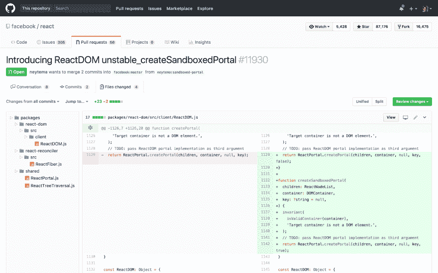

# 向 GitHub Pull 请求添加缺少的功能

> 原文：<https://dev.to/ketacode/adding-the-missing-features-to-github-pull-requests-8m1>

我喜欢 GitHub，但是他们的代码审查和拉请求的接口还需要改进。因此，除了抱怨，这里还有一个 Chrome 扩展，它添加了一个文件树视图来拉取请求和粘性文件头:

Chrome 网络商店上的“更好地拉取 GitHub 请求”扩展代码是开源的，托管在...GitHub:[https://github.com/berzniz/github_pr_tree](https://github.com/berzniz/github_pr_tree)。

也可以从 Chrome 商店安装:
[https://Chrome . Google . com/web Store/detail/better-pull-request-for-g/nfhdjopbhlggibjlimhdbogflgmbiahc](https://chrome.google.com/webstore/detail/better-pull-request-for-g/nfhdjopbhlggibjlimhdbogflgmbiahc)

到目前为止，每天有 2000 名开发人员在使用它，许多人贡献了他们的空闲时间来修复问题和添加附加功能。

编码很有趣。