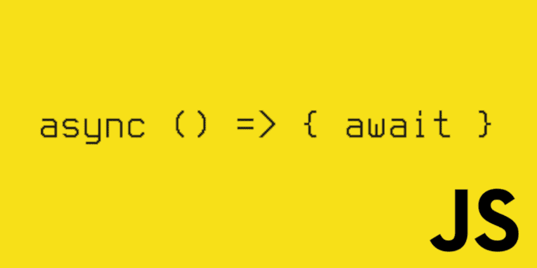

# Array.map() +异步/等待

> 原文：<https://dev.to/nyagarcia/array-map-async-await-2cif>

> MDN Web Docs:map()方法用调用数组中每个元素的函数的结果创建一个新数组。

今天，我发现自己不得不在 Array.map 中使用异步函数。不用说，Array.map 是一个同步函数。所以，我的手有点小问题。

我在重构代码以消除讨厌的“for”时遇到了这个问题..的”。基本上，我有一个对象数组，在这个数组上我必须做一些计算。其中一个计算涉及到调用一个 API，当然，这是异步的。在我进行重构之前，在我的 for 中使用 async/await 没有问题..循环的。然而，在切换到 Array.map 之后，我意识到事情不会那么简单。

我是这样做的: