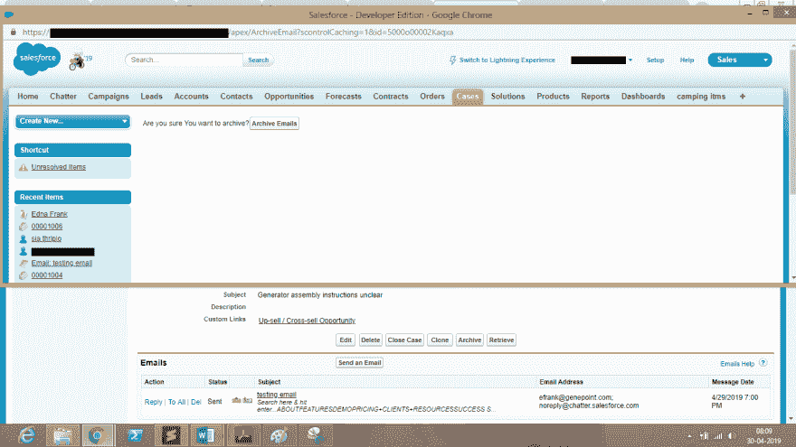
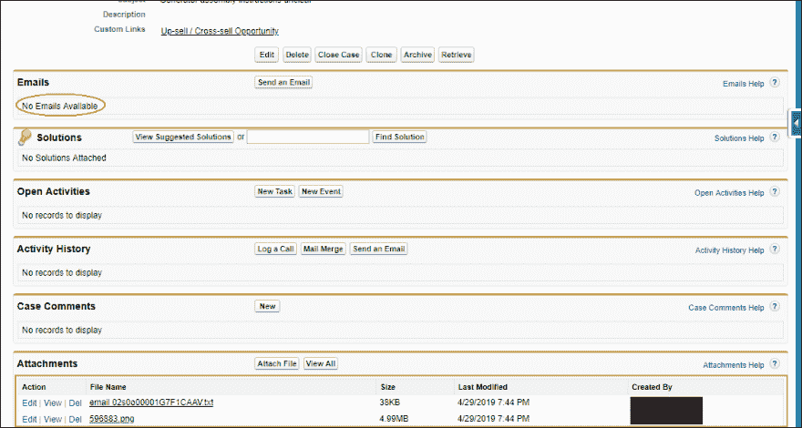
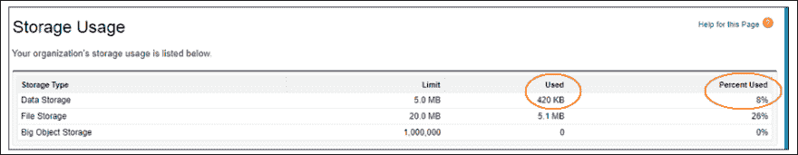
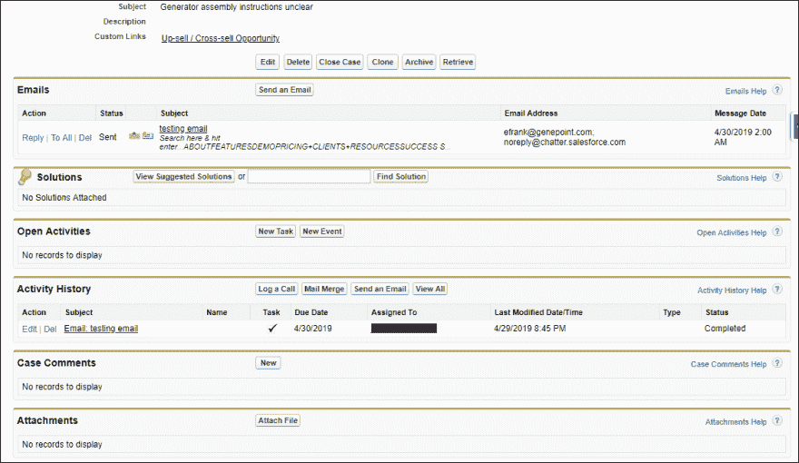
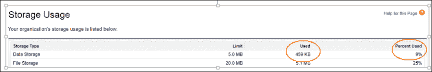

# Girikon 的 Salesforce 顾问在管理您的 Salesforce 组织的存储方面提供了正确的建议。

> 原文：<https://dev.to/james53120550/girikon-s-salesforce-consultant-provides-the-right-advice-in-managing-your-salesforce-org-s-storage-1jkh>

Salesforce 是全球领先的 CRM 平台之一。根据 Girikon 的 Salesforce Consultants 的说法，这是市场上最大和最广泛使用的 CRM 软件之一。Salesforce 有两种类型的存储，即数据存储和文件存储。文件存储包括附件、用户上传到“文档”选项卡的项目以及 Salesforce CRM Content。联系人管理器、组、专业、企业、性能和无限版本为每个组织分配了 10 GB 的文件存储空间。Essentials edition 为每个组织分配了 1 GB 的文件存储空间。包括活动在内的所有其他数据都被视为记录，并计入您的数据存储分配。每个 Contact Manager、Group、Enterprise、Professional 以及 Performance 版本的数据存储限制按 1 GB 计算，或按每个用户的限制(每个用户 20 MB)计算，视生产组织的要求而定。对于一个企业来说，控制开支、关注存储限制是其主要目标。

我们都同意 Salesforce 是一个很好的 CRM，但是当涉及到许可定价时，当您考虑到每用户许可等时，它会变得非常昂贵。如果组织关心的是存储成本，并且用户以惊人的速度持续上传数据，那么应用 Girikon 的策略来管理组织数据就很重要。电子邮件和案例是非常重要的信息，它们会占用很多空间。每封电子邮件需要大约 2Kb 到 10Kb 的数据(根据电子邮件内容的不同而有所不同),随电子邮件一起发送的每个附件可能高达 20Mb。通过归档管理，然后在需要时恢复电子邮件，可以更有效地管理组织数据。
归档策略非常简单，而且已经证明非常有效。我们的 Salesforce 咨询服务团队经常建议用户使用两个自定义按钮“归档”和“检索”,这两个按钮会为用户完成所有工作。点击存档时，相关列表中的电子邮件会被存档或存储为附件。

*   **在发送或接收电子邮件之前。**
*   **发完邮件后。**邮件显示在邮件相关列表中，数据存储量增加

*   单击存档按钮时。

会弹出一个 visual force 页面，询问您“您确定要归档吗？”

[T11】](https://res.cloudinary.com/practicaldev/image/fetch/s--5djnxDTA--/c_limit%2Cf_auto%2Cfl_progressive%2Cq_auto%2Cw_880/https://thepracticaldev.s3.amazonaws.com/i/ue7kqvkt9j97gt7gx878.png)

让我们探索一下存储背后的后端逻辑。当发送或接收电子邮件时，它会在 emailMessage 对象中创建一条记录，该电子邮件的附件会在 salesforce 的 attachment 对象中创建一条记录。创建的记录的父 Id 等于案例 Id，随该电子邮件发送的附件的父 Id 等于电子邮件记录 Id。因此，当我们点击存档按钮时，代码在后台运行，创建一个新的记录或文件，即电子邮件(emailId)。附件对象中的 txt，其中包含电子邮件及其详细信息，如:- BccAddress，ccAddress，TextBody/HTML body 等。对于随电子邮件一起发送的附件，这些附件的父 Id 被重新设置为父 Id，现在等于 caseId。之后，emailMessage 对象中的电子邮件记录被删除，这减少了数据存储。
用户按照上述步骤存档后，还需要检索电子邮件，以便将来查看。用户也有机会删除电子邮件。

*   点击检索按钮。
*   弹出一个视觉力页面，询问“确定要检索吗？”
*   电子邮件被检索。并且增加了数据存储量。

让我们来看看检索电子邮件时存储背后的后端逻辑。代码以这样的方式编写，它读取电子邮件的正文(emailId)。txt，然后从它在 emailMessage 对象中创建新记录。对于电子邮件附件，在系统为检索附件而在 emailMessage 对象中创建的自定义字段的帮助下，它们再次被重新设置为电子邮件的父项。自定义字段包含电子邮件未归档时的旧 Id。所有这些完成后，代码删除电子邮件(emailId)。txt 文件。

**关于吉里康**

Girikon 是 Silver[sales force Consulting](https://www.girikon.com/salesforce-consulting-services/)、Oracle Gold、Microsoft Application、Abode Bronze 技术合作伙伴。我们还通过了 ISO 9001 质量管理和 ISO 27001 数据管理系统认证。Girikon 的总部位于美国，在澳大利亚设有办事处，在印度诺伊达设有技术中心，三个办事处共有 150 多名员工。Girikon 是一家 Salesforce 咨询公司，通过离岸/在岸混合模式、高质量交付和良好的口碑提供经济高效的服务。

标签:salesforce 存储