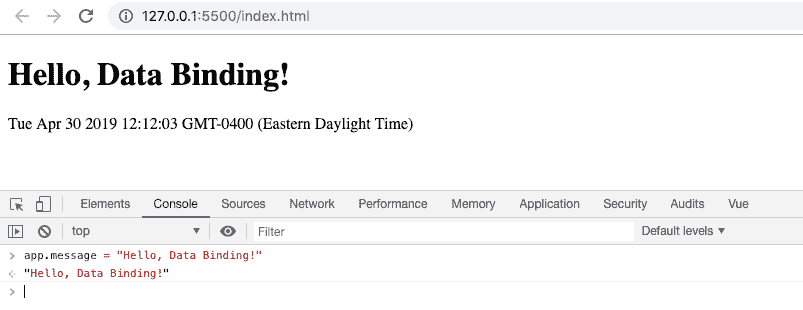
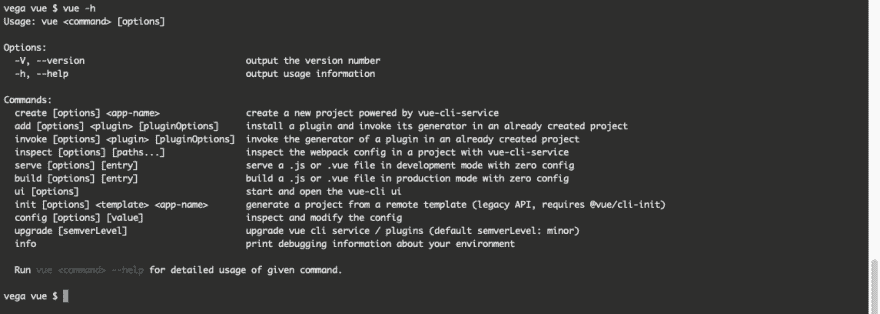
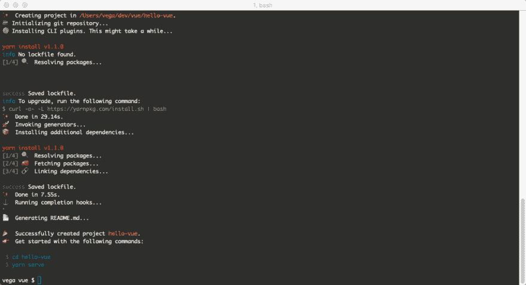
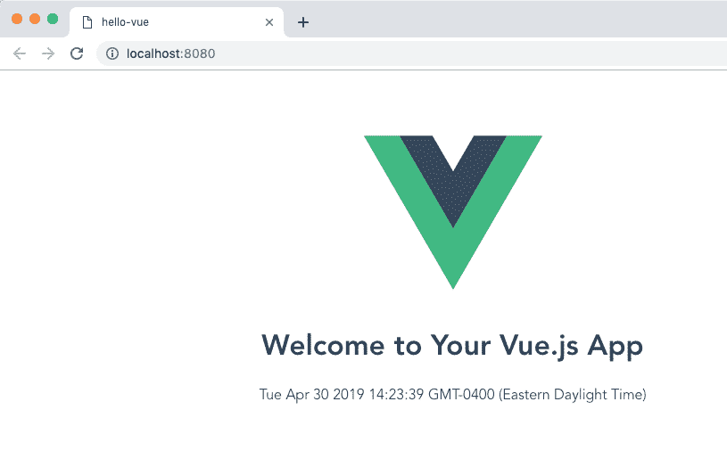
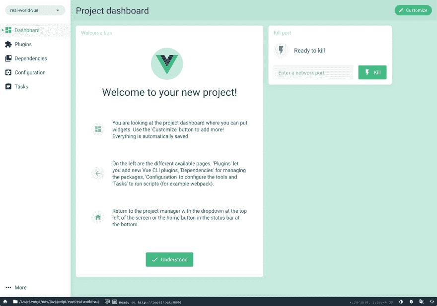
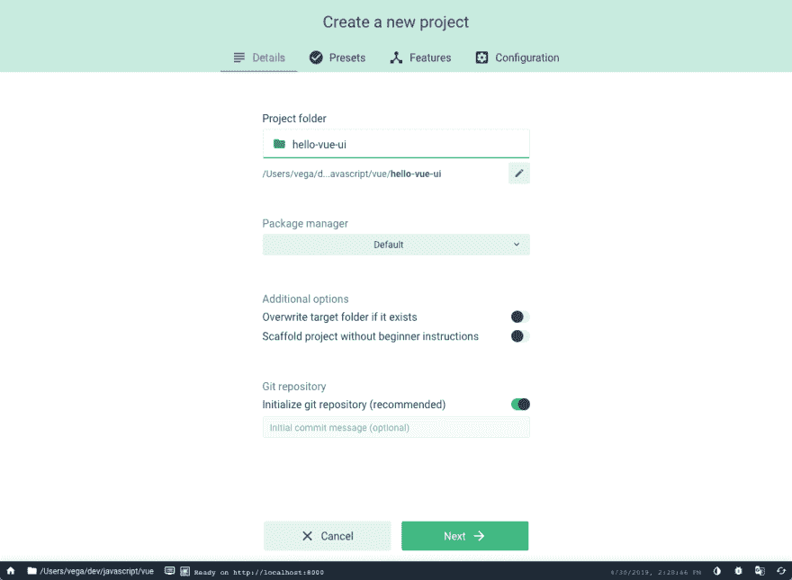
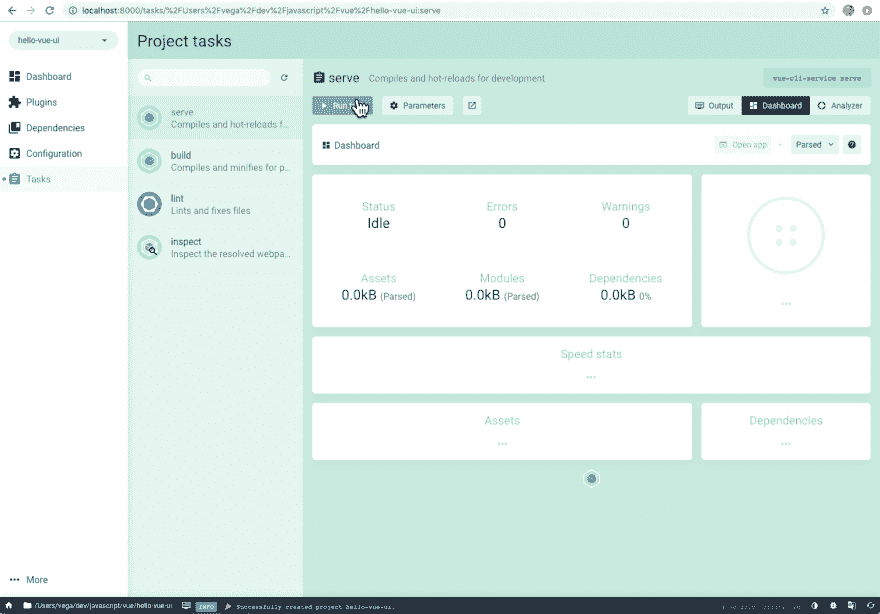
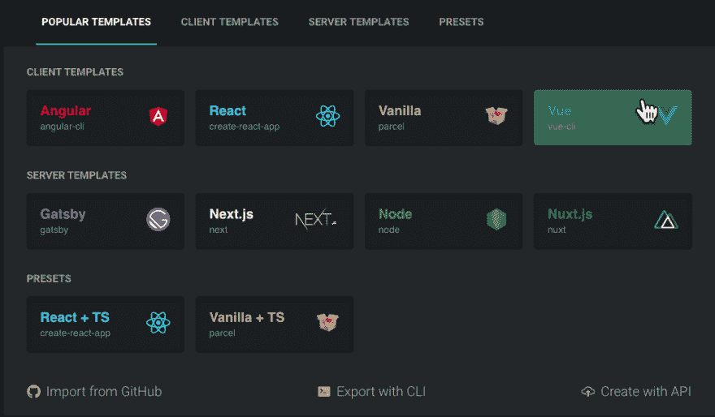
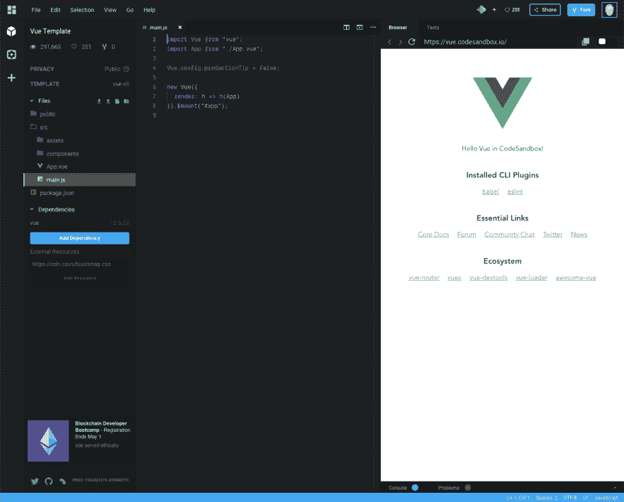
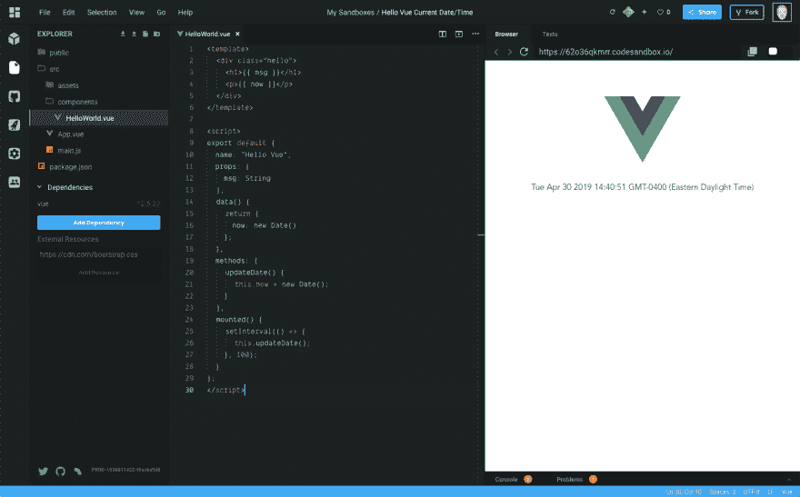

# 使用 VueJS 启动和运行所需的一切。

> 原文：<https://dev.to/therealdanvega/everything-you-need-to-get-up-and-running-with-vuejs-8c4>

此时，您很可能听说过名为 [Vue](https://vuejs.org/) 的 JavaScript 框架。如果它已经在你的清单上了，但是你不确定从哪里开始，我可以帮你。在这篇文章中，我将告诉你为什么我喜欢 Vue，并给你 4 种不同的方法来编写你的第一个应用程序。

通常我会避免给一个新框架的人太多的选择来做同样的事情，但是在这种情况下，我认为这很重要。您可能是喜欢使用命令行的人，也可能是喜欢在 GUI 中工作的人。也有一些方法可以在没有 CLI 的情况下开始编写 Vue 应用程序，只需在 HTML 页面中添加一个脚本标签。最后，您可能不想设置开发环境，而是现在就开始尝试。无论哪种选择最适合你，我都会保护你。

当你阅读这篇文章的时候，我会给你留下一些资源，当你读到最后的时候，我会给你留下我认为你接下来应该关注的东西。这不是深入探究 Vue 是什么或如何使用我给你的每个选项，所以请记住这一点。

## 进入门槛低

对我来说，Vue 的真正力量在于它是多么受欢迎的一个框架。核心团队在确保所有技能水平的开发人员都可以参与进来并高效工作方面做得非常出色。只要你熟悉 HTML、CSS 和 JavaScript，你现在就可以开始构建一些非常强大的应用程序。

我还认为，在 3 个顶级框架(Angular、React 和 Vue)中，Vue 的准入门槛最低。这有几个原因，但对我来说，归结为 3 件事

*   出色的文档
*   令人敬畏的社区
*   渐进框架

### 伟大的文献

当你问大多数喜欢使用 Vue 的开发者时，我想他们首先会告诉你文档有多棒。如果你去 Vue.js 网站，你会发现这些文档被分成几个部分。

**向导**

在[指南](https://vuejs.org/v2/guide/)中，你将找到开始使用 Vue.js 所需的一切。它被分解成一个很好的逻辑概念流，你将需要学习开始构建基于组件的应用程序。

**API**

在 [API](https://vuejs.org/v2/api/) 中，您将找到开始使用 Vue API 所需的一切。如果你曾经在 Vue 中看到一个方法，但你不太确定它是做什么的，这应该会给你答案。

**风格指南**

在[风格指南](https://vuejs.org/v2/style-guide/)中，你会发现一些关于避免错误和反模式的很棒的建议。重要的是，这些不是规则，而是指南。当你写了一些应用程序后，我会开始浏览，因为我发现它是一个非常有价值的资源。

**例题**

在[示例](https://vuejs.org/v2/examples/)中，您会发现用 Vue 构建的示例应用程序。我将把这个资源留到以后，并把重点放在构建简单的组件上，但是当你准备好了解完整的应用程序是如何组成的时候，请查看一下。

**食谱**

在[食谱](https://vuejs.org/v2/cookbook/)中，你会找到你可能遇到的常见问题的答案。这可能是像“我如何做表单验证”或“我如何对一个组件进行单元测试”这样的事情。这也是一个有价值的资源，但我会把它留到你开始问这类问题的时候。

**工装&核心库**

还有很多关于工具和核心库的资源和文档。我不打算深入研究这些，因为我想深入研究并开始编写一些代码。我确实想把这些作为参考资料留下来，我建议给他们看一下，这样你就知道你能得到什么了。

**工装**

*   [开发工具](https://github.com/vuejs/vue-devtools)
*   vista CLI
*   [检视载入器](https://vue-loader.vuejs.org/)

**核心库**

*   [检视路由器](https://router.vuejs.org/)
*   [Vuex](https://vuex.vuejs.org/)
*   vista 服务器渲染器

### 牛逼社区

我觉得在我的开发生涯中，我已经成为一些令人惊叹的社区的一部分，Vue 社区也不例外。每个人都非常热情友好，乐于助人。了解社区中其他人在构建什么或对什么感兴趣的一个简单方法是在 Twitter 上关注他们中的一些人。以下是我认为你应该从今天开始关注的 10 个人。

*   [尤雨溪](https://twitter.com/youyuxi)
*   克里斯·弗里茨
*   莎拉·德拉斯纳
*   [Damian 的校训](https://twitter.com/DamianDulisz)
*   Divya Sasidharan
*   纪尧姆周
*   [本洪](https://twitter.com/bencodezen)
*   塞巴斯蒂安·肖邦
*   娜塔莉亚·特普鲁希娜
*   艾德·耶伯格

### 递进框架

如果你访问 Vue.js 的主页，你会看到它被称为“渐进式框架”,虽然它起初看起来像是营销术语，但你很快就会意识到它不是。让我们从递进的定义开始

> 逐渐或分阶段发生或发展的；循序渐进。

正如您将在一分钟内看到的，您可以采取非常渐进的方法来构建 Vue 应用程序。如果你有一个现有的项目，你想添加 Vue 太，没问题。您可以从添加一个脚本标记并编写几行代码开始。

如果您想使用 CLI 根据您可能需要的特性来搭建一个新项目，也不成问题。当你的应用程序开始扩展，你需要添加路由或状态管理之类的东西，这真的很容易做到。

我们之前讨论过它，但是 Vue 是一个可接近的框架。如果你已经知道 HTML，CSS 和 JavaScript，你可以今天就开始。如果这是你，让我们开始写一些吧

## vista js 脚本

我们要看的第一个选项是使用脚本标签。如果您过去曾经使用过 JavaScript，这对您来说并不陌生。您有一个 HTML 页面，您需要向页面添加一些功能，因此您可以放入一个脚本标记。这不仅仅是为了学习 Vue，因为它有一些真正的实际用途。

通常很难在工作中引入新的工具、库和框架。如果你真的喜欢和 Vue 一起工作，去找你的老板，问你是否可以用 Vue 重写整个系统，他或她几乎会立刻否定你的想法。

相反，如果你去找他们，要求在你正在创建的新页面上介绍 Vue，那就容易多了。在这个例子中，我们将构建一个非常随意的应用程序，但它有助于解释几个不同的概念。

### 你好，vista！

在这个应用程序中，您将显示文本“Hello，Vue！”以及它下面的当前日期和时间。然后，您将编写一些逻辑来更新当前日期/时间，以便用户可以实时看到时间的变化。首先，您将创建一个目录，并将以下内容添加到一个新页面`index.html`。

```
<!DOCTYPE html>
<html lang="en">
<head>
  <meta charset="UTF-8">
  <meta name="viewport" content="width=device-width, initial-scale=1.0">
  <meta http-equiv="X-UA-Compatible" content="ie=edge">
  Hello, Vue.js
</head>
<body>

</body>
</html> 
```

现在您已经有了页面设置的基本部分，是时候添加 Vue.js 脚本了。您可以在 body 结束标记之前添加以下代码行。

```
<!-- development version includes helpful console warnings -->
<script src="https://cdn.jsdelivr.net/npm/vue/dist/vue.js"></script>
<script>

</script> 
```

我把注释留在那里，因为需要注意的是这是脚本的开发版本。如果您打算将它投入生产，您会希望使用生产脚本。你可以阅读更多关于这个的是 [Vue.js 指南文档](https://vuejs.org/v2/guide/)。

您需要做的第一件事是添加一个根元素来挂载您的 Vue 实例。

```
<div id="app">

</div> 
```

然后创建一个新的 Vue 实例，告诉 Vue 你的根元素是什么。

```
<script>
  const app = new Vue({
    el: '#app'
  })
</script> 
```

您现在要做的是创建两个变量来保存值，然后您可以使用这些值在页面上显示信息。这可以通过在数据对象上声明属性来实现。

```
<script>
  const app = new Vue({
    el: '#app',
    data: {
      message: 'Hello Vue!',
      now: new Date()
    }
  })
</script> 
```

现在你的数据已经设置好了，Vue 给了我们一个非常简洁的方法在页面上显示数据。

```
<div id="app">
  <h1>{{ message }}</h1>
  <p>{{ now }}</p>
</div> 
```

给自己一个大大的鼓励，因为你刚刚创建了你的第一个 Vue 应用。如果您运行这个应用程序，您应该会看到标题“Hello，Vue！”以及它下面的当前日期/时间。我使用 Visual Studio 代码和 [Live 服务器扩展](https://marketplace.visualstudio.com/items?itemName=ritwickdey.LiveServer)来运行我的。

这看起来不多，但 Vue 实际上为你做了很多。数据和 DOM 现在链接起来了，一切都是被动的。我们怎么知道？打开浏览器的 JavaScript 控制台(此时，在此页面上),将 app.message 设置为不同的值。您应该会看到上面的渲染示例相应地更新。

[](https://res.cloudinary.com/practicaldev/image/fetch/s--_eHg26pH--/c_limit%2Cf_auto%2Cfl_progressive%2Cq_auto%2Cw_880/https://thepracticaldev.s3.amazonaws.com/i/2kxfxf3zvl2p60epqyny.png)

Vue 还让您能够“挂钩”到组件的生命周期中。这意味着您可以收听像`created`、`mounted`、`destroyed`等事件。我不想深入探讨这个问题，因为这篇文章旨在向您展示创建 Vue 应用程序的不同方法，而不是其他所有内容。不过，我确实想完成我们的申请。

下面的代码将每秒更新一次变量。当 Vue 被挂载时，你使用`setInterval`方法每秒运行一个函数。就像在 Vue 实例上添加您自己的数据一样，您可以通过将方法添加到 methods 对象来创建方法。

```
<script>
  const app = new Vue({
    el: '#app',
    data: {
      message: 'Hello Vue!',
      now: new Date()
    },
    methods: {
      updateDate() {
        this.now = new Date();
      }
    },
    mounted() {
      setInterval(() => {
        this.updateDate();
      }, 100);
    }
  })
</script> 
```

如果您现在运行该应用程序，您应该得到相同的显示，但当前日期时间现在每秒更新一次。您不必手动更新 DOM，因为 Vue 已经为您将数据变量绑定到 DOM，当它们被更新时，DOM 也被更新。

## 检视 CLI

虽然在页面上放置脚本标签可以让我们快速启动并运行，但它的伸缩性并不好。如果您想构建成熟的单页面应用程序(SPA)并利用工具链，Vue CLI 是启动和运行的好方法。

如果您不喜欢在命令行上做任何事情，不要担心，您在这里安装的 CLI 工具也有 UI 版本。

### 安装 Vue CLI

您需要做的第一件事是安装 Vue CLI。这样做的一个要求是安装 NodeJS 和 npm，因此如果您对它们不熟悉，请花些时间安装它们，并对它们进行一些阅读，以便更好地理解它们的用途。要安装 Vue CLI，请运行以下命令:

```
 npm install -g @vue/cli 
```

为了`create`一个新的应用程序，你可以使用命令`vue create`。如果您不确定哪些命令可用，您可以运行 vue -h

[](https://res.cloudinary.com/practicaldev/image/fetch/s--o1hpRLN7--/c_limit%2Cf_auto%2Cfl_progressive%2Cq_auto%2Cw_880/https://thepracticaldev.s3.amazonaws.com/i/5n8f9cpxvegln60gh835.png)

create 命令需要一个应用程序名称，因此让我们通过运行以下命令来创建一个新的 vue 应用程序:

```
vue create hello-vue 
```

这将在当前目录中为您创建一个名为`hello-vue`的新文件夹。我将在以后的文章中更详细地介绍这一点，但现在，只需接受默认设置，一个新的应用程序将为您创建。

[](https://res.cloudinary.com/practicaldev/image/fetch/s--GQG-jNO_--/c_limit%2Cf_auto%2Cfl_progressive%2Cq_auto%2Cw_880/https://thepracticaldev.s3.amazonaws.com/i/h7b2myxhvxl8hrnpelci.png)

打开`src/components/HelloWorld.vue`，用以下内容替换里面的所有内容。

```
<template>
  <div class="hello">
    <h1>{{ msg }}</h1>
    <p>{{ now }}</p>
  </div>
</template>

<script>
export default {
  name: "Hello Vue",
  props: {
    msg: String
  },
  data() {
    return {
      now: new Date()
    };
  },
  methods: {
    updateDate() {
      this.now = new Date();
    }
  },
  mounted() {
    setInterval(() => {
      this.updateDate();
    }, 100);
  }
};
</script> 
```

从命令行(或集成终端)使用以下命令运行您的应用程序

```
npm run serve 
```

当你的应用程序启动时，命令行应该告诉你它在哪里运行，但是默认情况下，它应该在 [http://localhost:8080/](http://localhost:8080/)

[](https://res.cloudinary.com/practicaldev/image/fetch/s--Gzr3Yfdz--/c_limit%2Cf_auto%2Cfl_progressive%2Cq_auto%2Cw_880/https://thepracticaldev.s3.amazonaws.com/i/d8zjxumugm3pvj6j63gr.png)

这只是使用 CLI 的一个快速演练，但我希望您看到创建一个新的应用程序是多么容易，它具有强大的基础架构，并准备随着您的需求增长而扩展。

## [t1【检视 UI】](#vue-ui)

安装了 Vue CLI 后，您可以通过从命令行运行以下命令来使用 UI

```
vue ui 
```

这将在[http://localhost:8000/dashboard](http://localhost:8000/dashboard)打开一个新的应用程序，如下所示

[](https://res.cloudinary.com/practicaldev/image/fetch/s--eGOwI3vB--/c_limit%2Cf_auto%2Cfl_progressive%2Cq_auto%2Cw_880/https://thepracticaldev.s3.amazonaws.com/i/8ntuz5u4s0pngymafgns.png)

您可以使用 Vue UI 创建一个新项目，它会提供与命令行相同的选项。

[](https://res.cloudinary.com/practicaldev/image/fetch/s--aC0T3SUK--/c_limit%2Cf_auto%2Cfl_progressive%2Cq_auto%2Cw_880/https://thepracticaldev.s3.amazonaws.com/i/vv1dxw9kwpivgt6dl4g9.png)

当您的项目完成时，您可以使用项目任务直接从 UI 运行它。

[](https://res.cloudinary.com/practicaldev/image/fetch/s--nscjm3hd--/c_limit%2Cf_auto%2Cfl_progressive%2Cq_auto%2Cw_880/https://thepracticaldev.s3.amazonaws.com/i/lw5dwnuj02192f6d3q3f.png)

## CodeSandbox

虽然这些都是启动和运行 Vue 的很好的选择，但是它们也需要你有一些开发环境的设置。如果你还没有机会尝试，我在这里告诉你一个很棒的在线代码编辑器，叫做 [CodeSandbox](https://codesandbox.io/) 。

你需要做的第一件事是用你的 Github 账户注册一个 CodeSandbox 账户。一旦你登录后，点击创建一个沙箱，从那里你可以选择各种各样的模板。您可以从流行模板或客户端模板选项卡中选择 Vue。

[](https://res.cloudinary.com/practicaldev/image/fetch/s--_mAofVo_--/c_limit%2Cf_auto%2Cfl_progressive%2Cq_auto%2Cw_880/https://thepracticaldev.s3.amazonaws.com/i/f2ead5xspwf0r35k2uil.png)

只需几秒钟，您就可以启动并运行一个新的 Vue 应用程序！在左窗格中，您有所有的项目文件，编辑器在中间，浏览器预览应用程序正在运行。

[](https://res.cloudinary.com/practicaldev/image/fetch/s--HQcF-l0x--/c_limit%2Cf_auto%2Cfl_progressive%2Cq_auto%2Cw_880/https://thepracticaldev.s3.amazonaws.com/i/q6gme7s0ixa9tatxzr26.png)

打开`src/components/HelloWorld.vue`，用以下内容替换里面的所有内容。

```
<template>
  <div class="hello">
    <h1>{{ msg }}</h1>
    <p>{{ now }}</p>
  </div>
</template>

<script>
export default {
  name: "Hello Vue",
  props: {
    msg: String
  },
  data() {
    return {
      now: new Date()
    };
  },
  methods: {
    updateDate() {
      this.now = new Date();
    }
  },
  mounted() {
    setInterval(() => {
      this.updateDate();
    }, 100);
  }
};
</script> 
```

您应该会看到您一直在使用的那个应用程序。CodeSandbox 的好处是，现在你可以拿着它与朋友分享应用程序，只是为了炫耀一些东西或获得一些建议。

[https://codesandbox.io/s/62o36qkmrr?fontsize=14](https://codesandbox.io/s/62o36qkmrr?fontsize=14)

[](https://res.cloudinary.com/practicaldev/image/fetch/s--aPxajx75--/c_limit%2Cf_auto%2Cfl_progressive%2Cq_auto%2Cw_880/https://thepracticaldev.s3.amazonaws.com/i/j3i1dmb2qltqe3tr556v.png)

## 资源

这些是我最喜欢的帮助你前进的资源。为了深入了解 Vue 生态系统中的一切，请点击 [Awesome Vue](https://github.com/vuejs/awesome-vue) 。

*   [检视核心休息](https://github.com/vuejs)
*   [Vue 点(官方博客)](https://medium.com/the-vue-point)
*   [开发社区](https://dev.to/t/vue)

### 播客

*   [官方 Vue 消息](https://news.vuejs.org/)
*   [对 Vue 的看法](https://devchat.tv/views-on-vue/)

### 框架

*   [武打〔t1〕](https://vuepress.vuejs.org/)
*   [Nuxt](https://nuxtjs.org/)
*   [网格体](https://gridsome.org/)

## 何去何从？

无论你使用什么样的框架，你都需要保持你的 JavaScript 技能。你花在提高 JavaScript 技能上的时间越多越好。这将确保您能够使用任何提供给您的框架或库。

我之前提到过[指南文档](https://vuejs.org/v2/guide/)，但它值得再次提及。这是第一个地方，我会开始尽可能地通读，但也要确保你在练习这些例子。重复是学习过程中重要的一步，也是不可忽视的。当你浏览这些文档时，我会重点介绍 Vue 的核心概念。

*   组件基础
*   数据绑定
*   事件处理
*   指令
*   方法
*   计算属性
*   Vue 组件生命周期
*   小道具

不要觉得在这一点上构建大型应用程序。专注于构建组件，其余的会及时到来。

## 结论

如果你在 Twitter 上关注我(如果你不是，停止你正在做的事情，现在[关注我](https://twitter.com/therealdanvega))你知道我是 Vue 的超级粉丝。我喜欢编写基于组件的应用程序，我认为 Vue 不仅让它变得简单，还让编写代码变得有趣。如果您在进入 Vue.js 的过程中有任何问题，请随时联系我们。一如既往的朋友...

快乐编码
丹

*这篇文章最初是在 https://www.danvega.dev/blog 的[发表在我的博客上的。如果你觉得这篇文章有趣，请考虑](https://www.danvega.dev/blog)[订阅我的时事通讯](https://www.danvega.dev/signup/)或者在 [Twitter](http://twitter.com/therealdanvega) 上关注我。*