# 跨浏览器兼容 CSS 渐变的完整指南

> 原文：<https://dev.to/lambdatest/complete-guide-to-cross-browser-compatible-css-gradients-4jjb>

背景的 CSS 渐变已经成为 UI/UX 设计中不可或缺的一部分，对网站的设计有着巨大的影响。它在设置设计层次、吸引用户注意力和焦点，以及最终定义网站可用性和外观方面起着重要作用。网站常用的背景形式可以是纯色、图像、渐变或者三者的结合。背景的 CSS 渐变使设计者能够显示多种颜色之间的平滑过渡。渐变不仅用于标题或部分背景，也用于为覆盖、文本、按钮、边框、轮廓、倾斜块和横幅创建 CSS 渐变。

在 CSS 渐变背景出现之前，开发人员别无选择，只能借助图像来创建这样的效果。然而，这种方法有很大的缺点，会损害网站的性能。使用大量的图片，尤其是为了琐碎的目的，会导致[网站加载速度](https://www.lambdatest.com/blog/how-to-get-started-with-load-testing/?utm_source=dev&utm_medium=Blog&utm_campaign=ni-02-020519eu&utm_term=OrganicPosting)和带宽使用的巨大峰值。但是，通过利用 CSS 渐变的力量，设计人员可以确保更快的网站加载时间，而不牺牲分辨率和清晰度，只需使用简单的 CSS 渐变原生函数。

## 什么是 CSS 渐变？

CSS 渐变是通过使用渐变功能来实现的，它可以在多种颜色之间创建渐进的过渡。使用 CSS 渐变的一个重要前提是，它们属于数据类型，只能应用于背景图像属性或简称“背景”，而不能应用于数据类型为“颜色”或“背景色”的 CSS 属性。背景中的 CSS 渐变没有定义的固有维度，也没有任何特定的维度大小或比例。它只是动态地适应它所应用的元素的尺寸。

CSS3 定义了 4 种主要的渐变类型。

1.  线性 CSS 渐变
2.  径向 CSS 渐变(也是椭圆形)
3.  锥形 CSS 渐变
4.  重复 CSS 渐变

除了锥形渐变，其他 3 种 CSS 渐变类型，即径向、重复和线性 CSS 渐变都享有良好的浏览器支持，唯一的例外是 IE 6-9 和 Opera mini 浏览器。锥形渐变仍处于实验阶段，尚未被大多数浏览器采用，包括 Firefox、Edge 和 Opera。只有最新版本的 Chrome (69+)和 Safari(12.1+)提供对该功能的支持。我们将详细讨论浏览器对这 4 种 CSS 渐变的支持，我们还将[执行跨浏览器测试](https://www.lambdatest.com/blog/performing-cross-browser-testing-with-lambdatest/?utm_source=dev&utm_medium=Blog&utm_campaign=ni-02-020519eu&utm_term=OrganicPosting)以确定这些 CSS 渐变的跨浏览器兼容性解决方案。

## 1。CSS 线性渐变

CSS 线性渐变有助于沿着一条直线在多种颜色之间进行平滑、逐步升级的过渡。您可以使这些转换向上、下、左、右或对角线方向移动。您需要指定至少两种颜色(称为色标)来创建这种效果，并可以选择指定方向和起点。

**线性 CSS 渐变的语法**

`background-image: linear-gradient(direction, colorStop1, colorStop2, …);`

*   **方向:**用于设置 CSS 线性渐变效果的方向或角度。方向可以是–上、下、左、右或以度为单位或依次。指定方向是可选的。请注意，如果没有指定方向，默认情况下将设置为从上到下。
*   **颜色停止点:**由颜色值和一个起始点组成。起点可以是%或长度值。定义起点是可选的。

具有不同值集的 CSS 线性渐变的一些例子。

### 从上到下线性 CSS 渐变

在这种情况下，过渡从上到下开始，顶部是蓝色，底部是紫色。指定**"到底"**方向，否则默认设置。要创建一个从下到上的反向渐变，将方向反转为**“到上”**

```
<style>
        #grad1 {
            width: 25%;
            height: 100px;
            background-image: linear-gradient(to bottom, #3498db, #9b59b6); /*top to bottom Gradient*/
        }
        #grad2 {
            width: 25%;
            height: 100px;
            background-image: linear-gradient(to top, #f1c40f, #e74c3c); /*bottom to top Gradient*/
        }
    </style> 
```

Enter fullscreen mode Exit fullscreen mode

[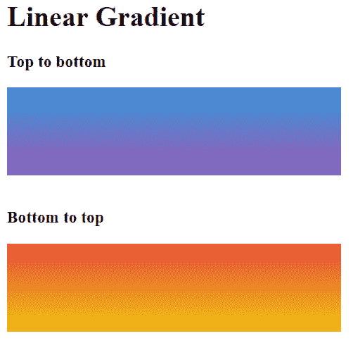](https://res.cloudinary.com/practicaldev/image/fetch/s--PwezqDEA--/c_limit%2Cf_auto%2Cfl_progressive%2Cq_auto%2Cw_880/https://www.lambdatest.com/blog/wp-content/uploads/2019/04/linear-gradient.png)

### 从左到右线性 CSS 渐变

在这种情况下，过渡从左向右开始，左边是绿色，右边是蓝色。指定**“向右”**方向或创建一个从下到上的反向渐变，将方向反转为**“向左”**。

```
<style>
        #grad1 {
            width: 25%;
            height: 100px;
            background-image: linear-gradient(to right, #2ecc71, #2980b9); /*Left to Right Gradient*/
        }
        #grad2 {
            width: 25%;
            height: 100px;
            background-image: linear-gradient(to left, #f1c40f, #c0392b); /*Right to Left Gradient*/
        }
    </style> 
```

Enter fullscreen mode Exit fullscreen mode

[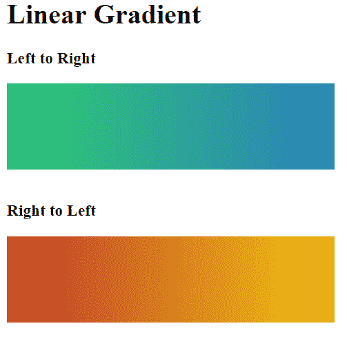](https://res.cloudinary.com/practicaldev/image/fetch/s--vhJyUFwz--/c_limit%2Cf_auto%2Cfl_progressive%2Cq_auto%2Cw_880/https://www.lambdatest.com/blog/wp-content/uploads/2019/04/linear-gradient-2.png)

### 对角线线性 CSS 渐变

这种情况下的过渡从左上到右下方向开始，在左上是绿色，在右下是蓝色。为此情况指定**“向右下方”**方向，或指定**“向左下方”**使用对角线 CSS 线性渐变创建反向场景。

```
<style>
        #grad1 {
            width: 25%;
            height: 100px;
            background-image: linear-gradient(to right bottom, #2ecc71, #2980b9); /*Top left to Right Bottom*/
        }
        #grad2 {
            width: 25%;
            height: 100px;
            background-image: linear-gradient(to left bottom, #f1c40f, #c0392b); /*Top Right to Left Bottom*/
        }
    </style> 
```

Enter fullscreen mode Exit fullscreen mode

[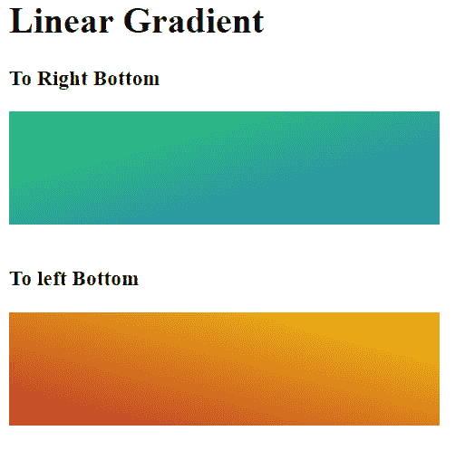](https://res.cloudinary.com/practicaldev/image/fetch/s--4LlFV0eH--/c_limit%2Cf_auto%2Cfl_progressive%2Cq_auto%2Cw_880/https://www.lambdatest.com/blog/wp-content/uploads/2019/04/linear-gradient-3.png)

### 倾斜的线性 CSS 渐变

要创建有角度的 CSS 线性渐变，请不要使用 to top、bottom left、right 参数来定义方向。相反，使用 deg–**0 到 360deg** 之间的任何值来指定方向。

*   45 度将创建一个对角线 CSS 线性渐变。
*   0 度将创建一个从上到下的 CSS 线性渐变。
*   90 度将创建一个从左到右的 CSS 线性渐变。

```
<style>
        #grad1 {
            width: 25%;
            height: 100px;
            background-image: linear-gradient(45deg, #2ecc71, #2980b9); /*45deg*/
        }
        #grad2 {
            width: 25%;
            height: 100px;
            background-image: linear-gradient(90deg, #f1c40f, #c0392b); /*90deg*/
        }
        #grad3 {
            width: 25%;
            height: 100px;
            background-image: linear-gradient(0deg, #8e44ad, #3498db); /*0deg*/
        }
    </style> 
```

Enter fullscreen mode Exit fullscreen mode

[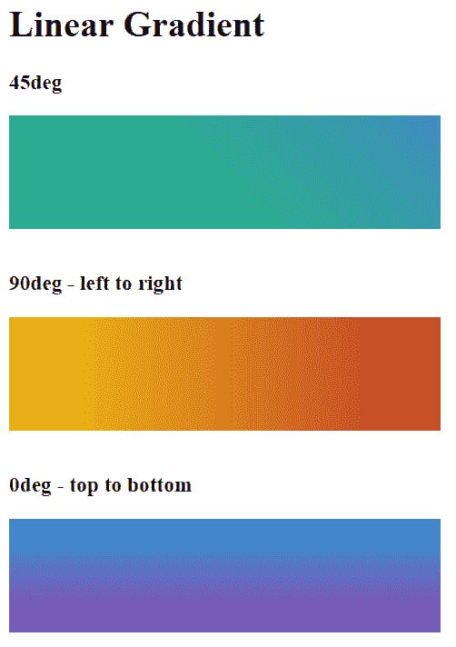](https://res.cloudinary.com/practicaldev/image/fetch/s--7jFc405w--/c_limit%2Cf_auto%2Cfl_progressive%2Cq_auto%2Cw_880/https://www.lambdatest.com/blog/wp-content/uploads/2019/04/linear-gradient-4.png)

### 多个颜色

您可以指定任意数量的颜色来创建渐变效果。下面的例子将帮助你创建 3 色和 4 色的 CSS 渐变。

```
<style>
        #grad1 {
            width: 25%;
            height: 100px;
            background-image: linear-gradient(45deg, #2ecc71, #2980b9, #8e44ad); /*45deg*/
        }
        #grad2 {
            width: 25%;
            height: 100px;
            background-image: linear-gradient(to left, #f1c40f, #2ecc71, #e74c3c); /*90deg*/
        }
        #grad3 {
            width: 25%;
            height: 100px;
            background-image: linear-gradient(to bottom, #1abc9c, #f1c40f, #3498db, #e74c3c); /*0deg*/
        }
    </style> 
```

Enter fullscreen mode Exit fullscreen mode

[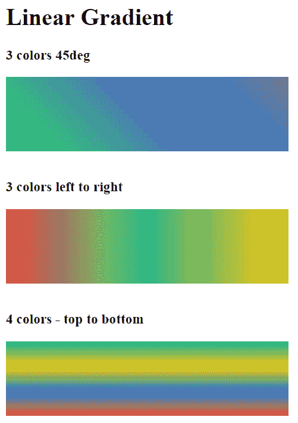](https://res.cloudinary.com/practicaldev/image/fetch/s--p60vYi-F--/c_limit%2Cf_auto%2Cfl_progressive%2Cq_auto%2Cw_880/https://www.lambdatest.com/blog/wp-content/uploads/2019/04/linear-gradient-5.png)

### 颜色停止

如果没有指定颜色停止点或起点，应用线性 CSS 渐变的元素的整个空间将在渐变函数中指定的所有列出的颜色之间平均分配。然而，CSS 允许你改变这种行为，并通过以%或长度单位指定颜色的起始点来控制颜色所占的空间。在下面的示例中，我们将黄色(#f1c040f)的起点设置为 20%。默认情况下，第一种颜色#e74c3c 为 0%，第二种颜色#f1c40f 为 100%。

```
<style>
        #grad1 {
            width: 25%;
            height: 100px;
            background-image: linear-gradient(to right,#e74c3c,#f1c40f 10%);
        }
    </style> 
```

Enter fullscreen mode Exit fullscreen mode

[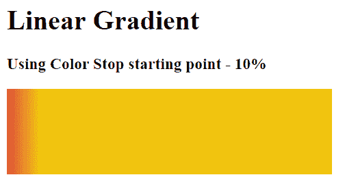](https://res.cloudinary.com/practicaldev/image/fetch/s--p2TEAlUr--/c_limit%2Cf_auto%2Cfl_progressive%2Cq_auto%2Cw_880/https://www.lambdatest.com/blog/wp-content/uploads/2019/04/linear-gradient-6.png)

### 颜色停止实心过渡

除了渐变效果，我们还可以使用起点技巧在线性 CSS 渐变函数中指定的两种或多种颜色之间创建实心过渡。将两种颜色的起点设置为相同的值，以获得这种效果。参考下面的例子-

```
<style>
        #grad1 {
            width: 25%;
            height: 100px;
            background-image: linear-gradient(to right,#1abc9c 20%,#3498db 20%);
        }
    </style> 
```

Enter fullscreen mode Exit fullscreen mode

[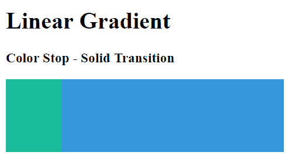](https://res.cloudinary.com/practicaldev/image/fetch/s--Ca-K78KK--/c_limit%2Cf_auto%2Cfl_progressive%2Cq_auto%2Cw_880/https://www.lambdatest.com/blog/wp-content/uploads/2019/04/linear-gradient-7.png)

## CSS 线性渐变跨浏览器兼容解决方案

包括 Internet Explorer 11 和 Microsoft Edge 在内的所有桌面浏览器都支持线性 CSS 渐变，这意味着这些 CSS 渐变提供了出色的跨浏览器兼容性。开发者需要注意的唯一例外是 IE6-9 和 Opera Mini，他们需要对它们执行[跨浏览器测试](https://www.lambdatest.com/?utm_source=dev&utm_medium=Blog&utm_campaign=ni-02-020519eu&utm_term=OrganicPosting)。

[](https://res.cloudinary.com/practicaldev/image/fetch/s--vI9dcwqS--/c_limit%2Cf_auto%2Cfl_progressive%2Cq_auto%2Cw_880/https://www.lambdatest.com/blog/wp-content/uploads/2019/04/cs-gradient.png)

*可以使用 CSS 线性渐变的跨浏览器兼容性表*

正如你在上面的[can use](https://caniuse.com/#search=CSS%20gradients)表中看到的，旧版 Mozilla Firefox、Opera、Safari 和 Google Chrome 提供了部分支持(浏览器版本标有黄绿色)。您需要为每个遗留/旧版本使用专用的供应商前缀，以使 CSS 线性渐变跨浏览器兼容。此外，我们将探索 Microsoft Filer 属性，为 Microsoft Internet Explorer(即 IE 6-9)添加渐变功能，以提供[跨浏览器兼容性](https://www.lambdatest.com/blog/what-is-cross-browser-compatibility-and-why-we-need-it/?utm_source=dev&utm_medium=Blog&utm_campaign=ni-02-020519eu&utm_term=OrganicPosting)。

**跨浏览器兼容线性 CSS 渐变的语法**

所有主流浏览器的现代版本都支持线性 CSS 渐变的 W3C 标准，由于其跨浏览器兼容性，使其成为非常可取的选择。

*   对于谷歌 Chrome 25+，Mozilla Firefox 16+，Opera 15+，Safari 6.1+，IE 10+，iOS 7+，Android 4.4+来说

```
background-image: linear-gradient(45deg, red 0%, blue 100%); 
```

Enter fullscreen mode Exit fullscreen mode

为了增加对谷歌 Chrome、Mozilla Firefox、Safari、Opera 和 IE 旧版本的支持，我们将使用下面提到的特定供应商前缀，并创建一个跨浏览器兼容性解决方案。

*   适用于谷歌浏览器(4-9 版)和 Safari 浏览器(4-5 版)

```
background-image: -webkit-gradient(linear, left bottom, right top, color-stop(0%, red), color-stop(100%, blue)); 
```

Enter fullscreen mode Exit fullscreen mode

*   针对 Chrome(版本 10-25)和 Safari(版本 5.1-6)

```
background-image: -webkit-linear-gradient(45deg, red 0%, blue 100%); 
```

Enter fullscreen mode Exit fullscreen mode

*   适用于 Firefox(3.6-15 版)

```
background-image: -moz-linear-gradient(45deg, red 0%, blue 100%); 
```

Enter fullscreen mode Exit fullscreen mode

*   歌剧(11.5 节)

```
background-image: -o-linear-gradient(45deg, red 0%, blue 100%); 
```

Enter fullscreen mode Exit fullscreen mode

*   对于 IE 10+

```
background-image: -ms-linear-gradient(45deg, red 0%, blue 100%); 
```

Enter fullscreen mode Exit fullscreen mode

*   对于 IE6-9

```
filter: progid:DXImageTransform.Microsoft.gradient( startColorstr='#ff0000', endColorstr='#0000ff',GradientType=1 );

-ms-filter: "progid:DXImageTransform.Microsoft.gradient (GradientType=0, startColorstr=#ff0000, endColorstr=#0000ff)"; 
```

Enter fullscreen mode Exit fullscreen mode

**注意:** IE6-9 只支持左右两个方向的颜色渐变。

*   纯色或 JPG/SVG 回退

```
background-color: red;  or background-image: url(fallback.jpg); 
```

Enter fullscreen mode Exit fullscreen mode

尽管如此，担心编码前缀以支持 Chrome 10-25 或 Safari 6 等传统浏览器版本并不明智。然而，所有现代浏览器(除了 Edge)都是向后兼容的，并且理解前缀语法。此外，许多开发人员在流行的代码编辑器中使用像–Autoprefixer 或其他扩展这样的工具来处理供应商前缀。对于任何开发人员来说，理解 autoprefixer 添加到代码中的前缀语法都是非常重要的。

### 有角度的 CSS 线性渐变

在继续为线性 CSS 渐变编写[跨浏览器兼容代码](https://www.lambdatest.com/blog/fixing-javascript-cross-browser-compatibility-issues/?utm_source=dev&utm_medium=Blog&utm_campaign=ni-02-020519eu&utm_term=OrganicPosting)之前，还有一个复杂的问题需要解决。复杂之处在于**“有角度的 CSS 线性渐变”**。旧浏览器版本支持的旧前缀语法和现代浏览器支持的新前缀语法以彼此不同的方式理解“有角度的 CSS 线性渐变”。

*   **无前缀新语法:**受–Chrome 25+，Firefox 16+，Opera 15+，Safari 6.1+，IE 10+支持。它在自下而上的方向上定义 0 度，并沿顺时针方向前进。0 度是从上到下，90 度是从左到右
*   **前缀旧语法:**受–Chrome 10-25，Firefox 3.6-15，Opera 11.1-11.5，Safari 5.1-6 支持。它在从左到右的方向上定义 0 度，并在逆时针方向上进行，即–0 度是从左到右，90 度是从下到上。
*   **旧版语法:**受–Chrome 1-9、Safari 4-5 支持。不支持角度。不切实际的关心今天。

[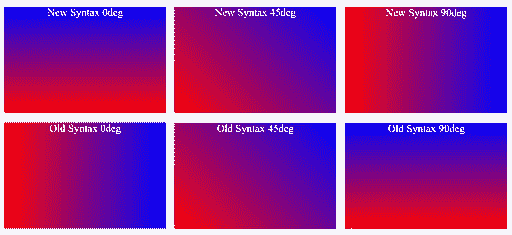](https://res.cloudinary.com/practicaldev/image/fetch/s--TAz-zZrb--/c_limit%2Cf_auto%2Cfl_progressive%2Cq_auto%2Cw_880/https://www.lambdatest.com/blog/wp-content/uploads/2019/04/Angled-CSS-Linear-Gradients.png)

下面是一个简单的转换公式，您可以使用它在两种语法中获得相同的渐变效果-

**新角度(无前缀的新语法):90°-旧角度(带前缀的旧语法)

旧角度(带前缀的旧语法):90°-新角度(无前缀的新语法)**

例如–

如果新角度为 0 度，则旧角度= 90-0 = 90 度

```
background: -webkit-linear-gradient(90deg, red, yellow, green);
background: linear-gradient(0deg, red, yellow, green); 
```

Enter fullscreen mode Exit fullscreen mode

如果新角度为 45 度，则旧角度= 90-45 度= 45 度

```
background: -webkit-linear-gradient(45deg, red, yellow, green);
background: linear-gradient(45deg, red, yellow, green); 
```

Enter fullscreen mode Exit fullscreen mode

如果新角度为 90 度，则旧角度= 90-90 = 0 度

```
background: -webkit-linear-gradient(0deg, red, yellow, green);
background: linear-gradient(90deg, red, yellow, green); 
```

Enter fullscreen mode Exit fullscreen mode

如果新角度是 135 度，那么旧角度= 90-135 度=-45 度

```
background: -webkit-linear-gradient(-45deg, red, yellow, green);
background: linear-gradient(135deg, red, yellow, green); 
```

Enter fullscreen mode Exit fullscreen mode

现在，在我们解决了渐变角度的复杂性之后，我们可以将所有的供应商前缀和回退编译在一起，以获得 CSS 线性渐变的最终[跨浏览器兼容解决方案。](https://www.lambdatest.com/blog/finding-cross-browser-compatibility-issues-in-html-and-css/?utm_source=dev&utm_medium=Blog&utm_campaign=ni-02-020519eu&utm_term=OrganicPosting) 

```
<!DOCTYPE html>
<html>
<head>
   <style>
       #grad1 {
           width: 25%;
           height: 100px;
           /* Solid color or jpg fallback */
           background-color: red; /*background-image: url(fallback.jpg);*/
           /* For Google Chrome(v 4-9) and Safari (v 4-5) */
           background-image: -webkit-gradient(linear, left bottom, right top, color-stop(0%, red), color-stop(100%, blue));
           /* For Chrome (v 10-25) and Safari(v 5.1-6)  */
           background-image: -webkit-linear-gradient(45deg, red 0%, blue 100%);
           /* For Firefox(v 3.6-15)  */
           background-image: -moz-linear-gradient(45deg, red 0%, blue 100%);
           /* For Opera(v 11.5) */
           background-image: -o-linear-gradient(45deg, red 0%, blue 100%);
           /* For IE 10+ */
           background-image: -ms-linear-gradient(45deg, red 0%, blue 100%);
           /* For IE6-9 */
           filter: progid:DXImageTransform.Microsoft.gradient(startColorstr='#ff0000', endColorstr='#0000ff', GradientType=1);
           -ms-filter: "progid:DXImageTransform.Microsoft.gradient (GradientType=0, startColorstr=#ff0000, endColorstr=#0000ff)";
           /* For Modern browsers */
           background-image: linear-gradient(45deg, red 0%, blue 100%);
       }
   </style>
</head>

<body>
   <h1>Linear Gradient</h1>
   <h3>Cross Browser Compatible Solution For All Browsers And Versions</h3>
   <div id="grad1"></div>
</body>
</html> 
```

Enter fullscreen mode Exit fullscreen mode

[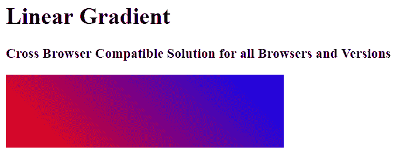](https://res.cloudinary.com/practicaldev/image/fetch/s--TCX7Pdwz--/c_limit%2Cf_auto%2Cfl_progressive%2Cq_auto%2Cw_880/https://www.lambdatest.com/blog/wp-content/uploads/2019/04/linear-gradient-8.png)

如果您有兴趣了解我们的代码如何出现在我们上面讨论的不同浏览器和版本中，请使用跨浏览器测试工具，如 LambdaTest，来验证跨 2000 多个真实浏览器和浏览器版本的[跨浏览器兼容性](https://www.lambdatest.com/feature?utm_source=dev&utm_medium=Blog&utm_campaign=ni-02-020519eu&utm_term=OrganicPosting)测试。

## 2。CSS 径向渐变

**CSS radial-gradient()** 函数用于创建两种或多种颜色之间的平滑渐变，这两种或多种颜色从称为中心的单个原点辐射，而不是 CSS 线性渐变中的直线。得到的渐变形状是圆形或椭圆形。径向 CSS 渐变从称为**中心**的奇点开始，向外辐射形成**同心形状**，可以是**圆形或椭圆形**。首先提到的颜色位于中心位置，然后向外逐渐向元素的边缘变成其他颜色。

径向 CSS 渐变可以用形状、大小、位置以及多个颜色停止点来表示。一系列同心色带或形状沿称为虚拟渐变光线的轴放置，该光线从中心向右横穿到最终形状。

**径向 CSS 渐变的语法**

`background-image: radial-gradient( , color-stop stop%, ..., color-stop stop%);`

*   **形状:**指定径向 CSS 渐变的形状。CSS 渐变形状值可以是椭圆或圆形。默认情况下，形状设置为椭圆形。
*   **Size :** 定义元素形状的径向 CSS 渐变的大小。尺寸值可以有 4 种类型——最远的角、最远的边、最近的角或最近的边。默认情况下，值设置为最远的角。
*   **位置:**中继径向 CSS 梯度的位置。值可以是左上右下或居中或两个值的组合。位置值也可以用%表示。默认情况下，它被设置为“在中心中心”或“在 50% 50%”。
*   **颜色停止:**定义一个颜色值，后跟一个 0-100%之间的停止值。提及止损值是可选的。0%表示形状的中心，可以是圆形或椭圆形，而 100%表示虚拟渐变光线与结束形状的交点。

[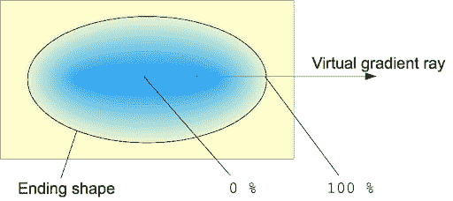](https://res.cloudinary.com/practicaldev/image/fetch/s--P_yKbGys--/c_limit%2Cf_auto%2Cfl_progressive%2Cq_auto%2Cw_880/https://www.lambdatest.com/blog/wp-content/uploads/2019/04/Radial-CSS-Gradients.png)

*图片来源:径向 CSS 渐变[来源](https://mdn.mozillademos.org/files/3795/radial%20gradient.png)*

现在，我们来看一些带有不同值的径向 CSS 渐变的例子。

### 具有均匀间隔色标的径向 CSS 渐变的基本示例

默认情况下，形状设置为椭圆，位置位于中心，大小设置为最远的角。当未提及 stop %时，默认情况下，所有 3 种颜色均匀分布。

```
<style>
      #radial-grad {
           height: 300px;
           width: 25%;
           background-image: radial-gradient(#f1c40f, #2ecc71, #e74c3c);
       }
</style> 
```

Enter fullscreen mode Exit fullscreen mode

[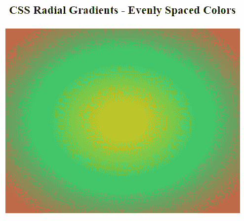](https://res.cloudinary.com/practicaldev/image/fetch/s--nraceTYj--/c_limit%2Cf_auto%2Cfl_progressive%2Cq_auto%2Cw_880/https://www.lambdatest.com/blog/wp-content/uploads/2019/04/Radial-CSS-Gradients-1.png)

### 带有不同间隔色标的放射状 CSS 渐变

这三种颜色可以用%的停止值来指定。现在，如果我们想设置绿色为 0%，黄色为 20%，红色为 70%。

```
<style>
       #radial-grad {
           height: 300px;
           width: 25%;
           background-image: radial-gradient(#2ecc71 0%, #f1c40f 20%, #3498db 70%);
       }
   </style> 
```

Enter fullscreen mode Exit fullscreen mode

[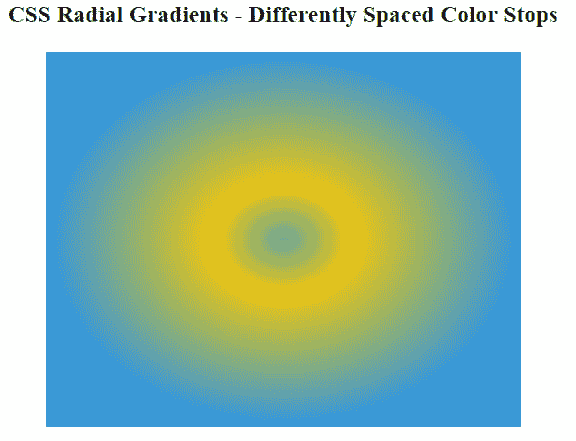](https://res.cloudinary.com/practicaldev/image/fetch/s--R1SU29bK--/c_limit%2Cf_auto%2Cfl_progressive%2Cq_auto%2Cw_880/https://www.lambdatest.com/blog/wp-content/uploads/2019/04/sd.png)

### 圆形放射状 CSS 渐变:

默认情况下，渐变形状设置为椭圆形。如果你想要一个圆形的径向 CSS 渐变，设置值为圆形。

```
<style>
          #radial-grad {
           height: 300px;
           width: 25%;
           background-image: radial-gradient(circle, #f1c40f 0%, #2ecc71 30%, #9b59b6 60%);
       }
      </style> 
```

Enter fullscreen mode Exit fullscreen mode

[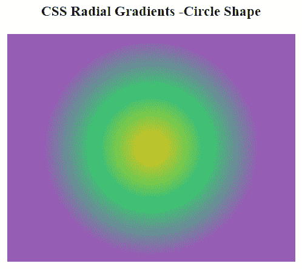](https://res.cloudinary.com/practicaldev/image/fetch/s--7zmW2_pt--/c_limit%2Cf_auto%2Cfl_progressive%2Cq_auto%2Cw_880/https://www.lambdatest.com/blog/wp-content/uploads/2019/04/CSS-Gradients-with-Circle-Shape.png)

### 不同大小值的径向 CSS 渐变

径向 CSS 渐变的大小值指定结束形状的大小。它可以是以下 4 个值之一

*   **最远角:**渐变的大小是这样确定的，它与渐变中心最远的角相遇。
*   **最近的角:**渐变的大小是这样确定的，它与渐变中心最近的角相交。
*   **最远侧:**默认值。渐变在离原点或渐变中心最远的一侧结束。
*   **最近边:**与最远边完全相反。渐变在离原点或渐变中心最近的一侧结束。

```
<style>
       #radial-grad1 {
           background-image: radial-gradient(circle farthest-side at 70% 40%, green, yellow , orangered );
       }
       #radial-grad2 {
           background-image: radial-gradient(circle closest-side at 70% 40%, green, yellow , orangered );
       }
       #radial-grad3 {
           background-image: radial-gradient(circle farthest-corner at 70% 40%, green, yellow , orangered );
       }
       #radial-grad4 {
           background-image: radial-gradient(circle closest-corner at 70% 40%, green, yellow , orangered );
       }
   </style 
```

Enter fullscreen mode Exit fullscreen mode

[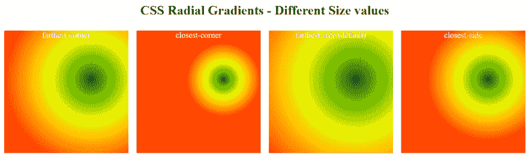](https://res.cloudinary.com/practicaldev/image/fetch/s--2l3yyKUO--/c_limit%2Cf_auto%2Cfl_progressive%2Cq_auto%2Cw_880/https://www.lambdatest.com/blog/wp-content/uploads/2019/04/css-gradient.png)

### 不同位置值的径向 CSS 渐变

径向 CSS 渐变的位置值可以通过使用顶部、右侧、底部、中心(或这些的组合)或百分比来指定。默认情况下，位置被设置为“在中心中心”或“在 50% 50%”。第一个值表示 x 轴位置，而第二个值表示 y 轴位置。

```
<style>
       #radial-grad1 {
           background-image: radial-gradient(circle farthest-side at 50% 50%, #f1c40f 0%, #2ecc71 70%, #9b59b6 100%);
       }

       #radial-grad2 {
           background-image: radial-gradient(circle farthest-side at 0% 50%, #f1c40f 0%, #2ecc71 70%, #9b59b6 100%);
       }

       #radial-grad3 {
           background-image: radial-gradient(circle farthest-side at center right, #f1c40f 0%, #2ecc71 70%, #9b59b6 100%);
       }

       #radial-grad4 {
           background-image: radial-gradient(circle farthest-side at bottom right, #f1c40f 0%, #2ecc71 70%, #9b59b6 100%);
       }

   </style> 
```

Enter fullscreen mode Exit fullscreen mode

[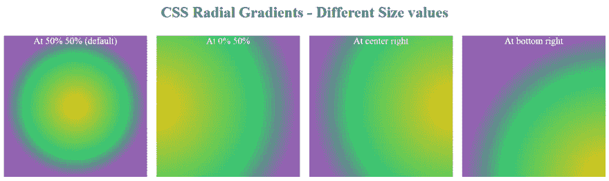](https://res.cloudinary.com/practicaldev/image/fetch/s--WAIUptUd--/c_limit%2Cf_auto%2Cfl_progressive%2Cq_auto%2Cw_880/https://www.lambdatest.com/blog/wp-content/uploads/2019/04/Radial-CSS-Gradients-with-Different-Position-Values.png)

### 带有锐色标的放射状 CSS 渐变

除了逐渐混合两种颜色之外，您还可以改变颜色停止值，以便在两种颜色之间获得清晰的直接过渡，从而获得清晰的色带。

```
#radial-grad {
           height: 300px;
           width: 25%;
           background-image: radial-gradient(circle, #f1c40f 0%, #f1c40f 30%, #1abc9c 30%, #1abc9c 60%, #e74c3c 60%, #e74c3c 100%);
       } 
```

Enter fullscreen mode Exit fullscreen mode

[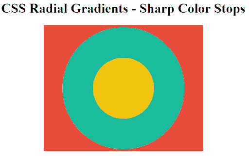](https://res.cloudinary.com/practicaldev/image/fetch/s--pNIi3nS---/c_limit%2Cf_auto%2Cfl_progressive%2Cq_auto%2Cw_880/https://www.lambdatest.com/blog/wp-content/uploads/2019/04/Radial-CSS-Gradients-with-Sharp-Color-Stops.png)

## 径向 CSS 渐变的跨浏览器兼容性解决方案

径向 CSS 渐变和我们上面讨论的 CSS 线性渐变一样享有相同的浏览器支持，提供了很好的跨浏览器兼容性。所有现代浏览器如谷歌 Chrome、Mozilla Firefox、Opera、Safari 和 Edge 都支持放射状 CSS 渐变。唯一的例外是在 IE 6-9 中。就像在 CSS 线性渐变的情况下，我们可以使用供应商前缀和回退来为旧版本的浏览器提供支持，然后执行手动/ [自动跨浏览器测试](https://www.lambdatest.com/selenium-automation?utm_source=dev&utm_medium=Blog&utm_campaign=ni-02-020519eu&utm_term=OrganicPosting)来查看我们的修复是否真正有效。

[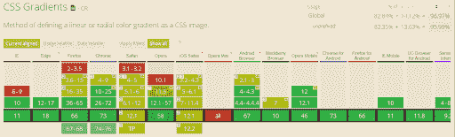](https://res.cloudinary.com/practicaldev/image/fetch/s--0EiQZgFB--/c_limit%2Cf_auto%2Cfl_progressive%2Cq_auto%2Cw_880/https://www.lambdatest.com/blog/wp-content/uploads/2019/04/Radial-CSS-Gradients-e.png)

*可以使用径向 CSS 渐变的跨浏览器兼容性表*

**径向 CSS 渐变的跨浏览器兼容语法**

所有主流浏览器的现代版本都支持 W3C 径向 CSS 渐变标准。

*   对于 Chrome 25+，Firefox 16+，Opera 15+，Safari 6.1+，IE 10+，iOS 7+，Android 4.4+来说

```
background-image: radial-gradient(circle at center, #f1c40f 0%, #1abc9c 100%); 
```

Enter fullscreen mode Exit fullscreen mode

**注意:**现代新无前缀语法要求你在指定位置时使用“at”。在下面显示的旧前缀语法中不需要它。

为了增加对 chrome、firefox、safari 和 opera 旧版本的支持，我们将使用下面提到的特定供应商前缀，并创建一个跨浏览器兼容的解决方案。使用 JPG 回退或聚合填充使径向 CSS 渐变在 IE 6-9 中工作。

*   适用于谷歌浏览器(4-9 版)和 Safari 浏览器(4-5 版)

```
background-image: -webkit-gradient(radial, center center, 0px, center center, 100%, color-stop(0%, #f1c40f), color-stop(100%,#1abc9c)); 
```

Enter fullscreen mode Exit fullscreen mode

*   适用于谷歌浏览器(版本 10-25)和 Safari 浏览器(版本 5.1-6)

```
 background-image: -webkit-radial-gradient(center, circle, #f1c40f 0%, #1abc9c 100%); 
```

Enter fullscreen mode Exit fullscreen mode

*   对于 Mozilla Firefox(3.6-15 版)

```
background-image: -moz-radial-gradient(center, circle cover, #f1c40f 0%, #1abc9c 100%); 
```

Enter fullscreen mode Exit fullscreen mode

*   歌剧(11.5 节)

```
background-image: -o-radial-gradient(center, circle, #f1c40f 0%, #1abc9c 100%); 
```

Enter fullscreen mode Exit fullscreen mode

*   纯色或 JPG/SVG 回退

```
background-color: red;  or background-image: url(fallback.jpg); 
```

Enter fullscreen mode Exit fullscreen mode

IE 滤镜属性只能用于创建 2 色线性渐变，而不能用于创建径向 CSS 渐变。因此，很难复制 IE6-9 的径向 CSS 梯度。使用线性梯度或 JPG/SVG 回退

[](https://accounts.lambdatest.com/register/?utm_source=dev&utm_medium=Blog&utm_campaign=ni-02-020519eu&utm_term=OrganicPosting)

## 3。CSS 锥形渐变

CSS 锥形渐变功能可以用来创建一个**圆形渐变模式**类似于径向 CSS 渐变。然而，**放射状 CSS 渐变创建了一个图案，其中色标从中心向外辐射，但是在圆锥形 CSS 渐变的情况下，色标被放置在原点的中心周围。**因其俯视呈圆锥状，故被称为**【圆锥】**。

圆锥形 CSS 梯度中不同颜色停止点的位置用度数或百分比来定义。0%对应 0 度，而 100%对应 360 度。顺时针方向转换时，度数或%位置值增加。虽然大于 360 度或 100%的值是允许的，但它在锥形 CSS 渐变画布上不会清晰可见，但仍可能会改变色标分布。

[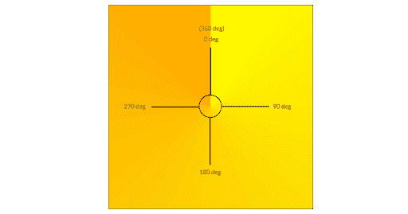](https://res.cloudinary.com/practicaldev/image/fetch/s--68hTDjBj--/c_limit%2Cf_auto%2Cfl_progressive%2Cq_auto%2Cw_880/https://www.lambdatest.com/blog/wp-content/uploads/2019/04/CSS-Conical-Gradients.png)

**锥形 CSS 渐变的语法**

`background-image: conic-gradient( , colorStop1 angle, colorStop2 angle, …);`

*   **起始角度:**起始角度可以用度或% >来指定，默认设置为 0 度或 0%
*   **位置:**位置可指定为居中、上、左、右、下或百分比。默认情况下，锥形 CSS 渐变位置设置为中心或 50%。
*   **颜色停止:**每个颜色停止可指定开始和结束颜色。默认情况下，第一个颜色停止点和最后一个颜色停止点的角度设置为 0 度和 360 度。

现在，我们来看一些圆锥形 CSS 渐变的例子。

### 基本锥形 CSS 渐变图案

起始角度为 0 度的锥形 CSS 渐变，位于中心位置，有三个颜色停止点

```
<style>
       #conic-grad {
           width: 25%;
           height: 300px;
          background: conic-gradient(#1abc9c 0deg, #f1c40f, #e74c3c 360deg);
       }
   </style> 
```

Enter fullscreen mode Exit fullscreen mode

[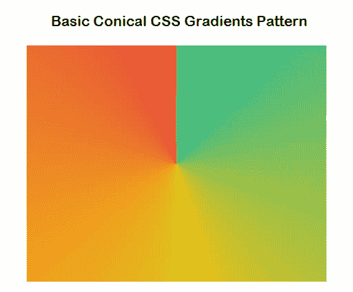](https://res.cloudinary.com/practicaldev/image/fetch/s--oQ-HDE0a--/c_limit%2Cf_auto%2Cfl_progressive%2Cq_auto%2Cw_880/https://www.lambdatest.com/blog/wp-content/uploads/2019/04/Basic-Conical-CSS-Gradients-Pattern.png)

### 2。使用 CSS 锥形渐变创建饼图

您可以使用 CSS 锥形渐变来创建一个饼图，通过定义急剧过渡的颜色停止。如前所述，**圆锥形渐变函数中指定的每个色标都可以用一个开始和结束角度来补充。**为了获得一个急剧的或瞬时的而不是逐渐渐进的过渡值，一个颜色停止的起始角小于或等于前一个颜色停止的结束角。因此，要么将每个色标的开始角度设置为 0%，要么将第一个色标的结束角度设置为等于第二个色标的开始角度，依此类推。最后，将元素的边框半径设置为 50%，得到一个圆形 div。

```
<style>
       #conic-grad {
           width: 25%;
           height: 300px;
           background: conic-gradient(#1abc9c 0% 33%, #f1c40f 0% 66%, #e74c3c 0% 100%);
           /*background: conic-gradient(#1abc9c 0% 33%, #f1c40f 33% 66%, #e74c3c 66% 100%);*/
           border-radius: 50%;
       }
   </style> 
```

Enter fullscreen mode Exit fullscreen mode

[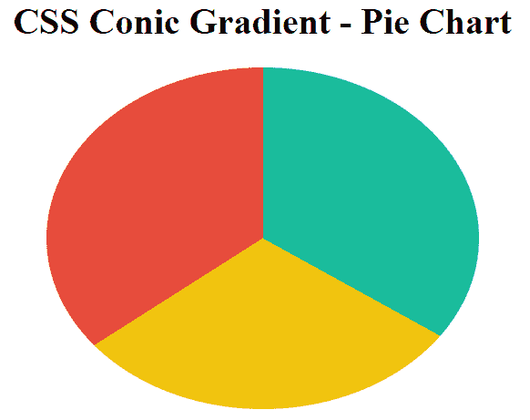](https://res.cloudinary.com/practicaldev/image/fetch/s--uNMeu6By--/c_limit%2Cf_auto%2Cfl_progressive%2Cq_auto%2Cw_880/https://www.lambdatest.com/blog/wp-content/uploads/2019/04/css-conic-gradient.png)

### 用 CSS 锥形渐变创建圆环图

为了创建一个使用锥形 CSS 渐变的圆环图，你可以同时使用径向和锥形渐变。在两个颜色停止点之间使用清晰的纯色过渡–径向渐变中的白色和透明。透明的颜色停止将与可见的圆锥形 CSS 渐变一致，给出一个圆环图的外观。您也可以使用 **:after 或:**before 创建一个伪元素，在锥形 CSS 渐变的中心创建白色圆形元素。

```
<style>
       #conic-grad {
           width: 25%;
           height: 300px;
           background: radial-gradient(white 40%, transparent 41%), conic-gradient(#1abc9c 0% 33%, #f1c40f 0% 66%, #e74c3c 0% 100%);
           border-radius: 50%;
       }
   </style> 
```

Enter fullscreen mode Exit fullscreen mode

[](https://res.cloudinary.com/practicaldev/image/fetch/s--_9MEMCPU--/c_limit%2Cf_auto%2Cfl_progressive%2Cq_auto%2Cw_880/https://www.lambdatest.com/blog/wp-content/uploads/2019/04/pasted-image-0-2.png)

## CSS 锥形渐变跨浏览器兼容解决方案

CSS 锥形渐变仍然处于实验阶段，还没有被大多数现代浏览器采用。桌面浏览器中只有 Google Chrome 69+和 Safari 12.1+以及移动浏览器中的 iOS safari 12.2、Android 12.2+和 Chrome Android 67 提供了对该功能的浏览器支持。其他流行的浏览器如 Mozilla Firefox、Opera 和 Edge 仍然没有推出对圆锥形 CSS 渐变的支持。

[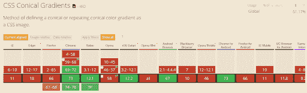](https://res.cloudinary.com/practicaldev/image/fetch/s--RfmAC2ey--/c_limit%2Cf_auto%2Cfl_progressive%2Cq_auto%2Cw_880/https://www.lambdatest.com/blog/wp-content/uploads/2019/04/CSS-Conical-Gradients-1.png)

*可以使用 CSS 锥形渐变的跨浏览器兼容性表*

为了给不支持的浏览器提供 CSS 锥形渐变功能，你可以使用一个巧妙的 polyfill。

## 4。CSS 重复渐变

CSS 重复渐变功能有助于生成重复的线性、放射状或圆锥形渐变图像。沿着一条线或围绕原点无限重复颜色停止，直到它包含整个元素画布。CSS 重复渐变函数有三种类型:**重复线性渐变()、重复径向渐变()、重复圆锥渐变()**。

### 重复-线性-渐变() :

CSS 重复线性梯度函数与 CSS 线性梯度函数使用完全相同的语法，也接受相同的参数。两者之间的区别在于，在线性渐变的情况下，色标逐渐在渐变轴上扩展，并且占据整个元素而不重复。另一方面，**在重复线性渐变的情况下，沿着指定方向以线性方式重复颜色停止。**每个色标之间的距离等于最后一个色标和第一个色标之间的差值。

**重复线性渐变的语法:**

`background-image: repeating-linear-gradient(45deg, red 10px, blue 60px);`

这两种颜色的偏移量是最后一个色标和第一个色标之间的差值，即 60-10px = 50px。这相当于`linear-gradient(45deg , ..., red -40px, blue 10px, red 10px, blue 60px, red 60px, blue 110px, ...);`

[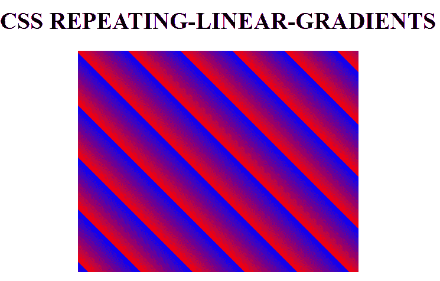](https://res.cloudinary.com/practicaldev/image/fetch/s--axpuf3-7--/c_limit%2Cf_auto%2Cfl_progressive%2Cq_auto%2Cw_880/https://www.lambdatest.com/blog/wp-content/uploads/2019/04/css-repeating.png)

为了创建具有明显过渡的彩色条纹，第一种颜色的结束色标应等于下一种颜色的开始色标。考虑这个例子—

```
<style>
    #repeating-linear-grad1 {
           width: 25%;
           height: 300px;
           background-image:
           repeating-linear-gradient(45deg, yellow 10px, yellow 20px, #009966 20px, #009966 30px, purple 30px, purple 40px);
    }
   </style> 
```

Enter fullscreen mode Exit fullscreen mode

[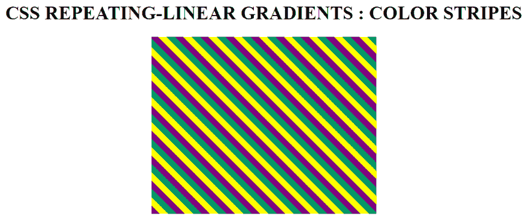](https://res.cloudinary.com/practicaldev/image/fetch/s--MLLXZyPH--/c_limit%2Cf_auto%2Cfl_progressive%2Cq_auto%2Cw_880/https://www.lambdatest.com/blog/wp-content/uploads/2019/04/css-linear-gradient.png)

### 重复-径向-渐变() :

CSS 重复径向梯度函数具有与 CSS 径向梯度函数完全相同的语法，并接受相同的参数。两者之间的区别在于这样一个事实，即**在径向渐变的情况下，彩色光阑以椭圆或圆形的方式在渐变虚拟光线上逐渐扩展，占据整个元素而不重复。另一方面，在重复线性渐变的情况下，色标以环形方式扩展，形成覆盖整个元素的重复带**。每个彩色光阑相隔的距离等于最后一个彩色光阑和第一个彩色光阑之间的差值。每个颜色停止的结束与下一个颜色停止的开始重合。

**语法:**

`background-image : repeating-radial-gradient(circle at center, red 10px, blue 60px);`

红色和蓝色这两种颜色移动了最后一个颜色停止点和第一个颜色停止点之间的差值，即 60-10px = 50px。这相当于`- radial-gradient ( circle at center , ..., red -40px, blue 10px, red 10px, blue 60px, red 60px, blue 110px, ...);`

[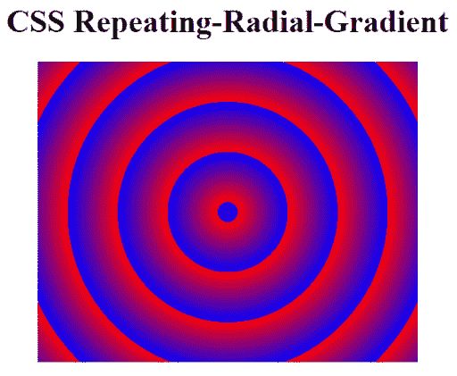](https://res.cloudinary.com/practicaldev/image/fetch/s--7SpI_ptC--/c_limit%2Cf_auto%2Cfl_progressive%2Cq_auto%2Cw_880/https://www.lambdatest.com/blog/wp-content/uploads/2019/04/CSS-repeating-radial-gradient.png)

为了创建具有明显过渡的彩色条纹，第一种颜色的结束色标应等于下一种颜色的开始色标。考虑这个例子—

```
<style>
   #repeating-radial-grad {
           width: 25%;
           height: 300px;
           background-image:
           repeating-radial-gradient(circle at center center, yellow 10px, yellow 20px, #009966 20px, #009966 30px, purple 30px, purple 40px);
       }
   </style> 
```

Enter fullscreen mode Exit fullscreen mode

[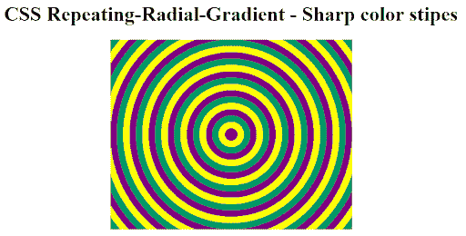](https://res.cloudinary.com/practicaldev/image/fetch/s--cbnDFX_O--/c_limit%2Cf_auto%2Cfl_progressive%2Cq_auto%2Cw_880/https://www.lambdatest.com/blog/wp-content/uploads/2019/04/CSS-repeating-radial-gradient-m.png)

### 重复-圆锥-梯度() :

CSS repeating-conic-gradient 在语法和参数方面的工作方式与 conic-gradient 类似，但会无限重复颜色停止，直到覆盖整个元素画布的 360%或 100%。

**语法:**

`background: repeating-conic-gradient(#f1c40f 0% 5%, #e74c3c 5% 10%);`

以%或度为单位将颜色停止的开始角度设置为等于上一个颜色停止的结束角度。在我们的示例中，#f1c40f 颜色停止的结束角度被设置为 5%，这等于#e74c3c 颜色停止的开始角度。

[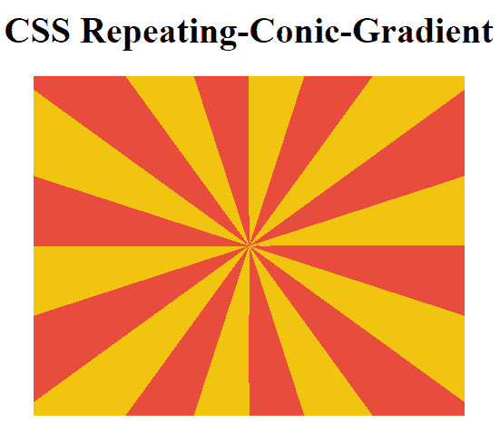](https://res.cloudinary.com/practicaldev/image/fetch/s--7XhUJCin--/c_limit%2Cf_auto%2Cfl_progressive%2Cq_auto%2Cw_880/https://www.lambdatest.com/blog/wp-content/uploads/2019/04/css-repeating-conic.png)

您还可以通过添加一行 CSS 代码轻松创建一个**棋盘图案**。将“背景尺寸”设置为“100% 100%”。此外，通过将第一个颜色停止的角度更改为 0% 25%并将第二个颜色停止的角度更改为 25%和 50%来更改颜色停止。

```
<style>
       #repeating-conic-grad {
           width: 300px;
           height: 300px;
           background: repeating-conic-gradient(#ecf0f1 0% 25%, #34495e 25% 50%);
           background-size: 100px 100px;
       }
   </style> 
```

Enter fullscreen mode Exit fullscreen mode

[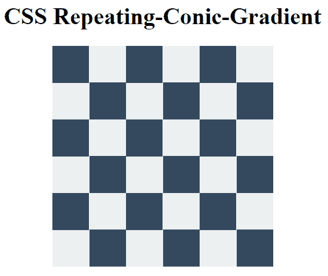](https://res.cloudinary.com/practicaldev/image/fetch/s--bByCQOGC--/c_limit%2Cf_auto%2Cfl_progressive%2Cq_auto%2Cw_880/https://www.lambdatest.com/blog/wp-content/uploads/2019/04/pasted-image-0-3.png)

## 你学到了什么！

现在，你可以通过简单地利用原生 CSS 渐变和跨浏览器兼容性技巧来创建任何种类的渐变模式，而不依赖于图像和 SVG。继续尝试应用 CSS 渐变来创建各种不同的 UI 元素，如带有渐变覆盖、渐变按钮、边框轮廓、阴影、倾斜渐变遮罩等的图像。牢记浏览器兼容性的重要性，设计一个合理的[跨浏览器测试策略](https://www.lambdatest.com/blog/cross-browser-testing-strategy-explained-in-three-easy-steps/?utm_source=dev&utm_medium=Blog&utm_campaign=ni-02-020519eu&utm_term=OrganicPosting)。用 CSS 渐变来呈现一个优秀的网页是没有意义的，因为它在不同的浏览器上会呈现得很糟糕。干杯！

[](https://accounts.lambdatest.com/register/?utm_source=dev&utm_medium=Blog&utm_campaign=ni-02-020519eu&utm_term=OrganicPosting)

**相关帖子**

1.  [修复 CSS 不透明的浏览器兼容性问题& RGBA](https://www.lambdatest.com/blog/fixing-browser-compatibility-issues-with-css-opacity-rgba/?utm_source=dev&utm_medium=Blog&utm_campaign=ni-02-020519eu&utm_term=OrganicPosting)
2.  [专业测试人员如何在 Selenium 自动化脚本中使用 CSS 选择器？](https://www.lambdatest.com/blog/how-pro-testers-use-css-selectors-in-selenium-automation-scripts/?utm_source=dev&utm_medium=Blog&utm_campaign=ni-02-020519eu&utm_term=OrganicPosting)
3.  [具有跨浏览器兼容性特征检测的 CSS](https://www.lambdatest.com/blog/css-with-feature-detection-for-cross-browser-compatibility/?utm_source=dev&utm_medium=Blog&utm_campaign=ni-02-020519eu&utm_term=OrganicPosting)