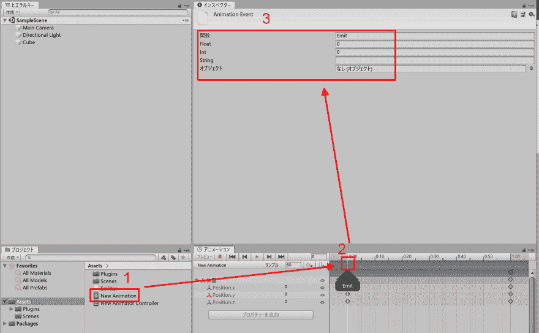
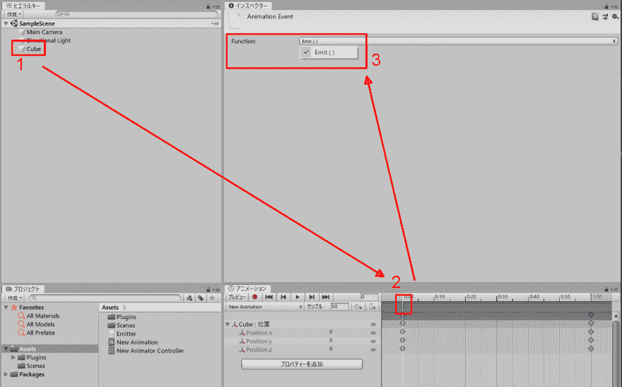

# 在 Unity 的 Animation Event 中很难理解函数定义和函数选择

> 原文：<https://dev.to/shiena/unity-animation-event-4fd8>

# 前言

[使用动画事件- Unity 手册](https://docs.unity3d.com/ja/current/Manual/animeditor-AnimationEvents.html)和[- Unity 似乎要熟练使用动画事件！ 参考](https://qiita.com/yun_T/items/58e77d3396ded286affc)试图给自制动画添加 Animation Event，但由于很难理解检查器的行为，所以进行了总结。

# 动画 Eventの関数定義

1.  在“项目”选项卡中选择 Animation 文件。
2.  在“动画”选项卡中，选择“动画事件”。
3.  在检查器中出现函数定义。

# 动画 Eventの関数選択

1.  用等级键选择与包含上述 Animation 的 Animation Controller 相关联的游戏对象。
2.  在“动画”选项卡中，选择“动画事件”。
3.  在检查器中出现函数选择。

# 总结

我仔细想想为什么会有这样的行为，因为函数定义是 Animation Event 的定义在 Animation 本身，所以选择文件，然后从附加到同一游戏对象的脚本中选择函数，所以我知道了阶级性游戏对象 话虽如此，很难看出因为之前选择的东西而导致动作发生变化……

# 参考链接

*   [使用动画事件- Unity 手册](https://docs.unity3d.com/ja/current/Manual/animeditor-AnimationEvents.html)
*   [【统一】动画 Eventを使いこなそう!](https://qiita.com/yun_T/items/58e77d3396ded286affc)