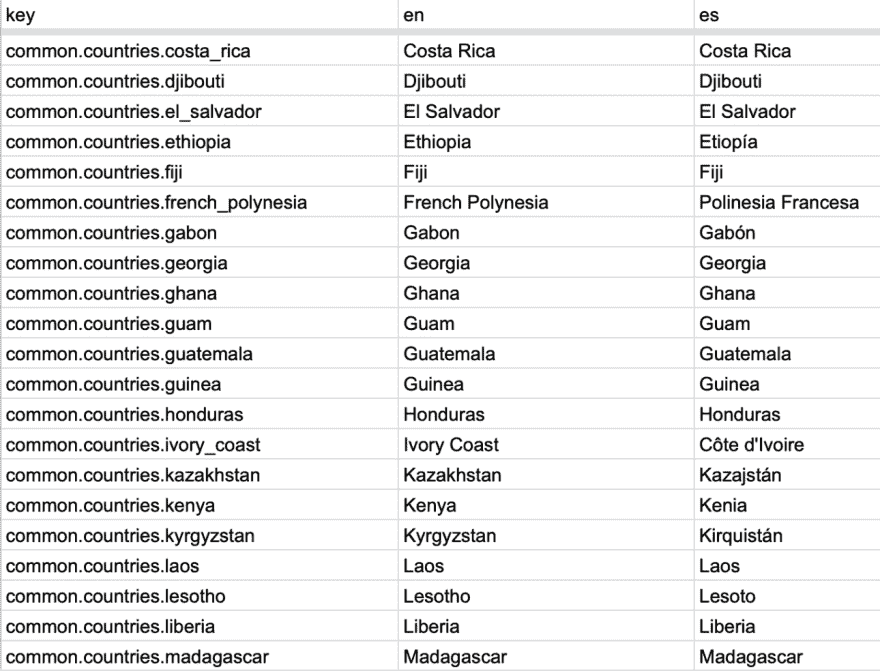

# 我们如何为汽车市场创建多站点设置:第 1 部分

> 原文：<https://dev.to/codicacom/how-we-created-a-multi-site-setup-for-a-vehicle-marketplace-part-1-224b>

*这篇文章最初发表在 [Codica 博客](https://www.codica.com/blog/multisite-vehicle-marketplace/)上。*

今天，我们想向您展示文章的第一部分，描述我们在非洲开发第一个[多厂商汽车市场](https://www.codica.com/case-studies/multi-vendor-vehicle-marketplace/)的方式。该平台为用户提供了交易新车和二手车、卡车和摩托车的机会。

该客户的主要目标是开发一个全球市场解决方案，为非洲和南美洲的许多地理区域提供服务。任务是连接客户与私人业主和经销商。

在开发之初，有一些平台网站，我们的目标是开发更多，扩大市场规模。考虑到所有的优点和缺点，我们的开发团队决定开发一个多站点设置。

到目前为止，有 89 个市场网站单独运行，并且这个数字还在继续增长。让我们开始行动吧，看看我们是如何达到这个结果的。

## 什么是多站点设置？

准确地说，多站点设置是独立网站的组合。在这里，您可以看到多域和多站点解决方案的比较表，以了解我们为什么选择此选项。

| 方面 | 多域 | 多站点 |
| --- | --- | --- |
| 领域 | 子域 | 不同领域 |
| 数据库ˌ资料库 | 一个 | 每个站点/域有单独的数据库 |
| 内容管理 | 通过一个面板 | 通过每个站点/域的多个面板 |
| 监视 | 容易的 | 中等 |
| 维护 | 困难的 | 中等 |
| 稳定性 | 低的 | 高的 |
| 加载速率 | 低的 | 高的 |

正如我们所看到的，多域选项的主要好处之一是易于内容管理，但是我们的开发团队选择了多站点解决方案。主要原因是它提供了不可否认好处稳定性和维护。

## 挑战

### 配置

**目标:正确组织和维护设施**

简而言之，我们的开发团队采用了一个复合配置系统，它提供了一个编辑每个站点的设置及其逻辑的机会。它被藏在一个 Git 存储库中。因此，它存储了所有网站的模板文件和颜色方案的 CSS 文件。

最初，每个站点都有自己的文件，其中包含支持的货币设置和其他信息。

```
site_name: NewSite
site_url: Newsite.com
continent: Continent
country_code: AO
currencies: { 'AOA': 'AOA', 'USD': 'USD' }
emails:
  contact_email: info@newsite.com
  from_email: info@newsite.com
socials:
  facebook: https://www.facebook.com/newsite/
  google_plus: https://plus.google.com/u/0/+Newsite
  instagram: https://www.instagram.com/newsite/
  linkedin: http://www.linkedin.com/company/new-site
  twitter: https://www.twitter.com/newsite
  youtube: https://www.youtube.com/channel/newsite 
```

Enter fullscreen mode Exit fullscreen mode

此外，我们有机会同时编辑和管理所有的网站。我们有这样的可能性，因为存在一个主要的 HTML/CSS 模板，它对所有的网站都是通用的。

这里你可以看到一个普通模板 CSS 文件的例子。如果我们编辑这个文件中的变量，那么所有网站的配色方案都会相应地改变。这个解决方案大大简化了配置调整。

```
$color-1: #0052b4;
$color-1-hover: darken($color-1, 20%);
$color-2: #cb032b; 
```

Enter fullscreen mode Exit fullscreen mode

### 本地化

#### 语言

如果你在许多国家经营市场，那么语言问题就变得具有挑战性。它包括创建翻译，以及更新和控制。

我们的主要目标是考虑特定地理区域的所有可能的语言，并集成它们以获得最佳用户体验。为了实现这一目标，我们创建了一个成熟的本地化系统，在这些国家支持**任何国家**和**多种语言**。

目标 1。提供快速简单的本地化

每个网站都提供几种语言，包括英语和当地语言。为了修改语言，我们采用了 [Ruby gems](https://www.codica.com/blog/top-ruby-gems-we-cant-live-without/) 来允许在短时间内解决许多问题，因为它们简化了开发过程。

我们的开发团队已经使用 [i18n gem](https://github.com/ruby-i18n/i18n) (默认设置)，为市场提供国际化解决方案。

此外，在这个 gem 的帮助下，我们有机会本地化诸如日期和时间、验证通知等信息。

目标 2。监控和管理多个翻译文件

在开发的这个阶段，我们完全意识到让客户轻松管理翻译是非常重要的。

我们已经开发了我们定制的解决方案:在提到的 gems (i18n，i18n- tasks)和[自定义 CSV 导入和导出任务](https://github.com/glebm/i18n-tasks/wiki/Custom-CSV-import-and-export-tasks)的帮助下，我们创建了一个导入和导出功能。

让我们来定义它的工作方式:

*   客户端向谷歌文档添加翻译。
*   这个文档与我们的 Git 存储库`.yml`文件同步，因此在我们的本地文件中更新。

此外，我们能够通过更改代码库中的数据来更新 Google Doc。

下面你可以看到一个谷歌文档屏幕，上面有来自代码库的“key”值和不同语言的相应值。

[](https://res.cloudinary.com/practicaldev/image/fetch/s--uNOctcoR--/c_limit%2Cf_auto%2Cfl_progressive%2Cq_auto%2Cw_880/https://thepracticaldev.s3.amazonaws.com/i/lf66na5ljlsedmr12v28.png)

继续前进，我们面临一个新的问题:为了调整整个平台的本地化，我们需要经常修改语言环境文件。

为了解决这个问题，我们的开发团队修改并改进了上面提到的**自定义 CSV 导入和导出任务**功能。现在，它让我们有可能一次将数据写入不同的文件，这大大提高了本地化管理。

让我们来看看这个机制是如何工作的:

```
def csv_export(_opts = {})
    translations_by_path = {}
    router = I18n::Tasks::Data::Router::PatternRouter.new(nil, write: i18n.config['csv']['export'])

    create_locales_file(i18n.locales)

    all_locales = i18n.locales << i18n.base_locale

    all_locales.each do |locale|
      router.route(locale, i18n.data_forest) do |path, nodes|
        translations_by_path[path] ||= {}
        translations_by_path[path][locale] ||= {}
        nodes.leaves do |node|
          translations_by_path[path][locale][node.full_key(root: false)] = node.value
        end
      end
      import_locale_in_csv(locale, translations_by_path)
    end
  End 
```

Enter fullscreen mode Exit fullscreen mode

现在，我们有机会跟踪和验证 Google Drive API 中的所有文件，并将区域设置导出到 Google Drive。在那里，我们可以简单方便地编辑和管理翻译。

当我们收到电子邮件通知时，我们使用以下方法运行导入功能从 Google Drive 获取数据:

```
 def csv_import_from_google
    translations = []
    file_links.each do |_local, token|
      csv = File.read(URI.open("https://docs.google.com/spreadsheets/d/#{token}/export?format=csv"))
      import_locale(csv, translations)
    end
    i18n.data.merge! I18n::Tasks::Data::Tree::Siblings.from_flat_pairs(translations)
  end

 def import_locale(csv, translations)
    CSV.parse(csv, headers: true) do |row|
      key = row['key']
      next unless key

      get_locale_from_files(row).each do |locale|
        raise "Locale missing for key #{key}! (locales in app: #{locales} / locales in file: #{row.headers.inspect})" unless row.key?(locale)
        translations << [[locale, key].join('.'), row[locale]] if row[locale].present? && skip_locale?(key)
      end
    end
  End 
```

Enter fullscreen mode Exit fullscreen mode

#### 货币

**目标:创建多种货币的兑换系统**

考虑到许多地点和货币，为平台用户提供一个方便的货币转换系统至关重要。

市场客户需要有机会以当地货币或美元确定价格，并快速进行转换。这个任务有点复杂，因为站点和货币的数量相当大。

对于每个网站，我们设置了几种货币，包括美元和当地货币。用户可以用任何列出的货币设定价格，也可以将其转换成任何其他可用的货币。

为了在平台上实现高效的货币转换，我们采用了 [Money Gem](https://github.com/RubyMoney/money) 。

然后，我们又面临了另一个问题:**汇率快速变化**。

为了解决这个问题，我们开发了一种特殊的自动服务，每小时更新一次汇率。我们在服务器上采用了[Cron Jobs](https://cron-job.org/en/)——它是一个在 Rails 应用程序中调度某些循环动作的工具。

此外，我们的开发团队已经配置了该工具，每小时向 Money Gem API 发送一次请求，接收当前货币兑换率的数据，解析数据，然后在平台上完成。

让我们看看这个服务是如何工作的:

```
class UpdateCurrenciesRate < BaseService

  def call
    base_rate = ExchangeRate.base_currency
    Settings.currencies.to_h.values.each do |currency|
      next if currency == base_rate
      update_rate(base_rate, currency)
    end
  end

  private

  def update_rate(base, target)
    currency_rate = JSON.parse(open(generate_link(base, target)).read)
    save_rate(base, target, currency_rate.values.first)
  rescue StandardError => error
    puts error
  end

  def generate_link(base, target)
    "http://free.currencyconverterapi.com/api/v3/convert?q=#{base}_#{target}&compact=ultra"
  end

  def save_rate(base, target, rate)
    Money.default_bank.add_rate(base, target, rate)
  end

End 
```

Enter fullscreen mode Exit fullscreen mode

## 结论

在这里，我们向您展示了文章的第一部分，涵盖了[市场开发](https://www.codica.com/services/online-marketplace-development/)的挑战，如**配置**和**本地化(语言、货币)**。第二部分即将推出，届时我们将告诉你关于**测试**和**部署**的挑战。

这种解决方案既省时又省钱，因为您可以轻松高效地管理平台网站。配置系统支持您增强单个网站并获得整个平台的结果。

敬请关注，点击此处阅读全文:[我们如何为汽车市场创建多站点设置](https://www.codica.com/blog/multisite-vehicle-marketplace/)。