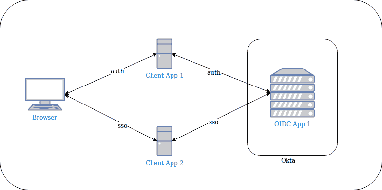
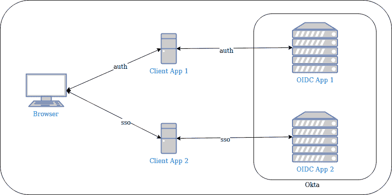
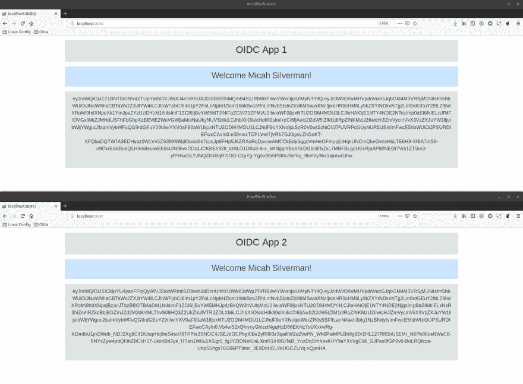
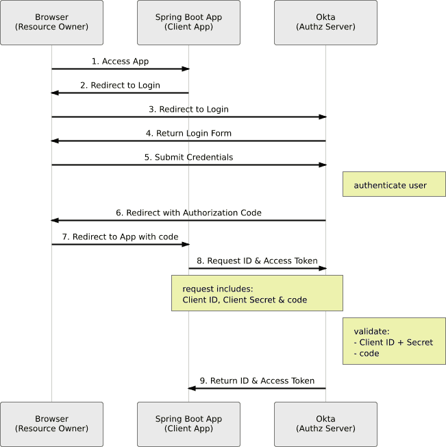

# 使用 Spring Boot 和 OAuth 2.0 实现简单的单点登录

> 原文：<https://dev.to/oktadev/easy-single-sign-on-with-spring-boot-and-oauth-2-0-13ig>

单点登录曾经是企业规模公司的“圣杯”,通常只提供给有能力的公司。如今，我们认为单点登录是理所当然的。例如，如果你登录了 Gmail，然后又不得不在去谷歌文档的时候再次登录，你会觉得这非常奇怪(而且令人不快)。

但是，如何为开发人员构建定制应用程序呢？SSO 仍然处于企业领域，从专有解决方案到 SAML，这通常需要复杂的内部解决方案配置。

现在，有了 OAuth 2.0 和 OpenID Connect 这样的标准以及像 [Okta](https://developer.okta.com/) 这样的服务提供商，开发人员可以轻松地将 SSO 集成到他们的应用程序中，无论是爱好项目还是企业级应用程序。

在这篇文章中，我将介绍 OpenID Connect——授权认证和 SSO 的关键支持技术——然后跳转到一个 Spring Boot 代码示例，在这里您可以看到 SSO 在多个应用程序中的运行。

## 利用 OAuth 2.0 和 OpenID Connect 实现单点登录的方法

借助 OIDC，SSO 通常通过一个定义的 OpenID Connect 应用程序链接多个应用程序来实现:

[](https://res.cloudinary.com/practicaldev/image/fetch/s--no5auREF--/c_limit%2Cf_auto%2Cfl_progressive%2Cq_auto%2Cw_880/https://d33wubrfki0l68.cloudfront.net/23f402b96ce8cd1c3dd9cdcedb9eec525963cc79/828e0/assets-jekyll/blog/spring-boot-single-sign-on-oauth-2/oidc_sso_1-6045009e1110b8a4cf86dfebc459558cc495db99f8114f9bb2469163ff58eaa1.png)

在上图中，您可以看到您实现了单点登录，因为您通过 OIDC 应用 1 向客户端应用 1 进行了身份验证，并且客户端应用 2 连接到同一个 OIDC 应用 1。

我们称之为“一级”单点登录。

“级别 2”是能够将多个客户端应用程序连接到多个 OIDC 应用程序，并且仍然能够完成单点登录。这看起来是这样的:

[](https://res.cloudinary.com/practicaldev/image/fetch/s--o9KdDmmg--/c_limit%2Cf_auto%2Cfl_progressive%2Cq_auto%2Cw_880/https://d33wubrfki0l68.cloudfront.net/dd0033c8c23a7aacbab380ad8f313b1124f1ebf5/4e05b/assets-jekyll/blog/spring-boot-single-sign-on-oauth-2/oidc_sso_2-41e505cfbb39dbfd1fb5598f72412cee2b3e409e1d53839ac324015e967960dd.png)

与 OpenID Connect 的成功交互导致 ID 令牌(身份令牌)被传递回应用程序。

在这种情况下，您可能对 OIDC App 1 和 OIDC App 2 之间返回的 ID 令牌中包含的信息有不同的要求。每个 Spring Boot 应用程序都有自己的 ID 令牌，而您只需认证一次。

## 使用 OAuth 和 OpenID Connect 为您的应用程序设置下一级单点登录

前往[developer.okta.com](https://developer.okta.com/signup/)为自己创建一个永久免费的开发者账户。查找电子邮件以完成您的 Okta org 的初始化。

接下来，您将设置两个 OpenID Connect 应用程序。

在管理控制台中导航到**应用程序**并点击:**添加应用程序**。选择**网页**，点击**下一步**。

用这些值填充字段:

| 字段名 | 价值 |
| --- | --- |
| 名字 | OIDC App 1 |
| 基地 URIs | [http://localhost:8080](http://localhost:8080) |
| 登录重定向 URIs | [http://localhost:8080/log in/oauth 2/code/okta](http://localhost:8080/login/oauth2/code/okta) |

点击**完成**。

向下滚动并复制`Client ID`和`Client Secret`。您很快就会用到这些值。

使用这些值以相同的方式创建第二个应用程序:

| 字段名 | 价值 |
| --- | --- |
| 名字 | OIDC App 2 |
| 基地 URIs | [http://localhost:8081](http://localhost:8081) |
| 登录重定向 URIs | [http://localhost:8081/log in/oauth 2/code/okta](http://localhost:8081/login/oauth2/code/okta) |

将`Client ID`和`Client Secret`值也复制到这里。

接下来，您将设置一些带有自定义声明和访问策略的授权服务器。这决定了当请求令牌时，Okta 是否会发出令牌。

导航到 **API >授权服务器**。点击**添加授权服务器**。根据下表填写数值:

| 字段名 | 价值 |
| --- | --- |
| 名字 | OIDC App 1 |
| 观众 | API://oid cap 1 |
| 描述 | OIDC App 1 |

点击**完成**。点击**的**标签页。点击**添加索赔**。在字段中填入这些值(未提及的值保留为默认值):

| 字段名 | 价值 |
| --- | --- |
| 名字 | appName |
| 包括在令牌类型中 | ID 标记总是 |
| 价值 | 《OIDC App 1》 |

请注意“OIDC 应用程序 1”中的双引号(")。

点击**访问策略**选项卡。点击**添加策略**。在**名称**和**描述**字段输入`OIDC App 1`。对于**分配给**字段，选择**以下客户**。开始在输入区输入`OIDC`，点击**在`OIDC App 1`的右边添加**。点击**创建策略**。这会将策略绑定到您的第一个 OIDC 应用程序。

点击**添加规则**。在**名称**字段输入`OIDC App 1`。取消选择除**授权码**之外的所有授权类型。点击**创建规则**。这确保了请求必须是授权代码流，以便 Okta 创建令牌(下面将详细介绍授权代码流)。

点击**设置**选项卡，复制**发行方** URL。您很快就会用到这个值。

现在，您将为第二个授权服务器重复所有操作，只是这一次，它将绑定到您的第二个 OIDC 应用程序。

导航到 **API >授权服务器**。点击**添加授权服务器**。根据下表填写数值:

| 字段名 | 价值 |
| --- | --- |
| 名字 | OIDC App 2 |
| 观众 | API://oid cap 2 |
| 描述 | OIDC App 2 |

点击**完成**。点击**的**标签页。点击**添加索赔**。在字段中填入这些值(未提及的值保留为默认值):

| 字段名 | 价值 |
| --- | --- |
| 名字 | appName |
| 包括在令牌类型中 | ID 标记总是 |
| 价值 | 《OIDC App 2》 |

请注意“OIDC 应用程序 2”中的双引号(")。

点击**访问策略**选项卡。点击**添加策略**。在**名称**和**描述**字段输入`OIDC App 2`。对于**分配给**字段，选择**以下客户**。开始在输入区输入`OIDC`，点击**在`OIDC App 2`的右边添加**。点击**创建策略**。这将策略绑定到您的第二个 OIDC 应用程序。

点击**添加规则**。在**名称**字段输入`OIDC App 2`。取消选择除**授权码**之外的所有授权类型。点击**创建规则**。这确保了请求必须是授权代码流，以便 Okta 创建令牌。

点击**设置**选项卡，复制**发行方** URL。

## 使用 Spring Boot 的 OAuth 集成进行单点登录

现在您已经完成了所有的配置，您可以看到“下一级”单点登录的运行。

github 项目包括一个启动应用程序的 shell 脚本。这适用于 Mac 和 Linux。如果您在另一个平台上，只需检查脚本的最后一行来启动应用程序。打开两个终端窗口。首先执行以下命令:

```
./run_app.sh \
    --ci <client id, oidc app 1> \
    --cs <client secret, oidc app 1> \
    --is <issuer, oidc app 1> \
    --po 8080 
```

在第二个终端窗口中执行以下命令:

```
./run_app.sh \
    --ci <client id, oidc app 2> \
    --cs <client secret, oidc app 2> \
    --is <issuer, oidc app 2> \
    --po 8081 
```

启动您的浏览器并导航至 [http://localhost:8080](http://localhost:8080) 。您将立即被重定向以进行身份验证。输入用户名和密码后，你应该会看到你的名字和应用程序的名称:OIDC 应用程序 1。如果您没有看到应用程序名称，则可能是您没有正确配置自定义声明。您还会看到 [JSON Web Token](https://tools.ietf.org/html/rfc7519) 格式的原始 ID Token。您可以将 JWT 复制并粘贴到 [jsonwebtoken.io](https://jsonwebtoken.io) 并查看其内容，其中包括`appName`声明。

在浏览器中打开第二个选项卡，导航到 [http://localhost:8081](http://localhost:8081) 。

你不应该被要求再次认证，你应该看到你的名字，应用程序的名称:OIDC 应用程序 2，和另一个 JWT。

这是单点登录的实际应用。而且，您使用两个独立的 spring boot 应用程序，连接到两个不同的授权服务器，绑定到两个不同的 OIDC 应用程序。这是下一级 SSO！

[](https://res.cloudinary.com/practicaldev/image/fetch/s--pJzZETmL--/c_limit%2Cf_auto%2Cfl_progressive%2Cq_auto%2Cw_880/https://d33wubrfki0l68.cloudfront.net/7e157d46bdce9770f7714166856b1ad68996f9f6/f6c65/assets-jekyll/blog/spring-boot-single-sign-on-oauth-2/oidc_sso_in_action-0b9d2bc8e40a4115aa80281d51064cf32be7161410ef00a8d9e500177c35a395.png)

## Spring Security 与 OAuth for Easy Java

是 Okta 为 OIDC 提供的云服务(位于 OAuth 之上)和 SSO 让这一切得以实现。Okta 的 [Spring Boot 启动器](https://github.com/okta/okta-spring-boot)结合最新版本的[弹簧安全](https://spring.io/projects/spring-security)让代码超级简单。

整个项目只有三个依赖:`spring-boot-starter-web`、`spring-boot-starter-thymeleaf`和`okta-spring-boot-starter`。

`spring-boot-starter-web`给应用程序一个[模型-视图-控制器](https://docs.spring.io/spring/docs/current/spring-framework-reference/web.html#mvc)框架。`spring-boot-starter-thymeleaf`是与 Spring 集成的[模板引擎](https://www.thymeleaf.org/)，是 MVC 框架的视图部分。`okta-spring-boot-starter`引入了 Spring Security，因此您不必将其定义为另一个依赖项。

使用 Okta Spring Boot 启动器，您只需要三位信息就可以与 Okta 集成:`client id`、`client secret`和`issuer`。

默认情况下，Spring Security 需要身份验证，所以在这个例子中不需要额外的配置。

看一看`HomeController` :

```
 @GetMapping("/")
 public ModelAndView home(@AuthenticationPrincipal OidcUser user) {
     ModelAndView mav = new ModelAndView();
     mav.addObject("user", user.getUserInfo());
     mav.addObject("idToken", user.getIdToken().getTokenValue());
     mav.setViewName("home");
     return mav;
 } 
```

进入这个方法时，Spring Security 已经通过授权代码流管理了身份验证。一个`OidcUser`对象被自动传递到该方法中，该对象表示来自 ID 标记的所有已解析声明以及 ID 标记 JWT 本身。从`OidcUser`中检索用户信息和原始 JWT，并添加到模型中。然后，该方法呈现视图:home.html。

看一看`home.html` :
的心脏

```
 <div th:if="${user.claims.containsKey('appName')}"
     class="alert alert-success text-center" role="alert"
 >
     <h2 th:text="${user.claims.appName}"></h2>
 </div>
 <p/>
 <div th:if="${user.claims.containsKey('name')}"
     class="alert alert-primary text-center" role="alert"
 >
     <h3 th:inline="text">Welcome [[${user.claims.name}]]!</h3>
 </div>
 <div class="alert alert-secondary text-center">
     <p th:inline="text" class="text-break" style="overflow-wrap: anywhere">
         [[${idToken}]]
     </p>
 </div> 
```

第一个 div 中的`th:if`是百里香叶模板，以防止您没有正确设置`appName`自定义声明。假设存在，`appName`是使用传递给该视图的模型中的`user.claims.appName`呈现的。

第二个 div 显示用户名。

第三个 div 显示了在上面的控制器中添加到模型中的原始 JWT。

## OpenID Connect 的五分钟概述

有了单点登录的新观点和可用的 Spring Boot 应用程序，让我们更深入地了解 OIDC。

OpenID Connect 是一个基于 OAuth 2.0 之上的身份和认证层。除了“知道”你是谁之外，你还可以使用 OIDC 进行单点登录。对 Spring Boot 和奥克塔来说尤其容易。

OIDC 是为 web 应用程序以及本地和移动应用程序而构建的。这是一种由微软、谷歌和其他公司开发的现代认证方法。它支持委托认证。这意味着我可以向我选择的身份验证提供者(如 Okta)提供我的凭证，然后我的定制应用程序(如 Spring Boot 应用程序)以 ID 令牌的形式获得一个断言，证明我成功地通过了身份验证。Spring Boot 应用程序永远看不到用户名和密码。对于现代应用程序来说，这是一个很好的方法，在这种应用程序中，您希望将身份验证等问题与应用程序的业务逻辑分开。

作为开发人员，我知道我需要身份验证。但是，这些年来，我已经看到了足够多的关于违规的恐怖故事，我很乐意不直接处理凭据。

OpenID Connect 使用“流”来完成委托认证。这只是从应用程序中的未验证状态进入验证状态所采取的步骤。

让我们浏览一下 OIDC 流程的序列图:

[](https://res.cloudinary.com/practicaldev/image/fetch/s--iLRUXeG6--/c_limit%2Cf_auto%2Cfl_progressive%2Cq_auto%2Cw_880/https://d33wubrfki0l68.cloudfront.net/17d11e48e8583bcff8206c698039f1fcd9205400/56b07/assets-jekyll/blog/spring-boot-single-sign-on-oauth-2/auth_code_flow-f27567f5419867eb3b49d99ea4cc4a5067e32e306a8311ba087de618ccea6e63.png)

这个流称为授权代码流，对于最终用户来说是最安全的流。这就是你在这篇文章附带的[代码示例](https://github.com/oktadeveloper/okta-spring-boot-oidc-sso-example)中使用的那个。该流程的目标是将令牌作为身份证明发送到 Spring Boot 应用程序。

您在浏览器中启动来自应用程序的流。它向授权服务器(Okta)发送一个包含 redirect_uri 值的请求。这是为了在您通过身份验证后，Okta 可以用授权码将您发送回应用程序中的正确位置。

Spring Boot 应用程序现在可以将授权码兑换成 Okta 的代币。

为什么跳这支舞？您的 Spring Boot 应用程序永远看不到凭据。注意在步骤 5 中，凭证被直接提交给 Okta。授权码通过浏览器(发起请求的地方)重定向回来。但是，我们不希望浏览器直接获得令牌。由您控制的应用程序——Spring Boot 应用程序——从 Okta 获取令牌更安全。这就是为什么是 Spring Boot 应用程序用代码交换令牌。

要了解 OAuth 2.0 和 OIDC 的更多信息，请查看这些博客帖子

*   [一个 OpenID 连接引物](https://developer.okta.com/blog/2017/07/25/oidc-primer-part-1)
*   [使用 Spring Security 的 OAuth 2.0 快速指南](https://developer.okta.com/blog/2019/03/12/oauth2-spring-security-guide)
*   [将你的 Spring Boot 应用迁移到最新最好的 Spring Security 和 OAuth 2.0](https://developer.okta.com/blog/2019/03/05/spring-boot-migration)

## 了解有关安全单点登录、OAuth 2.0 和 Spring Boot 的更多信息

Okta Spring Boot 启动程序使您能够通过几行代码和三个配置属性将您的 Spring Boot 应用程序与 Okta 集成。

除了我们的 Spring Boot Starter，Okta 的 OpenID Connect 服务不仅符合标准，还为您提供了复杂的单点登录体验，同一个用户可以访问许多不同的 OIDC 应用程序，每个应用程序都有自己的要求和配置。记住:OIDC 是建立在 OAuth 2.0 之上的——它不是独立的。OAuth 专门关注授权，而 OIDC 则明确增加了身份和认证方面的关注。

如果你想了解更多关于 OAuth 和 Spring Boot 的信息，你可能会对下面这些帖子感兴趣:

*   [通过 Spring Boot 和 OAuth 2.0 实现安全的服务器到服务器通信](https://developer.okta.com/blog/2018/04/02/client-creds-with-spring-boot)
*   [适用于本地和移动应用的 OAuth 2.0](https://developer.okta.com/blog/2018/12/13/oauth-2-for-native-and-mobile-apps)
*   [OAuth 2.0 隐式流死了吗？](https://developer.okta.com/blog/2019/05/01/is-the-oauth-implicit-flow-dead)

喜欢你今天学到的吗？在 [Twitter](https://twitter.com/oktadev) 上关注我们，订阅我们的 [YouTube 频道](https://www.youtube.com/channel/UC5AMiWqFVFxF1q9Ya1FuZ_Q)获取更多精彩内容！