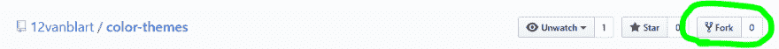
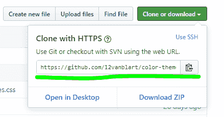
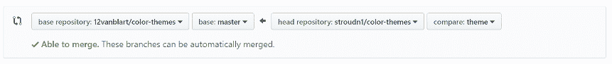
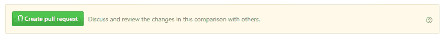
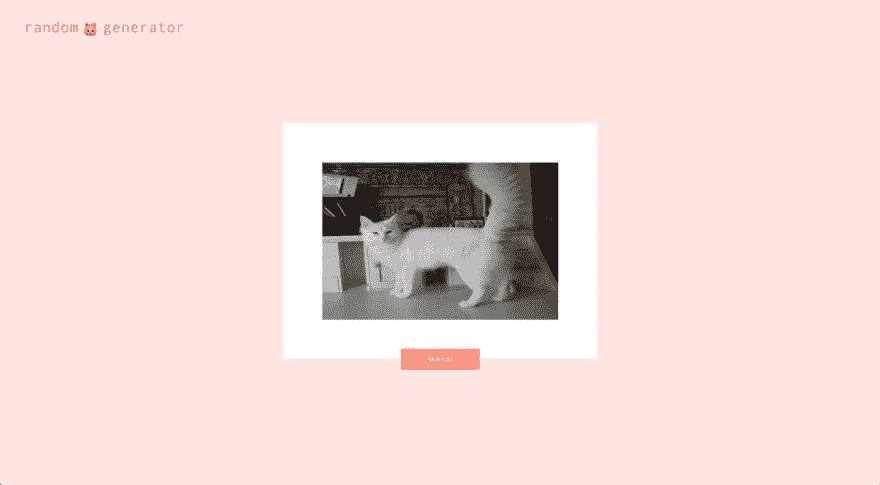

# 提出您的第一个拉取请求

> 原文：<https://dev.to/terabytetiger/make-your-first-pull-request-3iai>

## 先决条件

*   [安装 git](https://git-scm.com/downloads) (在您的终端上与`git --version`核对)
*   [安装 npm -寻找“下载 Node.js 和 npm”按钮](https://www.npmjs.com/get-npm)(在你的终端上用`npm --v`检查)
*   [一个 GitHub 账户](https://github.com/)

第一个拉动请求总是最难的！如果你在一个台阶上卡住了，请随时联系我，我会帮你走过你被绊倒的地方！

## 终端中的基本导航

以下命令将帮助您开始在终端中导航。

`pwd` -显示您当前所在的目录。“当前工作目录”的缩写
`ls`(windows 的`dir`)-列出当前目录的内容
`cd ..` -导航到您当前位置
`cd {directory}`上方的目录-导航到指定目录。这可以是绝对路径或相对路径。

这些命令都不会改变任何东西，所以请随意尝试它们并熟悉它们。你会经常用到它们。

## 设置

1.  在浏览器中导航到[https://github.com/12vanblart/color-themes](https://github.com/12vanblart/color-themes)
2.  点击右上角的“分叉”按钮
3.  一旦 GitHub 完成了对资源库的分支，点击“克隆或下载”按钮，在对话框中复制 url。
4.  打开您的终端并导航到您可以添加项目目录的目录(当您运行下一个命令时，它将在您的当前位置创建一个文件夹)。
5.  运行`git clone url_copied_from_step_3`——这将在您的目录中创建我的存储库的副本
6.  运行`cd ./color-themes`打开项目目录
7.  运行`git checkout -b yourBranchName`，但是将`yourBranchName`替换为您想要调用的分支
8.  运行`npm install`来安装项目依赖项
9.  如果使用 VS 代码，运行`code .`用代码打开目录。如果没有，打开您选择的编辑器/IDE 并打开`color-themes`文件夹。
10.  运行`npm run serve`运行应用程序的本地副本。(您可以通过按下`Ctrl + c`并回答`y`到“您想要终止批处理作业吗？”来随时停止此操作)
11.  打开您选择的网络浏览器并导航至`localhost:8080`

在这一点上，你应该看到和在 themes.tvanblargan.com 上看到的一样的东西。

## 添加主题

添加新主题需要更新两个文件- `src/assets/themes.css`和`src/components/ThemePicker.vue`。这些文件是在你使用上面的`git clone`命令时创建的。如果您不知道任何 Vue，请不要担心，您需要对该文件进行的更改不会太大！

### 编辑 ThemePicker.vue

在这个文件中，您将从第 28 行开始看到一个`<Theme>`组件列表。在所有现有的`<Theme>`之后添加新的一行，如下:

```
<Theme theme-name="your-theme-name" display-name="Your Theme Name" contributor="githubUsername"/> 
```

Enter fullscreen mode Exit fullscreen mode

用类名替换`your-theme-name`(见下面编辑 themes.css)，用你希望你的主题名称在选项列表中显示的任何名称替换`Your Theme Name`，用你的 GitHub 用户名替换`githubUsername`。

### 编辑 themes.css

在第 15 行，你需要复制以下内容(确保你的主题在注释结束后位于文件的顶部):

```
.your-theme-name {
  --primary: #fff;
  --secondary: #fff;
  --accent: #fff;
  --link: #fff;
  --text: #fff;
} 
```

Enter fullscreen mode Exit fullscreen mode

你可以将`your-theme-name`更新为你想要的主题类的名称(检查是否已经有了你选择的名称的主题！).

接下来，更新`#fff`成为你选择的颜色。如果你不确定从哪里开始挑选颜色，我推荐你试试[帕莱特](https://palettte.app/)

一旦你选择了你的主题，保存 themes.css 将立即更新本地主机，而不需要重新选择你的新主题！

### 对已接受请购单的要求

请注意，每次选择一个主题时，`A11y`卡的值都会重新计算和更新，以反映各种主题颜色之间的对比度。为了让您的主题获得批准，这些数字中的每一个都需要大于或等于 4.5 (WCAG AA 兼容)。

## 提交您的更改

一旦你对你的主题感到满意，并且通过了对比度要求，你会想要保存你的更改，这样它们可以被添加到现场，每个人都可以看到你的精彩主题！

为此，回到您的终端，使用`Ctrl + C`停止本地服务器(当提示“终止批处理作业(Y/N)？”时，键入`y`并按 enter 键)).然后，我们将运行以下命令:

1.  `git add *` -这告诉 git 您想要将所有修改过的文件添加到提交中
2.  ` git commit-m " Add theme your-theme-name "-这将您的更改保存为一个可以添加到 GitHub 的点。
3.  `git push --set-upstream origin yourBranchName`(如果出现提示，请输入用户名/密码)——这将把您的提交上传到 GitHub！

## 发出拉取请求！

现在前往[github.com](https://github.com/)并导航到您的分叉库(github.com/yourUserName/color-themes)并选择“拉请求”选项卡，然后按下“新拉请求”按钮。

1.  一旦页面加载完毕，你需要确保左边的下拉框是`base repository: 12vanblart/color-themes`和`base: master`，右边的选项是`head repository: yourUserName/color-themes`和`compare: yourBranchName`。
2.  点击“创建拉动请求”并填写详细信息
3.  点击“创建拉动请求”提交您的主题进行审查！

## 关闭思绪

现在你已经知道了足够多的信息，可以去为那些很酷的项目做一些公关了，比如艾玛的这个:

> 艾玛·魏德金🐞@ emmawedekind当我说我买了[randomcatgenerator.com](https://t.co/velmWXaLWz)的时候你们都以为我在开玩笑。
> 
> 在这里。它没有反应。很可能是不可及的。但是请随意修复我的 bug😜【github.com/emmawedekind/r…】
> 
> 随机命名即将到来。2019 年 4 月 26 日下午 17:57[](https://twitter.com/intent/tweet?in_reply_to=1121835739065520131)[](https://twitter.com/intent/retweet?tweet_id=1121835739065520131)[](https://twitter.com/intent/like?tweet_id=1121835739065520131)

或者这个来自布列塔尼(它有很好的文档和入门问题！):

##  [ brittanyrw ](https://github.com/brittanyrw) / [表情屏幕](https://github.com/brittanyrw/emojiscreen)

### 表情屏幕是通过表情符号描绘的电影、电视节目和音乐剧的列表。

<article class="markdown-body entry-content container-lg" itemprop="text">

# EmojiScreen <g-emoji class="g-emoji" alias="tv" fallback-src="https://github.githubassets.cimg/icons/emoji/unicode/1f4fa.png">📺</g-emoji>

## 通过表情符号描述的电影、电视节目和音乐剧列表。

[游览 emojiscreen.com](https://emojiscreen.com)

[](https://github.com/brittanyrw/emojiscreenreadme/emoji-screen.png)

## 投稿指南<g-emoji class="g-emoji" alias="gift" fallback-src="https://github.githubassets.cimg/icons/emoji/unicode/1f381.png">🎁</g-emoji>

以下是参与本项目时需要遵循的一些准则。

### 添加电影、电视节目或音乐剧

要将节目或电影添加到此项目中，您需要首先检查`movies.js`、`tv.js`或`musicals.js`文件中的项目，以确保您要添加的电影或节目不在项目中。一旦您确认您想要添加的项目已经不在项目中，您将在`data`文件夹中的`movies.js`、`tv.js`或`musicals.js`文件中添加一个`Emoji Card`。每个文件都由一个对象数组(列表)组成。您将为您的节目或电影添加一个新对象到适当的文件中。请注意:`musicals.js`文件是为…

</article>

[View on GitHub](https://github.com/brittanyrw/emojiscreen)

### 最后一个音符

非常感谢 Natalie 对这篇文章的措辞进行了校对和思考。

[](/nataliecodes)

## [娜塔莉·斯特劳德](/nataliecodes) <button name="button" type="button" data-info="{&quot;className&quot;:&quot;User&quot;,&quot;style&quot;:&quot;full&quot;,&quot;id&quot;:145364,&quot;name&quot;:&quot;natalie stroud&quot;}" class="crayons-btn follow-action-button whitespace-nowrap  " aria-label="Follow user: natalie stroud" aria-pressed="false">跟随</button>

[developer. Google Women Techmaker. LTUX co-organizer. Pearl Jam's biggest fan.](/nataliecodes)