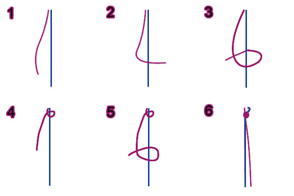

# 速成班:git 行话

> 原文：<https://dev.to/terabytetiger/crash-course-git-lingo-1enj>

## [T1】简介](#intro)

当开始编程时，您可能会听到“git”和“GitHub”到处都是，但是试图深入了解它们可能会让您感到不知所措。

注意:使用 git 和在线存储代码有很多选择。在这篇文章中，我将特别关注 Github，因为这是我所熟悉的平台。同样，我的友谊手镯比喻是基于被创造与结。

### git vs GitHub

在我们开始之前，先简要说明一下这两个术语。

“git”是一个在代码中保存时刻的工具，而“GitHub”是一个平台，允许你以可共享的格式存储使用 git 创建的时刻。

## Git 作为友谊手镯

[](https://res.cloudinary.com/practicaldev/image/fetch/s--tt4KukPv--/c_limit%2Cf_auto%2Cfl_progressive%2Cq_auto%2Cw_880/https://thepracticaldev.s3.amazonaws.com/i/y5isbie4l7p9g9vz9log.jpg)

把 git 想象成一个友谊手镯，组成手镯的每一条线都是代码变化/添加的子集，当所有的部分组合在一起时，最终产品就是手镯成品！

git 的优势之一是它允许你和其他开发者一起开发你的手环，允许他们引入新的颜色(代码)和技术来帮助使你的手环比你自己尝试做的更棒！

## 关键词&命令

### 贡献者

> 贡献者是添加到你的手镯的任何人。

就像友谊手镯一样，贡献可以有多种形式，而且都很重要！一些例子包括:

*   尝试使用代码时报告错误
*   添加到代码中
*   撰写关于如何使用代码的博客文章

### 仓库(Repo)

> 仓库是世界的友谊手镯！

每个手镯都是一个由所有细绳(代码)组成的储存库。他们可以有任何数量的贡献者，任何规模或语言，并在从开始到完成项目的过程中的任何地方。

### 分店/结账

> 树枝是友谊手镯的“宽度”绳。

类似于在友谊手镯上工作，你一次只能在一个“宽度”链上工作。你关注的那一串被称为你的“检出”分支。

在命名分支时，习惯上是根据分支要实现的特性来命名。当一个新的存储库被创建时，默认情况下它会带有一个`master`分支。这是所有“活动”或“生产”代码存在的地方，通常不应该直接对`master`进行更改。

#### 示例代码:

```
// list of branches (Current branch returns with a star)
git branch

// create a branch
git branch <branch_name>

// checkout (switch to) a branch
git checkout <branch_name>

// create & checkout branch
git checkout -b <branch_name> 
```

Enter fullscreen mode Exit fullscreen mode

### 克隆命令

> 拿起你朋友的手镯。

`clone`是一个终端命令，允许您在电脑上创建存储库的副本。克隆时，您可以使用 HTTPS 和 SSH 链接。为了简单起见，我将坚持使用 HTTPS，但是关于 SSH 的更多信息可以在 GitHub 上找到[。](https://help.github.com/en/articles/connecting-to-github-with-ssh)

#### 示例代码:

```
// HTTPS Clone
git clone https://github.com/12vanblart/color-themes.git 
```

Enter fullscreen mode Exit fullscreen mode

### 拉动命令

> 问“嘿，朋友！手镯怎么样了？”

当在一个分支上工作时，在添加到它之前，确保你有其他人可能已经做的任何改变是很重要的。一旦你在你想要工作的分支上，你可以使用`git pull`得到任何改变。

#### 示例代码:

```
// Get changes for current branch
git pull

// Get changes for all local branches
git pull --all 
```

Enter fullscreen mode Exit fullscreen mode

### 暂存/添加命令

> 这是你把绳子打成一个结的时刻，但是在你拉紧它之前。

add 命令告诉 git 您想要将哪些文件置于“暂存”状态。Staging 是您希望准备文件以保存到分支的一种奇特方式。

```
// Stage a single file
git add <path_to_file>

// Stage all changed files
git add * 
```

Enter fullscreen mode Exit fullscreen mode

### 提交

> 这是当你把你的结拉得很紧的时候——足以看到变化会是什么样子，但又不至于难以解开。

提交会获取所有存储的项目，向它们附加一条消息，并将它们保存到分支。有一种说法是“尽早提交，经常提交”，这是基于这样一个事实:如果你想尝试一些事情，但最终没有成功，你可以将代码倒回到一个更早的提交。

#### 示例代码:

```
// Commit currently staged files with a message
git commit -m "<your message here>"

// View past commits
git log

// Rewind to a specific commit
git reset <commit id from git log>

// Discard changes to a file (after rewind)
// Note: This is permanent and should be handled with care.
git checkout -- <file_name> 
```

Enter fullscreen mode Exit fullscreen mode

### 推送命令

> “哎！你看我正在做的手镯！”

push 命令将您的本地分支的提交保存到存储库中，供其他人查看、提取和处理。

#### 示例代码:

```
// push your changes to GitHub
git push 
```

Enter fullscreen mode Exit fullscreen mode

### 拉式请求

> 一旦你在储存库中添加了一个分支，并拉紧你的绳结，看看它看起来像什么，最后要做的事情是与手镯的所有者确认是否可以进行更改。

创建一个拉请求是一个过程，用于在将分支的变更添加到存储库的主代码之前，确保存储库的所有者(或者其他授权用户)同意您的分支的变更。当一个分支被添加到主分支时，开发人员称之为“合并一个拉请求”。

### 叉

> 想象一下，你有一台神奇的打印机，可以让你放入一个手镯，并得到你放入的手镯的两个精确副本。所以，你借了你朋友的手镯，用打印机打印，然后把原来的手镯还回去。这就是派生存储库的作用！

Fork 允许您在自己的用户名下创建一个存储库的副本，从中您可以创建分支，甚至可以向初始存储库发出请求。

> 最常见的是，forks 用于提议对其他人的项目进行更改，或者将其他人的项目作为您自己想法的起点- [GitHub 文档](https://help.github.com/en/articles/fork-a-repo)

## 了解更多

如果你想了解更多关于 git 的知识，或者只是想要一个可靠的书签，当你需要了解 git 时，我强烈推荐 [Pro Git(免费！)](https://git-scm.com/book/en/v2)！这一分类不仅非常符合逻辑和简洁，而且我发现它很好地用容易理解的术语来表达。

### 最后一个音符

非常感谢 Natalie 对这篇文章的措辞进行了校对和思考。

[](/nataliecodes)

## [娜塔莉·斯特劳德](/nataliecodes) <button name="button" type="button" data-info="{&quot;className&quot;:&quot;User&quot;,&quot;style&quot;:&quot;full&quot;,&quot;id&quot;:145364,&quot;name&quot;:&quot;natalie stroud&quot;}" class="crayons-btn follow-action-button whitespace-nowrap  " aria-label="Follow user: natalie stroud" aria-pressed="false">跟随</button>

[developer. Google Women Techmaker. LTUX co-organizer. Pearl Jam's biggest fan.](/nataliecodes)