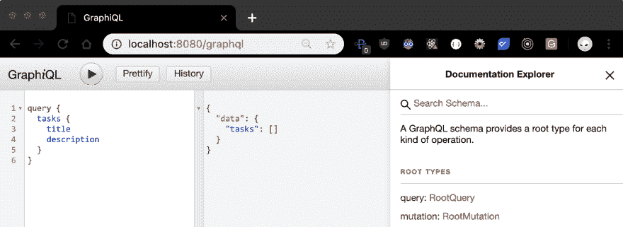
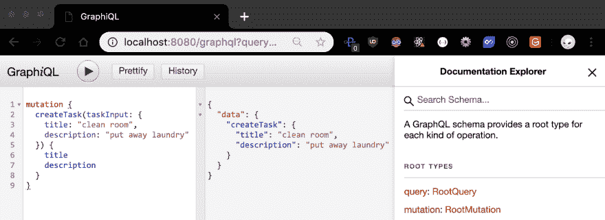
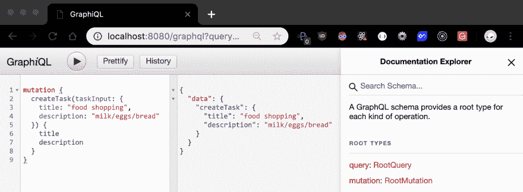
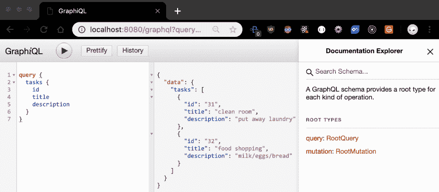
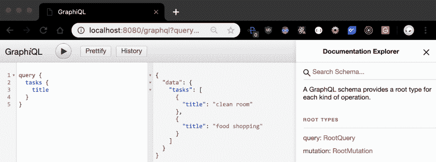

# 你想学 GraphQL，你想昨天就学会了

> 原文：<https://dev.to/cerosner/you-want-to-learn-graphql-and-you-want-to-have-learned-it-yesterday-3pk4>

# GraphQL 正迅速成为服务如何利用其 API 的领跑者。

因为 GraphQL 是一个*规范*而不是一个包罗万象的工具，所以它可以在任何平台上通过使用为各种服务器制作的单独库来定制。开发者可以**描述他们的数据**，向**索要他们想要的东西**，然后**得到可预测的结果**。

好吧，酷。所以，有什么大不了的？

## 起源

如果你看过我之前的[帖子](https://dev.to/cerosner/the-jam-stack-57l9)，你就会知道我喜欢从概述这些新技术是如何出现的以及为什么它们对软件工程的未来如此重要开始。

为了刷新，**应用编程接口**(API)公开了其他服务可以利用的特定内部数据。就像用户界面旨在指导人们使用应用程序一样，API 旨在让软件通过经由**通用资源标识符** (URIs)路由的端点与其他软件进行交互。

与人类不同，计算机不需要花哨的按钮或清晰的字体来导航 API，但程序员仍然需要在恶劣的环境中有效地操作代码，命令这些机器做到这一点。

简单对象访问协议(SOAP)几乎是构建这些接口的全部。它由手工管理的 XML 文档组成，这些文档必须遵守严格的协议规范，并且通常不使用错误堆栈来帮助查找现有的 bug。

对有组织的、不太复杂的标准的需求催生了当今大多数现代 web 服务使用的 RESTful 架构。

## 休息

**具象状态转移** (REST)仅仅是一种被采用的
风格，用于设计 HTTP 协议上的 API，直接访问 HTTP 协议提供的交付方法:`GET`、`POST`、`PUT`、`DELETE`。

这些请求决定了发送的数据会发生什么和/或作为响应发送回什么数据。如果您只想要其中的一部分数据，则必须定义更具体的 URI 端点，或者添加针对这种差异的查询参数。这可能导致冗长的、未使用的端点定义和复杂的查询，很容易成为任何人都难以管理的问题。

```
GET '/'                  // respond with all (root) data
GET '/users'             // respond with user data
GET '/users/userId'      // specified endpoint for one user's data
GET '/users?id=userId'   // query string for one user's data 
```

假设您可以在前端进行过滤，如果您将 API 设置为只发送一般的请求，但是这可能会降低应用程序的速度，因为每次负载中都会携带过多的信息。

你能看出我们要去哪里吗？

## GraphQL

GraphQL 向前端引入了一种查询语言(因此称为“QL”)，它允许我们通过始终向单个中间件端点`('/graphql')`发送`POST`请求来精简代码。与只读的`GET`请求不同，`POST`交付方法持有一个请求体，我们可以在其中构造查询，然后由后端的 GraphQL 规范发送和解释。

它是一种类型化语言，这意味着我们可以在代码运行之前定义我们的数据应该是什么样子，确保返回的正是我们所期望的。

这是我用 Node.js、Express 和 PostgreSQL/Sequelize 创建的一个超级简单的任务应用程序的 GraphQL 样板。

```
import express from 'express'
import bodyParser from 'body-parser'
import graphqlHttp from 'express-graphql'
import { buildSchema } from 'graphql'
import { db, Tasks } from '../database'

const PORT = 8080
const app = express()

app.use(bodyParser.json())

app.use('/graphql', graphqlHttp({
  schema: buildSchema(`
    type Task {
      id: ID!
      title: String!
      description: String! ${/* ! === not null */''} }

    input TaskInput {
      title: String!
      description: String!
    }

    type RootQuery { ${/* entry point for fetching data */''} tasks: [Task!]! ${/* returns a list (Array) of Task data types */''}  ${/* cannot return 'null' and cannot return an Array with 'null' */''}  ${/* add as many endpoints to this object as needed */''} }

    type RootMutation { ${/* entry point for manipulating data */''} createTask(taskInput: TaskInput!): Task! ${/* custom param 'taskInput' takes a TaskInput data type */ ''}  ${/* returns a Task data type */''}  ${/* add as many operations to this object as needed */''} }

    schema {
      query: RootQuery ${/* points to query entry point */''} mutation: RootMutation ${/* points to mutation entry point */''} }
  `),
  rootValue: {
    tasks: () => {
      return Tasks.findAll()  // query the database
      .then(allTasks => allTasks)  // return all tasks as defined in our RootQuery
      .catch(err => {
        console.log(err)
        throw err
      })
    },
    createTask: args => {  // 'args' is an object of all listed parameters
      const { title, description } = args.taskInput  // destructuring assignment

      const newTask = {  // assign TaskInput properties to a new task object
        title,
        description
      }

      return Tasks.create(newTask)  // query database to create the new task
      .then(createdTask => createdTask)  // return new task as defined in our RootMutation
      .catch(err => {
        console.log(err)
        throw err
      })
    }
  },
  graphiql: true // turn on UI
}))

db.sync()
  .then(() => app.listen(PORT, () => {
  console.log(`> I'm listening (:`)
  console.log(`> http://localhost:${PORT}/graphql`)
})) 
```

### **【graphql http()**

这个中间件功能通过我们的查询解析器`'/graphql'`端点路由请求。请求由我们定义的模式处理，然后转发给我们创建的相关解析器端点。

它采用具有以下主要属性的对象:

*   `schema` -指向我们决定数据应该是什么样子的地方
*   `rootValue` -指向与我们的模式端点匹配的解析器函数的对象

### **buildSchema()**

这个函数接受一个多行模板字符串，它实际上定义了我们的模式。它解析并转换该字符串，供我们的中间件使用，中间件将我们的数据发送到适当的解析器进行处理。我们必须遵守寻找某些关键字的 GraphQL 命令规范:

*   `type` -自定义对象
    *   *注意:类型名`RootQuery` / `RootMutation`只是约定俗成的，但是它们可以被你想叫的任何名字，只要你的模式指向它们*
*   `input` -特定类型的自定义对象
*   `schema` -扎根关键词
    *   `query` -用于`GET`请求的入口点
    *   `mutation`—`POST/PUT/DELETE`请求的入口点

### **图 ql**

这个 API 实现的最终补充是 GraphQL 的内置调试器。`GraphiQL`是一个可以在浏览器中访问的 UI，用于准确检查我们的端点(服务器运行时位于`'localhost:${port}/graphql'`)。只需将它添加到我们的中间件对象的末尾，并用一个布尔值打开/关闭它。

[](https://res.cloudinary.com/practicaldev/image/fetch/s--xsObyU-G--/c_limit%2Cf_auto%2Cfl_progressive%2Cq_auto%2Cw_880/https://thepracticaldev.s3.amazonaws.com/i/pzln6niea3rk7ap656rz.png)

> 查询所有任务的`title`和`description`(数据库为空)

[](https://res.cloudinary.com/practicaldev/image/fetch/s--Cj-86j1v--/c_limit%2Cf_auto%2Cfl_progressive%2Cq_auto%2Cw_880/https://thepracticaldev.s3.amazonaws.com/i/cgzcgbaz2bfwrgf0ulgb.png)
[T6】](https://res.cloudinary.com/practicaldev/image/fetch/s--0Bs83hTZ--/c_limit%2Cf_auto%2Cfl_progressive%2Cq_auto%2Cw_880/https://thepracticaldev.s3.amazonaws.com/i/5h5l6682dsyf2mis415u.png)

> 在数据库中手动创建任务

[](https://res.cloudinary.com/practicaldev/image/fetch/s--sbdNuMk6--/c_limit%2Cf_auto%2Cfl_progressive%2Cq_auto%2Cw_880/https://thepracticaldev.s3.amazonaws.com/i/0zdek29uz2knabdwqqwy.png)

> 查询所有任务的`id`、`title`、`description`

[](https://res.cloudinary.com/practicaldev/image/fetch/s--9fzZuUUb--/c_limit%2Cf_auto%2Cfl_progressive%2Cq_auto%2Cw_880/https://thepracticaldev.s3.amazonaws.com/i/2b6ocq9pqmghf6j0lg6a.png)

> 只查询所有任务的`title`

* * *

随着端点和解析器的增长，将这些功能分解到它们自己的模块中有助于保持事物的有序性，为设计结构的可维护性和整体数据质量提供易于遵循的路径。这很容易与标准的 RESTful 范式相比较——现在我们可以通过定义可变数据类型来准确地指定*我们希望我们的数据看起来是什么样子，从而允许我们要求完全唯一的数据组合，呈现可预测的响应，而没有多余流量的过载。这最终为优化功能节省了客户机-服务器周期之间的行程。*

GraphQL 是一个完美的例子，它展示了我们每天访问 web 时在优化过程中的指数增长，无论您是否是程序员！

### 这种进化最吸引人的方面，一般来说就是软件开发，是不断转换的能力；抽象再抽象。

打着开发人员体验(DX)的旗号，回忆起一位过去的导师的断言“大多数开发人员创建解决方案不是因为他们是梦想家，而是因为他们感到沮丧。”对编程易用性的任何增强都将为提高一般可访问性铺平道路；我们越快引导新来者掌握这些概念，我们就能越快合作找到有效的解决方案。