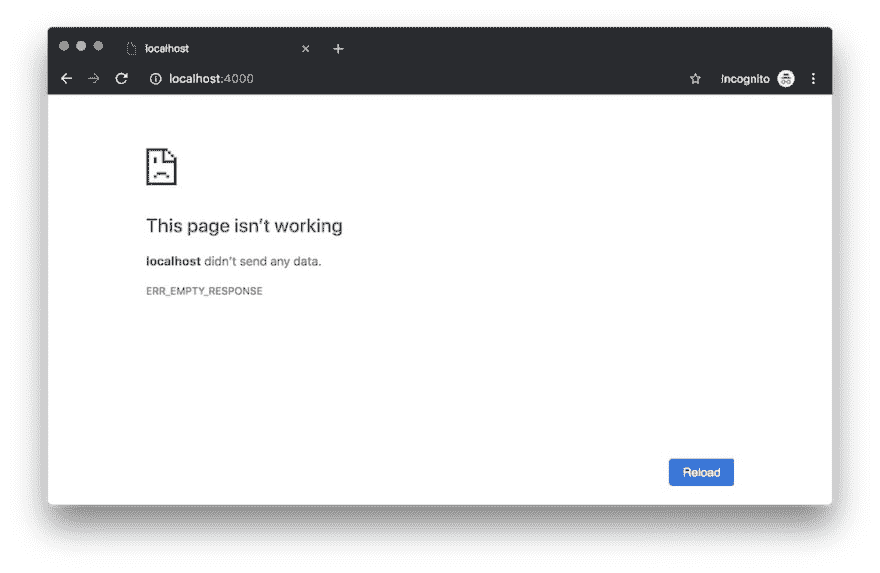
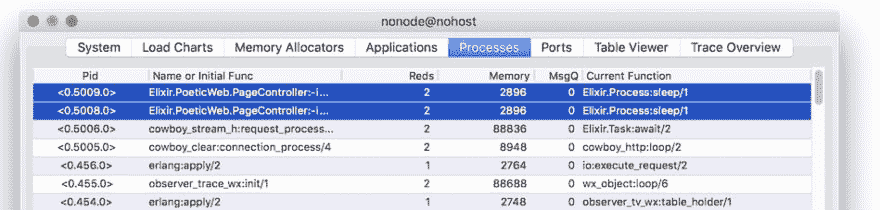
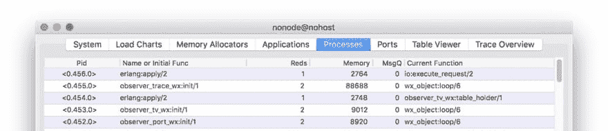

# 在 Phoenix 中处理长时间运行的 HTTP 请求和超时

> 原文：<https://dev.to/alvisesus/dealing-with-long-running-http-requests-and-timeouts-in-phoenix-1824>

有兴趣了解 Elixir、Phoenix 和软件架构吗？[订阅我的时事通讯，了解一般思考和每周深入的方法](https://www.poeticoding.com/subscribe-to-newsletter/)。

Phoenix 速度快，并发性高，可以在不到一毫秒的时间内处理 HTTP 请求。尽可能快地满足请求是我们的首要任务，但现实情况是，有时处理一个请求可能需要太长时间。这迫使 Phoenix 触发超时并关闭连接。

[](https://res.cloudinary.com/practicaldev/image/fetch/s--lm67lBcg--/c_limit%2Cf_auto%2Cfl_progressive%2Cq_auto%2Cw_880/https://www.poeticoding.com/wp-content/uploads/2019/05/image.png)

一般来说，我们的凤凰行动不只是渲染一个页面；它处理数据库、远程资源、外部服务、API 等。同时处理请求，这些步骤可能需要时间。

我们已经在[一步一步的教程中看到了如何构建一个支持用户上传的 Phoenix 应用](https://www.poeticoding.com/step-by-step-tutorial-to-build-a-phoenix-app-that-supports-user-uploads/)如何处理上传的文件，并将它们保存在本地。

[`UploadController.create`](https://github.com/poeticoding/phoenix_uploads_articles/blob/d67c4b2495a75410f7cc497a6df2dd54be37cc03/lib/poetic_web/controllers/upload_controller.ex#L16) 动作很简单，但是它做了一系列的事情:它计算文件的散列，将文件复制到本地目录，并将一些信息保存到数据库中。这些步骤中的每一步都需要时间，尤其是当文件很大或者数据库负载很重的时候。

通常，文件保存在云存储中(像 [AWS S3](https://aws.amazon.com/s3/) )。这意味着我们还需要考虑将文件(有时很大)上传到云存储服务所需的时间。

## 模拟一个长期运行的 HTTP 请求

为了方便地模拟一个长时间运行的请求，我们可以在新的 Phoenix 项目`PageController.index/2`默认创建的动作中使用 [`Process.sleep/1`](https://hexdocs.pm/elixir/Process.html#sleep/1) 。

```
# lib/poetic_web/controllers/page_controller.ex

defmodule PoeticWeb.PageController do
  use PoeticWeb, :controller

  def index(conn, _params) do
        Process.sleep 65_000

      render(conn, "index.html")
  end

end 
```

在呈现索引页面之前，我们强制动作的进程休眠 65 秒。然后我们用`curl`发出一个 HTTP 请求，触发`PageController.index/2`动作。

```
$ curl -v localhost:4000

* Connected to localhost (127.0.0.1) port 4000 (#0)
> GET / HTTP/1.1
> Host: localhost:4000
> User-Agent: curl/7.54.0
> Accept: */*
>
* Empty reply from server
* Connection #0 to host localhost left intact
curl: (52) Empty reply from server 
```

在 **60 秒**后，`curl`上升，错误:`Empty reply from server`。

Phoenix 没有记录任何超时错误，这使得超时更难发现，我们唯一注意到的是通常的`[info] Sent 2xx in ..`丢失了。

```
[info] GET /
[debug] Processing with PoeticWeb.PageController.index/2
  Parameters: %{}
  Pipelines: [:browser] 
```

Phoenix 不记录超时错误的原因是它不处理这种类型的超时。cowboy——Phoenix 附带的 HTTP 服务器——负责超时。

## 怎么才能解决这个？

默认情况下，Phoenix 给我们 60 秒的时间来处理一个 HTTP 请求并回复。让我们实话实说...在大多数情况下，时间足够了。

但是，如果我们需要一分钟以上的时间来处理请求，我们该怎么办呢？(*如果我们需要，例如，上传一个非常大的文件到 AWS S3*

*   我们可以使用像 rihanna 这样的作业队列，这是一个很好的选择，尤其是当我们确定我们的任务需要几分钟的时候。我们立即向客户机返回一个状态响应，将实际处理推迟到将来的某个时间。然而，这需要进一步的工作:我们需要一个 [Postgres 数据库](https://www.poeticoding.com/step-by-step-tutorial-to-build-a-phoenix-app-that-supports-user-uploads/#postgres-docker)(我们将不得不监控和维护它)，并且我们需要在客户端实现某种轮询机制来检查任务是否已经成功完成。
*   我们可以利用令人敬畏的 [Phoenix channels](https://hexdocs.pm/phoenix/channels.html) ，这使得与客户端的持久连接变得容易，因此我们可以接收请求并在完成后将结果推回。
*   在某些情况下，稍微增加超时时间是很好的(也更容易)。多亏了 BEAM(Erlang virtual machine ), Phoenix 是高度并发的，可以轻松处理数千个(甚至数百万个)活动连接，因此一个长时间运行的请求不应该对其他请求产生重大影响。

## 牛仔超时

我们关注后一种更简单的解决方案。Phoenix 基于 [Plug](https://github.com/elixir-plug/plug) ，它使用 [Cowboy](https://github.com/ninenines/cowboy) 作为默认的 web 服务器。牛仔实际上处理超时，关闭连接。

查看依赖关系，在`mix.exs`文件中，我们可以看到 [plug_cowboy](https://github.com/elixir-plug/plug_cowboy) ，Cowboy web 服务器的插件适配器。

```
# mix.exs
defp deps do
  [
    ...
    {:plug_cowboy, "~> 2.0"}
  ]
end 
```

从版本 [1.4](https://gist.github.com/chrismccord/bb1f8b136f5a9e4abc0bfc07b832257e) 开始，凤凰城使用牛仔 2，它有一套新的[超时选项](https://ninenines.eu/docs/en/cowboy/2.0/manual/cowboy_http/):

*   `request_timeout` ( *默认为 5_000 毫秒*)，*在 Cowboy 关闭连接之前没有请求的毫秒时间。*
    这是客户端发送 HTTP 请求的最大时间。我们不碰这个。

*   `inactivity_timeout` ( *默认 300_000 毫秒*)，*在 Cowboy 关闭连接*之前，没有收到任何信息的毫秒时间。

*   `idle_timeout` ( *默认 60_000 毫秒*)，*在 Cowboy 关闭连接*之前没有收到数据的毫秒时间。

上例中的连接是由`idle_timeout`关闭的。一旦客户端发送了 HTTP 请求，Cowboy 会等待 60 秒来接收来自客户端的数据。由于客户端正在等待我们的响应，60 秒后 web 服务器关闭连接。

为了**稍微**增加超时，我们需要改变环境`config/{dev,prod,test}.exs`的 phoenix 配置文件中的`Endpoint`配置。

```
#config/dev.exs
config :poetic, PoeticWeb.Endpoint,
  http: [
    port: 4000,

    protocol_options: [
        idle_timeout: 70_000
    ]
  ],
  ... 
```

添加`protocol_options: [idle_timeout: 70_000]`我们将超时时间从 60 秒增加到 70 秒，足以呈现我们示例中的索引页面。

重启 Phoenix 后，我们看到这次服务器在空闲 60 秒后，正确回答并记录处理时间。

```
[debug] Processing with PoeticWeb.PageController.index/2
  Parameters: %{}
  Pipelines: [:browser]
[info] Sent 200 in 65009ms 
```

## 关联流程和任务

设置超时有助于清理过时的连接并释放保留的资源。

有时，为了服务于 HTTP 请求，我们需要利用并发性，生成进程来获取远程资源、连接到数据库或调用外部 API。

生成[进程**链接**](http://erlang.org/doc/reference_manual/processes.html#links) 到连接进程是很重要的。这确保了当连接由于超时而关闭时，所有的种子进程都会终止。

如果我们只需要并发处理一些数据，就像我们在[中看到的 Elixir Concurrency](https://www.poeticoding.com/the-primitives-of-elixir-concurrency-full-example/#task) 的原语一样，通常最好使用 Elixir [`Task`](https://hexdocs.pm/elixir/Task.html) 模块，而不是直接使用像`spawn_link`和`receive`这样的原语。

[`Task.async`](https://hexdocs.pm/elixir/Task.html#async/1) 产生一个链接到调用者进程的进程，所以如果请求超时，任务会自动终止。

```
# lib/poetic_web/controllers/page_controller.ex

defmodule PoeticWeb.PageController do
  use PoeticWeb, :controller

  def index(conn, _params) do
        task1 = Task.async(fn ->
      # long running task 1
      IO.inspect(self(), label: "PID task1")
      Process.sleep 80_000
    end)

    task2 = Task.async(fn ->
      # long running task 2
      IO.inspect(self(), label: "PID task2")
      Process.sleep 75_000
    end)

    Task.await(task1, :infinity)
    Task.await(task2, :infinity)

      render(conn, "index.html")
  end

end 
```

在这个例子中，我们启动了两个任务，然后[等待](https://hexdocs.pm/elixir/Task.html#await/2)的结果。使用 Erlang observer，我们可以看到两个任务正在休眠。

[](https://res.cloudinary.com/practicaldev/image/fetch/s--fVFMymHX--/c_limit%2Cf_auto%2Cfl_progressive%2Cq_auto%2Cw_880/https://www.poeticoding.com/wp-content/uploads/2019/05/erlang_observer_tasks_sleep.jpg)

由于这两个任务花费的时间都比默认的 60 秒长，Cowboy 关闭了连接。我们看到，一旦连接的进程终止，所有链接的进程都会终止，包括两个任务。

[](https://res.cloudinary.com/practicaldev/image/fetch/s--oZNF9rSw--/c_limit%2Cf_auto%2Cfl_progressive%2Cq_auto%2Cw_880/https://www.poeticoding.com/wp-content/uploads/2019/05/erlang_obswerver_connection_closed-1.jpg)

有兴趣了解 Elixir、Phoenix 和软件架构吗？[订阅我的时事通讯，了解一般思考和每周深入的方法](https://www.poeticoding.com/subscribe-to-newsletter/)。