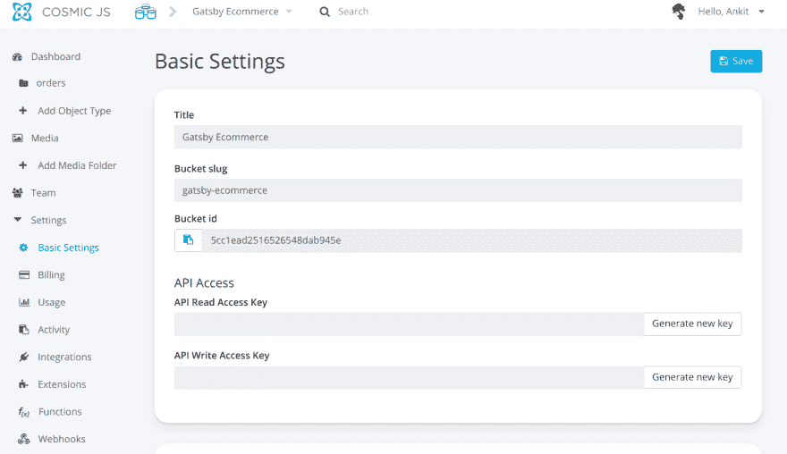

# 如何使用 Gatsby 和 Cosmic JS 建立电子商务网站

> 原文：<https://dev.to/a9kitkumar/how-to-build-an-ecommerce-website-using-gatsby-and-cosmic-js-3bbm>

本教程将向您展示如何使用 Gatsby 和 Cosmic JS 构建一个电子商务应用程序。这个应用程序将让你对我们如何将电子商务应用程序与 Cosmic JS 集成来存储我们的数据有一个基本的想法。在这个应用程序示例中，所有订单数据都将存储在 Cosmic JS 数据库中，其速度将会让您着迷。让我们开始吧。

## TL；速度三角形定位法(dead reckoning)

[检验演示](https://cosmicjs.com/apps/gatsby-ecommerce-website)

[下载代码库](https://github.com/a9kitkumar/Gatsby-Ecommerce)

## App 简介

在这里，我们用 Cosmic JS 的后端功能在 Gatsby 中构建一个电子商务应用程序。我们将基于一个电子商务网站进行一些导航，最后下的订单将保存在 Cosmic JS 数据库中。Cosmic JS 为 JavaScript 技术提供了 npm 模块。此外，它还提供了 API 端点，在这些端点的帮助下，您可以直接对其应用 CRUD 操作。这里我们使用 API 端点来存储数据。

## 要求

1.  [Node.js](https://nodejs.org/en/) 必须安装在您的系统上，它是运行 npm 命令所必需的。选择它的最新版本并安装在您的系统上。

2.  在 node.js 之后，在您的系统上全局安装 Gatsby CLI。你可以在这里找到它:[盖茨比 CLI](https://www.gatsbyjs.org/docs/gatsby-cli/)

推荐帖: [Snapchat 作弊:如何抓到一个 Snapchat 骗子？](https://mytechmarvel.com/snapchat-cheating-how-to-know-if-your-partner-is-cheating/)

## 我们开始吧

我们假设您已经安装了上述软件和 CLI。现在运行以下命令创建一个新的 Gatsby 应用程序:

*盖茨比新盖茨比-电子商务*

成功执行该命令后，确保您已经创建了一个名为“Gatsby-Ecommerce”的新 Gatsby 应用程序。现在开始，从终端执行以下命令:

*npm 开始*

它将运行您的应用程序并打开端口: [http://localhost:8000/](http://localhost:8000/)

## 配置有宇宙 JS

Cosmic JS 是二合一服务提供商，这意味着它也提供数据库和服务器的便利。所以你需要先注册 [Cosmic JS](https://cosmicjs.com/) 并创建一个你想用的任何名字的新桶，这里我们创建了一个名为 Gatsby Ecommerce 的桶。现在是时候创建一个对象类型了，这意味着要进行数据管理。创建名为 orders 的对象类型，所有订单都将存储在此对象中。现在，我们必须做一些基本设置，在您的仪表板中进行基本设置。看看下面的截图:

在这里，您可以看到读/写密钥字段和其他 id。点击生成读写密钥，并连同铲斗 ID 和废料一起保存在任何文本文件中。

现在在任何 IDE 中打开你的 Gatsby 项目，这里我用的是 Visual Basic 代码。现在，在项目的根目录下创建一个名为 config 的文件夹，并在 config 文件夹中创建一个名为 config.js 的新文件，并以下列格式保存上述 id 和键: