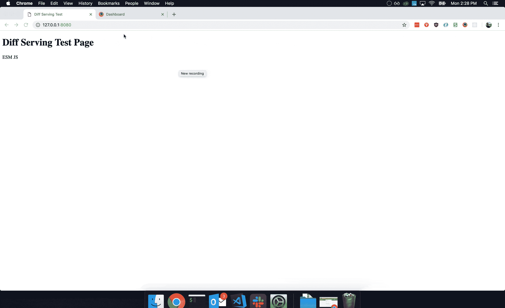
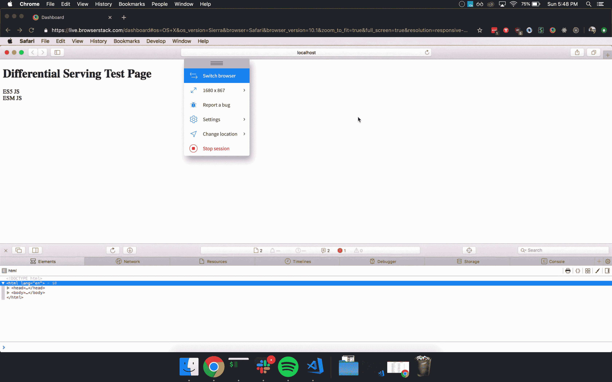

# 差别服务

> 原文：<https://dev.to/thejohnstew/differential-serving-3dkf>

最近我在听[商店脱口秀](https://shoptalkshow.com/episodes/347/)，听说了差别服务。差别服务背后的思想是，您为不同的浏览器提供不同的包。

这里的好处是，我们可以为 evergreen 浏览器提供 IE11 捆绑包和现代捆绑包，而不是编译到支持的最低功能集(对我们大多数人来说可能是 IE11)。

这似乎是一个很好的胜利。但是这有多有效呢？

## 举例

要实现差别服务，我们实际上不需要太多代码。下面是一个小例子:

```
 <div id="root-es5"></div>
  <div id="root-esm"></div>

  <!-- ES5 and below JS -->
  <script nomodule src="/es5.js"></script>
  <!-- ES6 and above JS -->
  <script type="module" src="/esm.js"></script> 
```

[](//raw.githubusercontent.com/johnstew/differential-serving/master/assets/diff-serving.gif)

关键部分是两个脚本标签。旧浏览器使用`<script nomodule>`来解析和执行特定的包，新浏览器使用`<script type="module">`。这个想法是我们把工作留给浏览器来决定服务哪个包。

## 生成两个束

要生成两个包，您需要更新您的构建配置来输出两个包，一个针对 IE11 之类的旧浏览器，另一个针对支持`<script type="module">`的新浏览器。为此，您可以使用`@babel/preset-env`并指定浏览器目标。

webpack 配置示例:

```
module.exports = [
  {
    ...
    output: {
      path: path.resolve(__dirname, 'dist'),
      filename: '[name].legacy.js'
    },
    module: {
      rules: [
        {
          test: /\.js$/,
          exclude: /node_modules/,
          use: {
            loader: 'babel-loader',
            options: {
              presets: [
                ['@babel/preset-env',
                {
                    targets: {
                        browsers: [
                          /**
                           *  Browser List: https://bit.ly/2FvLWtW
                           *  `defaults` setting gives us IE11 and others at ~86% coverage
                           */
                          'defaults'
                        ]
                    },
                    useBuiltIns: 'usage',
                    modules: false,
                    corejs: 2
                }]
              ]
            }
          }
        }
      ]
    }
    ...
  },
  {
    ...
    output: {
      path: path.resolve(__dirname, 'dist'),
      filename: '[name].esm.js'
    },
    module: {
      rules: [
        {
          test: /\.js$/,
          exclude: /node_modules/,
          use: {
            loader: 'babel-loader',
            options: {
              presets: [
                ['@babel/preset-env',
                {
                    targets: {
                        browsers: [
                          /**
                           *  Browser List: https://bit.ly/2Yjs58M
                           */
                          'Edge >= 16',
                          'Firefox >= 60',
                          'Chrome >= 61',
                          'Safari >= 11',
                          'Opera >= 48'
                        ]
                    },
                    useBuiltIns: 'usage',
                    modules: false,
                    corejs: 2
                }]
              ]
            }
          }
        }
      ]
    },
    ...
  }
]; 
```

值得注意的一点是， [HTML Webpack 插件](https://www.npmjs.com/package/html-webpack-plugin)目前还没有内置对生成不同脚本标签输出的支持。幸运的是，有一些插件可以帮助解决这个问题:

*   [html-web pack-多构建插件](https://www.npmjs.com/package/html-webpack-multi-build-plugin)
*   [网页包模块名称模块插件](https://www.npmjs.com/package/webpack-module-nomodule-plugin)

## 有用吗？

你可能一直在想的一个问题是，这真的有用吗？答案是肯定的，但有几个问题。在 [Safari 10.1](https://johnstew.github.io/differential-serving/tests/index.html#Safari-10-1) 上，浏览器下载两个包并执行两个包。

[](//raw.githubusercontent.com/johnstew/differential-serving/master/tests/Safari-10-1.gif)

Edge 和 [IE](https://johnstew.github.io/differential-serving/tests/index.html#MSIE-11) 似乎在下载这两个包以及 [Firefox 59](https://johnstew.github.io/differential-serving/tests/index.html#Firefox-59) 时都有问题。

*   [测试结果图表](https://github.com/johnstew/differential-serving#tests)
*   [测试结果记录](https://johnstew.github.io/differential-serving/tests/index.html#Safari-10-1)

也就是说，如果可以的话，我仍然认为这是一个实施的好主意。

## 替代方法

另一种更可控的方法是使用用户代理检测来找出是哪个浏览器发出请求，并基于此提供正确的包。有一个名为 [browserslist-useragent](https://www.npmjs.com/package/browserslist-useragent) 的包，它将解析用户代理字符串，并将其与您可能已经在`.browserslistrc`文件中的浏览器列表进行匹配。

```
const express = require('express');
const { matchesUA } = require('browserslist-useragent');
const exphbs  = require('express-handlebars');

...

app.use((req, res, next) => {
  try {
    const ESM_BROWSERS = [
      'Edge >= 16',
      'Firefox >= 60',
      'Chrome >= 61',
      'Safari >= 11',
      'Opera >= 48'
    ];

    const isModuleCompatible = matchesUA(req.headers['user-agent'], { browsers: ESM_BROWSERS, allowHigherVersions: true });

    res.locals.isModuleCompatible = isModuleCompatible;
  } catch (error) {
    console.error(error);
    res.locals.isModuleCompatible = false;
  }
  next();
});

app.get('/', (req, res) => {
  res.render('home', { isModuleCompatible: res.locals.isModuleCompatible });
}); 
```

这种方法让您对发送给用户的内容有了更多的控制。

## 总结

最后，差异服务是一个巨大的性能优势，无需重写任何现有的客户端代码。对于哪种方法是最好的，有一些权衡，但这是由您决定的。

如果您有兴趣了解更多信息，以下是一些有用的链接列表:

*   [https://github.com/johnstew/differential-serving](https://github.com/johnstew/differential-serving)
*   [https://Philip walton . com/articles/deploying-es 2015-code-in-production-today/](https://philipwalton.com/articles/deploying-es2015-code-in-production-today/)
*   [https://calendar . perf planet . com/2018/doing-differential-serving-in-2019/](https://calendar.perfplanet.com/2018/doing-differential-serving-in-2019/)
*   [https://www . smashingmagazine . com/2018/10/smart-bundling-legacy-code-browsers/](https://www.smashingmagazine.com/2018/10/smart-bundling-legacy-code-browsers/)
*   [https://gist . github . com/samthor/64b 114 E4 a4 f 539915 a 95b 91 ffd 340 ACC](https://gist.github.com/samthor/64b114e4a4f539915a95b91ffd340acc)
*   [https://github.com/philipwalton/webpack-esnext-boilerplate](https://github.com/philipwalton/webpack-esnext-boilerplate)
*   [https://github . com/Philip walton/web pack-es next-boilerplate/issues/1](https://github.com/philipwalton/webpack-esnext-boilerplate/issues/1)