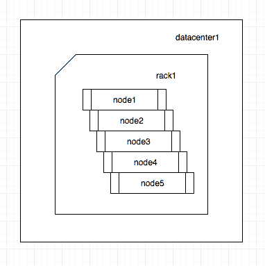
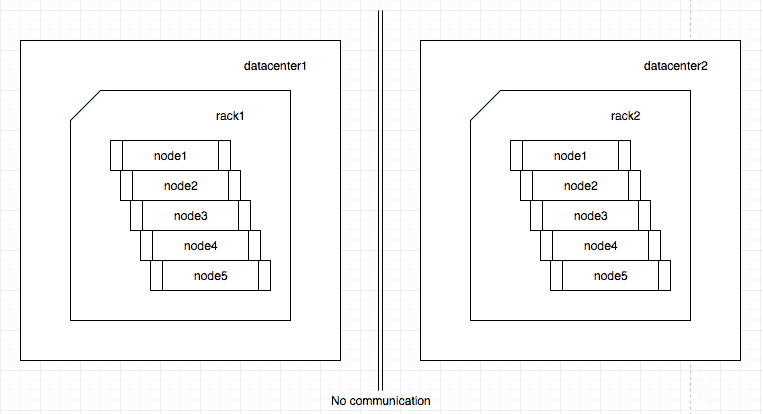
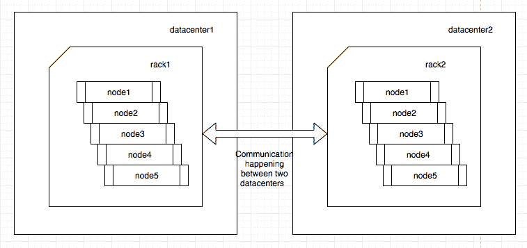

# 卡珊德拉 202:告密者

> 原文：<https://dev.to/p_chhetri/cassandra-202-snitches-4ake>

### 简介:

Snitch 是决定整个 cassandra 集群网络拓扑的组件。它提供了从节点的 IP 地址到其所属的数据中心和机架的转换。这确保了数据的放置方式能够让集群处理机架/数据中心级的停机。

为了提高我们的 cassandra 集群的弹性，我们决定从默认的告密者[simple snick](https://docs.datastax.com/en/cassandra/3.0/cassandra/architecture/archSnitchSimple.html)迁移到生产级集群推荐的告密者[GossipingPropertyFileSnitch](https://docs.datastax.com/en/cassandra/3.0/cassandra/architecture/archsnitchGossipPF.html)。后者是机架和数据中心感知型告密者，而前者不识别任何此类信息。

### 事实:

*   集群中的每个节点都必须配置为使用相同的 snitch 类型。
*   由于 simple snick 将每个节点分配给数据中心 1 中的 rack1in，所以只能从 simple snick 迁移到 GossipingPropertyFileSnitch*first*。其他 Snitch 比如 Ec2Snitch 或者 GoogleCloudSnitch 都不兼容 SimpleSnitch。直接迁移到任何不兼容的金色飞贼*都会导致数据丢失。*
**   Cassandra *不允许*更改已经有数据的节点的机架或数据中心。因此，在这种情况下，唯一的选择是首先停用节点并引导它。*

 *### 简单飞贼向 GPFS 迁徙:

#### 一、改变当前集群的飞贼配置

假设您的集群中有五个节点配置了 SimpleSnitch。您可以像这样可视化您的集群:

<figure>[](https://res.cloudinary.com/practicaldev/image/fetch/s--kbqQWSg7--/c_limit%2Cf_auto%2Cfl_progressive%2Cq_auto%2Cw_880/https://cdn-images-1.medium.com/max/382/1%2AuY89Nh2SMhxjjd0wu9-CFA.png) 

<figcaption>在简单飞贼</figcaption>

</figure>

中配置 5 个节点

1.  停止当前集群的所有节点。

2.  因为 GPFS 引用 cassandra-rackdc.properties 来推断节点的机架和数据中心，所以在每个节点中更新它们，如下所示

```
dc=datacenter1
rack=rack1 
```

1.  更新 cassandra.yaml 中每个节点的飞贼类型

```
endpoint\_snitch: GossipingPropertyFileSnitch 
```

1.  启动当前集群的所有节点。

<figure>[](https://res.cloudinary.com/practicaldev/image/fetch/s--kbqQWSg7--/c_limit%2Cf_auto%2Cfl_progressive%2Cq_auto%2Cw_880/https://cdn-images-1.medium.com/max/382/1%2AuY89Nh2SMhxjjd0wu9-CFA.png) 

<figcaption>5 个节点配置在 GPFS</figcaption>

</figure>

#### 二世。将所有 cassandra 客户端更新为 DCAware

在添加新的数据中心之前，我们需要满足以下先决条件:

1.  确保客户端仅查询现有的数据中心数据中心 1 cassandra 节点:

*   确保客户端配置为使用 useDCAwareRoundRobinPolicy
*   确保客户端指向数据中心 1
*   将一致性级别从仲裁更改为 LOCAL_QUORUM

1.  更新所有 cassandra 密钥空间以使用 SimpleStrategy 中的 NetworkTopologyStrategy

```
ALTER KEYSPACE sample\_keyspace WITH REPLICATION =
{ 'class' : 'NetworkTopologyStrategy', 'datacenter1' : 3 }; 
```

您需要为所有与系统相关的键空间和用户创建的键空间执行此操作，只有少数系统键空间的配置不能更改。

> 更改密钥空间复制设置实际上不会移动任何现有数据。它只影响新的读/写操作。

#### 三世。添加新的数据中心

现在，启动新数据中心的节点，确保它们都具有与当前集群相同的 cluster_name 配置。

<figure>[](https://res.cloudinary.com/practicaldev/image/fetch/s--37Nuqnrv--/c_limit%2Cf_auto%2Cfl_progressive%2Cq_auto%2Cw_880/https://cdn-images-1.medium.com/max/763/1%2AwRwXEr20YbKJ6gQ5Be-nug.png) 

<figcaption>两个互不认识的数据中心中配置在 GPFS 的 5 个节点</figcaption>

</figure>

要确保一个数据中心的 cassandra 节点可以看到另一个数据中心的节点，请在所有旧数据中心的节点配置中添加新数据中心的种子节点，然后重新启动它们。同样，在新数据中心的所有节点配置中添加旧数据中心的种子节点，并重新启动它们。始终建议使用来自所有数据中心的种子。

<figure>[](https://res.cloudinary.com/practicaldev/image/fetch/s--slGvWA3m--/c_limit%2Cf_auto%2Cfl_progressive%2Cq_auto%2Cw_880/https://cdn-images-1.medium.com/max/757/1%2AE_Jaq_jw-TDNMs6DK60YoA.png) 

<figcaption>配置在 GPFS 的 5 个节点在两个数据中心相互通信</figcaption>

</figure>

完成后，您会注意到 nodetool 状态将在输出中显示两个数据中心。

尽管新的数据中心节点已经加入集群，但是它们仍然没有任何数据。确保旧数据中心节点的每个密钥空间都复制到新数据中心节点。

1.  更新每个密钥空间，增加新数据中心中预期副本的数量。

```
ALTER KEYSPACE sample\_keyspace WITH REPLICATION =
{ 'class' : 'NetworkTopologyStrategy', 'datacenter1' : 3, 'datacenter2' : 3 }; 
```

您可以将新数据中心的副本计数指定为 1，以确保重建速度更快。

> 如果您为新数据中心指定副本计数为 1，并在稍后将其更改为 3，您将需要运行 nodetool repair -full，并使用-dc 选项来仅修复新数据中心中的节点。这可能会增加总时间。

1.  在新的数据中心重建每个节点。

```
nodetool rebuild -- _datacenter1_ 
```

您可以同时在一个或多个节点上重建，但我们建议您一次只在上运行一次。一次在一个节点上运行减少了对旧数据中心的影响。在我们的例子中，在多个节点上同时运行它会给 cassandra 带来内存不足的问题。

#### 四世。验证较新的数据中心与较旧的数据中心同步

#### 五、删除旧数据中心的引用

在开始旧数据中心的退役流程之前，我们需要满足以下先决条件:

1.  确保客户端仅指向较新的数据中心 datacenter2 cassandra 节点。
2.  使用 nodetool repair -full 运行完全修复，以确保所有数据都从正在停用的数据中心传播。您需要在旧数据中心的每个节点上运行它(一次在一个节点上)
3.  更新每个密钥空间，从复制配置中删除旧的数据中心 datacenter1。

```
ALTER KEYSPACE sample\_keyspace WITH REPLICATION =
{ 'class' : 'NetworkTopologyStrategy', 'datacenter2' : 3 }; 
```

#### 六。淘汰旧的数据中心

1.  在旧数据中心的每个节点上运行 node tool dissolution。

### 参考文献:

*   [卡珊德拉:更新复制因子](https://docs.datastax.com/en/cql/3.3/cql/cql_using/useUpdateKeyspaceRF.html)*