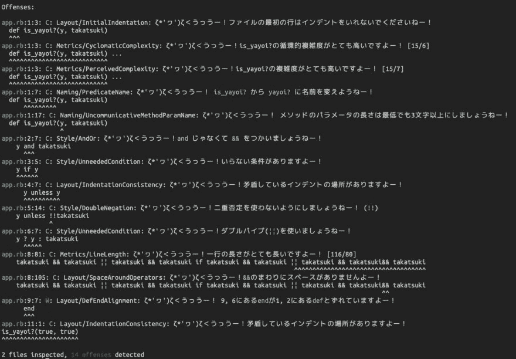

# rubocop-yayoiを作った

> 原文：<https://dev.to/yutagoto/rubocop-yayoi-45n6>

[我觉得如果 rubocop](https://rubygems.org/gems/rubocop) 的注意文本是日语的话——要是喜欢的角色指出来就更好了，所以做了。

> 。rubocop 的提醒文本要是高槻或者好的话觉得有点精神，所以试着摆弄了一下 rubocop。14:58 PM - 24 Apr 2019[](https://twitter.com/intent/tweet?in_reply_to=1121065780995452929)[](https://twitter.com/intent/retweet?tweet_id=1121065780995452929) [](https://twitter.com/intent/like?tweet_id=1121065780995452929)

## 完成的东西

[https://rubygems.org/gems/rubocop-yayoi](https://rubygems.org/gems/rubocop-yayoi)

## [yuta goto](https://github.com/YutaGoto)/[rubo COP-弥生](https://github.com/YutaGoto/rubocop-yayoi)

<article class="markdown-body entry-content container-lg" itemprop="text">

# Rubocop::弥生

[](https://travis-ci.org/YutaGoto/rubocop-yayoi)

`ζ*'ヮ')ζ＜うっうー！`

这个 gem 是执行[rubocop](https://github.com/rubocop-hq/rubocop) 后显示的文本会被偶像大师 765 专业所属的高槻和好风指出的 gem！

## 装置

将这一行添加到应用程序的 Gemfile 中:

```
gem 'rubocop-yayoi'
```

Enter fullscreen mode Exit fullscreen mode

然后执行:

```
$ bundle 
```

或者自己安装为:

```
$ gem install rubocop-yayoi 
```

## 使用

### robocop 配置文件

把这个放进你的`.rubocop.yml`。

```
require: rubocop-yayoi 
```

现在你可以运行`rubocop`，它会自动加载 RuboCop RSpec cops 和标准的 cops。

### 命令行

```
rubocop --require rubocop-yayoi
```

Enter fullscreen mode Exit fullscreen mode

### 耙任务

```
RuboCop::RakeTask.new do |task|
  task.requires << 'rubocop-yayoi'
end
```

Enter fullscreen mode Exit fullscreen mode

## 发展

在签出 repo 之后，运行`bin/setup`来安装依赖项。然后，运行`rake spec`来运行测试。你也可以运行`bin/console`得到一个交互式提示，让你进行实验。

要将这个 gem 安装到您的本地机器上，运行`bundle exec rake install`。要发布新版本，更新`version.rb`中的版本号，然后运行`bundle exec rake release`

</article>

[View on GitHub](https://github.com/YutaGoto/rubocop-yayoi)

## 使用方法

只需要设定。

```
# .rubocop.yml
require:
  - rubocop-yayoi 
```

Enter fullscreen mode Exit fullscreen mode

在此状态下，准备以下 ruby 文件以供尝试。

```
# index.rb
class Takatsuki_Yayoi
  def is_yayoi?(y, takatsuki)
    y && true
  end
end 
```

Enter fullscreen mode Exit fullscreen mode

实行。

```
$ bundle exec rubocop index.rb
[Warn] Performance Cops will be removed from RuboCop 0.68\. Use rubocop-performance gem instead.
       https://github.com/rubocop-hq/rubocop/tree/master/manual/migrate_performance_cops.md

/Users/yutagoto/Documents/rubocop-yayoi/lib/rubocop/cop/layout/def_end_alignment.rb:8: warning: already initialized constant RuboCop::Cop::Layout::DefEndAlignment::MSG
/Users/yutagoto/Documents/yayoitest/vendor/bundle/ruby/2.6.0/gems/rubocop-0.67.2/lib/rubocop/cop/layout/def_end_alignment.rb:40: warning: previous definition of MSG was here
# 定数を上書きしているワーニングがめっちゃ出るので省略

ζ*'ヮ')ζ＜1ファイルチェックしますよー！
W

ζ*'ヮ')ζ＜うっうー！！

index.rb:1:1: C: Style/Documentation: ζ*'ヮ')ζ＜うっうー！classのドキュメントのコメントを書きましょうねー
class Takatsuki_Yayoi
^^^^^
index.rb:1:7: C: Naming/ClassAndModuleCamelCase: ζ*'ヮ')ζ＜うっうー！モデル名やモジュール名にはCamelCaseを使いましょうねー！
class Takatsuki_Yayoi
      ^^^^^^^^^^^^^^^
index.rb:2:7: C: Naming/PredicateName: ζ*'ヮ')ζ＜うっうー！ is_yayoi? から yayoi? に名前を変えようねー！
  def is_yayoi?(y, takatsuki)
      ^^^^^^^^^
index.rb:2:17: C: Naming/UncommunicativeMethodParamName: ζ*'ヮ')ζ＜うっうー！メソッドのパラメータの長さは最低でも3 文字以上にしましょうねー！
  def is_yayoi?(y, takatsuki)
                ^
index.rb:2:20: W: Lint/UnusedMethodArgument: ζ*'ヮ')ζ＜うっうー！使っていない引数がありますよー takatsuki！ もし使わないなら、_か_takatsukiのようにしましょうねー！
  def is_yayoi?(y, takatsuki)
                   ^^^^^^^^^

ζ*'ヮ')ζ＜うっうー！1ファイルチェックしましたよー！
ζ*'ヮ')ζ＜うっうー！5こ怪しいですよー！ 
```

Enter fullscreen mode Exit fullscreen mode

这样的感觉，就像是受到了高槻和优酱的指摘一样。 真高兴啊。

现在还只能应对一部分的指摘，所以今后打算增加。 因为实质上就像是翻译工作，所以感觉对 rubocop 的理解会加深很多。 ( TODO:)

另外，每次执行都会显示很多复盖常数的 warning，所以我觉得必须改造切出和显示在 method 上的逻辑，使其感觉更好。 ( TODO:)

如果你愿意的话，请用着做。