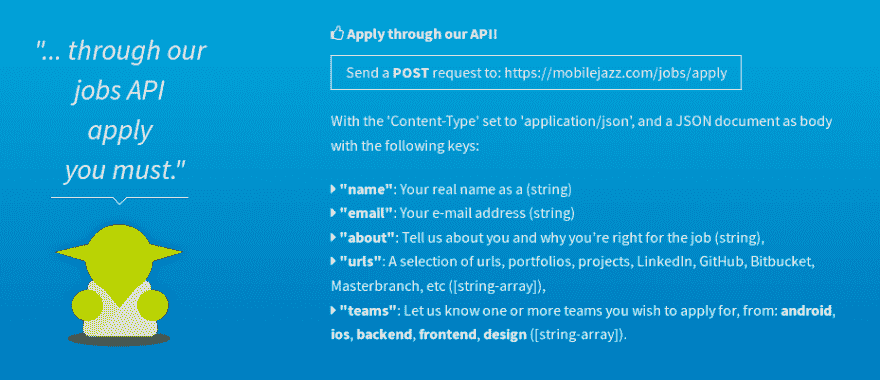
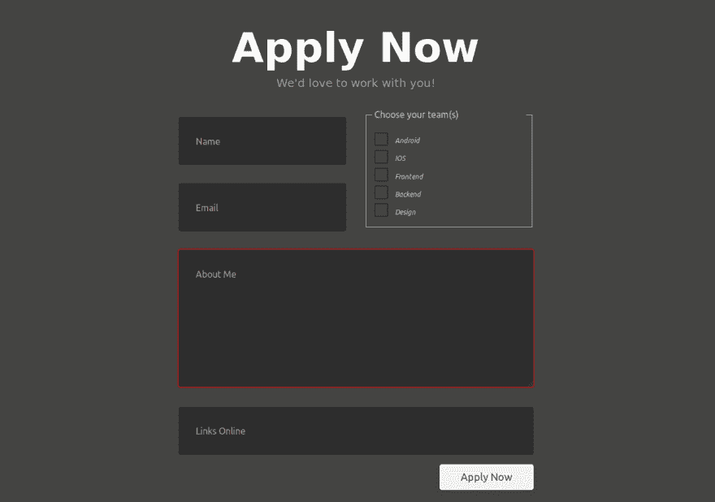

# 用你自己的表格申请。

> 原文：<https://dev.to/kobbymmo/apply-with-your-own-form-516d>

上周我在网上冲浪时发现了移动爵士乐。我偶然发现了他们的博客[如何正确处理错误【UX】](https://mobilejazz.com/blog/how-to-handle-errors-properly-ux/)。之后，我决定浏览他们的 GitHub 和社交媒体页面，我真的很喜欢它，并直接喜欢上了这是一家我想加入的公司。

因此，我点击了他们的工作公告板，以检查加入所需的要求。当我打开它的时候，我笑得很开心

然后我决定不通过 API 来申请，为什么不创建一个简单的表单来做这件事。毕竟我正在申请加入前端和后端团队。所以我照做了，并在 Netlify 上举办了这个活动。但不幸的是，我的请求因 CORS 而受阻。

我最终向 postman 提出了申请，仍在等待他们的回复，但在此之前，我会尝试解决 CORS 错误。我会告诉你事情的进展。

你是招聘人员吗？也许在你下一次招聘的时候，让申请人制作一份申请表。我相信这对你们俩来说都将是一次奇妙的经历。