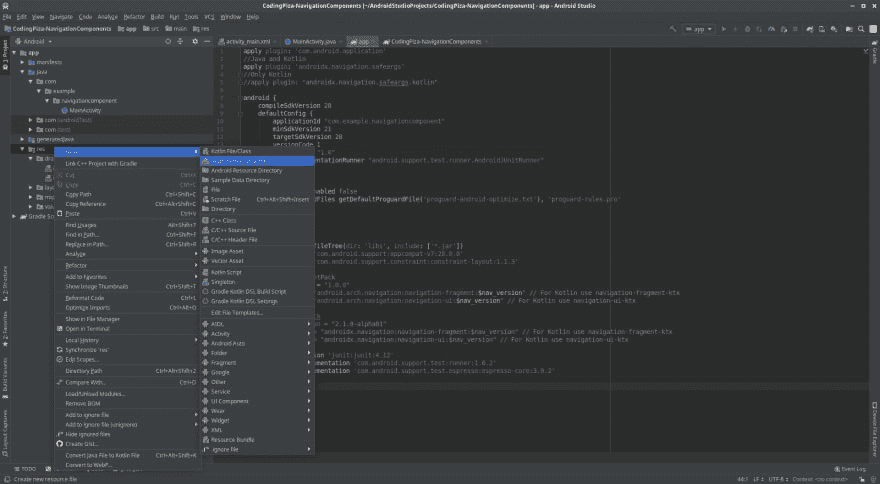
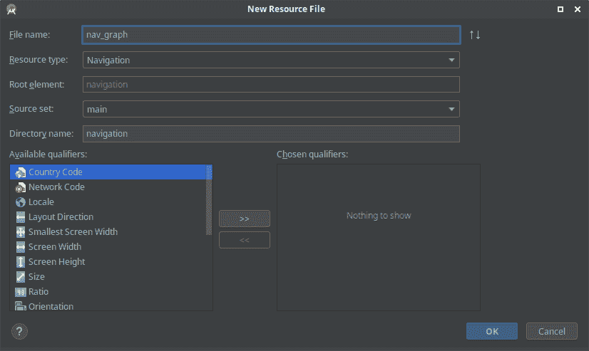
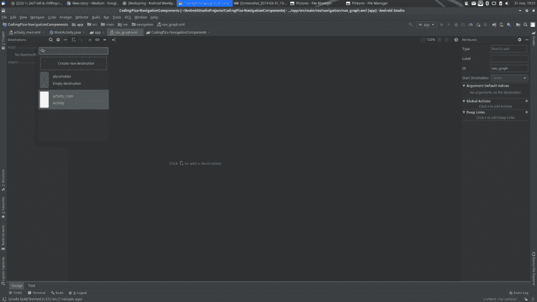
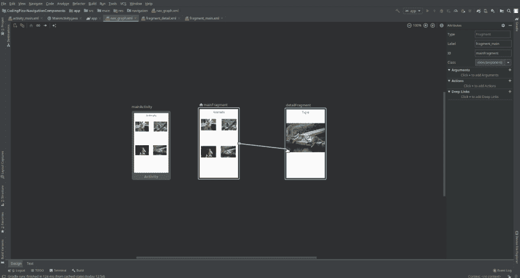
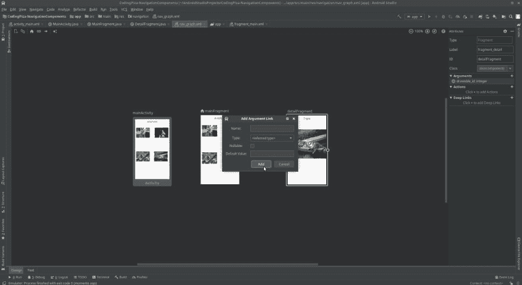

# Como usar el Android 导航组件

> 原文：<https://dev.to/gvetri/como-usar-el-android-navigation-component-4hhg>

# Android 架构组件-导航组件

## 航行问题

多年来，Android 开发人员一直在寻找一种方法，使其创建的应用程序中的碎片和活动更易于导航。许多人发明了许多类和变体，称为 Navigation、Base Navigation、Navigation Manager。

在人类可以发明的任何一种巧妙的名称中，每个名称都有其优缺点，其中许多名称都需要开发人员从基类继承或手动将常量添加到类中，以确定它的去向和来源，这通常会导致许多浏览器错误

例如，如果一个应用程序在向下追溯时显示了购买详细信息，则它会将您带到该购买详细信息的上一步，即您选择购买的对象，在某些情况下，这些著名的导航类会失败，因为它们会将您发送到主应用程序屏幕，或者更糟的是，发送到您没有的另一个屏幕

## 安卓导航组件

2018 年 Google I/O 宣布创建该组件，以便为 Android 应用程序提供标准，大约一个月前发布了该组件的稳定版本，目前有一个支持 AppCompat 的 1.0 版本和一个可用于 Android Jetpack 的 2.0 版本。如果你想知道 Android Jetpack 是什么，我在这篇文章中早些时候提到过他。

使用此组件的基础是创建一个图形，将应用程序中的所有活动和片段以及允许更改片段的“操作”连接起来。

## 给我看代码

要开始在项目中使用导航组件，必须将以下依赖项添加到我们的内部版本 app 模块和项目级别。

**Java:**

#### 建设。工程程度

```
buildscript {
        repositories {
            google()
            jcenter()
        }
        dependencies {
            classpath 'com.android.tools.build:gradle:3.3.1'
            //Pre Jetpack
            classpath 'android.arch.navigation:navigation-safe-args-gradle-plugin:1.0.0'
            // Jetpack
            //classpath "androidx.navigation:navigation-safe-args-gradle-plugin:2.1.0-alpha01"
        }
}

allprojects {
    repositories {
        google()
        jcenter()
    }
}

task clean(type: Delete) {
    delete rootProject.buildDir
} 
```

Enter fullscreen mode Exit fullscreen mode

#### 构建。app 模块度

```
 apply plugin: 'com.android.application'
//Java and Kotlin
apply plugin: 'androidx.navigation.safeargs'
//Only Kotlin
//apply plugin: "androidx.navigation.safeargs.kotlin"

android {
compileSdkVersion 28
defaultConfig {
    applicationId "com.example.navigationcomponent"
    minSdkVersion 21
    targetSdkVersion 28
    versionCode 1
    versionName "1.0"
    testInstrumentationRunner "android.support.test.runner.AndroidJUnitRunner"
}
buildTypes {
    release {
        minifyEnabled false
        proguardFiles getDefaultProguardFile('proguard-android-optimize.txt'), 'proguard-rules.pro'
    }
}
}
dependencies {
implementation fileTree(dir: 'libs', include: ['*.jar'])
implementation 'com.android.support:appcompat-v7:28.0.0'
implementation 'com.android.support.constraint:constraint-layout:1.1.3'

//Android Pre JetPack
def nav_version = "1.0.0"
implementation "android.arch.navigation:navigation-fragment:$nav_version"
// For Kotlin use navigation-fragment-ktx
implementation "android.arch.navigation:navigation-ui:$nav_version"
// For Kotlin use navigation-ui-ktx

//Android Jetpack
//    def nav_version = "2.1.0-alpha01"
//    implementation "androidx.navigation:navigation-fragment:$nav_version" // For Kotlin use navigation-fragment-ktx
//    implementation "androidx.navigation:navigation-ui:$nav_version" // For Kotlin use navigation-ui-ktx

implementation 'com.android.support:support-v4:28.0.0'
testImplementation 'junit:junit:4.12'
androidTestImplementation 'com.android.support.test:runner:1.0.2'
androidTestImplementation 'com.android.support.test.espresso:espresso-core:3.0.2'
implementation 'com.android.support:recyclerview-v7:28.0.0'
} 
```

Enter fullscreen mode Exit fullscreen mode

**中的“T1”**

#### 建设。工程程度

```
// Top-level build file where you can add configuration options common to all sub-projects/modules.
buildscript {
    ext.kotlin_version = '1.3.30'
    repositories {
        google()
        jcenter() 
    }
    dependencies {
        classpath 'com.android.tools.build:gradle:3.3.1'
        //Pre Jetpack
        classpath 'android.arch.navigation:navigation-safe-args-gradle-plugin:1.0.0'
        classpath "org.jetbrains.kotlin:kotlin-gradle-plugin:$kotlin_version"
        // Jetpack
        //classpath "androidx.navigation:navigation-safe-args-gradle-plugin:2.1.0-alpha01"
    }
}
allprojects {
    repositories {
        google()
        jcenter()
    }
}

task clean(type: Delete) {
delete rootProject.buildDir
} 
```

Enter fullscreen mode Exit fullscreen mode

#### 构建。app 模块度

```
apply plugin: 'com.android.application'
apply plugin: 'kotlin-android-extensions'
apply plugin: 'kotlin-android'
//Java and Kotlin
//apply plugin: 'androidx.navigation.safeargs'
//Only Kotlin
apply plugin: "androidx.navigation.safeargs.kotlin"
android {
compileSdkVersion 28
defaultConfig {
    applicationId "com.example.navigationcomponent"
    minSdkVersion 21
    targetSdkVersion 28
    versionCode 1
    versionName "1.0"
    testInstrumentationRunner "android.support.test.runner.AndroidJUnitRunner"
}
buildTypes {
    release {
        minifyEnabled false
        proguardFiles getDefaultProguardFile('proguard-android-optimize.txt'), 'proguard-rules.pro'
    }
}
}

dependencies {
    implementation fileTree(dir: 'libs', include: ['*.jar'])
    implementation 'com.android.support:appcompat-v7:28.0.0'
    implementation 'com.android.support.constraint:constraint-layout:1.1.3'

    //Android Pre JetPack
    def nav_version = "1.0.0"
    implementation "android.arch.navigation:navigation-fragment:$nav_version"
    // For Kotlin use navigation-fragment-ktx
    implementation "android.arch.navigation:navigation-ui:$nav_version"
    // For Kotlin use navigation-ui-ktx

    //Android Jetpack
    //def nav_version = "2.1.0-alpha01"
    //implementation "androidx.navigation:navigation-fragment:$nav_version" // For Kotlin use navigation-fragment-ktx
    //implementation "androidx.navigation:navigation-ui:$nav_version" // For Kotlin use navigation-ui-ktx

    implementation 'com.android.support:support-v4:28.0.0'
    testImplementation 'junit:junit:4.12'
    androidTestImplementation 'com.android.support.test:runner:1.0.2'
    androidTestImplementation 'com.android.support.test.espresso:espresso-core:3.0.2'
    implementation 'com.android.support:recyclerview-v7:28.0.0'
    implementation "org.jetbrains.kotlin:kotlin-stdlib-jdk7:$kotlin_version"
    }

repositories {
    mavenCentral()
} 
```

Enter fullscreen mode Exit fullscreen mode

## 1。Crear el 导航图

为此，我们需要在 Android Studio 中打开我们的项目选项卡，右键单击“res”文件夹，选择 Android 资源文件，键入所需的导航图名称，然后选择“navigation(导航)”。

[](https://res.cloudinary.com/practicaldev/image/fetch/s--UEp5Iw0t--/c_limit%2Cf_auto%2Cfl_progressive%2Cq_auto%2Cw_880/https://thepracticaldev.s3.amazonaws.com/i/qneekzmbb5n1qpk5up52.png)

[](https://res.cloudinary.com/practicaldev/image/fetch/s--zIrWszRJ--/c_limit%2Cf_auto%2Cfl_progressive%2Cq_auto%2Cw_880/https://thepracticaldev.s3.amazonaws.com/i/h2bwotca0cvmrino07jz.png)

## 2。将 NavHostFragment 添加到我们的 MainActivity 布局中。

这将有助于我们容纳我们的碎片。为此，我们将以下代码添加到布局中。

```
<LinearLayout xmlns:android="http://schemas.android.com/apk/res/android"
xmlns:app="http://schemas.android.com/apk/res-auto"
xmlns:tools="http://schemas.android.com/tools"
android:layout_width="match_parent"
android:layout_height="match_parent"
tools:context=".MainActivity">

<fragment
    android:id="@+id/my_nav_host_fragment"
    android:name="androidx.navigation.fragment.NavHostFragment"
    android:layout_width="match_parent"
    android:layout_height="match_parent"
    app:defaultNavHost="true"
    app:navGraph="@navigation/nav_graph" />
    </LinearLayout> 
```

Enter fullscreen mode Exit fullscreen mode

接下来，打开导航文件 nav_graph.xml 并选择我们的片段主机。

[](https://res.cloudinary.com/practicaldev/image/fetch/s--P5QaUsRD--/c_limit%2Cf_auto%2Cfl_progressive%2Cq_auto%2Cw_880/https://thepracticaldev.s3.amazonaws.com/i/o3ty6sj1w1iil8gg0k8b.png)

## 3。Agregar nuestros 片段 al 导航图

只需在屏幕上单击绿色+图标，然后单击“Create new destination”(创建新目标)即可添加先前创建的片段或创建新片段。

## 4。连接体 nuestros 片段利用和操作

要连接它们，只需单击一个碎片，然后将箭头“拖动”到第二个碎片。我们已经创造了一个行动。

[](https://res.cloudinary.com/practicaldev/image/fetch/s--Mm6x952v--/c_limit%2Cf_auto%2Cfl_progressive%2Cq_auto%2Cw_880/https://thepracticaldev.s3.amazonaws.com/i/kwarjfldz4yg9fasoriv.jpg)

## 5。移动中心碎片

要使用导航组件在碎片之间移动，我们有几个选项。主要是获取导航控制器，这取决于您所处的环境，您可以用不同的方式执行此操作。
在我们的情况下，我们将在单击图像时切换到另一个片段。为此，我们将使用 Navigation FindNavController 类中的方法(该方法接受视图或活动作为参数)，然后使用 Navigation 方法并将其操作 id 作为参数传递，如下所示:

**Java:**

```
ivDog.setOnClickListener(new View.OnClickListener() {
        @Override
        public void onClick(View v) {
            Navigation.findNavController(v).navigate(R.id.action_mainFragment_to_detailFragment);
        }
}); 
```

Enter fullscreen mode Exit fullscreen mode

**中的“T1”**

```
ivDog?.setOnClickListener {v -> Navigation.findNavController(v).navigate(R.id.action_mainFragment_to_detailFragment) } 
```

Enter fullscreen mode Exit fullscreen mode

## 将物体从一个碎片传递到另一个碎片

为了能够传递片段中的物件，我们只需要像传统方式建立我们的组合，然后将它加入方法中做为参数。navigation()我们在此之前看到过:
**【Java:**

```
ivGorilla.setOnClickListener(new View.OnClickListener() {
        @Override
        public void onClick(View v) {
            Bundle bundle = new Bundle();
            bundle.putInt("id", R.drawable.animal_2);
            Navigation.findNavController(v).navigate(R.id.action_mainFragment_to_detailFragment, bundle);
        }
    }); 
```

Enter fullscreen mode Exit fullscreen mode

**中的“T1”**

```
ivGorilla?.setOnClickListener { v ->
        val bundle = Bundle()
        bundle.putInt("drawable_id", R.drawable.animal_2)
        Navigation.findNavController(v).navigate(R.id.action_mainFragment_to_detailFragment, bundle)
    } 
```

Enter fullscreen mode Exit fullscreen mode

若要取得详细资料片段中的 drawableId，请执行下列动作:

**Java:**

```
@Override
public void onViewCreated(@NonNull View view, @Nullable Bundle savedInstanceState) {
    super.onViewCreated(view, savedInstanceState);
    if (getArguments() != null) {
        int drawableId = DetailFragmentArgs.fromBundle(getArguments()).getDrawableId();
        ivAnimal.setImageResource(drawableId);
    }
} 
```

Enter fullscreen mode Exit fullscreen mode

**中的“T1”**

```
override fun onViewCreated(view: View, savedInstanceState: Bundle?) {
    super.onViewCreated(view, savedInstanceState)
    arguments?.let{
        //Without SafeArgs
        int drawableId = getArguments().getInt("drawable_id");
        ivAnimal?.setImageResource(drawableId)
    }
} 
```

Enter fullscreen mode Exit fullscreen mode

## 使用 safe-args 插件将对象从一个片段传递到另一个片段

导航组件使用名为 safe-args 的分级插件，该插件可帮助您将对象从片段 a 传递到片段 b。这有助于生成类以确保对象是安全的。

> **注** : Type-safe 是指在编译时对对象进行评估，如果我们尝试传递错误的类型，编译器会给我们错误。

此外，它还可以帮助我们消除将常量指定为绑定密钥以便以后使用和检索对象的问题。

首先，我们需要转到 nav_graph.xml 并单击对象将接收到的片段，在本例中，我们将传递要在详细片段中显示的 draw id。所以我们单击详细信息片段，然后单击“Arguments”右侧的+符号，创建我们的新参数。我们填写这些字段，然后单击“添加”。

[](https://res.cloudinary.com/practicaldev/image/fetch/s--5utYvdWO--/c_limit%2Cf_auto%2Cfl_progressive%2Cq_auto%2Cw_880/https://thepracticaldev.s3.amazonaws.com/i/sfsp9dzhx4d4wn1x99ag.jpg)

我们需要创建 NavDirections 对象的实例，该实例是从 safeArgs 插件生成的类中获取的。safeArgs 插件所做的是为片段名称添加后缀，在本例中为:t0]如果您的片段被命名为 MainFragment，则此类将被命名为 MainFragmentDirections，然后我们将使用提供给我们的方法，如您所见，它具有一个整数作为参数，该整数是要传递给另一个片段的 draw id。然后调用我们在导航()之前看到的方法，但这次我们将把我们以前创建的导航传递给它。

**Java:**

```
 ivHorse.setOnClickListener(new View.OnClickListener() {
        @Override
        public void onClick(View v) {
            NavDirections mainFragmentDirections = MainFragmentDirections.actionMainFragmentToDetailFragment(R.drawable.animal_3);
            Navigation.findNavController(v).navigate(mainFragmentDirections);
        }
    }); 
```

Enter fullscreen mode Exit fullscreen mode

**中的“T1”**

```
 ivHorse?.setOnClickListener { v ->
        val mainFragmentDirections = MainFragmentDirections.actionMainFragmentToDetailFragment(R.drawable.animal_3)
        Navigation.findNavController(v).navigate(mainFragmentDirections)
    } 
```

Enter fullscreen mode Exit fullscreen mode

要获取我们传递给详细碎片片段的 drawableId，我们将执行以下操作:

**Java:**

```
@Override
public void onViewCreated(@NonNull View view, @Nullable Bundle savedInstanceState) {
    super.onViewCreated(view, savedInstanceState);
    if (getArguments() != null) {
        int drawableId = DetailFragmentArgs.fromBundle(getArguments()).getDrawableId();
        ivAnimal.setImageResource(drawableId);
    }
} 
```

Enter fullscreen mode Exit fullscreen mode

**中的“T1”**

```
 override fun onViewCreated(view: View, savedInstanceState: Bundle?) {

    super.onViewCreated(view, savedInstanceState)

    arguments?.let{

        //Using SafeArgs

        val drawableId = DetailFragmentArgs.fromBundle(it).drawableId

        ivAnimal?.setImageResource(drawableId)

    }

  } 
```

Enter fullscreen mode Exit fullscreen mode

## 
  
决赛

这是导航组件的基本用法。您也可以将它与绘图员或“底部导航视图”配合使用，但这适用于另一篇文章
到此为止。在接下来的几篇文章中，我将简要介绍其他 Android 体系结构组件。如果您喜欢这篇文章，请离开您的&评论，如果您对此有任何疑问，请不要忘记[在 twitter](//www.twitter.com/gvetri18) 上跟我来，这样我们就可以成为朋友了；如果您想了解其他 Android 教程，请访问我的博客[【www . coding pizza . com】](//www.codingpizza.com)。