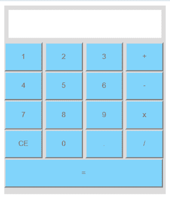

# 用 JavaScript 制作一个计算器

> 原文：<https://dev.to/skptricks/make-a-calculator-in-javascript-3po5>

使用 JQuery、HTML 和 CSS 创建简单的计算器

本教程解释了如何使用 jquery、html 和 css 创建简单的计算器应用程序。到目前为止，还没有教过用 JavaScript 制作计算器。因为它支持数学计算。在 JQuery、HTML 和 CSS 的帮助下，我们可以构建一些完全在浏览器内部运行的小应用程序。今天在本教程中，我将向你展示如何在 HTML 和 CSS 的帮助下使用 JQuery 创建一个简单的计算器。使用这个计算器，我们可以进行基本的算术运算。

点击此处阅读更多内容...