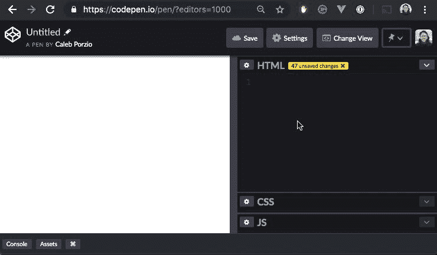

# 7 个可爱的网络开发技巧

> 原文：<https://dev.to/areknawo/7-adorable-web-development-tricks-2of8>

**这篇文章摘自[我的博客](https://areknawo.com)，所以请务必查看更多最新内容😉**

到目前为止，所有主流的 web 开发语言都可以被认为是**成熟的**。经过 20 多年的发展， **HTML** 、 **CSS** 和 **JavaScript** 已经成为全球公认的网络标准。但是，这仅仅是一个引导我们到这篇文章主题的事实。今天，我想向你展示 7 个有趣且鲜为人知的**技巧** / **窍门**，这 3 种语言已经发展了多年。信不信由你——有些东西即使是更有经验的 web 开发人员也可能不知道。也许只是因为不是所有的东西都同样有用...无论如何，让我们深入挖掘，找点乐子吧！

# 7。布尔转换

类型安全和 JavaScript 似乎是两个完全不同的概念。跟踪 JS 中的所有动态类型可能是一项相当艰巨的任务。然而，它仍然可以带来更好的性能，编写的代码更容易被 JIT 编译器处理。在条件表达式中使用布尔以外的类型是这种错误的一个常见例子。但是，有一个窍门！

还记得 [**逻辑不是**](https://developer.mozilla.org/en-US/docs/Web/JavaScript/Reference/Operators/Logical_Operators#Logical_NOT_(!)) 运算符(`!`)吗？这是一个简单，快速和优雅的方式转换给定值到相反的布尔值。但是，如果我们希望我们的布尔值准确地表示它应该是什么值呢(当表示为布尔值时)？良好的...我们已经得到了相反的布尔值，对吗？所以，让我们再次否定我们的值，得到完整的布尔值**...或者直接从* *开始使用 [`Boolean()`](https://developer.mozilla.org/en-US/docs/Web/JavaScript/Reference/Global_Objects/Boolean) 功能。* *** 

```
const falsyValue = 0;
const truthyValue = 1;
!!falsyValue; // false
!!truthyValue; // true 
```

Enter fullscreen mode Exit fullscreen mode

# 6。划分&轮

JS 里有不少算子。其中一些被广泛使用，而另一些则没有。第二组通常包括所谓的 [**位运算符**](https://developer.mozilla.org/en-US/docs/Web/JavaScript/Reference/Operators/Bitwise_Operators) 。它们基本上是对单个位(**二进制数**)进行运算，而不是任何其他数字系统。许多 JS 程序员知道它们的存在，但并不真正费心去使用它们。这主要是因为他们可能会觉得有点复杂，至少可以说，不是真正的初学者友好的，思考他们需要一段时间。

但是，按位运算符也有其优势！他们当然允许程序员用更短的语法写同样的代码，但只是在特殊情况下。除此之外，他们在比特上操作的事实自然地使他们成为更**高性能的解决方案**。为了让你明白我的意思，这里有一个例子，用基本的 [**右移**](https://developer.mozilla.org/en-US/docs/Web/JavaScript/Reference/Operators/Bitwise_Operators#%3E%3E_(Sign-propagating_right_shift)) 操作符将数字除以 2 并对结果进行舍入(舍入)。

```
const value = 543;
const halfValue = value/2; // 271.5

Math.round(halfValue); // 272
Math.floor(halfValue); // 271

value >> 1; // 271 
```

Enter fullscreen mode Exit fullscreen mode

# 5。JSON 格式

JSON 的概念很可能是所有 JS 开发者都知道的。这是在一个人的 JS 旅程开始时就介绍的东西。因此，这同样适用于 [`JSON.parse()`](https://developer.mozilla.org/en-US/docs/Web/JavaScript/Reference/Global_Objects/JSON/parse) 和 [`JSON.stringify()`](https://developer.mozilla.org/en-US/docs/Web/JavaScript/Reference/Global_Objects/JSON/stringify) 方法。您肯定知道，它们允许您将 JSON 兼容的值来回转换为字符串。但是，我打赌你很可能不知道的一个技巧是，使用`JSON.stringify()`，你实际上可以**格式化你的输出**字符串。

除了要字符串化的值之外，该方法还有两个可选的参数:

*   `replacer` - **函数**或字符串或数字的**数组，稍后用于**白名单**所传递值的属性，稍后将它们包含在结果字符串中。当等于`null`时，默认情况下，它只接受。**
*   `spaces` -一个**数字**或一个**字符串**，其值和长度分别限制为 10。它为您提供了一个设置字符串或空格数的选项，您希望使用这些空格来分隔输出字符串中的对象属性。如果等于 0、空字符串或`null`(默认)，输出保持不变。

现在，特别是第二个参数给了你一个很好的简单的方法来美化你的字符串值。当然，这绝不是所有问题的最佳解决方案，但至少它就在那里，随时可以使用。

```
const obj = {a:{b:1,c:2},d:{e:3,f:4}};

JSON.stringify(obj);
// "{"a":{"b":1,"c":2},"d":{"e":3,"f":4}}"

JSON.stringify(obj, null, 2);
/*
"{
  "a": {
    "b": 1,
    "c": 2
  },
  "d": {
    "e": 3,
    "f": 4
  }
}"
*/ 
```

Enter fullscreen mode Exit fullscreen mode

# 4。CSS 居中

用 CSS 居中元素本身并不是一个技巧。事实上，这是很常见的做法。但是，现实是，一些开发者(包括我)经常忘记这些简单的事情。更糟糕的是，这个问题没有最好的也是唯一的解决方法。这是因为不同浏览器之间的不兼容性(尤其是 IE)。

毫无疑问，获得广泛采用的最广泛的解决方案之一是使用 **Flexbox 型号**。下面是一个将元素的子元素居中对齐到父元素中心的示例。

```
<div style="display:flex;justify-content:center;align-items:center;">
  <div></div>
</div> 
```

Enter fullscreen mode Exit fullscreen mode

除了上面的方法([它对 IE](https://caniuse.com/#feat=flexbox) 的不同版本没有很好的支持)，我强烈推荐你去 CSS 网站查看 [**如何居中，在那里你会得到针对给定情况的适当解决方案。**](http://howtocenterincss.com/)

# 3。CSS 变量

在 CSS 预处理器、web 框架和 CSS-in-JS 解决方案的时代，**普通 CSS** 的使用肯定至少有小幅下降。这并不是一件坏事——只要列出的解决方案做得更好。但是，CSS 预处理程序众所周知的一个特性是 [**变量**](https://developer.mozilla.org/en-US/docs/Web/CSS/Using_CSS_custom_properties) ！

```
:root {
  --main-bg-color: brown;
}

.className {
  background-color: var(--main-bg-color);
  display: block;
  color: white;
} 
```

Enter fullscreen mode Exit fullscreen mode

这个特性的[浏览器支持](https://caniuse.com/#feat=css-variables)看起来也很不错！无论如何，很高兴知道一些如此渴望的特性正在成为语言本身。然而，它不能与任何预处理程序或 CSS-in-JS 库的通用性相匹配。但是，知道这样一个特性的存在还是很好的。

# 2。CSS 支持检查

不同浏览器对 JS 和 CSS 中不同特性的支持有很大差异。而且，虽然 JS 端的**特性检查**并不那么复杂，但对于 CSS 来说，事情就不一样了...或者说曾经是。介绍 [`@supports`](https://developer.mozilla.org/en-US/docs/Web/CSS/@supports) CSS 规则——特征检查的最佳解决方案。

```
@supports (display: grid) {
  div {
    display: grid;
  }
}

@supports not (display: grid) {
  div {
    display: block;
  }
} 
```

Enter fullscreen mode Exit fullscreen mode

它的整个语法有一种形式的 **if-else 语句**，其中你可以检查给定的属性-值对是否被支持。总而言之，这只是一个很好的检查不同特性支持的解决方案，但前提是`@supports`本身就是...[支持](https://caniuse.com/#feat=css-featurequeries)。

# 1。风格样式

现在，对于第一个技巧，我显然必须将正确的归属赋予来源的作者- [**@calebporzio**](https://twitter.com/calebporzio) 。

> <video loop="" controls=""><source src="https://video.twimg.com/ext_tw_video/1121054690295320577/pu/vid/740x432/71JRHRvdUI0bD-IE.mp4?tag=8" type="video/mp4"></video>calebporzio[@ calebporzio](https://dev.to/calebporzio)🤡我刚刚发现在 HTML 中很酷的事情是可能的。没有实际用途，只是好玩。2019 年 4 月 24 日下午 14:14[](https://twitter.com/intent/tweet?in_reply_to=1121054728148926467)[](https://twitter.com/intent/retweet?tweet_id=1121054728148926467)[](https://twitter.com/intent/like?tweet_id=1121054728148926467)

这基本上可以归结为一个事实，你可以设置样式元素的样式，显示其内容，使其可编辑和 viola！——你已经有了一个有点**活的 CSS 编辑器**！正如作者所说——它可能没有任何实际的用例，但它太棒了！此外，遗憾的是，它与`<script>`标签的工作方式不同。

```
<style style="display: block" contenteditable>
    html {
        background: blue;
    }
</style> 
```

Enter fullscreen mode Exit fullscreen mode

# 有用吗？

那么，你对这个简短但相当有趣的列表有什么看法呢？你喜欢这些拨片吗？你已经知道他们中的一些吗？在**评论区**分享你的想法，并与**分享下面的**回应。还有，考虑分享文章本身！要了解最新内容，**在 Twitter 上关注我****， [**在我的脸书页面**](https://www.facebook.com/areknawoblog) 关注我 [**我的个人博客**](https://areknawo.com) 。一如既往地感谢您的阅读，祝您今天过得愉快！**