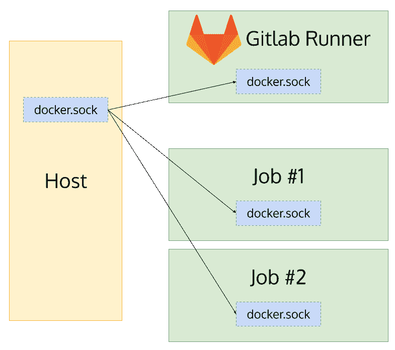

# [GitLab Runner]在 GitLab Runner 容器上的 Docker 作业中构建 Docker 映像

> 原文：<https://dev.to/zarewoft/gitlab-runner-build-docker-image-in-docker-job-on-gitlab-runner-container-5g7g>

如果我们能在容器化的环境中运行 Gitlab 管道中的每个作业，那就太棒了。Gitlab Runner [通过让`image`在目标任务中伴随`docker`执行者来实现那个](https://docs.gitlab.com/runner/executors/docker.html)。

但是...在 Gitlab Runner 中运行这些作业怎么样呢？git lab Runner 也运行在它自己的容器中。然后，构建、标记、推送 Docker 图像也是一项工作吗？

哦，太好了！我们可以。

# 为什么？

因为将每个作业隔离到它的容器中是非常非常好的。它创建了一个干净的工作空间，我们每次运行时，我们也可以选择哪个环境，我们希望运行每项工作，只需选择一个 Docker 图像，我们想要的。

让 Gitlab Runner 作为容器运行很酷，对吧？我们可以很容易地启动和升级它。

你可能会问，构建和推进容器的部分怎么样？那部分...我只是想尝试使用 container 来完成每一项工作。仅此而已。🤪如果你能想到任何原因，请在评论中帮助我。

# 步骤

以下是我们今天要做的步骤:

1.  准备如何启动跑步者
2.  登记赛跑者
3.  启动它！

## 准备如何启动转轮

我通常使用 docker-compose 来声明性地运行 docker 容器。

```
version: "3"
services:
  runner:
    image: gitlab/gitlab-runner:alpine
    restart: always
    volumes:
      - /Users/zarewoft/gitlab-runner/config:/etc/gitlab-runner
      - /var/run/docker.sock:/var/run/docker.sock 
```

首先，我将我的`config`目录映射为消费稍后将创建的`config.yoml`。

其次，`docker.sock`被映射以适应 Docker 执行器。这将使 executor 与主机的 Docker 守护进程交互，因此，它的作业将创建容器，这些容器将是 Runner 的兄弟。

## 登记跑步者

跑步者需要向 Gitlab 服务器注册。在这里，我们将启动一个短命的 Gitlab Runner 容器来做这件事。它将注册到 Gitlab 服务器并创建`config.yoml`以供将来使用。

<figure>

```
docker run --rm -v /Users/zarewoft/gitlab-runner/config:/etc/gitlab-runner gitlab/gitlab-runner:alpine register -n \
   --url https://gitlab.com/ \
   --registration-token REGISTRATION_TOKEN \
   --executor docker \
   --description "My Docker Runner" \
   --docker-image "docker:stable" 
```

<figcaption>command to register our Runner</figcaption>

</figure>

在这个例子中，我挂载我的`config`目录来持久存储`config.yoml`，与我之前的 docker-compose 将消耗的位置相同。我还提供了`docker-image`，它告诉执行程序默认的图像是什么。

#### 缓存图像图层

想象一下在 Gitlab 管道中定义一个作业。该工作将建立和推动包含我们的应用程序的 Docker 图像。肯定会用类似`docker:stable`的图像。在这个过程中，它会创建许多层 Docker 图像，这些图像可以在将来重用，但不幸的是，它会随着作业的容器一起销毁。

不，我们不能牺牲每条管道的时间！！！如果我们能在某个地方保存这些层，那就太好了🤔。

哦，或者我们可以让他们使用主机的 Docker 守护进程！

`docker-volumes`来了。该选项告诉主机的 Docker 守护进程将主机的`docker.sock`映射到它将为任何作业创建的每个容器。

通过添加这些，我们的最终注册命令看起来像这样:

```
docker run --rm -v /Users/zarewoft/gitlab-runner/config:/etc/gitlab-runner gitlab/gitlab-runner:alpine register -n \
   --url https://gitlab.com/ \
   --registration-token REGISTRATION_TOKEN \
   --executor docker \
   --description "My Docker Runner" \
   --docker-image "docker:stable" \
   --docker-volumes /var/run/docker.sock:/var/run/docker.sock 
```

<figure>

[](https://res.cloudinary.com/practicaldev/image/fetch/s--gyJxS9Cw--/c_limit%2Cf_auto%2Cfl_progressive%2Cq_auto%2Cw_880/https://thepracticaldev.s3.amazonaws.com/i/xxnq06q24fya7xf7axk8.png)

<figcaption>a diagram to make this article a bit more colorful</figcaption>

</figure>

## 开始吧！

然后，在 docker 上写。

```
docker-compose up -d 
```

* * *

希望你觉得这足够丰富。如有错误，请在评论中告知。谢谢！😊