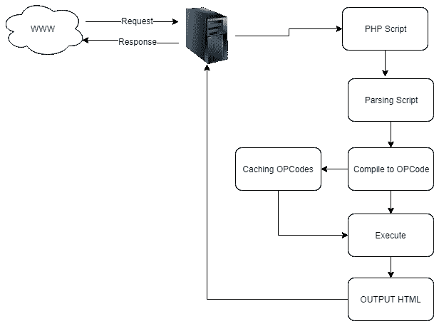

# PHP 8:JIT 简介

> 原文：<https://dev.to/chokri/php-8-introducing-jit-28f3>

基本上，PHP 脚本被编译成指令，这些指令被称为机器可以理解的操作码。操作码是低级的，因此与原始 PHP 代码相比，翻译成机器码更快。

这个执行阶段称为编译时间。这些操作码然后由 Zend VM 在运行时阶段执行。

JIT (Just In Time)正在作为 OPcache 的一个几乎独立的部分实现，op cache 是一个缓存操作码的扩展，以便编译只在需要时发生。在 PHP 中，JIT 将把为 Zend VM 生成的指令视为中间表示。然后它会生成一个依赖于架构的机器码，这样你的代码的宿主就不再是 Zend VM，而是直接是 CPU

### 为什么要 JIT？

自 7.0 版本以来，PHP 已经做了许多改进，包括哈希表的优化、Zend VM 中某些操作码的专门化、编译器中某些序列的专门化等等。经过这么多的改进，现在 PHP 已经达到了可以进一步改进的极限。

因此，JIT 是一种在运行时编译部分代码的技术，因此可以使用编译后的版本。(刚好及时)

### PHP 对比 C/Ruby/Python

在 PHP 中添加对 JIT 的支持将允许它在今天还没有考虑到的场景中使用，PHP 不是 HTML 模板，而是一种与 Ruby、Python 和 Java 相比的编程语言。

### 更快更安全

有了 JIT 的支持，核心团队将能够用 PHP 而不是 C 开发内置函数，而不会有任何巨大的性能损失。这将使 PHP 不容易受到内存管理、溢出和其他与基于 C 的开发相关的类似问题的影响。

据 stitcher 透露， [PHP 7.4](https://stitcher.io/blog/new-in-php-74) 将引入 JIT。上映日期大概在 2019 年 12 月左右，但尚未确认。尽管 PHP 8 的发布时间表还没有正式宣布，但许多人都在猜测它将在 2021 年末发布。

帖子 [PHP 8:介绍 JIT](https://khalifa.tn/php-8-introducing-jit/) 最早出现在 [C.Khalifa](https://khalifa.tn) 上。