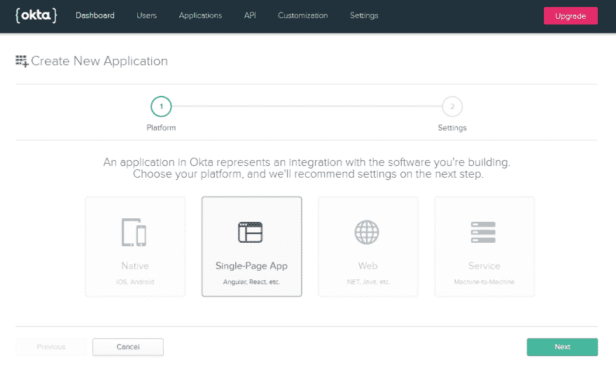
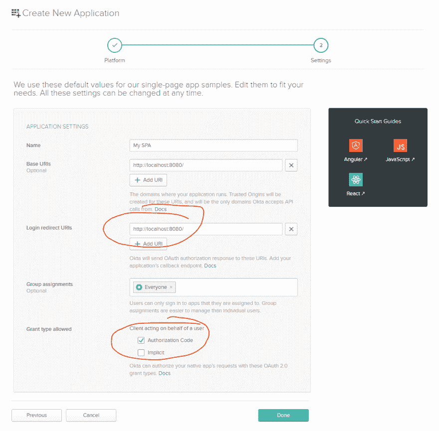
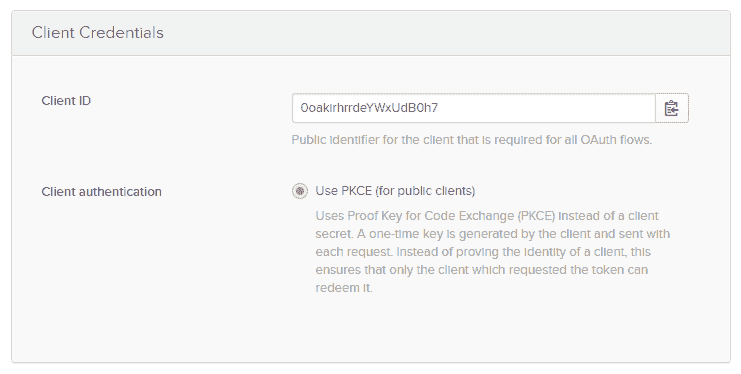
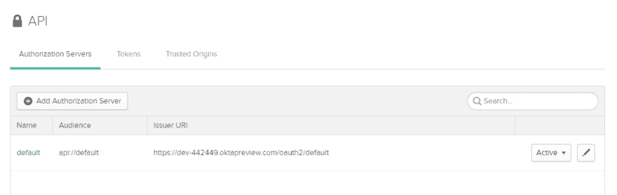
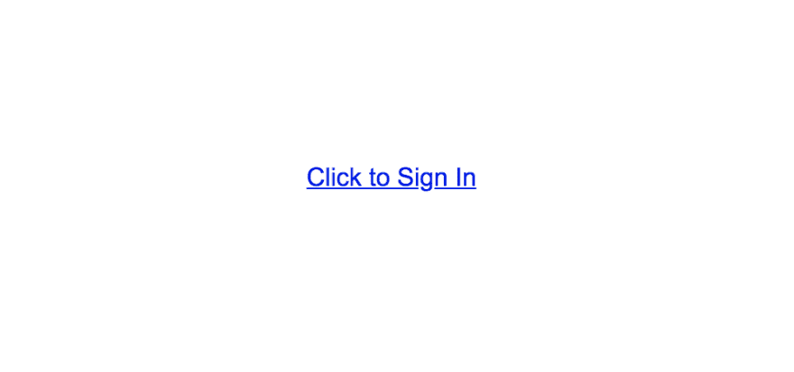

# OAuth 2.0 隐式流死了吗？

> 原文：<https://dev.to/oktadev/is-the-oauth-2-0-implicit-flow-dead-4el8>

您可能最近听到了一些关于 OAuth 2.0 隐式流的讨论。OAuth 工作组发布了一些关于隐式流和基于 JavaScript 的应用程序的新指南，特别是隐式流不应再被使用。在这篇文章中，我们将看看隐式流发生了什么变化，以及为什么。

[https://www.youtube.com/embed/CHzERullHe8](https://www.youtube.com/embed/CHzERullHe8)

## OAuth 2.0 中隐含的最佳实践正在发生变化

OAuth 2.0 中的隐式流是在近十年前创建的，当时浏览器的工作方式与现在非常不同。创建隐式流的主要原因是因为浏览器中的旧限制。过去，JavaScript 只能向加载页面的同一台服务器发出请求。然而，标准的 OAuth 授权代码流要求向 OAuth 服务器的令牌端点发出 POST 请求，该端点通常与应用程序位于不同的域中。这意味着以前无法从 JavaScript 使用这个流。隐式流通过避免 POST 请求，而不是在重定向中立即返回访问令牌，绕过了这个限制。

今天，跨源资源共享(CORS)被浏览器普遍采用，消除了这种折衷的需要。CORS 为 JavaScript 提供了一种方法，只要目的地允许，它就可以向不同域上的服务器发出请求。这使得在 JavaScript 中使用授权代码流成为可能。

值得注意的是，与授权代码流相比，隐式流一直被视为一种妥协。例如，规范没有提供在隐式流中返回刷新令牌的机制，因为这样做被认为太不安全了。该规范还推荐通过隐式流发布的访问令牌的短生命周期和有限范围。

## OAuth 授权码流程更好

既然可以从浏览器使用授权代码流，我们还有一个关于 JavaScript 应用程序的问题要处理。传统上，当将授权代码交换为访问令牌时，授权代码流使用客户端秘密，但是没有办法将客户端秘密包含在 JavaScript 应用程序中并保持秘密。如果你要在源代码中包含一个秘密，任何使用该应用的人都可以在他们的浏览器中“查看源代码”并看到它。所以我们需要一个解决方案。

谢天谢地，这个问题已经解决了，因为同样的问题也适用于移动应用程序。正如我们在过去的中看到的[，本地应用也不能安全地使用客户端秘密。OAuth 工作组几年前通过对授权代码流的 PKCE 扩展解决了这个问题。](https://www.youtube.com/watch?v=H6MxsFMAoP8)

PKCE 的授权代码流增加了一个额外的步骤，允许我们保护授权代码，这样即使它在重定向过程中被盗，它自己也是无用的。你可以在我们的博客文章[OAuth 2.0 for Native and Mobile Apps](https://developer.okta.com/blog/2018/12/13/oauth-2-for-native-and-mobile-apps)中了解更多关于 PKCE 的工作方式。

## 现有应用的 OAuth 2.0 隐式流程

这里要记住的重要事情是，在隐式流中没有发现新的漏洞。如果你有一个使用隐式流的现有应用程序，这并不是说你的应用程序在这个新指南发布后突然变得不安全了。

也就是说，安全地实现隐式流是——并且一直是——极具挑战性的。如果您不厌其烦地彻底审核您的源代码，确切地知道您在应用程序中使用了哪些第三方库，拥有强大的内容安全策略，并且对您构建安全 JavaScript 应用程序的能力充满信心，那么您的应用程序可能是好的。

那么，你是否应该立即将你所有的应用切换到使用 PKCE，而不是隐式流呢？大概不会，看你的风险承受能力了。但是在这一点上，我绝对不推荐使用隐式流创建新的应用。

## 授权代码流是否让基于浏览器的应用完全安全？

不幸的是，没有完美的安全性。尤其是在浏览器中，应用程序可能会受到多种方式的攻击。我们能做的最好的事情就是防范常见的攻击，并减少应用程序的整体攻击面。

具体来说，使用 PKCE 的授权代码流确实完全保护了应用程序免受攻击，在攻击中，授权代码在传输回应用程序的过程中被窃取。然而，一旦 JavaScript 应用程序获得了访问令牌，它仍然必须将其存储在某个地方以便使用，并且无论应用程序是使用隐式流还是 PKCE 来获得它，它存储访问令牌的方式都是相同的。您仍然需要确保您有一个良好的内容安全策略，并且知道您在应用程序中使用的任何第三方库。

在 JavaScript 应用程序中安全实现 OAuth 的最佳方式是将令牌管理完全置于 JavaScript 之外。如果您正在构建一个由动态服务器提供服务的 JavaScript 应用程序，比如具有 Angular 前端的 [Spring Boot 后端，或者具有 React 前端的](https://developer.okta.com/blog/2018/08/22/basic-crud-angular-7-and-spring-boot-2)[ASP.NET 后端，那么您可以将所有 OAuth 交换和令牌管理都放在后端，永远不会暴露给 JavaScript 前端，并避免 JavaScript 中管理令牌所固有的所有风险。](https://developer.okta.com/blog/2018/07/02/build-a-secure-crud-app-with-aspnetcore-and-react)

## 今天开始在 JavaScript 中使用 PKCE 的隐式流

那么你准备好开始用 JavaScript 写一个使用 PKCE 的应用了吗？让我们来看看这到底意味着什么。

出于演示的目的，让我们假设您想用纯 JavaScript 实现它，不需要额外的库。这将确切地说明 PKCE 是如何工作的，然后你应该能够翻译成你选择的特定框架。

首先，[注册一个免费的 Okta 开发者账号](https://developer.okta.com/signup/)。注册后，从页面顶部的菜单中选择**应用**，点击**添加应用**。

[](https://res.cloudinary.com/practicaldev/image/fetch/s--pbbLBM7r--/c_limit%2Cf_auto%2Cfl_progressive%2Cq_auto%2Cw_880/https://d33wubrfki0l68.cloudfront.net/88ea1755a2442f59c59af60ea419603488e96c05/715a3/assets-jekyll/blog/oauth-implicit-flow-dead/add-application-9850fc5e93dfd1f9c390d7103cc689f839423fb7b554f9789fddcf670e4b1c91.png)

从选项中选择**单页应用**，这将配置该应用以在令牌端点上启用 CORS 报头，并且不会创建客户端机密。

给你的应用程序起一个名字，然后你需要改变两个设置。

[](https://res.cloudinary.com/practicaldev/image/fetch/s--ROMs4Rrl--/c_limit%2Cf_auto%2Cfl_progressive%2Cq_auto%2Cw_880/https://d33wubrfki0l68.cloudfront.net/e5a0ed2d4d0d93ea4ae6ebf65c8a45f4f765b68d/8e231/assets-jekyll/blog/oauth-implicit-flow-dead/application-details-582b86dba287307c3e17e0faa7bef790faa05a34043fd2e6d7579c48383e7667.png)

更改**登录重定向 URI** 以匹配基本 URI，因为我们将在一个 HTML 文件中构建一个单页面应用程序。

另外，确保勾选**授权码**复选框，取消勾选**隐含**。

这将注册应用程序，并在下一个屏幕上为您提供一个`client_id`。记下这个值，因为我们以后还会用到它。

[](https://res.cloudinary.com/practicaldev/image/fetch/s--1s2j5LDg--/c_limit%2Cf_auto%2Cfl_progressive%2Cq_auto%2Cw_880/https://d33wubrfki0l68.cloudfront.net/f0bc25d787afba0a9fe49ccf1a857263b83021fd/db4b0/assets-jekyll/blog/oauth-implicit-flow-dead/client-id-c1c9df402378300db458721e5e81535d2fa23a9668718bef7fd159cd38d47f10.png)

创建一个新文件夹，并在其中创建一个名为`index.html`的 HTML 文件，内容如下。在下面的配置框中填写您的客户 ID。

```
<html>
OAuth Authorization Code + PKCE in Vanilla JS
<meta name="viewport" content="width=device-width, initial-scale=1, user-scalable=no">

<script>
// Configure your application and authorization server details
var config = {
    client_id: "",
    redirect_uri: "http://localhost:8080/",
    authorization_endpoint: "",
    token_endpoint: "",
    requested_scopes: "openid"
};
</script> 
```

Enter fullscreen mode Exit fullscreen mode

接下来，我们需要为您的 OAuth 服务器找到授权端点和令牌端点。导航到顶部主菜单中的 **API** ，然后选择**授权服务器**。列表中可能只有一个服务器，“默认”。

[](https://res.cloudinary.com/practicaldev/image/fetch/s--XruPEefh--/c_limit%2Cf_auto%2Cfl_progressive%2Cq_auto%2Cw_880/https://d33wubrfki0l68.cloudfront.net/a9ed45b40b8c54c98d8c3c40026bab653f0be5f3/29c8c/assets-jekyll/blog/oauth-implicit-flow-dead/default-authorization-server-df877dc542a03210f9629bf52558ef9f6ee6ac20fe33886f7860dcf617502aa1.png)

从该授权服务器复制发行者 URI。您的授权端点将是附加了`/v1/auth`的 URI，令牌端点将以`/v1/token`结束。

例如，如果您的发行者 URI 是`https://{yourOktaDomain}/oauth2/default`，那么您的授权端点将是`https:/{yourOktaDomain}/oauth2/defalut/v1/auth`，您的令牌端点将是`https://{yourOktaDomain}/oauth2/default/v1/token`。在上一步创建的 JavaScript config 对象中输入这两个值。

### 设置 HTML 结构

接下来，让我们向页面添加一些 HTML 来创建几个 UI 元素，以帮助演示这个流程。

```
<div class="flex-center full-height">
    <div class="content">
        <a href="#" id="start">Click to Sign In</a>
        <div id="token" class="hidden">
            <h2>Access Token</h2>
            <div id="access_token" class="code"></div>
        </div>
        <div id="error" class="hidden">
            <h2>Error</h2>
            <div id="error_details" class="code"></div>
        </div>
    </div>
</div> 
```

Enter fullscreen mode Exit fullscreen mode

为了让它看起来更好，在下面添加下面的 CSS。

```
<style>
body {
  padding: 0;
  margin: 0;
  min-height: 100vh;
  font-family: arial, sans-serif;
}
@media(max-width: 400px) {
  body {
    padding: 10px;
  }
}
.full-height {
  min-height: 100vh;
}
.flex-center {
  align-items: center;
  display: flex;
  justify-content: center;
}
.content {
  max-width: 400px;
}
h2 {
  text-align: center;
}
.code {
  font-family: "Courier New", "Courier", monospace;
  width: 100%;
  padding: 4px;
  border: 1px #ccc solid;
  border-radius: 4px;
  word-break: break-all;
}
.hidden {
  display: none;
}
</style> 
```

Enter fullscreen mode Exit fullscreen mode

### 开始 PKCE 的请求

这样一来，我们就可以进入正题，真正开始 JavaScript 的 PKCE 流了。首先，添加一个新的`<script>`标签，这样我们就有了开始编写 JavaScript 的地方。

```
<script>
</script> 
```

Enter fullscreen mode Exit fullscreen mode

我们首先要定义几个助手函数来处理 PKCE 的棘手部分:安全地生成一个随机字符串，并生成该字符串的 SHA256 散列。

将这些函数添加到您刚刚创建的`<script>`标签中。

```
// PKCE HELPER FUNCTIONS

// Generate a secure random string using the browser crypto functions
function generateRandomString() {
    var array = new Uint32Array(28);
    window.crypto.getRandomValues(array);
    return Array.from(array, dec => ('0' + dec.toString(16)).substr(-2)).join('');
}

// Calculate the SHA256 hash of the input text. 
// Returns a promise that resolves to an ArrayBuffer
function sha256(plain) {
    const encoder = new TextEncoder();
    const data = encoder.encode(plain);
    return window.crypto.subtle.digest('SHA-256', data);
}

// Base64-urlencodes the input string
function base64urlencode(str) {
    // Convert the ArrayBuffer to string using Uint8 array to convert to what btoa accepts.
    // btoa accepts chars only within ascii 0-255 and base64 encodes them.
    // Then convert the base64 encoded to base64url encoded
    // (replace + with -, replace / with _, trim trailing =)
    return btoa(String.fromCharCode.apply(null, new Uint8Array(str)))
        .replace(/\+/g, '-').replace(/\//g, '_').replace(/=+$/, '');
}

// Return the base64-urlencoded sha256 hash for the PKCE challenge
async function pkceChallengeFromVerifier(v) {
    hashed = await sha256(v);
    return base64urlencode(hashed);
} 
```

Enter fullscreen mode Exit fullscreen mode

现在我们准备好开始流程了。PKCE 流程的第一步是生成一个密码，对其进行哈希处理，然后通过 URL 中的哈希将用户重定向到授权服务器。

我们将在 HTML 中创建的`Click to Sign In`链接中添加一个`onclick`监听器。

```
// Initiate the PKCE Auth Code flow when the link is clicked
document.getElementById("start").addEventListener("click", async function(e){
    e.preventDefault();

    // Create and store a random "state" value
    var state = generateRandomString();
    localStorage.setItem("pkce_state", state);

    // Create and store a new PKCE code_verifier (the plaintext random secret)
    var code_verifier = generateRandomString();
    localStorage.setItem("pkce_code_verifier", code_verifier);

    // Hash and base64-urlencode the secret to use as the challenge
    var code_challenge = await pkceChallengeFromVerifier(code_verifier);

    // Build the authorization URL
    var url = config.authorization_endpoint 
        + "?response_type=code"
        + "&client_id="+encodeURIComponent(config.client_id)
        + "&state="+encodeURIComponent(state)
        + "&scope="+encodeURIComponent(config.requested_scopes)
        + "&redirect_uri="+encodeURIComponent(config.redirect_uri)
        + "&code_challenge="+encodeURIComponent(code_challenge)
        + "&code_challenge_method=S256"
        ;

    // Redirect to the authorization server
    window.location = url;
}); 
```

Enter fullscreen mode Exit fullscreen mode

这个函数做几件事:

*   创建一个随机字符串用作`state`值，并将其存储在`LocalStorage`中
*   创建一个随机字符串用作 PKCE `code_verifier`值
*   哈希和 base64-URL 编码的代码验证
*   使用您在开始时定义的配置值，用所有必需的参数构建授权 URL
*   将浏览器重定向到授权 URL

此时，用户被移交给授权服务器进行登录。然后，授权服务器将用户重定向回应用程序，查询字符串中将有两个参数:`code`和`state`。

### 使用授权码获取访问令牌

这个应用程序将需要验证`state`值与它在开始时生成的值相匹配，然后用授权码交换一个访问令牌。为此，我们需要添加几个辅助函数。

将下面的函数添加到 JavaScript 的底部。这个函数将把查询字符串解析成 JavaScript 对象。

```
// Parse a query string into an object
function parseQueryString(string) {
    if(string == "") { return {}; }
    var segments = string.split("&").map(s => s.split("=") );
    var queryString = {};
    segments.forEach(s => queryString[s[0]] = s[1]);
    return queryString;
} 
```

Enter fullscreen mode Exit fullscreen mode

另外，添加下面的函数，这将为我们提供一个简单的方法来发出 POST 请求并解析 JSON 响应。

```
// Make a POST request and parse the response as JSON
function sendPostRequest(url, params, success, error) {
    var request = new XMLHttpRequest();
    request.open('POST', url, true);
    request.setRequestHeader('Content-Type', 'application/x-www-form-urlencoded; charset=UTF-8');
    request.onload = function() {
        var body = {};
        try {
            body = JSON.parse(request.response);
        } catch(e) {}

        if(request.status == 200) {
            success(request, body);
        } else {
            error(request, body);
        }
    }
    request.onerror = function() {
        error(request, {});
    }
    var body = Object.keys(params).map(key => key + '=' + params[key]).join('&');
    request.send(body);
} 
```

Enter fullscreen mode Exit fullscreen mode

现在，您已经准备好将授权码换成访问令牌了。如果您熟悉传统的授权代码流，您会记得这一步通常需要客户端密码。但是因为我们没有这个 JavaScript 应用程序的客户端密码，所以我们会在发出请求时发送 PKCE 代码验证器，确保只有请求代码的应用程序才能用代码交换访问令牌。

将以下代码添加到 JavaScript 部分。

```
// Handle the redirect back from the authorization server and
// get an access token from the token endpoint

var q = parseQueryString(window.location.search.substring(1));

// Check if the server returned an error string
if(q.error) {
    alert("Error returned from authorization server: "+q.error);
    document.getElementById("error_details").innerText = q.error+"\n\n"+q.error_description;
    document.getElementById("error").classList = "";
}

// If the server returned an authorization code, attempt to exchange it for an access token
if(q.code) {

    // Verify state matches what we set at the beginning
    if(localStorage.getItem("pkce_state") != q.state) {
        alert("Invalid state");
    } else {

        // Exchange the authorization code for an access token
        sendPostRequest(config.token_endpoint, {
            grant_type: "authorization_code",
            code: q.code,
            client_id: config.client_id,
            redirect_uri: config.redirect_uri,
            code_verifier: localStorage.getItem("pkce_code_verifier")
        }, function(request, body) {

            // Initialize your application now that you have an access token.
            // Here we just display it in the browser.
            document.getElementById("access_token").innerText = body.access_token;
            document.getElementById("start").classList = "hidden";
            document.getElementById("token").classList = "";

            // Replace the history entry to remove the auth code from the browser address bar
            window.history.replaceState({}, null, "/");

        }, function(request, error) {
            // This could be an error response from the OAuth server, or an error because the 
            // request failed such as if the OAuth server doesn't allow CORS requests
            document.getElementById("error_details").innerText = error.error+"\n\n"+error.error_description;
            document.getElementById("error").classList = "";
        });
    }

    // Clean these up since we don't need them anymore
    localStorage.removeItem("pkce_state");
    localStorage.removeItem("pkce_code_verifier");
} 
```

Enter fullscreen mode Exit fullscreen mode

这段代码做了几件事:

*   检查授权服务器是否返回了错误消息，如果是，则向用户显示错误消息
*   检查授权服务器是否返回了授权码，并将其交换为访问令牌
*   向令牌端点发送一个 POST 请求，其中包括在上一步中生成的`code_verifier`参数
*   更新用户界面以指示错误消息或显示返回的访问令牌
*   使用会话历史管理 API 从地址栏中移除授权代码

至此，您已经准备好试用这个应用程序了！您需要运行一个本地 web 服务器或者在一个测试域上托管它。在任何情况下，只要确保你的应用程序设置中的**基本 URI** 和**重定向 URI** 被设置为你将要访问这个应用程序的 URL。(还要注意，由于浏览器对`file://` URIs 的跨域限制，仅仅从文件系统打开页面是不行的)。

你可以使用任何网络服务器来提供文件，但我发现一个简单的方法来启动这个应用程序是使用 PHP 的内置网络服务器。您可以运行下面的命令在端口 8080 上启动 web 服务器:

```
php -S localhost:8080 
```

Enter fullscreen mode Exit fullscreen mode

您现在可以在浏览器中访问`http://localhost:8080/`，您将看到登录链接。

[](https://res.cloudinary.com/practicaldev/image/fetch/s--77FnSb_l--/c_limit%2Cf_auto%2Cfl_progressive%2Cq_auto%2Cw_880/https://d33wubrfki0l68.cloudfront.net/2d646fd91d3cfbc8246aa738c51ff808bfe1ddd5/5435f/assets-jekyll/blog/oauth-implicit-flow-dead/click-to-sign-in-f43d2da3f04c26caf928b8941e91f659f0179f09c29f2fa206a3a2cec0e4b49a.png)

点击那个链接，你会被重定向到 Okta。如果你已经登录，你将立即被重定向，应用程序将获得一个访问令牌！

恭喜你。您已经用普通的 JavaScript 在浏览器中成功实现了 PKCE！

你可以在这里找到完整的示例代码: [pkce-vanilla-js](https://github.com/aaronpk/pkce-vanilla-js)

希望这是一个有用的演示，展示了如何在浏览器中做 PKCE！在实践中，您可能会使用一个 JavaScript 库在幕后为您处理这一问题，但是了解它在幕后是如何工作的仍然很有用！

## 了解关于 OAuth 2.0、隐式流程和安全认证的更多信息

如果您想更深入地了解这些主题，这里有一些资源:

*   [这篇博文的源代码](https://github.com/aaronpk/pkce-vanilla-js)
*   [PKCE 互动演示](https://www.oauth.com/playground/authorization-code-with-pkce.html)
*   [隐式互动演示](https://www.oauth.com/playground/implicit.html)
*   [为什么 API 密钥在移动应用中不安全](https://dev.to/blog/2019/01/22/oauth-api-keys-arent-safe-in-mobile-apps)

喜欢你今天学到的吗？在 [Twitter](https://twitter.com/oktadev) 上关注我们，订阅我们的 [YouTube 频道](https://www.youtube.com/channel/UC5AMiWqFVFxF1q9Ya1FuZ_Q)获取更多精彩内容！