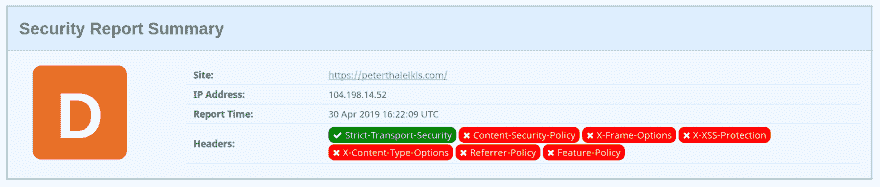
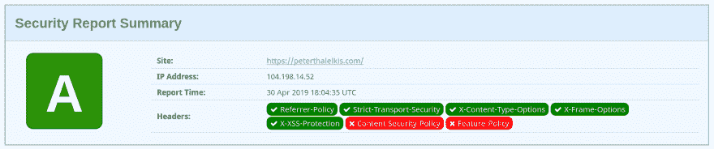

# 如何提高你网站的安全性？

> 原文：<https://dev.to/spekulatius1984/how-to-improve-the-security-of-your-netlify-site-20ld>

最近我用[十一](http://11ty.io/)和[网络生活](http://netlify.com/)重建了我的博客(这个网站)。作为一名工程师，我喜欢增强和改进我的网站。有时，我会将我的网站提交给服务部门，检查它们以确定新的改进领域。例如，这些服务是用于查找不再工作的链接的断开链接爬虫，或者是用于检查 HTTP 报头的潜在安全增强/问题的【securityheaders.com】服务[。](https://securityheaders.com/)

## 我的网络生活网站的初始安全评估

像以前很多次一样，我进入我的一个网站检查 securityheaders.com 上与安全相关的 HTTP 头。结果很快就出来了，显示出头球还有改进的潜力。根据 Scott Helme 的网站，只有“D 级”:

[](https://res.cloudinary.com/practicaldev/image/fetch/s--G9AOcCQG--/c_limit%2Cf_auto%2Cfl_progressive%2Cq_auto%2Cw_880/https://peterthaleikis.com/statimg/How-to-improve-the-security-of-your-Netlify-site/result-before.png)

## 用 Netlify' _headers 文件容易改进

杰出的 Netlify 开发人员体验使得调整标题变得非常容易。Netlify 允许你在一个名为`_headers`的文件中设置额外的头。该文件应该位于您的“发布目录”中。这通常被称为`public/`、`dist`或`_site`。如果你不确定，你可以在网站的网络管理面板的“构建&部署”下查看。

头文件允许你为你的页面的不同 URL(例如`/contact`)或者 URL 段(例如`/*`为所有 URL)定义头文件。在我的例子中，非常简单，因为我想将标题应用到所有页面(网址):

```
/*
 X-Frame-Options: DENY
 X-XSS-Protection: 1; mode=block
 Referrer-Policy: no-referrer
 X-Content-Type-Options: nosniff 
```

Enter fullscreen mode Exit fullscreen mode

`_headers`-peterthaleikis.com 上使用的文件示例

有了这些标题，我的成绩有了显著提高，并获得了“A 级”:

[](https://res.cloudinary.com/practicaldev/image/fetch/s--acjFD6oa--/c_limit%2Cf_auto%2Cfl_progressive%2Cq_auto%2Cw_880/https://peterthaleikis.com/statimg/How-to-improve-the-security-of-your-Netlify-site/result-after.png)

将头文件添加到您的 git 中，将它推上来并进行部署应该不会超过五分钟，并且会显著提高您的网站的安全性。我认为这些时间是值得投资的🙏️