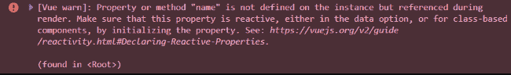
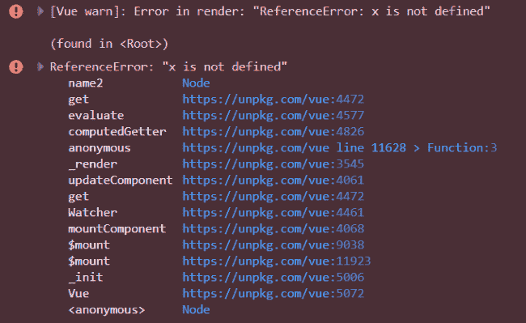
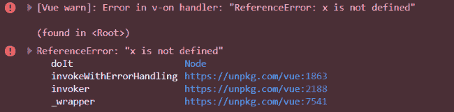
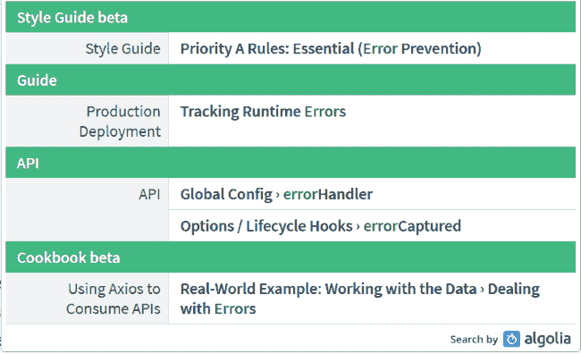

# 处理 Vue.js 中的错误

> 原文：<https://dev.to/raymondcamden/handling-errors-in-vue-js-52l2>

去年我一直在使用、撰写和展示我最喜欢的框架 Vue.js，并意识到我还需要研究 Vue 的错误处理。我想说那是因为我写了完美的代码，但是我想我们都知道这个事实。在过去的几天里，我花了一些时间研究 Vue 提供的各种错误处理技术，并想分享我的发现。显然，这不会涵盖所有的场景，但我希望它有所帮助！

## 错误！

为了测试各种错误处理技术，我决定使用三种不同的错误(不管怎样，最初是这样)。第一个简单地引用了一个不存在的变量:

```
<div id="app" v-cloak>
  Hello, {{name}}
</div> 
```

Enter fullscreen mode Exit fullscreen mode

这个例子不会向用户显示错误，但是会在控制台显示一条`[Vue warn]`消息。

[](https://res.cloudinary.com/practicaldev/image/fetch/s--FW5K1Y45--/c_limit%2Cf_auto%2Cfl_progressive%2Cq_auto%2Cw_880/https://static.raymondcamden.cimg/2019/05/ve1a.png)

您可以在此处查看此示例:

[https://codepen.io/cfjedimaster/embed/qweOKB?height=600&default-tab=result&embed-version=2](https://codepen.io/cfjedimaster/embed/qweOKB?height=600&default-tab=result&embed-version=2)

对于第二个例子，我尝试了一个绑定到计算属性的变量，它会抛出一个错误:

```
<div id="app" v-cloak>
  Hello, {{name2}}
</div>

<script>
const app = new Vue({
  el:'#app',
  computed:{
    name2() {
      return x;
    }
  }
})
</script> 
```

Enter fullscreen mode Exit fullscreen mode

这将在控制台中抛出一个`[Vue warn]`和一个常规错误，并且不向用户显示任何内容。

[](https://res.cloudinary.com/practicaldev/image/fetch/s--0MLThNba--/c_limit%2Cf_auto%2Cfl_progressive%2Cq_auto%2Cw_880/https://static.raymondcamden.cimg/2019/05/ve1.png)

这是这个的嵌入。

[https://codepen.io/cfjedimaster/embed/BEXoOw?height=600&default-tab=result&embed-version=2](https://codepen.io/cfjedimaster/embed/BEXoOw?height=600&default-tab=result&embed-version=2)

对于我的第三个错误，我使用了一个在执行时会抛出错误的方法。

```
<div id="app" v-cloak>
    <button @click="doIt">Do It</button>
</div>

<script>
const app = new Vue({
  el:'#app',
  methods:{
      doIt() {
          return x;
      }
  }
})
</script> 
```

Enter fullscreen mode Exit fullscreen mode

和上一个一样，这个错误会在控制台中抛出两次，一次警告，一次适当的错误。与上次不同的是，只有当您真正单击按钮时，才会抛出错误。

[](https://res.cloudinary.com/practicaldev/image/fetch/s--ZuVVE_Nf--/c_limit%2Cf_auto%2Cfl_progressive%2Cq_auto%2Cw_880/https://static.raymondcamden.cimg/2019/05/ve2.png)

这是这个的嵌入:

[https://codepen.io/cfjedimaster/embed/oOKjJb?height=600&default-tab=result&embed-version=2](https://codepen.io/cfjedimaster/embed/oOKjJb?height=600&default-tab=result&embed-version=2)

好了，在我们继续之前，我想澄清一下，这并不代表你可能产生的每一种错误，它只是我认为在 Vue.js 应用程序中常见的一些错误的基线。

那么，你如何处理 Vue 应用程序中的错误呢？我不得不说，我对主要的 [Vue 指南](https://vuejs.org/v2/guide/)没有一个关于错误处理的明确定义部分感到有点惊讶。

[](https://res.cloudinary.com/practicaldev/image/fetch/s--kAfWw7dk--/c_limit%2Cf_auto%2Cfl_progressive%2Cq_auto%2Cw_880/https://static.raymondcamden.cimg/2019/05/ve3.png)

是的，指南中有一个，但是文本足够短，可以引用:

> 如果在组件渲染期间出现运行时错误，它将被传递给全局 Vue.config.errorHandler 配置函数(如果已设置)。将这个钩子与 Sentry 之类的错误跟踪服务结合使用可能是个好主意，Sentry 为 Vue 提供了官方集成。

在我看来，这个话题真的应该在文档中多提一点。(坦率地说，这取决于我是否能帮助医生！)一般来说，Vue 中的错误处理归结于这些技术:

*   errorHandler(错误处理程序)
*   华纳德勒
*   渲染错误
*   错误被捕获
*   window.onerror(不是特定于 Vue 的技术)

让我们开始吃吧。

## 错误处理技巧一:errorHandler

我们要看的第一个技术是[错误处理器](https://vuejs.org/v2/api/#errorHandler)。您可能已经猜到，这是 Vue.js 应用程序的通用错误处理程序。你这样分配它:

```
Vue.config.errorHandler = function(err, vm, info) {

} 
```

Enter fullscreen mode Exit fullscreen mode

在上面的函数声明中，`err`是实际的错误对象，`info`是 Vue 特定的错误字符串，`vm`是实际的 Vue 应用。请记住，您可以一次在一个网页上运行多个 Vue 应用程序。这个错误处理程序将适用于所有这些应用程序。考虑这个简单的例子:

```
Vue.config.errorHandler = function(err, vm, info) {
  console.log(`Error: ${err.toString()}\nInfo: ${info}`);
} 
```

Enter fullscreen mode Exit fullscreen mode

对于第一个错误，这没有任何作用。如果你记得的话，它生成一个*警告*，而不是一个错误。

对于第二个错误，它处理错误并报告:

```
Error: ReferenceError: x is not defined
Info: render 
```

Enter fullscreen mode Exit fullscreen mode

最后，第三个例子给出了这个结果:

```
Error: ReferenceError: x is not defined
Info: v-on handler 
```

Enter fullscreen mode Exit fullscreen mode

注意前面两个例子中的信息是多么的有用。现在让我们检查下一个技术。

## 错误处理技巧二:warnHandler

[warnHandler](https://vuejs.org/v2/api/#warnHandler) 处理-等待- Vue 警告。但是请注意，这个处理程序在生产过程中会被忽略。方法处理程序也略有不同:

```
Vue.config.warnHandler = function(msg, vm, trace) {

} 
```

Enter fullscreen mode Exit fullscreen mode

`msg`和`vm`都应该是不言自明的，但是`trace`应该是组件树。考虑这个例子:

```
Vue.config.warnHandler = function(msg, vm, trace) {
  console.log(`Warn: ${msg}\nTrace: ${trace}`);
} 
```

Enter fullscreen mode Exit fullscreen mode

第一个错误示例现在有了一个警告处理程序并返回:

```
Warn: Property or method 'name' is not defined on the instance but referenced during render. Make sure that this property is reactive, either in the data option, or for class-based components, by initializing the property. See: https://vuejs.org/v2/guide/reactivity.html#Declaring-Reactive-Properties.
Trace: 

(found in <Root>) 
```

Enter fullscreen mode Exit fullscreen mode

第二个和第三个例子没有改变。您可以查看以下所有三项的嵌入内容:

[https://codepen.io/cfjedimaster/embed/oOKxEa?height=600&default-tab=result&embed-version=2](https://codepen.io/cfjedimaster/embed/oOKxEa?height=600&default-tab=result&embed-version=2)

[https://codepen.io/cfjedimaster/embed/PgMNao?height=600&default-tab=result&embed-version=2](https://codepen.io/cfjedimaster/embed/PgMNao?height=600&default-tab=result&embed-version=2)

[https://codepen.io/cfjedimaster/embed/wZVGEK?height=600&default-tab=result&embed-version=2](https://codepen.io/cfjedimaster/embed/wZVGEK?height=600&default-tab=result&embed-version=2)

## 错误处理技巧三:renderError

我要演示的第三个方法是 [renderError](https://vuejs.org/v2/api/#renderError) 。与前两种不同，这种技术是特定于组件的，而不是全局的。另外，和`warnHandler`一样，这在生产中是禁用的。

若要使用，请将其添加到您的组件/应用程序中。这个例子是根据文档中的一个例子修改的。

```
const app = new Vue({
  el:'#app',
  renderError (h, err) {
    return h('pre', { style: { color: 'red' }}, err.stack)
  }
}) 
```

Enter fullscreen mode Exit fullscreen mode

如果在第一个错误示例中使用，它什么也不做，如果你想一想，这有点儿有意义，因为第一个示例抛出的是警告，而不是错误。如果您在第二个示例中测试它，其中 computed 属性抛出一个错误，那么它将被呈现。你可以在下面的嵌入中看到它。

[https://codepen.io/cfjedimaster/embed/NmQrwa?height=600&default-tab=result&embed-version=2](https://codepen.io/cfjedimaster/embed/NmQrwa?height=600&default-tab=result&embed-version=2)

老实说，当控制台更合适时，我不确定为什么我会使用它，但是如果你的 QA 团队或其他测试人员不熟悉浏览器控制台，在屏幕上有一个更简单的错误消息可能会有帮助。

## 错误处理技巧四:错误捕获

对于最后的(Vue 特定的)技术，我们有 [errorCaptured](https://vuejs.org/v2/api/#errorCaptured) ，也就是让我困惑的技术，坦白地说，仍然让我有点困惑。医生是这么说的:

> 当捕获到来自任何派生组件的错误时调用。钩子接收三个参数:错误、触发错误的组件实例和包含错误捕获位置信息的字符串。钩子可以返回 false 来阻止错误进一步传播。

根据我的研究(同样，我对此肯定不确定)，这个错误处理程序只能由“父”组件用来处理来自“子”组件的错误。据我所知，它不能用在主 Vue 实例中，只能用在有子组件的组件中。

为了测试这一点，我创建了一组父/子组件，如下所示:

```
Vue.component('cat', {
  template:`
<div><h1>Cat: </h1>
  <slot></slot>
</div>`,
  props:{
    name:{
      required:true,
      type:String
    }
  },
   errorCaptured(err,vm,info) {
    console.log(`cat EC: ${err.toString()}\ninfo: ${info}`); 
     return false;
  }

});

Vue.component('kitten', {
  template:'<div><h1>Kitten: </h1></div>',
  props:{
    name:{
      required:true,
      type:String
    }
  }
}); 
```

Enter fullscreen mode Exit fullscreen mode

请注意`kitten`组件中有一个错误。现在如果我试着这样使用它:

```
<div id="app" v-cloak>
  <cat name="my cat">
      <kitten></kitten>
  </cat>
</div> 
```

Enter fullscreen mode Exit fullscreen mode

我会从处理程序那里得到一条消息:

```
cat EC: TypeError: dontexist is not a function
info: render 
```

Enter fullscreen mode Exit fullscreen mode

你可以在下面的嵌入中查看。

[https://codepen.io/cfjedimaster/embed/MRMbYJ?height=600&default-tab=result&embed-version=2](https://codepen.io/cfjedimaster/embed/MRMbYJ?height=600&default-tab=result&embed-version=2)

所以是的…有趣的功能。我猜它主要是由构建具有父/子类型关系的组件库的人使用的。更像是一个“库开发者”的特性，而不是一个“普通开发者”的特性。但是，这只是我对该功能的初步印象。

## 统治它们的一个技巧:window.onerror

[](https://res.cloudinary.com/practicaldev/image/fetch/s--J7rmw_t4--/c_limit%2Cf_auto%2Cfl_progressive%2Cq_auto%2Cw_880/https://static.raymondcamden.cimg/2019/05/ring.png)

最后一个(也是最强大的)选项是使用 [window.onerror](https://developer.mozilla.org/en-US/docs/Web/API/GlobalEventHandlers/onerror) ，这是一个全局错误处理程序，用于处理 JavaScript 可能出错的*事件*。处理程序采用
的形式

```
window.onerror = function(message, source, line, column, error) {

} 
```

Enter fullscreen mode Exit fullscreen mode

可能上面唯一你猜不到的是脚本的 URL。

然而事情变得有趣了。如果你这样定义，并且不使用*而不是*使用`Vue.config.errorHandler`，那么这将没有帮助。Vue 希望您定义这个该死的东西，如果您没有定义，就不会将错误传播到它本身之外。我…我想这是有道理的？我不知道-对我来说这不一定有意义。更奇怪的是，假设你的 Vue 错误处理程序本身有一个错误。这也不会传播到 window.onerror。

这里有一个代码笔的例子。我已经注释掉了`errorHandler`中的错误，但是如果您删除注释，您将会看到全局错误处理程序没有运行。只有当您单击第二个按钮时，才能看到全局处理程序运行。

[https://codepen.io/cfjedimaster/embed/WWVowN?height=600&default-tab=result&embed-version=2](https://codepen.io/cfjedimaster/embed/WWVowN?height=600&default-tab=result&embed-version=2)

## 总结起来

我希望这有意义。正如我在开始所说的，这是我第一次涉足这个话题，所以我肯定会寻求评论、建议和纠正。我很想听听人们是如何在自己的应用程序中使用这些技术的！