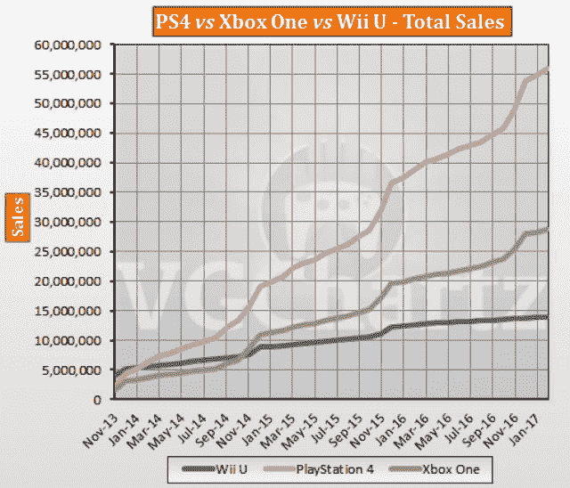
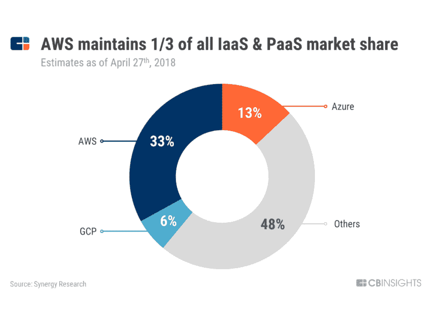
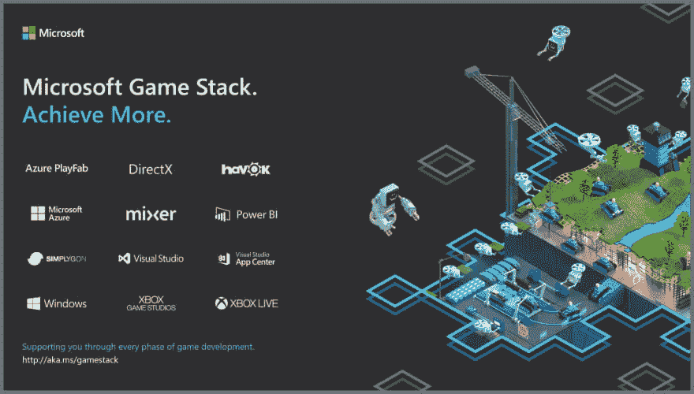
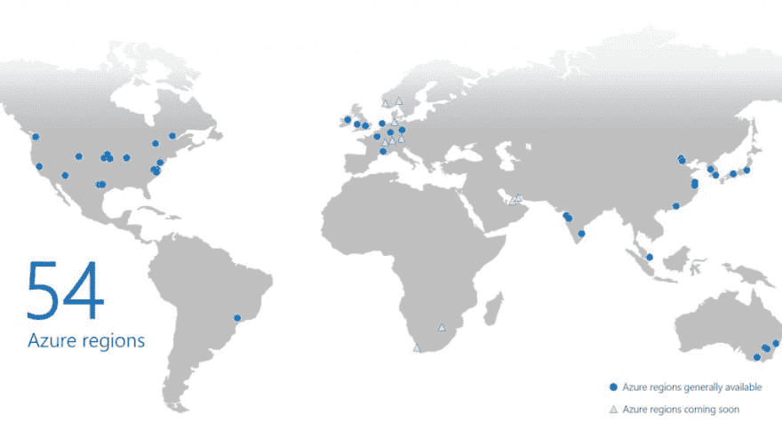

# 首席大师能为微软 Azure 赢得胜利吗？

> 原文：<https://dev.to/thegeoffstevens/can-master-chief-win-the-day-for-microsoft-azure-2dia>

xCloud 项目是微软在争夺云主导权的大型技术战中获得优势的最新战略。被许多人视为游戏的未来，Project xCloud 的游戏流媒体服务是迄今为止微软云平台 Azure 力量的最清晰展示。

凭借 Project xCloud 在精通技术的游戏玩家社区中的知名度及其对数亿消费者和开发者的潜在全球影响力，微软正在为其云帝国的其余部分奠定基础。

Azure 云将使游戏玩家受益，但开发者可能是真正的赢家——微软计划将 Azure、Xbox Live、DirectX、Windows 和许多其他服务集成到一台运行良好的游戏开发机器中。

被恰当地称为[游戏栈](https://azure.microsoft.com/en-us/blog/achieve-more-with-microsoft-game-stack/)的微软希望建立一个开发者友好的平台，为开发者提供他们需要的工具，让他们的游戏进入数百万游戏玩家的手中。

## 过去不可想象的事现在如何成为现实

Project xCloud 是微软尚未发布的游戏流媒体服务，可以让你在任何设备上玩任何视频游戏。《Forza》、《战地》和《使命召唤》等游戏将不再局限于单一的物理控制台，而是在云中运行，你的设备就像是虚拟控制台的门户。通过从云中传输游戏，每个人都可以在从个人电脑到手机和平板电脑的所有设备上玩同样的资源密集型游戏。

<figure>

<figcaption>Five years ago, this image would have been considered blasphemous</figcaption>

</figure>

微软 Xbox 的旗舰游戏《光环》(Halo)定义了一代游戏——现代的《T2》超级马里奥或《T4》街头霸王——现在可以在苹果的 iPhone 或谷歌的 Pixel 上玩了。

不久前，这样的未来似乎是不可想象的。

在过去的几年里，微软发生了两件大事，使得今天成为可能。

首先，索尼的竞争对手游戏机 PlayStation 4 在销量上击败了 Xbox One。PS4 的销量超过 9000 万台，是 Xbox One 预计 4300 万台的两倍多。几乎在一夜之间，微软失去了它在游戏世界的优势——它凭借其上一代游戏机 Xbox 360 取得的巨大成功而取得的领先优势很快消失了。

<figure>

<figcaption>Source: [VGChartz](http://www.vgchartz.com/article/267817/ps4-vs-xbox-one-vs-wii-u-global-lifetime-salesfebruary-2017-update/)</figcaption>

</figure>

第二，亚马逊通过 AWS 主导了云基础设施，将微软 Azure 降至第二位。每过一年，AWS 的规模就会翻一番，2018 年的收入增长到 250 亿美元。微软 Azure 被留下来追赶。

<figure>

<figcaption>Source: [CB Insights](https://www.cbinsights.com/research/amazon-google-microsoft-multi-cloud-strategies/)</figcaption>

</figure>

微软最具战略意义的两款产品似乎落后于竞争对手。

现在这两个世界——游戏和云——正在碰撞。在一次大胆的行动中，微软计划在全球游戏舞台上展示其日益强大的云，希望超越亚马逊和谷歌。如果成功，回报可能是巨大的。

## 游戏开发的终极平台

微软游戏栈汇集了一套由 Azure 支持的微软工具和服务，为游戏开发者提供支持，从独立开发者到 AAA 工作室。

游戏堆栈工具使构建、部署和操作游戏变得容易。开发者可以集成新技术，比如 PlayFab，这是一个用于构建和运行直播游戏的完整后端。

Game Stack 希望利用其作为平台的优势，成为最强大的游戏开发工具生态系统。

与这些工具相集成的是对强大云的无缝访问。根据微软的说法，“云在游戏堆栈中扮演着关键角色，Azure 满足了这一重要需求。”

Game Stack 实际上是云、网络和设备不可知的——但与 Azure 的无缝集成使它最有可能是云。吸引大量快乐的开发者和游戏玩家将决定微软游戏开发平台的成功。

## 通过做不可能的事情来证明您的云计算价值

根据微软的 Project xCloud 宣传视频:“世界上有 20 亿游戏玩家。他们中的一些人有个人电脑。他们中的一些有一个控制台。他们中的一些人有智能手机。”

微软关闭了智能手机业务，在游戏机大战中落后，并面临个人电脑销量的大幅下滑。微软开始变得越来越像《光晕》的《保卫星球》对抗圣约人入侵的首席执行官——换句话说，不好。

颇具预言性的是，士官长侥幸逃脱毁灭，拯救的不是别人，正是科塔娜本人。

微软没有被吓倒，开始重新定义它的核心重点。电脑、游戏机和智能手机都可以在云上交叉。

如果世界上每个人都能玩光晕会怎么样？

想象一下将所有 20 亿游戏玩家连接到微软的云上。

游戏是一项大生意。云是一个更大的行业。

xCloud 项目将是 Azure 迄今为止最明显的演示——对许多人来说，这将是他们与微软云最明显、最直接的互动。这将清楚地表明 Azure 的优势，亚马逊和谷歌在很大程度上无法复制。

随着 Azure 成为其游戏追求的核心，微软计划让世界各地的消费者感到惊讶，无论他们是南亚的手机用户，北美的游戏机所有者，还是未来几十年即将上网的下一代非洲人。软件开发商和科技公司将会注意到这一点。

## 构筑游戏云的护城河

谷歌用自己的游戏流媒体服务 Stadia 戏弄了世界。长期以来，亚马逊一直被怀疑试图开发自己的服务。两家公司都没有多少游戏背景。

没有 AAA 头衔，没有游戏社区，没有怀旧的视频游戏知识，亚马逊和谷歌处于非常不利的地位。

微软找到了最佳点——它知道这一点:“我们是一家拥有内容和社区的游戏公司。我们碰巧在 Azure 也有一个强大的第一方云。

军士长曾经是人类的救世主和对抗敌对外星生物的保卫者，接下来他可能会被指派一项英雄任务，引领(地球)云进入下一个成长阶段。

如果你喜欢这个，看看我们的时事通讯， [SRC](https://www.software.com/src) 。