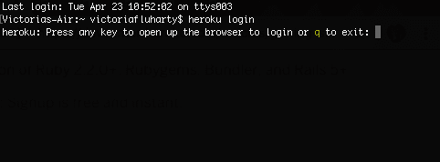
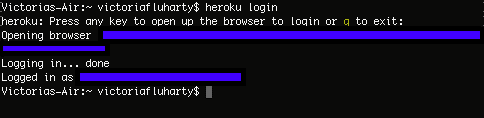
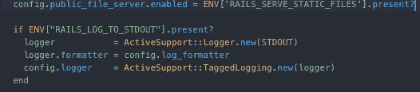
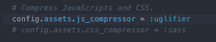
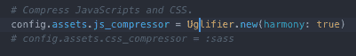

# 用 Heroku 部署 Ruby on Rails 项目

> 原文：<https://dev.to/torianne02/deploying-a-ruby-on-rails-project-with-heroku-1l7m>

上周，我创建了一个关于将 Ruby on Rails 数据库从 SQLite3 切换到 PostgreSQL 的快速教程,这是整个 Heroku 部署教程的第 1 步(共 2 步)。今天，我在这里给你们这个教程的第二部分。

根据我在上一篇文章中解释的内容，当我第一次开始用 Heroku 部署我的 Ruby on Rails 项目时，我真的很紧张。在我的训练营中，有很多人在努力做到这一点，其中大部分都是关于数据库切换的。谢天谢地，我基本上没有遇到什么大问题，但是在尝试部署到 Heroku 时，我确实遇到了一些困难。

我将尽最大努力把我遇到的所有小问题都包括在谷歌上，这样，对于我们这些刚开始通过 Heroku 部署的人来说，这可能是一个一站式商店。让我们开始吧。

## Heroku 的本地设置

首先，你需要在你的机器上安装 [Heroku CLI](https://devcenter.heroku.com/articles/heroku-cli#download-and-install) 。一旦你安装了它，你需要打开你的终端并使用命令`$ heroku login`登录到你的 Heroku 账户。

[](https://res.cloudinary.com/practicaldev/image/fetch/s--F2qS3Y1y--/c_limit%2Cf_auto%2Cfl_progressive%2Cq_auto%2Cw_880/https://thepracticaldev.s3.amazonaws.com/i/i8hltn58i977omt8lli1.png)

系统会提示您按任意键登录。我总是选择按`enter`。完成后，您将被重定向到网络浏览器。

[](https://res.cloudinary.com/practicaldev/image/fetch/s--fBrAEbeP--/c_limit%2Cf_auto%2Cfl_progressive%2Cq_auto%2Cw_880/https://thepracticaldev.s3.amazonaws.com/i/det60656jiqwk70ctspv.png)

当您按下 login 并成功完成后，会提示您返回到终端，它应该是这样的(没有所有蓝色标记，因为我只是想保护我的登录信息)。

[](https://res.cloudinary.com/practicaldev/image/fetch/s--E7Hypyu7--/c_limit%2Cf_auto%2Cfl_progressive%2Cq_auto%2Cw_880/https://thepracticaldev.s3.amazonaws.com/i/ya6agzwwof0flxrto8lx.png)

## 创建一个新的(或升级一个旧的)Ruby on Rails 项目

需要注意的一件重要事情是，如果您正在升级一个旧项目，您将需要确保您使用的是 Rails 的升级版本。截至目前，Heroku 接受 [Rails 5](http://edgeguides.rubyonrails.org/upgrading_ruby_on_rails.html#upgrading-from-rails-4-2-to-rails-5-0) 。如果您不确定如何检查您的项目当前使用的版本，请转到您的终端，确保您在项目目录中，并运行`$ rails -v`。如果您使用的是早于 Rails 5 的版本，请确保单击上面的链接获取升级说明。

如果您正在创建一个新项目，请确保使用 PostgreSQL 数据库创建它，以便您可以避免以后切换它的需要。您可以在终端中使用以下命令来实现这一点:

```
$ rails new app-name -- database=postgresql 
```

确保通过运行命令`$ cd app-name`在创建项目目录后进入该目录。

## 数据库

如果您刚刚创建了一个使用 PostgreSQL 作为数据库的新项目，那么您可以跳过这一部分。

如果您有一个使用 SQLite 数据库的现有项目，这就是我们需要对 PostgreSQL 进行更改的地方。为什么你会问？Heroku 不支持 SQLite 数据库，您将无法部署您的项目。你可以去看看我写的这个两步教程的第一部分[来实现这个改变。](https://dev.to/torianne02/making-the-change-from-sqlite3-to-postgresql-ruby-on-rails-2m0p)

## 创建根/主页

您需要为您的项目创建一个根页面，当它通过 Heroku 部署后打开时，它将作为 web 应用程序的初始登录页面。为了实现这一点，您需要确保根页面和索引页面都有一个控制器。

在本教程中，我们将创建一个`home`控制器。您可以在终端中使用以下命令来创建它:

```
$ rails g controller home 
```

现在，我们需要通过创建一个新文件(`app/views/home/index.html.erb`)来创建索引页面。在这个文件中，您可以编写/编码任何您想在主页上显示的内容。

一旦你完成了所有这些，你需要在`config/routes.rb`内为它添加一条铁路路线。在`config/routes.rb`中添加

```
root 'home#index' 
```

你会希望通过使用`$ rails s`运行你的服务器并在你的浏览器中访问 [http://localhost:3000](http://localhost:3000) 来确保它正常工作。

## `production.rb`文件

根据 Heroku 的官方文档，“以前版本的 Rails 需要你在你的项目中添加一个 gem[Rails _ 12 factor](https://github.com/heroku/rails_12factor)来启用 Heroku 上的静态资产服务和登录。”如果你创建了一个新的应用程序，你可以忽略这个 gem。如果您正在升级一个现有的项目，并且在您的`Gemfile`中有这个 gem，您可以删除它，只要您的`config/environments/production.rb`文件中有这个配置:

[](https://res.cloudinary.com/practicaldev/image/fetch/s--p73eOLTy--/c_limit%2Cf_auto%2Cfl_progressive%2Cq_auto%2Cw_880/https://thepracticaldev.s3.amazonaws.com/i/cmgcglpjcpadlk1qpvi7.png)

就上述信息而言，我个人并不需要做任何改变，但我确实遇到了另一个关于我的`production.rb`文件的障碍。当我去部署我的项目时，我一直得到一个类似于`Ugligier::Error: Unexpected token: punc((). To use ES6 syntax, harmony mode must be enabled with Uglifier.new(:harmony => true)`的错误。

在花了几分钟时间搜索之后，我发现错误在我的`config/environments/production.rb`文件中。

起初，我的 JavaScript compressor 行看起来像这样

[](https://res.cloudinary.com/practicaldev/image/fetch/s--oFL1xL0P--/c_limit%2Cf_auto%2Cfl_progressive%2Cq_auto%2Cw_880/https://thepracticaldev.s3.amazonaws.com/i/t6e56qed83cuftmywc67.png)

它需要看起来像这样

[](https://res.cloudinary.com/practicaldev/image/fetch/s--hDfOPUGz--/c_limit%2Cf_auto%2Cfl_progressive%2Cq_auto%2Cw_880/https://thepracticaldev.s3.amazonaws.com/i/cjbxvwxvxtbnjl7vzult.png)

所以，如果你遇到类似的问题，只要仔细检查你的`production.rb`文件。

## 去吧

现在，正如我在之前的教程中所说的，请**请**确保你尽可能多地提交和推送你的代码。我不断犯错误，试图推送到 Heroku，同样的错误不断发生，因为我没有将我的更改提交和推送到 [Git](http://git-scm.com/) 和 GitHub。

## 部署到 Heroku

现在，有趣的部分来了！在您的项目目录的终端中，通过运行`$ heroku create`在 Heroku 上创建一个 app。

完成这些之后，用下面的命令部署代码:

```
$ git push heroku master 
```

如果您遇到任何错误，只需仔细检查以确保您已经将所有更改提交到 Git。如果这不是原因，那么谷歌将是你最好的朋友！

## 数据库迁移

您需要通过运行这个命令
来手动迁移您的数据库

```
$ heroku run rake db:migrate 
```

## 访问您的项目

现在你可以在 Heroku 上看到你的应用程序了！！！为此，请在您的终端中运行`$ heroku open`。

## 最后问候

显然，我不会对每个问题都有答案，所以如果需要的话，请谷歌一下。我想确保包括我个人遇到的问题，这样我就可以帮助那些和我遇到同样困难的人。

我希望通过这篇教程，我让正在阅读这篇文章的读者在 Heroku 的部署少了一点恐惧，多了一份顺畅。

编码快乐！！

#### 来源

[Heroku with Rails 5 . x 入门](https://devcenter.heroku.com/articles/getting-started-with-rails5#deploy-your-application-to-heroku)
[Heroku 推送期](https://stackoverflow.com/questions/52259494/heroku-push-issue)
[丑化::错误](https://github.com/lautis/uglifier/issues/127)