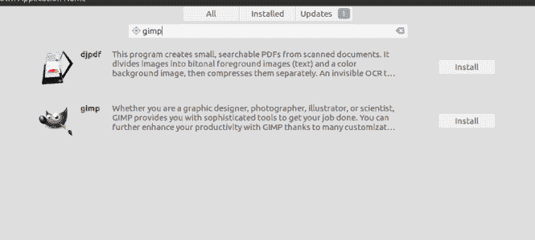
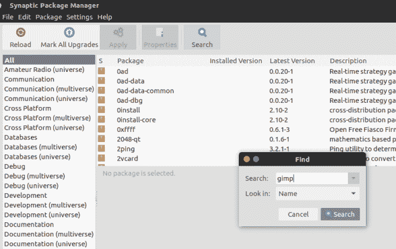
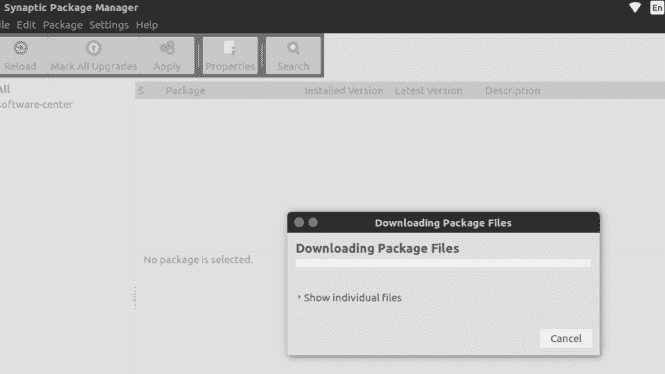
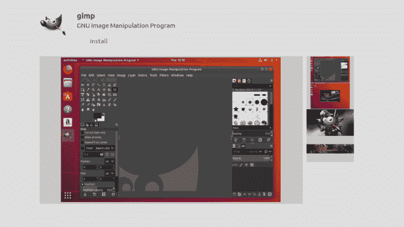

# 想在 Linux 上用 PHOTOSHOP 就装 GIMP。

> 原文：<https://dev.to/xeroxism/install-gimp-if-you-want-photoshop-on-linux-pd9>

## *让您的图形创意栩栩如生。*

GIMP(GNU IMAGE MANIPULATION PROGRAM)是一个非常强大和灵活的免费开源图像编辑器，可用于图像润饰和编辑、自由形式绘图、不同类型图像格式之间的转换以及许多其他与图形相关的任务。

gimp 包含了非常有用的工具，可以让你的工作变得轻松愉快，无论是作为图形设计师、插画师，还是仅仅想做一些图片处理。

如果你习惯了 Photoshop，with 应该很熟悉——许多相似的工作流程和功能。它接近 Adobe Photoshop，因为你可以免费获得。它支持图层，并配备了先进的工具来增强您的图片或从头开始创建新的图片。

您可以轻松地手动调整图片外观的各个方面，或者使用几十种可定制的滤镜和效果，只需点击几下鼠标即可获得令人惊叹的效果。GIMP comespre-installed 有很多其他用户创建的插件，添加更多的是小菜一碟。

如果你不需要 GIMP 的强大功能，而喜欢更简单的界面，可以看看[**Pinta**](https://fossnaija.com/graphics-linux-pinta-image-editor/)——另一个高效的开源图片编辑器，功能更少，但更容易掌握。

这篇文章将向你展示如何在 UbuntuLinux 上轻松安装 Gimp。

## 方法一:使用 UBUNTU SOFTWARECENTER。

推荐的安装 gimp 的方式是通过 Linux 发行版中的官方软件包。

你可以直接去 Ubuntu 软件中心，在搜索栏搜索“GIMP”。

<figure> 

<figcaption>GIMP: UBUNTU 软件中心</figcaption>

</figure>

然后，您可以简单地点击安装按钮来安装应用程序。然后你所要做的就是等待安装完成。

## 方法二:使用 SYNAPTIC PACKAGEMANAGER。

首先确保你已经安装了[**synaptic package manager**](https://dev.to/xeroxism/how-to-install-synaptic-package-manager-in-ubuntu-linux-hm3)。

然后在包列表中搜索“gimp”，标记安装。

然后选择“gimp”结果，并选择“标记为安装”，同时标记软件应用程序所需的依赖关系。

然后单击“应用”开始安装。

<figure> 

<figcaption>用突触包管理器下载 GIMP

</figcaption>

</figure>

安装完成后，您就可以开始工作了！

快乐的 Linux！

如果你想在 Linux 上使用 PHOTOSHOP，安装 GIMP。最早出现在[福斯奈亚](https://fossnaija.com)上。