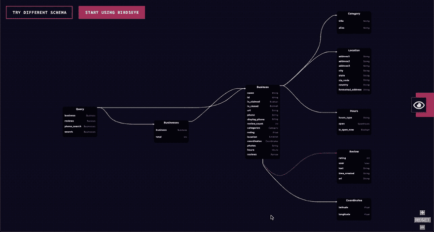

# 介绍 GraphQL Birdseye🦅

> 原文：<https://dev.to/novvum/introducing-graphql-birdseye-33i6>

我们很自豪地正式发布 [graphql-birdseye](https://github.com/Novvum/graphql-birdseye) ！Birdseye 允许您将任何 GraphQL 模式作为动态的交互式图形来查看。在我们的[演示网站](https://birdseye.novvum.io/)上试试吧！

伯德塞使用了“战争迷雾”🌁动态缩放以一次显示一部分模式的导航样式。与一次显示整个模式相比，这大大简化了查找相关类型的过程。

#### 入门

你可以通过阅读此处的说明[开始使用 birdseye。该库目前作为 React 组件可用，但如果我们收到对 Angular 或 Vue 等其他框架的请求，我们也很乐意在这些框架上工作🙂。](https://github.com/Novvum/graphql-birdseye#installation)

#### 我们为什么要建造它

我们受到启发，制作了一个 GraphQL 模式可视化工具，您可以将它添加到其他站点和包中。我们已经看到了一些其他优秀的工具，如 [graphql-rover](https://brbb.github.io/graphql-rover/) 、 [graphql-voyager](https://www.npmjs.com/package/graphql-voyager) 和 [graphql 编辑器](https://graphqleditor.com/)。我们原本计划将 voyager 与 graphql-playground 集成在一起，但这会增加 1.2 MB 的包容量。这个包的大小使得这个库很难与任何其他工具集成。

为了解决这个问题，我们创造了 Birdseye，它是轻量级的，可以很好地与其他工具配合使用。在这个过程中，我们也对用户体验做了一些有益的改变(📣感谢 [Prisma](https://www.prisma.io/) 为“战争迷雾”导航出谋划策。

#### 我们如何建造它

当我们第一次开始时，我们花了第一个月的时间尝试各种图表库，如 [WebCola](https://github.com/tgdwyer/WebCola) 、 [Cytoscape.js](http://js.cytoscape.org/) 、 [dagre](https://github.com/dagrejs/dagre) 等等。一些库支持部分特性，而其他库支持不同的子集。在这一点上，我们考虑建立我们自己的可视化库，我们很快意识到这将是多么疯狂😅。

我们决定继续寻找，最终发现了接缝🎊。它给了我们一个很好的 API 来定义自定义的形状，并提供了优秀的布局和链接路由算法。它也给了我们根据需要修改这些算法的能力。最重要的是，它对包的大小增加很少(大约 70kb)。

在解决了 JointJS 之后，项目的其余部分集中于更详细地理解 API 并使用它来构建库。我们用来实现这一目标的其他一些工具有:

*   打字稿(TypeScript):我们随时可以使用的常用语言。类型安全通过在早期捕捉简单的问题为我们省去了很多麻烦。
*   [Rollup](https://rollupjs.org/guide/en) :专门打包库的捆绑器。
*   svg-pan-zoom:HTML 中 SVG 的简单平移/缩放解决方案。它为鼠标滚动、双击和平移添加了事件侦听器。

#### 我们将何去何从

我们致力于改进这个库，使它成为可视化您的模式的首选。我们希望听到您的反馈，以便我们可以做得更好，我们随时欢迎您的贡献。我们计划开展的工作包括:

1.  提高大型模式的性能
2.  切换缩放导航样式的选项
3.  更平滑的用户界面过渡和交互

#### 告诉我们你的想法🤔

如果你喜欢鸟眼，请在 Twitter([@ novvvumio](https://twitter.com/novvumio))上关注我们，给我们一颗星🌟上 [GitHub](https://github.com/Novvum/graphql-birdseye) ！如果您发现任何问题，我们很乐意解决它们！你可以在这里提交他们。

###### 关于我们: [Novvum](https://novvum.io) 是一家专业从事工程、战略、&设计的现代软件开发机构。