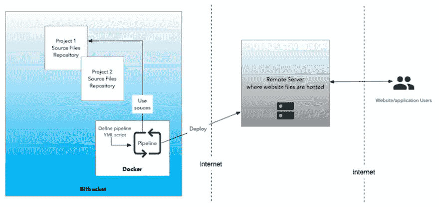
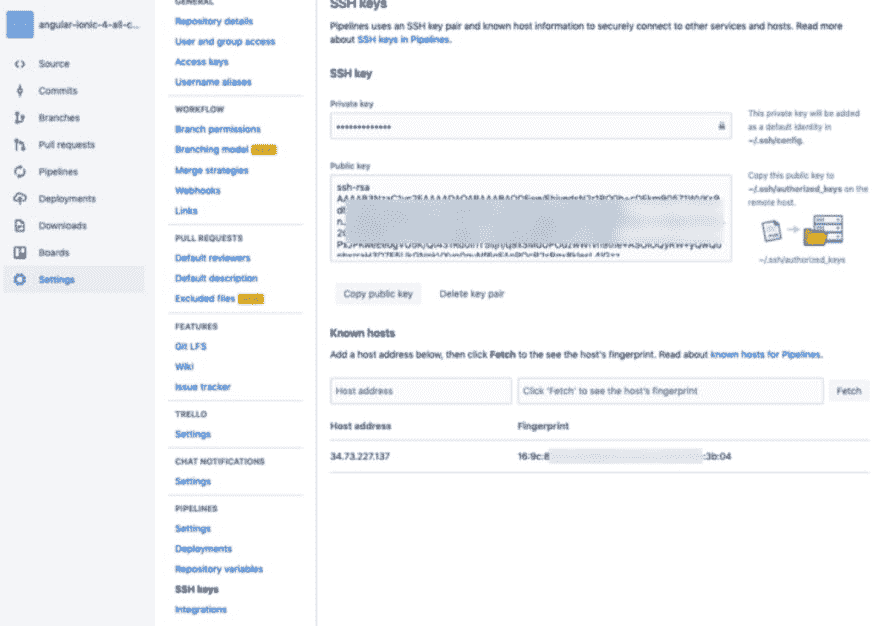
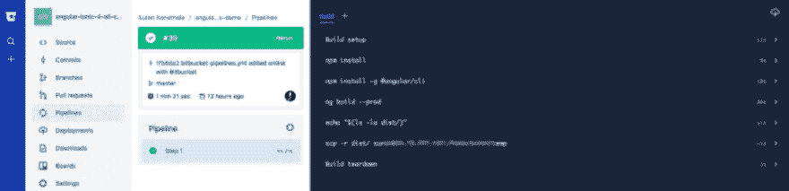

# 使用 Bitbucket 管道在 Google 虚拟机上部署 Angular 应用程序

> 原文：<https://dev.to/atlassian/deploying-an-angular-app-on-a-google-vm-using-bitbucket-pipelines-550b>

*这是一篇由* [*苏伦·科纳塔拉*](https://twitter.com/surenkonathala) *为* [*比特斗*](https://bitbucket.org/product) *写的客帖。*

Angular 是使用最广泛的 javascript 框架之一。虽然构建很容易，但是开发人员在配置部署和设置 CI/CD 管道时会遇到问题。这篇文章概述了使用 Bitbucket 管道将 Angular 应用程序部署到 Google VM 所需的步骤。

### 什么是管道？

[Bitbucket Pipelines](https://bitbucket.org/product/features/pipelines) 允许开发人员配置源文件到测试/生产服务器的连续交付(在云端)。这些管道被配置为使用 YML 脚本连接到生产服务器。

### 我为什么要用管道？

为了让用户能够访问应用程序，需要将源代码部署到服务器上。向用户呈现/交付 web 应用程序的服务器称为**生产**服务器。在应用程序到达生产服务器之前，它要经过多次开发和测试。这些迭代通常被部署到一个**开发**服务器或者一个**阶段**服务器。

[](https://res.cloudinary.com/practicaldev/image/fetch/s--OHLcyViW--/c_limit%2Cf_auto%2Cfl_progressive%2Cq_auto%2Cw_880/https://cdn-images-1.medium.com/max/1024/0%2AMSGZbUT0CptVfWhK.png)

对于要部署到上述每台服务器的应用程序，有几个步骤可能会很麻烦。

*   将代码文件复制到服务器
*   运行构建和部署脚本
*   在每台服务器上重复相同的操作。有时团队在每个阶段都有多个服务器。

好吧！通过 Jenkins 之类的工具，上述工作已经在一定程度上实现了自动化，但缺点是开发人员/管理员必须在他们的服务器上安装另一个软件，并学习使用和管理它。

Pipelines 简化了上述过程，事实上自动化了整个构建和部署过程——也称为 CI/CD(持续集成/持续部署)。Bitbucket 管道最大的优点是可以从 Bitbucket 存储库直接构建和部署应用程序到任何目标服务器。

可以使用简单的基于 YAML 的脚本来定义整个复制、构建和部署流程，而无需任何附加软件或解决方案。我们需要做的就是挑选 docker 镜像(比如 NodeJs，Java 等。)用于构建项目的管道，并选择频率(例如，手动，或在源存储库中更新文件时自动)。这为团队和组织节省了大量的时间和资源。

### 教程:在 Bitbucket 上配置 Angular 项目

本教程介绍了如何将基于 Angular 的 web 应用程序部署到 Google Cloud 虚拟机(VM)上。应用程序的源代码在一个位存储库中，该虚拟机需要使用 SSH 安全密钥进行连接。

*先决条件*

*   具有私有和公共 SSH 密钥的外部服务器(或 VM)。这将是网站或网络应用程序的主机。
*   在[位存储桶](https://bitbucket.org/account/signup/)上存储项目源文件。这些将被用来构建&部署到服务器。

### 第一步:设置 SSH 密钥

在 Bitbucket >项目源存储库>设置>管道> SSH 密钥下

添加私钥和公钥。您需要从需要连接的外部服务器获取这些信息。

添加已知主机(这将是您要将代码推送至的外部服务器的 IP 地址。在我们的例子中，我们在 Google Cloud 上使用了一个虚拟机)

[](https://res.cloudinary.com/practicaldev/image/fetch/s--QIR6d9au--/c_limit%2Cf_auto%2Cfl_progressive%2Cq_auto%2Cw_880/https://cdn-images-1.medium.com/max/1024/0%2AowrA1vugumgrEhoC.png)

### 第二步:定义 YML 部署脚本

转到项目源存储库>管道>新建管道并定义脚本。以下是一个脚本示例:

```
# Sample build file # @author Suren Konathala 
# ----- 
image: node:8 
pipelines:   
  default: 
- step:      
     caches:        
     - node      
     script: # Modify the commands below to build your repository.
       - echo "$(ls -la)"        
       - npm install        
       - npm install -g @angular/cli        
       - ng build --prod        
       - echo "$(ls -la dist/)"        
       - scp -r dist/ user@34.73.227.137:/projects/commerce1 
```

以上脚本执行构建 Angular 项目所需的命令/步骤。完成后，它会将 dist 文件夹下的构建文件的内容推/部署到外部服务器。

在这个例子中，我们使用 SCP 命令将代码推送到外部服务器。由于已经在上面的步骤 1 中设置了 SSH 密钥，您的本地 repo 现在可以连接到服务器并复制文件。

### 第三步:运行管道

保存并“运行管道”。您可以看到管道的运行日志和状态。

[](https://res.cloudinary.com/practicaldev/image/fetch/s--WHSjTJDo--/c_limit%2Cf_auto%2Cfl_progressive%2Cq_auto%2Cw_880/https://cdn-images-1.medium.com/max/1024/0%2A180llwPX1K8hO7FK.png)

成功完成后，您可以通过测试您的实时应用程序并检查是否反映了最新的更新，或者您可以手动检查服务器上的文件是否已更新(不需要在每次推送时都这样做)，来验证文件是否确实被复制到外部服务器。

### 故障排除/信息

更新管道中的节点版本..在 YML 脚本中将 docker 节点映像的版本更改为 node:8。

```
image: node:8 
```

要知道您所在的文件夹和正在生成的文件，您可以使用 echo 命令。一些例子..

```
echo "Starting the deployment..."
echo "$(ls -la)" 
```

这篇[文章](https://stackoverflow.com/questions/55227229/how-can-we-ssh-to-a-google-cloud-vm-from-mac-terminal-using-public-key-generated)展示了如何在 Linux 服务器/虚拟机上添加 SSH 密钥。

这个项目的源文件在这里共享[。](https://bitbucket.org/konathalasuren/angular-ionic-4-all-components-demo/)

点击了解更多关于构建 Angular 项目的信息[。](https://angular.io/guide/deployment)

这是苏伦·科纳塔拉为 Bitbucket 写的一篇客座博文。“我的使命是简化组织的技术采用。我是一名开发商、建筑师、顾问和经理。我喜欢写作和谈论技术。在 [*LinkedIn*](https://www.linkedin.com/in/ksurendra/) *或*[*Twitter*](https://twitter.com/surenkonathala)*上与我联系。”*

喜欢分享你的技术专长吗？了解更多关于[位桶编写程序](https://bitbucket.org/product/write?utm_source=blog&utm_medium=post&utm_campaign=bottom-post)的信息。

*原载于 2019 年 4 月 30 日*[*【https://bitbucket.org】*](https://bitbucket.org/blog/deploying-an-angular-app-on-a-google-vm-using-bitbucket-pipelines)*。*