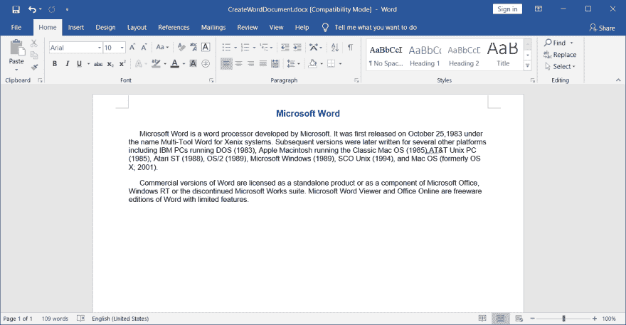
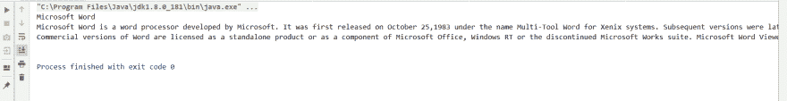

# 用 Java 创建和阅读 Word 文档

> 原文：<https://dev.to/eiceblue/create-and-read-word-document-in-java-kcm>

## 简介

Word 文档是我们日常工作中最常用的文件类型之一，而创建和阅读 Word 文档是使用 Word 文档时最常见的需求。在本文中，我们将学习如何用 java 以编程方式创建一个 word 文档并读取 Word 文档中的文本内容。

## 我们需要的文字处理库

[自由的尖顶。Java 文档](https://www.e-iceblue.com/Introduce/free-doc-for-java.html)

## 创建 Word 文档

在自由塔尖。Doc for Java，一个**文档**对象代表一个 Word 文档。下面的代码示例显示了如何使用 Free Spire 创建文档对象、添加段落、设置段落样式以及将文档对象保存到文件中。Java 的 Doc。

```
import com.spire.doc.*;
import com.spire.doc.documents.HorizontalAlignment;
import com.spire.doc.documents.Paragraph;
import com.spire.doc.documents.ParagraphStyle;

import java.awt.*;

public class CreateWordDocument {
    public static void main(String[] args){
        //Create a Document instance
        Document document = new Document();

        //Add a section
        Section section = document.addSection();

       //Add 3 paragraphs to the section
        Paragraph para1 = section.addParagraph();
        para1.appendText("Microsoft Word");

        Paragraph para2 = section.addParagraph();
        para2.appendText("Microsoft Word is a word processor developed by Microsoft. It was first released on October 25," +
                "1983 under the name Multi-Tool Word for Xenix systems. Subsequent versions were later written for several " +
                "other platforms including IBM PCs running DOS (1983), Apple Macintosh running the Classic Mac OS (1985)," +
                "AT&T Unix PC (1985), Atari ST (1988), OS/2 (1989), Microsoft Windows (1989), SCO Unix (1994), "+
                "and Mac OS (formerly OS X; 2001).");

        Paragraph para3 = section.addParagraph();
        para3.appendText("Commercial versions of Word are licensed as a standalone product or as a component of Microsoft Office, " +
                        "Windows RT or the discontinued Microsoft Works suite. Microsoft Word Viewer and Office Online are freeware editions "+
                        "of Word with limited features.");

        //Set title style for paragraph 1
        ParagraphStyle style1 = new ParagraphStyle(document);
        style1.setName("titleStyle");
        style1.getCharacterFormat().setBold(true);
        style1.getCharacterFormat().setTextColor(Color.BLUE);
        style1.getCharacterFormat().setFontName("Arial");
        style1.getCharacterFormat().setFontSize(12f);
        document.getStyles().add(style1);
        para1.applyStyle("titleStyle");

        //Set style for paragraph 2 and 3
        ParagraphStyle style2 = new ParagraphStyle(document);
        style2.setName("paraStyle");
        style2.getCharacterFormat().setFontName("Arial");
        style2.getCharacterFormat().setFontSize(10f);
        document.getStyles().add(style2);
        para2.applyStyle("paraStyle");
        para3.applyStyle("paraStyle");

        //Horizontally align paragraph 1 to center
        para1.getFormat().setHorizontalAlignment(HorizontalAlignment.Center);

        //Set indent for paragraph 2 and 3
        para2.getFormat().setFirstLineIndent(15f);
        para3.getFormat().setFirstLineIndent(15f);

        //Set spaces after paragraph 1 and 2
        para1.getFormat().setAfterSpacing(15f);
        para2.getFormat().setAfterSpacing(10f);

        //Save the document
        document.saveToFile("CreateWordDocument.docx", FileFormat.Docx);
    }
} 
```

[](https://res.cloudinary.com/practicaldev/image/fetch/s---y7VSwaR--/c_limit%2Cf_auto%2Cfl_progressive%2Cq_auto%2Cw_880/https://thepracticaldev.s3.amazonaws.com/i/edlva46lsnymb7jc8bbc.png)

## 读取 Word 文档中的文本内容

**Document** 类提供了一个 **getText()** 方法，可以让我们轻松获取一个 Word 文档的文本内容。

```
import com.spire.doc.*;

public class TextReader {
    public static void main(String[] args){

        //Load the Word document
        Document doc = new Document("CreateWordDocument.docx");

        //Get text
        System.out.println(doc.getText());
    }
} 
```

[](https://res.cloudinary.com/practicaldev/image/fetch/s--JVhlVkxr--/c_limit%2Cf_auto%2Cfl_progressive%2Cq_auto%2Cw_880/https://thepracticaldev.s3.amazonaws.com/i/j021apwanm5pbtn6dvhr.png)

除了文字，自由的尖顶。Doc for Java 还支持读取 Word 文档中的各种其他元素，如段落、图像、页眉、页脚、列表和表格。你可以自己试一试。