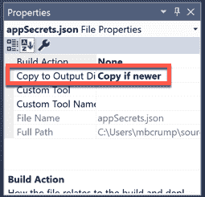
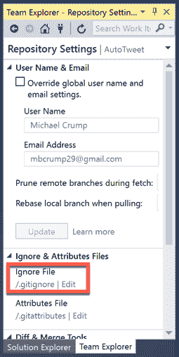
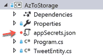

# 防止 Azure 中的机密泄露

> 原文：<https://dev.to/azure/preventing-leaked-secrets-in-azure-8kp>

*我们选择了由[迈克尔·克伦普](https://twitter.com/mbcrump)创造的我们最喜欢的技巧和诀窍，并在整个四月在 Azure 上提供新的技术内容！错过一天(或更多)？[赶上系列](https://dev.to/t/azureapril)。*

**没有天蓝色？** [抢免费订阅](https://azure.microsoft.com/en-us/free?&WT.mc_id=azureapril_devto-blog-cxa)。

* * *

# 防止泄密。网络核心

我认为几乎每个人都在他们开发生涯的某个时候向 git 提交过一个秘密、密钥或密码。我确实有。如果你认为你没有，去复查一下。

糟透了。而且很容易做到。

Azure 的秘密管理解决方案是 [Azure Key Vault](https://docs.microsoft.com/en-us/azure/key-vault/key-vault-whatis?WT.mc_id=azureapril_devto-blog-cxa) 。

但是如果你想推出自己的解决方案呢？毕竟我们是工程师...

# 碾压自己的[秘密经理人](https://docs.microsoft.com/en-us/aspnet/core/security/app-secrets?view=aspnetcore-2.2&tabs=windows#secret-manager?WT.mc_id=azureapril_devto-blog-cxa)

[天蓝色金库](https://docs.microsoft.com/en-us/azure/key-vault/key-vault-whatis?WT.mc_id=azureapril_devto-blog-cxa)是*便宜*但不是完全免费。而且学习服务是有开销的。(尽管我认为这非常简单。)

> [Secret Manager](https://docs.microsoft.com/en-us/aspnet/core/security/app-secrets?view=aspnetcore-2.2&tabs=windows#secret-manager?WT.mc_id=azureapril_devto-blog-cxa) 是微软的一个解决方案，用于在 ASP.NET 核心项目的开发过程中存储敏感数据。
> 
> 信息总是存储在用户配置文件目录中，例如 Windows 的`%APPDATA%\microsoft\UserSecrets\<userSecretsId>\secrets.json` 或 Mac/Linux 的`~/.microsoft/usersecrets/<userSecretsId>/secrets.json`。
> 
> 这意味着，如果其他人想获得您的密钥库，他们可以针对这些目录 b/c JSON 文件是未加密的。我的版本并没有加密，只是没有存储在用户配置文件目录中。

# 防止有问题的推送

如果你在。NET Core，可以防止敏感数据意外推送到 GitHub。

##### 第一步

创建新的。Visual Studio 核心应用程序。

##### 第二步

添加一个名为`appSecrets.json`的文件，定义几个你不想公开的秘密。

```
{
  "ConnectionStrings": {
    "BitlyAPI": "A_BITLY_API_KEY",
    "StorageAccountAPI": "MY_STORAGE_ACCOUNT_KEY"
  }
} 
```

##### 第三步

在 Visual Studio 中将`appSecrets.json`文件设置为`Copy if newer`。

[](https://res.cloudinary.com/practicaldev/image/fetch/s--sI7GgFXv--/c_limit%2Cf_auto%2Cfl_progressive%2Cq_auto%2Cw_880/https://microsoft.github.io/AzureTipsAndTricks/files/azconsecret1.png)

##### 第四步

添加下面的 NuGet 包，让您可以轻松地读取本地 JSON 文件(比如您的`appSecrets.json`)并提取关键信息:

*   微软。扩展.配置
*   微软。扩展. Configuration.FileExtensions 扩展
*   微软。扩展

##### 第五步

在 Main 方法中添加以下代码。这使用了`ConfigurationBuilder`并搜索文件。

```
var builder = new ConfigurationBuilder()
    .SetBasePath(Directory.GetCurrentDirectory())
    .AddJsonFile("appSecrets.json", optional: false, reloadOnChange: true);

IConfigurationRoot configuration = builder.Build(); 
```

现在，您可以使用以下命令来访问字符串的值:

```
configuration.GetConnectionString("StorageAccountAPI") 
```

##### 第六步

设置您的`/.gitignore`忽略您添加的`appSecrets.json`。

```
## Ignore Visual Studio temporary files, build results, and
## files generated by popular Visual Studio add-ons.

appSecrets.json 
```

如果使用 Visual Studio，您可以通过查找红色圆圈来验证该文件是否被忽略。

[](https://res.cloudinary.com/practicaldev/image/fetch/s--2KRUUYjW--/c_limit%2Cf_auto%2Cfl_progressive%2Cq_auto%2Cw_880/https://microsoft.github.io/AzureTipsAndTricks/files/azconsecret2.png)

[](https://res.cloudinary.com/practicaldev/image/fetch/s--lmCe5wUF--/c_limit%2Cf_auto%2Cfl_progressive%2Cq_auto%2Cw_880/https://microsoft.github.io/AzureTipsAndTricks/files/azconsecret3.png)

不太复杂。但是！我真的推荐使用 Azure Key Vault，因为它很简单，可以在整个软件交付生命周期中保护你。

想在 Azure 上阅读更多关于秘密的内容吗？ [我们为你准备了一切钥匙、秘密和证书。](https://docs.microsoft.com/en-us/azure/key-vault/about-keys-secrets-and-certificates?WT.mc_id=azureapril_devto-blog-cxa)！

* * *

我们将在 4 月份每天发布文章，所以请继续关注或提前查看更多提示和技巧[现在](http://azuredev.tips)。