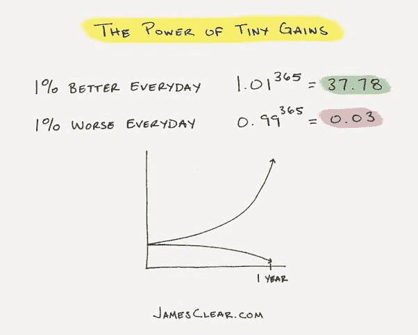

# 为什么动力不能让你去任何地方？—原子习惯。

> 原文：<https://dev.to/bhavaniravi/why-motivation-alone-is-not-getting-you-anywhere-atomic-habits-5d11>

### 为什么动力不能让你去任何地方？—原子习惯。

专注于开始，而不是结束。

#### 动力不够

这听起来像是普遍真理。你现在可能在点头。我们大多数人都有动力去完成某件事，但也是永远拖延事情的大师。理解为什么会这样对我来说是一个巨大的启示。

动力给你成就感。对某件事感到兴奋，就好像你走在正确的轨道上，你实际上在做着人生中伟大的事情。但是，你实际上是在看 GoT。尽管你在结束时感觉很糟糕，但是对你明天将会做一些伟大的事情的预期将会把成就感反馈到你的大脑中。因此，您陷入了永无止境的

> 动机->成就感->拖延症

第二个巨大的启示是，我们经常感到有动力，因为我们对最终结果感到兴奋。我会成为一名伟大的作家，一名出色的艺术家，一名复杂的软件工程师，等等。，但是我们中有多少人对写这本书的第一章，画第一笔，写第一行代码感到兴奋呢？

在收获利益的兴奋中，我们经常忘记看将带我们去那里的路。将动机视为一件事情的开始，这种观念的改变真的很棒。

在《原子习惯》中， [James Clear](https://medium.com/u/528e9a6004d8) 为你提供了一系列实用的技巧，帮助你做出并坚持这些逐渐演变成习惯的微小改变。

> 专注于开始，而不是结束。然后建立系统和习惯——你的过程——可以有机地带你去你想去的地方。

#### 如何克服？

1.  **习惯链**

习惯链是书中分享的一个很棒的技巧，你可以把你想要获得的习惯链在你现有的习惯中间。

例如，如果你想认真从事写作，并且总是梦想成为一名伟大的作家，但是从来没有努力每天写作，那么把它插入到你的日常日程中。

它可能是这样的。我会在早上醒来，喝咖啡，打开笔记本写作 15 分钟，洗个澡等等。你可以在一天的不同时间为多个习惯做这件事，并且随着你对习惯越来越熟悉而改变时间。习惯链是将更好的习惯融入生活的无缝方式。

**2。早期奖励**

动机可能是有益的，谁对自己身材好或成为著名作家感觉不好。但是这些想象最佳结果的奖励不足以让你上瘾。当你迈出第一步时，恐惧占据了你全身，你会想出上百万种方法来解释为什么它行不通。

将动机拆分成有时间限制的任务，并公开宣布。当你完成每一个里程碑时，奖励自己。完成这些小目标中的每一个都会提高你的自信，并直接消灭恐惧因素。

例如，我想学习自然语言处理技术已经很久了。虽然学习一项技术让我兴奋，但我从未真正去做。直到我偶然发现了#100DaysOfMLCode 挑战，你公开承诺每天学习 1 小时的 ML。现在，我必须专注于每天 1 小时内需要做的事情。我了解得越多，对这个话题就越有信心。

#### 3。成为那个人。

这是最简单但是最厉害的一招。它是如此简单，却给你一种完全掌控自己生活的感觉。不要用“我想”这个词，而要用“我不想”。让我给你举几个例子，

> 我想减肥。= >我不吃垃圾食品。
> 
> 我想成为一名作家= >我不会不写作就开始我的一天。

你明白了，对吧？。通过使用“*我不”*这样的话，你在向自己和周围的人保证，你不是那种人。

下一次，当你感到兴奋，但还没有兴奋到可以移动你的屁股去完成事情的时候，记住。你只需要今天进步 1%。

