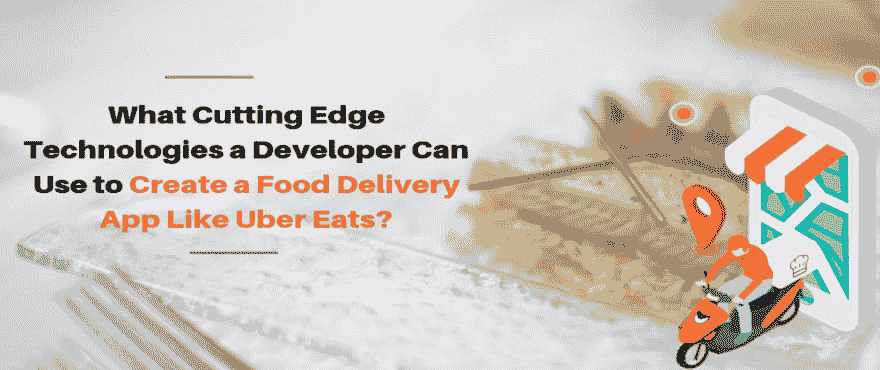

# 开发人员可以使用哪些前沿技术来创建像 UberEats 这样的食品交付应用程序？

> 原文：<https://dev.to/spotneats/what-cutting-edge-technologies-a-developer-can-use-to-create-a-food-delivery-app-like-ubereats-250n>

像 Postmates，GrubHub，Swiggy 这样的在线食品配送公司已经获得了超过 1 亿美元的资金。这些改进意味着什么？按需送餐业务的增长势不可挡。虽然在线送餐业务不确定，但它仍然是许多企业家的选择，主要是因为它的所有权模式较少。

随着发展中国家的快速扩张和食品配送业务的激烈竞争，这一行业需要一些新的东西。很容易，应用程序是唯一可以轻松利用来改变对手的因素。

首先，网上送餐业务有两种模式。

-聚合器模型
-内部交付

**聚合器模型**

这才是真正的少所有权模式。作为一名企业家，你的主要投资是开发客户应用程序、餐厅应用程序、管理应用程序和交付合作伙伴应用程序。主要工作是说服餐馆在你的应用程序中列出。

有车的感兴趣的人可以注册成为你的送货伙伴。一旦顾客从应用程序中点餐，它就被还原到相应的餐厅。一段时间后，将为其分配一个交货合作伙伴。他挑选完成的订单，并将其交付给客户。

在这里，每一笔订单，你都可以得到一定比例的佣金。这就是 Swiggy，UberEats 等的工作模式。

**内部交付模式**

这种模式适合那些自己开餐馆的人。应该会有一个以您的餐厅命名的客户应用程序。与聚合器模型相反，这里使用的是交付车队。食品订购和交付流程类似于聚合器模型。这种模式的主要优点是，你不需要向任何人支付任何佣金。

不用说，在这两种模式中，有许多共同的特征。

开发者在应用程序的哪些方面与竞争对手有所不同

**GPS 追踪**

GPS 是点播应用的重要组成部分。在这里，实时信息必须发送给客户应用程序、司机应用程序和管理员。以下是一些可用于 GPS 追踪的技术。

**查找客户的位置**

-核心位置框架(iOS 版)
-Google Places API(Android 版)

**向发货代理人提供路线**

-地图工具包(iOS 版)
-谷歌地图应用编程接口(Android 版)

**UI/UX 设计**

Adobe XD、Axure RP、Sketch 等是 UI/UX 设计的一些顶级工具。这些工具同时兼容 iOS 和 Android。用户体验和应用程序设计是影响用户的重要因素之一，有助于留住客户和扩大客户群。因此，作为一名开发人员，通过 UI/UX 改进业务的空间很大。

尝试将分析与 UX 整合。分析数据可用于衡量用户的行为。如今，测量手势的使用非常重要，因为许多智能手机都取消了 home 键。成年人、青少年和儿童的手势是不同的。因此，通过测量手势 UX 来优化应用程序。

尽可能使导航栏无缝。有时导航栏可能没有响应，这可能会严重影响用户群。

做 A/B 留存测试，找到用户在你 app 中留存的原因。这有助于您优化应用程序。

**综合支付网关**

支付网关系统是用户希望它安全可靠的地方。市场上有许多安全支付集成，但只有少数是可靠和可信的。

-PayPal Payments Pro
-brain tree
-Stripe
-s krill
-Square 的 API

为了扩大客户群，应该提供更多的支付选择，如电子钱包和数字支付。

**搜索和导航**

当你开餐馆时，会有很多菜系，每个菜系都有很多不同的食物。所以，在一个送餐应用程序中，你必须把所有的菜单都放进去。用户应该能够轻松地浏览菜单，订购食物，没有任何麻烦。关于菜单的所有细节应该在数据库中。API 用于在需要时从数据库获取数据。幸运的是，有一些 API 可以帮助你在手机应用中轻松搜索和导航。这些 API 属于食品巨头 GrubHub，好在它是开源的。

-GrubHub API
-Foursquare API

GrubHub API 可以支持其中超过 10，000 家餐厅。

**收视率&评论**

基于需求的商业的成功是因为即时反馈系统的存在。用户可以对服务进行评级和评论，这为服务提供商提供了提高服务质量的空间。新用户也用评论来决定服务的好坏。开发人员应该为每个餐厅和每个送餐员提供评论和评级功能。对于餐馆和递送代理来说，阈值是固定的。如果他们的评级低于阈值，他们的服务将被暂停。UberEats 和 Zomato 都遵循这样的制度。

**结束**

以上是开发人员可以用来为类似 GrubHub 和 Postmates 这样的巨头开发在线食品交付应用程序的一些尖端技术。

此外，如果你是食品配送行业的入门级企业家，那么最好加载具有上述所有功能的应用程序。这样做肯定会让你在对手中名列前茅。