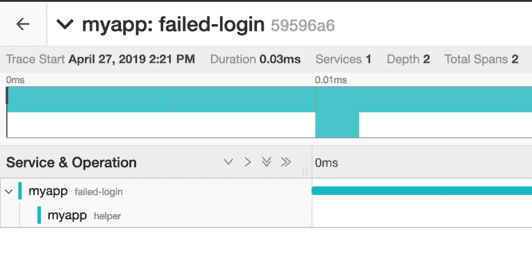

# OpenCensus 入门

> 原文：<https://dev.to/zerok/getting-started-with-opencensus-3b59>

*这篇文章最初发表在[我的博客](https://zerokspot.com/weblog/2019/04/27/opencensus/)上。*

当您想要创建一个支持使用跟踪进行自省
的服务并公开指标时，您通常必须手动
集成 API:

*   [为耶格开启追踪](https://opentracing.io)
*   普罗米修斯客户端库向普罗米修斯公开指标

这只是两个例子，但是因为它们反映了我当前首选的关于跟踪和度量的
工具，我将在这里列出它们。如果你想让
从一个供应商转换到另一个供应商，你通常最终不得不
更换这些集成的大部分。

这正是谷歌的 [OpenCensus](https://opencensus.io)
如此有趣的原因:它充当了一个抽象层，你可以在其中
定义你的指标和跟踪，然后在其他地方插入实际的导出
格式。例如，如果你想从
Prometheus + Jaeger 切换到 Stackdriver，你只需要替换
exporter 实现，其他的都可以像以前做的一样
。

## 跟踪指标

那么，如何将指标和追踪与 OpenCensus 集成呢？假设
您想要跟踪页面上失败登录的次数。您
首先必须在某处定义度量(我倾向于将它们添加到一个
`metrics.go`文件中):

```
package server

import (
    "go.opencensus.io/stats"
    "go.opencensus.io/stats/view"
    "go.opencensus.io/tag"
)

var (
    loginFailedTotal     = stats.Int64("login_failed_total", "Total number of failed logins", "1")
    loginFailedTotalView = &view.View{
        Name:        "login_failed_total",
        Measure:     loginFailedTotal,
        Aggregation: view.Count(),
        TagKeys:     []tag.Key{},
    }
)

func init() {
    view.Register(loginFailedTotalView)
} 
```

如果登录失败，您可以使用`stats.Record`
功能记录一个新值:

```
package server

import (
    "go.opencensus.io/stats"
)

func loginHandler(...) {
    // ...

    stats.Record(r.Context(), loginFailedTotal.M(1))

    // ...
} 
```

这看起来和你在《普罗米修斯》中要做的事情非常相似。剩下的是向外界公开度量的代码。

```
package main

import (
    "contrib.go.opencensus.io/exporter/prometheus"
    "go.opencensus.io/stats/view"
)

func main() {
    // ...

    promex, _ := prometheus.NewExporter(prometheus.Options{Namespace: "myapp"})
    view.RegisterExporter(promex)

    mux.Handle("/metrics", promex)

    // ...
} 
```

然后通过`/metrics`公开的指标也包含一个
`myapp_login_failed_total`条目:

```
# HELP myapp_login_failed_total Total number of failed logins
# TYPE myapp_login_failed_total counter
myapp_login_failed_total 1 
```

如果您现在必须支持另一个指标收集器，您只需
用`view`包注册另一个导出器，然后
(取决于导出器)启动它。集成的其余部分(
指标、视图、电话录音)可以保持不变。

## 痕迹

就痕迹而言，故事看起来颇为相似。您有一个地方可以让您
进行实际的跟踪并配置一个导出器，该导出器负责
将您的跟踪提交到您想要使用的任何后端。

```
import (
    "net/http"

    "contrib.go.opencensus.io/exporter/jaeger"
    "go.opencensus.io/trace"
)

func main() {
    // ...

    trace.ApplyConfig(trace.Config{
        DefaultSampler: trace.AlwaysSample(),
    })
    agentEndpointURI := "localhost:6831"
    collectorEndpointURI := "http://localhost:14268/api/traces"
    jex, _ := jaeger.NewExporter(jaeger.Options{
        AgentEndpoint:     agentEndpointURI,
        CollectorEndpoint: collectorEndpointURI,
        ServiceName:       "myapp",
    })
    trace.RegisterExporter(jex)

    // ...
}

func loginHandler(w http.ResponseWriter, r *http.Request) {
    ctx := r.Context()
    ctx, span := trace.StartSpan(ctx, "failed-login")
    span.AddAttributes(trace.StringAttribute("user", "some-user"))
    defer span.End()

    // ...
} 
```

正如您在上面的例子中看到的，当您开始一个新的“跨度”时，您会收到一个上下文，然后您可以将它传递给“子跨度”。如果
我们为“助手”操作使用另一个跨度，你会在 Jaeger 中得到这样的
渲染:

[](https://res.cloudinary.com/practicaldev/image/fetch/s--ymF3WSKc--/c_limit%2Cf_auto%2Cfl_progressive%2Cq_auto%2Cw_880/https://thepracticaldev.s3.amazonaws.com/i/jqg06q7odymabhkkn3y7.png)

在 OpenTracing/Jaeger 中，你可以使用
`opentracing.StartSpanFromContext`调用来做同样的事情，这比必要的
要冗长得多。总的来说，除了度量标准
和视图之间的区别之外，与我过去工作过的其他 API 相比，这个 API 感觉更简洁，更适合
最佳实践。

## 关闭思绪

出口商可以插入项目的方式也使得
OpenCensus 的核心非常适合集成到项目
模板中。巧合的是，这几乎就是我现在正在做的事情
；-)此外，目前正在进行的工作是[合并
OpenCensus 和
OpenTracing](https://medium.com/opentracing/a-roadmap-to-convergence-b074e5815289)
，这样整个空间在几个
月内会看起来更加有趣。

## 完整的例子

你可以找到一个完整的例子，我在[https://github.com/zerok/opencensus-demo](https://github.com/zerok/opencensus-demo)的这篇文章
中使用了这个例子。