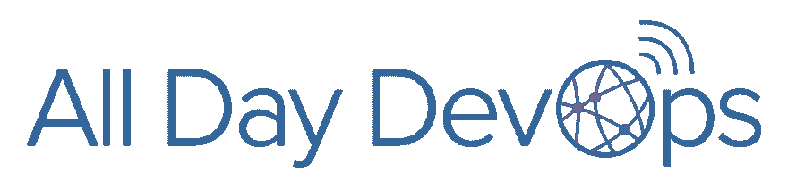
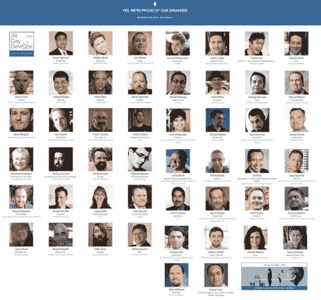
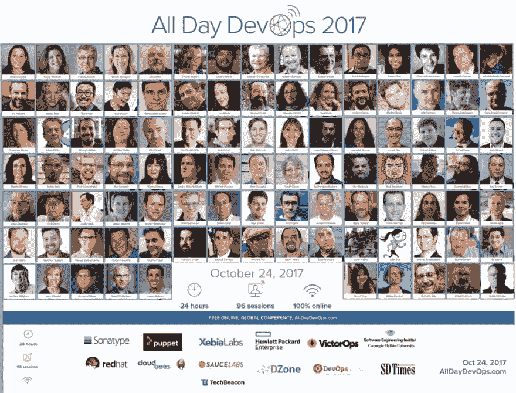
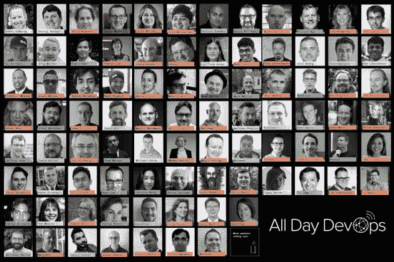
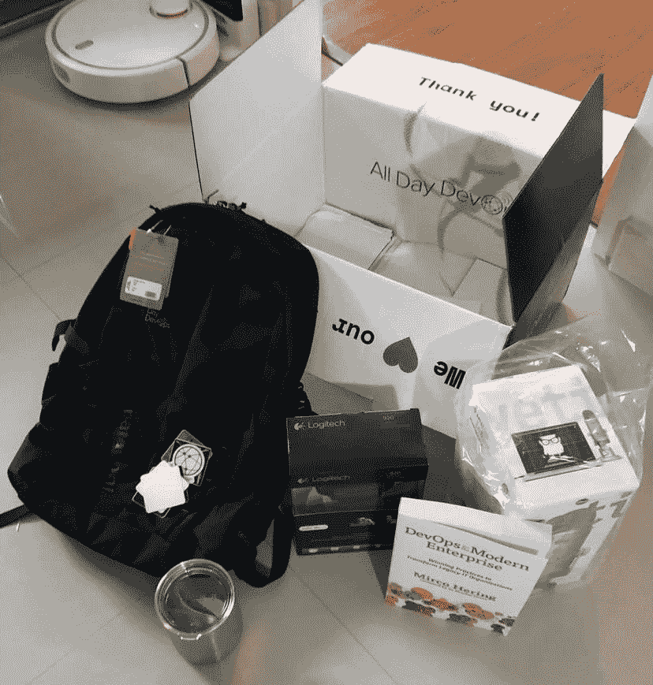

# 向全天开发人员提交您的提案

> 原文：<https://dev.to/madhuakula/submit-your-proposal-to-all-day-devops-4ljc>

<figure> 

<figcaption>[全天 DevOps —全球最大的 DevOps 大会](https://www.alldaydevops.com)</figcaption>

</figure>

### 为什么您应该向全天开发人员提交您的提案

#### 在全球最大的在线社区之一演讲和工作的经历

大家好，

这篇博客文章是关于[全天开发](https://www.alldaydevops.com)的，特别是为什么你应该提交你的建议，以查看展示你的研究的世界级体验。在过去的 3 年里，我作为一名演讲和组织全天 DevOps 活动的老手，增加了我的经验，这种经验还在不断增加:)

首先让我告诉你什么是全天 DevOps

> *全天 DevOps 是一个****免费在线社区，负责创建世界上最大的 DevOps 大会。***

 **✅ 24 小时

✅直播

✅ 125 人演讲

✅五首曲目

✅ 38 个时区

✅全球观影派对

✅免费报名

✅无需出行

#### 全天 DevOps 2016

这一切都是从 2016 年全天 DevOps 开始的，我有机会用 FOSS 展示我的研究[自动化基础设施安全监控，并从社区、组织者及其周围获得了精彩的回应和反馈。它几乎建立了我的信心，让我准备更上一层楼，在 13k+人群面前展示。](https://www.youtube.com/watch?v=3_HIlDm3GtM)

[https://www.youtube.com/embed/3_HIlDm3GtM](https://www.youtube.com/embed/3_HIlDm3GtM)

我仍然记得并收藏了全天 DevOps 2016 的 [CFP 页面。这次会议帮助我结识了一些好朋友，并有机会与出色的组织者](https://www.papercall.io/all-day-devops-2016)[德里克·e·威克斯](https://medium.com/u/4fc4d0e000ae)、[马克·米勒](https://www.linkedin.com/in/seniorstoryteller)和[开发人员](https://medium.com/u/a43db92df755)一起工作。他们在整个会议期间、会后以及现在都在帮助我:)

我真的要感谢并赞扬我的公司 [Appsecco](https://appsecco.com) 和 [Akash Mahajan](https://medium.com/u/750968b743c7) 推动我为社区做贡献并一直帮助我:)

<figure> 

<figcaption>主讲人照片来自全天 DevOps 2016</figcaption>

</figure>

#### 全天 DevOps 2017

今年，我承担了更多的责任，并有幸与社区分享我的研究。在这一年，我有机会主持 DevSecOps 轨道，并发言。一开始有点紧张，但你不相信我做了什么。阅读我写的关于在一天中扮演两个角色的故事

[在全天开发会议上主持和演示](https://blog.appsecco.com/moderating-and-presenting-at-all-day-devops-d80df02a7b30)

[https://medium . com/media/1a 7 F2 C2 a9 d 488 bb 42445 CB 20 ed 82 E3 fa/href](https://medium.com/media/1a7f2c2a9d488bb42445cb20ed82e3fa/href)

<figure> 

<figcaption>主讲人照片来自全天 DevOps 2017</figcaption>

</figure>

#### 全天 DevOps 2018

因为前几年我做得很好。今年，我继续担任 DevSecOps track 的版主，并展示我的研究。

在这一年里，我还和迈克·罗萨多进行了一些闲聊式的预采访，关于我的演讲“使用开源的容器安全监控”以及关于我自己和其他事情。你可以看下面的视频

[全天 DevOps](https://www.facebook.com/AllDayDevOps/videos/all-day-devops-speaker-series-madhu-akula/733940340277601/)

这是 2018 年全天 DevOps 的我的演示文稿

[https://medium . com/media/06564555 a0b 6066 EEC 8 ACB 6 f 81 b 0 ce 1 f/href](https://medium.com/media/06564555a0b6066eec8acb6f81b0ce1f/href)

<figure> 

<figcaption>主讲人照片来自全天 DevOps 2018</figcaption>

</figure>

<figure> 

<figcaption>你将获得的一些很酷的好东西包括，我一直喜欢它们:D</figcaption>

</figure>

#### 全天演讲给你带来的好处

*   获得一个向世界展示你惊人作品的机会
*   从组织者、评审者和参与者那里获得评审、反馈和建议
*   面对来自世界各地各种水平和技能的近 30，000 多名参与者，树立信心迈向下一个级别
*   从提交到 post conference 的伟大演讲经验之一。如果你也是演讲老手，你一定会在这个过程中学到一些东西；)
*   在整个会议期间，您将从组织者那里获得帮助，以建立您的演示文稿、审查、会议准备、预检等
*   迈克·罗萨多关于你的会议和你的爱好等的精彩预览采访
*   与演讲者、主持人和组织者互动
*   在 slack 频道与众多参与者交谈
*   我完全忘了说，你会得到一个超级酷的扬声器，我一直很喜欢它们，:D
*   在社交媒体和其他新闻报道中建立你个人和你组织的公共品牌
*   更多，我认为这个列表继续下去…

> 记住，对你来说普通的东西对别人来说是令人敬畏的

#### 今年怎么样？

第四届全天 DevOps 年会将于 2019 年 11 月 6 日举行。从格林威治时间上午 9:00 开始，持续 24 小时，将有 5 个同步轨道，每个轨道包含一系列连续的 30 分钟的演示，总演示时间超过 50 小时。出席免费。

路线的高级概述包括

有 5 个定义的轨道:

1.  云本地基础架构和监控
2.  DevSecOps 和自动化安全
3.  CI/CD —连续一切
4.  文化转型
5.  SRE —现场可靠性工程

我已经提交了我今年的演讲，同时也主持了 DevSecOps 专题讲座。期待并期待全天 DevOps 2019！T3】

> 激动！！想与 2019 年全天 DevOps 分享你的故事，然后在[https://sessionize.com/2019-all-day-devops](https://sessionize.com/2019-all-day-devops/)提交你的演讲

我想感谢每一个组织者，主持人，演讲者，支持者，赞助商和了不起的参与者，没有他们，我们不可能有这个免费的在线社区。

***感谢阅读文章，如果你喜欢请点击拍手图标与他人分享——在 twitter 上关注我@***[***madhuakula***](https://twitter.com/@madhuakula)

* * ***