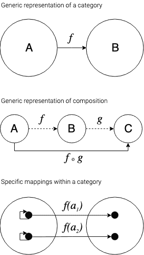

# 简单范畴理论第一部分:基础知识

> 原文：<https://dev.to/chrismcleod/easy-category-theory-part-i-the-basics-nfn>

随着函数式编程重新成为主流，学习范畴理论可能很重要。如果你热衷于发现抽象，CT 有望成为终极抽象。当我学习范畴理论时，我将在这个系列中增加一篇文章，在文章中我将解释我学到的概念，试图进一步加深我自己的理解，并希望帮助你学习这个庞大的主题。

有大量的文章，书籍，论文等学习 CT。我写这些文章的目的并不是提供最好的解释或者使用所有数学符号的详尽解释。我只希望提供*另一个*解释，即*可能*引发我希望你正在进行的更多引导式学习的顿悟。我在这里的解释被调整到我学习的最好方式，隐喻，图片和简单的语言。

我推荐的学习 CT 的策略是，用一本入门书作为要学习的概念和学习顺序的指南。然后参考其他资源(YouTube，像这篇文章这样的文章，等等),一点一点地理解每个概念，直到你的理解令人满意，并足以转移到下一个概念。

> 声明:我不是数学家，也没有学位。我只是刚刚开始学习范畴理论，我说的任何话都应该被独立地验证为正确的。

### 什么是范畴论？

数学中的*理论*是试图找出模式并暗示这些模式的可能性。然后使用数学概念、语言和符号将这些可能性组合成一组定义明确的想法，形成被认为是正确的陈述(公理),并在此基础上形成进一步的公理。

*范畴理论*是一种有点特殊的数学理论，因为公理试图形式化所有数学的结构。这个理论试图解释的模式显然是数学的每一个分支的基础，甚至更多。也就是说，如果你要用那些对象及其规则的最抽象的概念来代替任何数学分支中的概念，那么你就是在处理 ct。

### 什么是范畴？

一个类别有两个部分和两个规则。这两部分分别是*事物*和*指标*。一个*指示器*是某个可以被提供一个*事物*并指示(指出、显示、返回、显示)相同或另一个*事物*的过程。一个类别的两个规则是*指示器*必须是可结合的，并且每个*事物*必须有一个标识*指示器*。

**可组合**是指如果一个指标用*A 类事物*来表示*B 类事物*，另一个指标用*B 类事物*来表示*C 类事物*，那么就有一个指标可以用*A 类事物*来表示*C 类事物*，这个指标就是这两个指标的组合，即如果我们可以从 A- > B- > C

结合性的定义是，由运算符连接的一组量无论如何分组都会给出相同的结果，只要它们的顺序保持不变。在 CT 中，这意味着，只要你不改变箭头指向的地方，你可以在任何点开始跟随箭头。

**身份**意味着如果我有*事物*并给我的*指示器*一个，它将向我指示我给它的确切*事物*。

我有意使用这种不明确的语言。很难将一个类别的抽象本质与一个类别的具体例子区分开来。例如，*指标*通常被认为是函数，就像数学函数 f(x)一样，它接受输入并产生输出。然而，*指标*不一定是变换。同样，作为指示器的唯一规则是结合性和同一性指示器的存在。关系也是*指标*。如果我有一个 5，并且我使用关系≤,那么我有一个*指示器*，它接受“所有数的集合”类型的*事物*，并且指示“小于或等于 5 的数的集合”类型的所有其他*事物*。

#### 简化语言

*   **对象:** *事物*如实数、文字、其他类别甚至*箭头*。几乎任何东西都可以成为物体。
*   **箭头:** *指示器*是用对象来指示其他对象的进程。它们必须是可结合的。

所以用我们的新语言来说，**范畴就是用某一类物体指向其他同类物体的箭头。这些箭头必须是关联的和可组合的**。该类别包含所有此类指示器和对象。

### 概念举例

在编程中，类(或者更准确地说是类型)是类别的一个例子。让我们来填空:

#### 类别的类型

*   **对象:**类型
*   **箭头:**层次结构(继承)
*   **可组合**:可以。如果类型 C 从类型 B 继承，类型 B 从类型 A 继承，那么类型 C 从类型 A 继承。请注意，从层次意义上来说，这些类型定义(分组、求值)的顺序并不重要，即(C < - (B < - A))。然而，它们的组合顺序不同，即 C < - B < - A 与 B < - C < - A 不同
*   **身份:**是的。类型 A 可以从类型 A 继承，在这种情况下，你会有类型 A，虽然因为这是微不足道的，没有我所知道的语言支持它。

#### 比喻范畴

*   **对象:**任何东西
*   **箭头:**心理映射
*   **可组合:**可以。如果我想象一块木头代表一艘船，一艘船代表旅行，我可以想象一块木头代表旅行。
*   **身份:**是的。我总是能想象一块木头代表一块木头。

### 接下来是什么？

下一篇文章将讨论对于大多数意图和目的来说，两个足够接近的类别被认为是相等的意味着什么。

### 资源

我推荐这本书:
[https://www . Amazon . com/gp/product/052171916 x/ref = ppx _ yo _ dt _ b _ search _ asin _ title？ie=UTF8 & psc=1](https://www.amazon.com/gp/product/052171916X/ref=ppx_yo_dt_b_search_asin_title?ie=UTF8&psc=1)

还有巴托兹·米列夫斯基的(免费！)youtube 频道:
[https://www.youtube.com/playlist?list = PLbgaMIhjbmEnaH _ ltk xli 7 fma 2 hsnawm _](https://www.youtube.com/playlist?list=PLbgaMIhjbmEnaH_LTkxLI7FMa2HsnawM_)