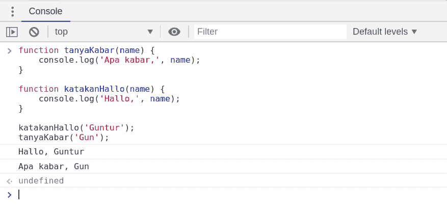
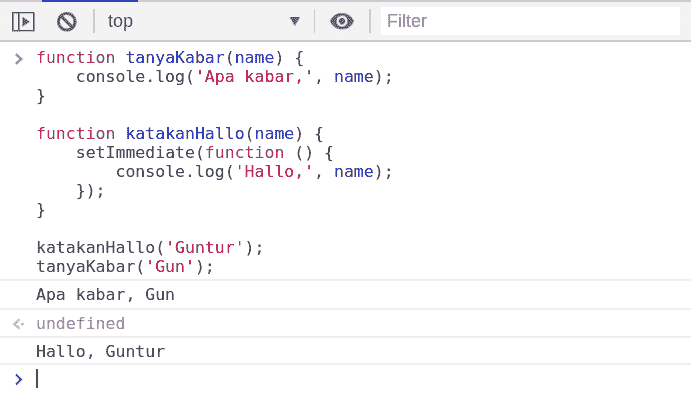

# Memahami 同步和异步 Javascript

> 原文：<https://dev.to/guntur/memahami-synchronous-dan-asynchronous-javascript-4kjj>

Jika anda baru menggeluti bahasa pemrograman javascript, tentunya anda sering menemukan kode yang dieksekusi secara synchronous maupun asynchronous. Oke, kali ini kita sebut saja kedua istilah itu **`sync`** untuk synchronous dan **`async`** untuk asynchronous.

## 流程

Secara default, javascript diproses dalam baris perbaris, artinya setiap baris kode tidak akan dieksekusi sebelum baris kode sebelumnya selesai diproses. Semua proses akan ditampung dan dikenal dengan istilah **`call stack`** .

## 同步

Synchronous ( **`sync`** ), merupakan mode default dalam proses eksekusi perintah kode. Perhatikan baris kode berikut

```
function tanyaKabar(name) {
    console.log('Apa kabar,', name);
}

function katakanHallo(name) {
    console.log('Hallo,', name);
}

katakanHallo('Guntur');
tanyaKabar('Gun'); 
```

Jika kita eksekusi kode diatas, maka pada layar `console` dibrowser anda akan muncul seperti gambar berikut

[](https://res.cloudinary.com/practicaldev/image/fetch/s--xUadmpy8--/c_limit%2Cf_auto%2Cfl_progressive%2Cq_auto%2Cw_880/https://user-images.githubusercontent.com/11140873/56920321-1befbb00-6aed-11e9-8ca0-8aa42bfd4919.png)

Sepertinya semua berjalan dengan baik, tidak ada yang aneh dan baik-baik saja. Hahaa.

## 异步

Jika pada `sync` , kode diproses baris perbaris, maka di `async` kode diproses secara baris perbaris juga. Hah..., maksudnya, lantas perbedaannya apa?

Dalam skenario-nya, sebenarnya kode `async` telah diproses, hanya saja sebatas penjadwalan untuk dieksekusi pada tahapan berikutnya. Artinya, kode yang berperilaku `async` tidak akan langsung dieksekusi, tetapi di `skip` dan akan melakukan eksekusi baris perintah berikutnya.

```
function tanyaKabar(name) {
    console.log('Apa kabar,', name);
}

function katakanHallo(name) {
    setImmediate(function () {
        console.log('Hallo,', name);
    });
}

katakanHallo('Guntur');
tanyaKabar('Gun'); 
```

Mari kita eksekusi kode diatas dan perhatikan hasilnya

[](https://res.cloudinary.com/practicaldev/image/fetch/s--8s2HkTMF--/c_limit%2Cf_auto%2Cfl_progressive%2Cq_auto%2Cw_880/https://user-images.githubusercontent.com/11140873/56920320-1b572480-6aed-11e9-90f5-f9bfd1e501f1.png)

Terlihat perbedaan pada urutan proses eksekusinya. Fungsi `katakanHallo('Guntur')` tidak langsung dieksekusi, sebab penerapannya menggunakan `asynchronous` dalam body fungsi `katakanHallo` .

### Kapan Menggunakan Async?

Pemanfaatan `async` sangat berguna pada saat melakukan operasi-operasi yang tidak harus menunggu proses yang lainnya. Misalnya, memanipulasi `DOM` ketika melakukan proses `ajax` .

Agar bisa memahami, kita perlu mengetahui cara menghandle kode `async` tersebut dengan cara `callback` ataupun `promises` .

## Kesimpulan

Yang perlu digarisbawahi adalah bagaimana cara kita untuk mengurutkan setiap baris-baris perintah agar dapat diproses dan dieksekusi sesuai tujuan.

Setiap kode yang akan dituliskan tidak selalu menggunakan `synchronous` ataupun `asynchronous` , itu selalu bergantung pada kebutuhan sebuah proses program.

## Terkait

*   [Handle Async Dengan Callback](https://dev.to/guntur/handle-async-callback-javascript-2458)
*   [办理异步登安承诺](https://dev.to/guntur/handle-async-promises-javascript-7ck)