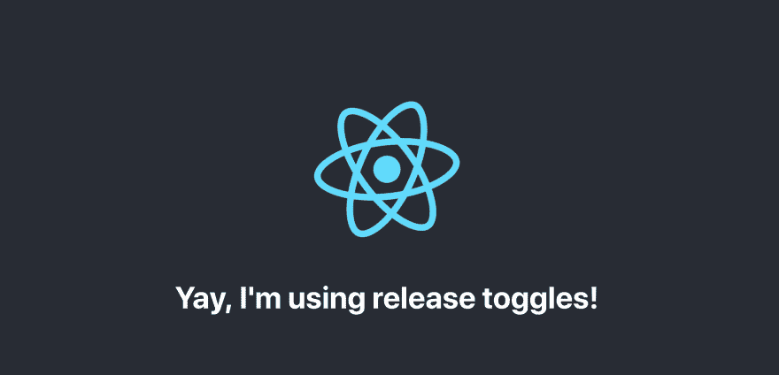

# 使用 Appknobs、React 和 CLI 实现释放切换

> 原文：<https://dev.to/thekarel/implementing-release-toggles-with-appknobs-react-cli-3b06>

<small>首发于[appknobs.io/blog](https://appknobs.io/blog/implementing-release-toggles-with-react-and-cli)T3】</small>

## 让我们添加一个释放开关

当你进行基于主干的开发时，你的主分支中的任何东西——通常是 master——都会被推向生产。同时，您可能希望使用短命的特性分支，一次添加一些小的改进，并经常集成(合并)。为了防止半成品特征出现在生产中，你需要使用*释放开关*。这些开关——也称为发布标志——将允许您部署、演示和端到端测试由选定用户开发的功能，但对其他任何人隐藏它。

这是一个非常简单的概念，但如果你试图从头开始实现它，就会遇到一些困难。因此，我们将使用来自 [Appknobs.io](https://appknobs.io) 的两个开源 NPM 包来超级快速地完成这项工作: [@appknobs/react](https://www.npmjs.com/package/@appknobs/react) 用于 UI， [@appknobs/cli](https://www.npmjs.com/package/@appknobs/cli) 用于命令行。

## 创建新项目(可选)

我们假设你有一个工作的 React 16+应用程序为新的版本切换做好了准备。如果你需要一个快速沙盒，使用
生成一个

```
npx create-react-app my-sandbox 
```

或者

```
yarn create react-app my-sandbox 
```

## 安装依赖项

在你的项目文件夹中，安装`@appknobs/react`、`@appknobs/client`和`@appknobs/cli` :

```
npm install @appknobs/react @appknobs/client && npm install -D @appknobs/cli 
```

或者

```
yarn add @appknobs/react @appknobs/client && yarn add -D @appknobs/cli 
```

## 添加一个释放开关

`@appknobs/react`带有一个名为`Feature`的声明性特性切换组件。在你用`<Feature name='...'><YourSection /></Feature>`封装了应用程序的一部分之后，它就变成了一个托管特性，所以你可以在不修改代码的情况下切换发布。

这取决于你选择你的用户界面的一部分隐藏在一个开关后面。如果你正在使用 Create React 应用程序生成的沙盒，打开`src/App.js`并将其更改为

```
import React, { Component } from 'react';
import {Feature} from '@appknobs/react'
import logo from './logo.svg'
import './App.css';

class App extends Component {
  render() {
    return (
      <div className="App">
        <header className="App-header">
          

          {/* This is our super-simple feature: */}
          <Feature name='sandbox-yay'>
            <h1>Yay, I'm using release toggles!</h1>
          </Feature>

        </header>
      </div>
    );
  }
}

export default App; 
```

这段代码将`<h1>Yay, I'm using release toggles!</h1>`隐藏在释放开关之后。是的，这有点简单，但作为一个例子很好。组件`Feature`可以包装用户界面层次的任何部分，而[支持更复杂场景的渲染道具](https://www.npmjs.com/package/@appknobs/react#function-as-children-aka-render-props)。请注意，一旦功能被管理，默认情况下它是隐藏的。所以你的“耶”还不会出现。

## 特征标志自动发现

使用`@appknobs/cli`-app knobs 的命令行界面-让特性管理服务知道你的发布标志。使用 Yarn，您可以简单地运行`yarn knobs`来调用它，否则，在您的`package.json`中添加一行...

```
 "scripts":  {  "knobs":  "knobs"  } 
```

…然后运行`npm run knobs`。将`@appknobs/cli`作为一个全局包安装或者运行`npx @appknobs/cli`也可以。对于下面的例子，我们假设它是一个全球包。

为了让你的生活更容易，Appknobs 可以查看你的代码库，自动找到并注册所有的特性标志。无需手动复制粘贴。

从项目的顶层调用`knobs parse src/`，该工具将引导您完成整个过程:

```
$ knobs parse src

You need to log in before you can upload feature flags from your project

? Would you like to log in or register now? …
  Log in
❯ Register
  Quit 
```

基本上，你需要选择*注册*，输入你的邮箱和密码，回车:

```
App name: my-sandbox
App ID: DfXPWwujs4YxZc2~Ay8~9
Framework: react

Found the following feature flags:
👉 sandbox-yay

👍 sandbox-yay saved 
```

好了👏

你的释放切换被自动发现并记录在 Appknobs 服务中。

## 获取您的应用 ID

请记下你的应用 ID，因为你很快就会用到它。要在以后找到它，请运行以下命令:

```
$ knobs app-info

✔ App name: my-app-xxx
✔ appID: TfXPWwiysHYxZc2~Ay8~9 
```

## 获取您的 API 密钥

您将需要一个 API 密钥来从您的应用程序访问 Appknobs 服务。

CLI 再次为您服务:

```
$ knobs apikey

✔ Your API key is: 62zYKyPePbmPqxpPoYAcm and is valid until Mon May 13 2019 
```

💡提示:你可以随时去我们在 https://console.appknobs.io/的网络控制台找到这些信息。

## 把你的 app 包在`<Appknobs>`

为了确保每个特性在需要时“翻转”,我们提供了一个**包装器组件**,它使用 React 上下文传播更改。它类似于 Redux 或 React 路由器提供的高级组件。

这也是配置和**注入服务客户端**的地方，服务客户端将在运行时获取应用程序的可用功能切换。你需要之前的`appId`和`apiKey`。

最后，您**发送运行时上下文**——例如用户名、主机名、cookie 值等。-提供服务以决定功能。上下文负载的内容完全由您决定。下面的例子很简单，但是现在有效，并且允许你继续尝试。[在我们之前的博客文章中找到更多关于有效载荷和条件的信息。](https://dev.to/blog/getting-to-know-the-appknobs-console#define-the-conditions)

💡提示:查看 [`@appknobs/react`](https://www.npmjs.com/package/@appknobs/react) 和 [`@appknobs/client`](https://www.npmjs.com/package/@appknobs/client) 文档以了解高级主题，或者在[app knobs/app knobs-examples](https://github.com/appknobs/appknobs-examples)repo 中查看 React/Next.js、React Native 和其他环境的代码示例。

对于 CRA 沙盒的例子，`src/index.js`需要这样修改:

```
import React from 'react';
import ReactDOM from 'react-dom';
import './index.css';
import App from './App';
import * as serviceWorker from './serviceWorker';
import {Appknobs} from '@appknobs/react'
import {newBrowserClient} from '@appknobs/client'

// Create a service client that will work in a browser:
const client = newBrowserClient({appId: 'YOUR_APP_ID', apiKey: 'YOUR_API_KEY'})

// Pass the client and a simple payload to the Apknobs wrapper:
ReactDOM.render(<Appknobs client={client} payload={{user: 'me'}}><App /></Appknobs>, document.getElementById('root'));

serviceWorker.unregister(); 
```

注意:你只需要使用`<Appknobs>`一次，然后添加尽可能多的`Feature`！

## 你的代码已经准备好了

如前所述，释放切换背后的思想是您可以在不改变代码的情况下改变特性的可见性。既然“耶”功能现在已经管理好了，让我们前往位于[https://console.appknobs.io/](https://console.appknobs.io/)的 web 控制台并设置条件。

💡提示:`knobs console`将打开 web UI

有一个[web 控制台](https://dev.to/blog/getting-to-know-the-appknobs-console)的详细指南，如果需要的话你可以参考。步骤非常简单:

*   参观[https://console.appknobs.io/](https://console.appknobs.io/)
*   **使用您的用户名和密码登录**
*   在你的应用程序下——在我们的例子中是“我的沙盒”——点击**编辑特征**
*   在您定义的特征下，点击**编辑条件**

在**条件表**中，我们添加:

*   `user`作为财产
*   `Equal to`作谓语
*   `me`作为论据

—然后保存。

## 搞定

重新加载你的应用程序，享受你的“耶”信息！🥇

[](https://res.cloudinary.com/practicaldev/image/fetch/s--N6UvB9Y2--/c_limit%2Cf_auto%2Cfl_progressive%2Cq_auto%2Cw_880/https://thepracticaldev.s3.amazonaws.com/i/52urbdknj47hc05ol50f.png)

尝试将`src/index.js`中的上下文负载设置为其他值，例如`{user: 'Poirot'}`，看看会发生什么。

✋Note:评估由有效负载缓存 1 分钟，因此在控制台上所做的更改可能需要几秒钟才能在应用程序中看到。

希望这篇指南能让你开始一个更高效的、基于主干的开发之旅。