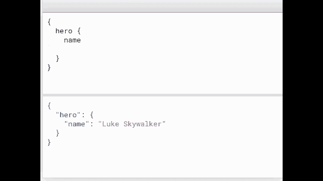
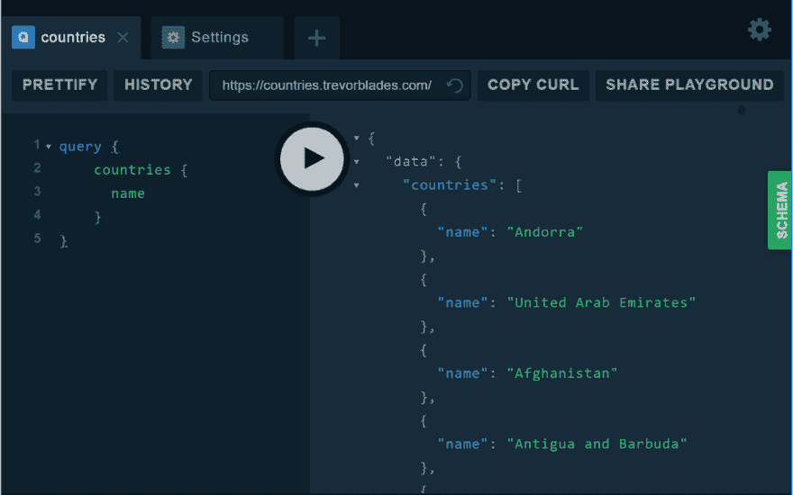

# 有颤动的图

> 原文：<https://dev.to/nitishk72/graphql-with-flutter-3mdm>

GraphQL 是一种查询语言，我们用它向 GraphQL 服务器发送查询。服务器在运行时执行查询，用现有数据完成这些查询。

让我用更简单的话让你明白这一点。我想你知道 SQL(结构化查询语言)。如果我们有一个用户表，其中包含他们的姓名、年龄、电子邮件、电话等信息。现在，您想获取用户的姓名和电子邮件，然后编写一个查询，您将获得该信息。(选择姓名，向用户发送电子邮件)。

你不会得到用户的年龄和电话，因为你没有要求这些信息。这些都是服务器端(后端)的事情。如果你是一个前端开发人员，你已经做了 20 页，你需要用户信息。你会问后端开发人员，我想在不同的页面上的用户信息，所以我需要一个 API。后端开发人员将使 API 会给你一个端点。

>在 6 页上你只需要用户名

>在 10 页上你需要用户名

>在 4 页上你需要用户名邮箱和电话。

因此，后端开发人员可以采用两种方法。

1.  他将使用不同的数据创建 3 个不同的端点。
2.  他可以用所有的信息做一个通用的 API。

这两种方法的问题是什么？

1.  我们有多个端点。如果有一天我们会忘记用户的姓名和年龄，那么我们需要建立另一个端点。
2.  我们没有多个端点**但是**我们正在获取数据，在每一页上我们不希望用户的手机仍然在获取数据。

你可能认为过度抓取没有什么不好，因为额外的数据不会占用我们的带宽。你在这里可能是错误的，因为你是在低尺度上思考。你没见过大型 API。

> 我知道你来这里是为了看这场混乱

但是最后一个关于 GraphQL 的演示,我们将转移到 Flutter 部分

<figure>[](https://res.cloudinary.com/practicaldev/image/fetch/s--lYN38z2O--/c_limit%2Cf_auto%2Cfl_progressive%2Cq_66%2Cw_880/https://cdn-images-1.medium.com/max/640/1%2AOdnn356RBy_nlu27CptELw.gif) 

<figcaption>Demo 来自 GraphQL 官网</figcaption>

</figure>

不同的技术有不同的 GraphQL 实现。首先，我们需要在我们的服务器上实现 GraphQL，然后我们使用 GraphQL Query 从服务器请求数据。所以在一瞬间，我们不需要实现 GraphQL 服务器。我们将使用一个[现成的 GraphQL 服务器](https://countries.trevorblades.com/)，我们将从那里获取数据。

[图形 SQL 游乐场](https://countries.trevorblades.com/)

[https://www.youtube.com/embed/Re7FPa3wzN0](https://www.youtube.com/embed/Re7FPa3wzN0)

让我们来看看 Flutter 编码部分，并了解它到底是如何工作的。

Graphql Flutter is 1.x.x 目前在 **flutter dev 频道有售。**如果你不知道这个开发频道是什么，以及如何连接到开发频道，请不要担心，我会告诉你。

颤振有 4 个通道，其中颤振(测试，开发，主稳定)。默认情况下，我们都在稳定通道上，以便使用 GraphQL (1.x.x)。我们需要换个频道。

**怎么换频道？**

```
$ flutter channel dev 
```

现在你需要检查通道，这将下载一些 Dart never 版本，颤振开发通道依赖于它。你只需要检查频道，文件就会自动下载。

```
$ flutter channel 
```

### 旋舞从这里开始

首先，我们需要为 graph QL([graph QL _ flutter](https://github.com/zino-app/graphql-flutter#readme))
添加依赖关系

```
name: flutter_graphql_demo
description: A new Flutter application.
version: 1.0.0+1

environment:
  sdk: ">=2.1.0  <3.0.0"

dependencies:
  flutter:
    sdk: flutter
  cupertino_icons: ^0.1.2
  graphql_flutter: ^1.0.0+4 
```

现在让我们开始为颤振编写代码。首先，我们创建一个 GraphQL 客户端，该客户端将与 GraphQL 服务器通信，我们只是通知客户端有关 GraphQL 查询的信息。

> 让我们来设置 GraphQL 客户端

```
import 'package:flutter/material.dart';
import 'package:graphql_flutter/graphql_flutter.dart';

void main() {
  runApp(MaterialApp(title: "GQL App",home: MyApp()));
}

class MyApp extends StatelessWidget {
  @override
  Widget build(BuildContext context) {
    final HttpLink httpLink = HttpLink(uri: "https://countries.trevorblades.com/");

    final ValueNotifier<GraphQLClient> client = ValueNotifier<GraphQLClient>(
      GraphQLClient(
        link: httpLink as Link,
        cache: OptimisticCache(
          dataIdFromObject: typenameDataIdFromObject,
        ),
      ),
    );

    return GraphQLProvider(
      child: HomePage(),
      client: client,
    );
  }
} 
```

我将谈到与 GraphQL 相关的每一点。

要使用客户端，首先需要用链接和缓存进行初始化。对于这个例子，我们将使用 HttpLink 作为我们的链接，使用 Optimisticache 作为我们的缓存。

在第 15 行你可以看到链接。Link 用于通过所需的头(如果有)指向 GraphQL 服务器的端点。标头用于对客户端进行身份验证。

每当有任何值改变时，值通知器就通知它们的监听器

我们用 GraphQLProvider 包装应用程序的完整页面。因此，我们可以向 GraphQL 服务器发出请求，而无需指定端点和头。这意味着从我们的页面内部，我们只需要告诉查询和 GraphQL 提供者将为我们做所有的任务。这就是它被称为客户端库的原因。

这里，我们将 GraphQL 客户端分离到一个不同的无状态客户端中，我们没有在这里编写任何 UI 代码，因为我想将它们分开(GraphQL 客户端和 Flutter UI)。

这是我们将发送以获取 GraphQL 服务器并显示国家列表的查询。您可以尝试将这个查询复制并粘贴到这个 [GraphQL 服务器](https://countries.trevorblades.com/)上。

```
query {
 countries {
 name
 }
} 
```

> 让我们消费图表客户端的响应

现在我们要为我们的应用程序制作 UI

```
class HomePage extends StatelessWidget {
  String query = r"""
                      query GetCountries{
                          countries {
                            name
                          }
                      }
                  """;

  @override
  Widget build(BuildContext context) {
    return Scaffold(
      appBar: AppBar(
        title: Text("GraphlQL Client"),
      ),
      body: Query(
        options: QueryOptions(document: query),
        builder: (
          QueryResult result, {VoidCallback refetch}) {
          if (result.loading) {
            return Center(child: CircularProgressIndicator());
          }
          if (result.data == null) {
            return Center(child : Text("No Data Found !"));
          }
          return ListView.builder(
            itemBuilder: (BuildContext context, int index) {
              return ListTile(
                title: Text(result.data['countries'][index]['name'])
              );
            },
            itemCount: result.data['countries'].length,
          );
        },
      ),
    );
  }
} 
```

这是我们 UI 的代码，让我们来理解这段代码中的 GraphQL 部分。

我们使用插件定义的 **Query()** 小部件。它不是本机小部件。**查询**在这里有两个字段

1.  选项:选项要求查询。我们要向服务器发送什么样的查询，如果你想将一些变量和查询一起发送，那么我们必须从选项中传递。
2.  建筑商:建筑商和其他建筑商一样，在一片混乱中。构建器根据数据更改其状态。(你可以把这个 builder 比作 FutureBuilder。

首先，它将向服务器发送查询，并进入加载状态。你可以看到加载时我们正在显示循环进度栏()。一旦查询的执行和加载状态发生变化，它将进入完成状态。

在完成状态下，它要么有错误，要么有数据。如果没有数据，我们将显示一条消息,**未找到数据！。**

result.data =您在 GraphQL 操场上看到的数据。

[](https://res.cloudinary.com/practicaldev/image/fetch/s--9QvnuRqf--/c_limit%2Cf_auto%2Cfl_progressive%2Cq_auto%2Cw_880/https://cdn-images-1.medium.com/max/1024/1%2A9z9_TcJwFPraSKpIpmzrdQ.png)

如果我们得到了数据，那么我们就给出了答案。响应和 JSON 响应一样，你只需要把国家从响应中取出来，并显示在你的 UI 中。我想你知道这件事。

[nitishk 72/flutter _ graph QL _ demo](https://github.com/nitishk72/flutter_graphql_demo)

感谢阅读，如果你喜欢，请鼓掌。如果你有什么要说的，那就发表评论吧，不要太陌生。

[尼提什·库马尔·singh🇮🇳(@尼提什克 72_) |推特](https://twitter.com/nitishk72_)

* * *