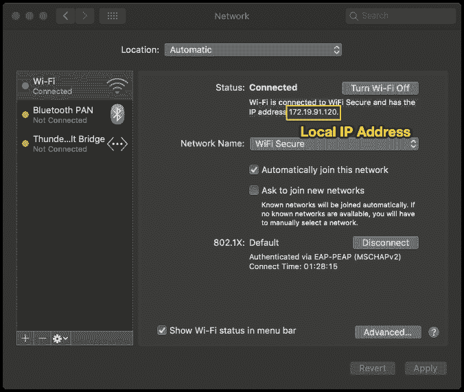
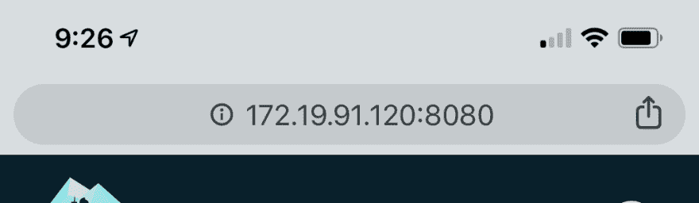

# 提示:如何在手机上查看本地主机网络应用

> 原文：<https://dev.to/prowe214/tip-how-to-view-localhost-web-apps-on-your-phone-4a4k>

### 开发人员提示:如何在手机上查看本地主机 web 应用程序

我总是在构建需要针对移动优化的 web 应用程序产品。在部署之前在手机上查看我的项目是必须的。

我经常使用 Chrome Devtools 中的移动设备模拟器来进行一些小的风格调整，但是没有什么比移动设备本身更能完美地模拟实际的移动浏览器了。这有助于我在特定于移动设备的错误成为用户的问题之前抓住它们。

这里有一个我用来让移动设备上的测试变得极其简单的方法。这些说明适用于 Mac 环境。

### 通过本地 IP 通过您的 wifi 提供服务

这听起来很复杂，但实际上很简单。

> 重要事项:确保您的开发计算机和移动设备连接到同一个 wifi 网络。

#### 第一步:送达本地主机

在您的开发机器上，以您通常通过本地主机地址服务应用程序的任何方式来服务您的应用程序。

请务必记下它所服务的端口号。在下图中，我们注意到 8080。

一旦您能够通过 localhost 在您的计算机上本地查看您的应用程序，您就可以转到步骤 2。

#### 第二步:找到你的本地 IP 地址

打开**系统偏好** > **网络**。如果尚未选择，请在左侧窗格中选择“Wifi”。

在“状态:已连接”下，您应该会看到“Wi-Fi 已连接并且具有 IP 地址< **本地 IP 地址** >”

记下 IP 地址！

> 注:当您的设备或其他设备连接到网络或从网络断开时，您的本地 IP 地址通常会自动更改。所以你不能把这个地址加入书签。相反，你每次都必须找到你的地址——对我来说，这通常只是我每天早上开始的时候，它会持续一整天。

#### 第三步:在手机上查看

在移动设备的浏览器上(任何浏览器都可以)，导航到 http://:。

例如，如果我在 localhost:8080 上服务，我的本地 IP 地址是 123.45.67.890，在我的移动设备的浏览器上，我将导航到[http://123 . 45 . 67 . 890:8080](http://123.45.67.890:8080.)。http://很重要，不要关闭它。

### 成功！

您现在应该可以在移动设备上查看您的应用程序了。将它设置在主监视器旁边，因为每当本地主机重新加载时，它都会重新加载，所以它将与本地提供的桌面 web 应用程序完全同步。

在这种体验中，您不会得到任何前端开发工具，但是如果在本机浏览器的体验中，事情看起来或行为有所不同，您会得到一个早期警告。