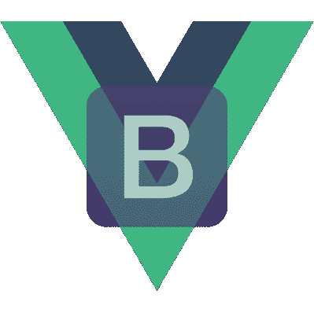
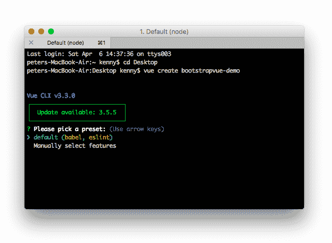
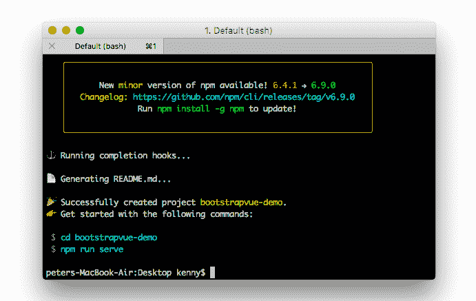
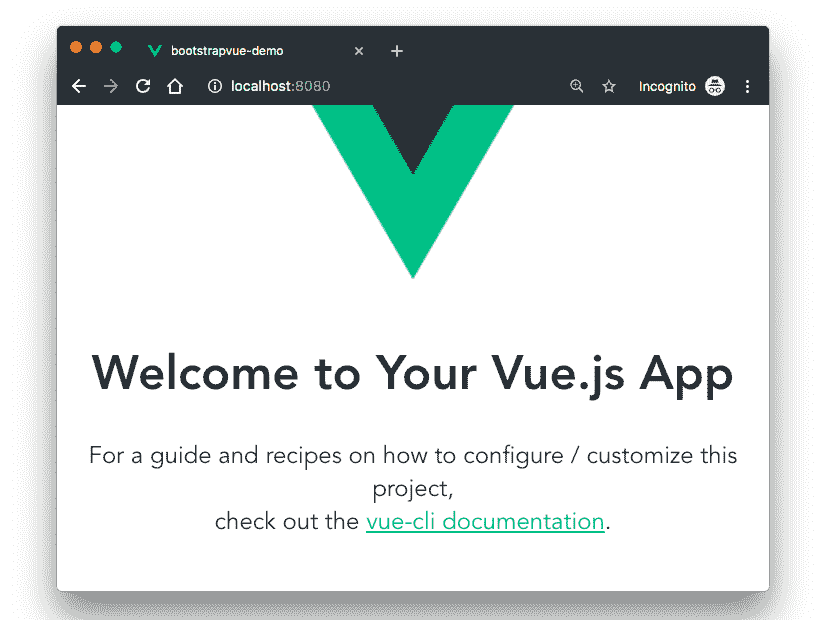

# BootstrapVue 入门

> 原文：<https://dev.to/bnevilleoneill/getting-started-with-bootstrapvue-5364>

[](https://res.cloudinary.com/practicaldev/image/fetch/s--ZKO0D-4V--/c_limit%2Cf_auto%2Cfl_progressive%2Cq_auto%2Cw_880/https://cdn-images-1.medium.com/max/399/1%2A8KjJ5dPjn3Y53IIHAtDMvQ.png)

[Vue.js](https://vuejs.org/) 是一个流行的 JavaScript 库，用于在短时间内开发原型。这包括用户界面、前端应用、静态网页和原生移动应用。它以易于使用的语法和简单的数据绑定特性而闻名。

最近，在 Vue.js 生态系统中发布了一个新的包。它是流行的 [Bootstrap 框架](https://getbootstrap.com/docs/4.3/getting-started/introduction/)和 Vue.js 的集成，这个包被称为 [BootstrapVue](https://bootstrap-vue.js.org/) 。它允许我们动态地使用与 Bootstrap (v4)集成的定制组件。

还有呢？它支持定制的引导组件、网格系统，还支持 Vue.js 指令。

在本帖中，我们将介绍 BootstrapVue 的基础知识，解释一般概念，演示设置过程，并在此过程中构建一个 mini Vue.js 项目，为您提供更多实践经验。

[](https://logrocket.com/signup/)

### 为什么是 BootstrapVue？

鉴于 Bootstrap 是可用的最流行的 CSS 框架(在我看来)，大多数已经或打算从 Vanilla JavaScript 这样的框架迁移到 Vue.js 的开发人员总是发现迁移有点困难，因为 [Bootstrap 严重依赖 jQuery](https://getbootstrap.com/docs/4.0/getting-started/introduction/#quick-start) 。

有了 BootstrapVue，任何开发人员都可以从 Vanilla.js 或 jQuery 切换到 Vue.js，而不必担心 Bootstrap 对 jQuery 的严重依赖，甚至也不用想办法绕过它。这就是 BootstrapVue 的救援方式。它有助于弥合这一差距，并允许新的 Vue 开发人员在他们的项目中轻松使用 Bootstrap。

### 入门

当使用像 webpack、babel 等模块打包器时，最好将包直接包含到项目中。出于演示的目的，并给你一个理解和使用 BootstrapVue 的实践方法，我们将使用 BootstrapVue 建立一个 Vue.js 项目，并将其构建成一个从外部 API 获取膳食的功能性 Vue.js 应用程序。

**先决条件**

*   Vue.js 的基础知识将有助于理解这个演示
*   在您的笔记本电脑上全球安装 Vue CLI 工具，跟进这篇文章。如果您目前没有安装，请遵循此安装指南[中的](https://cli.vuejs.org/guide/installation.html)

### 创建 Vue 项目

首先，我们必须创建一个 Vue.js 项目，我们可以用它来演示 BootstrapVue 组件的实现。首先，在您的首选目录下打开一个终端窗口，并运行下面的命令:

```
vue create bootstrapvue-demo 
```

*如果您没有在全球范围内安装 Vue CLI，请按照本指南***进行安装，然后回来继续本教程。**

 *上面的命令会抛出一个预设的选择对话框，如下所示:

[](https://res.cloudinary.com/practicaldev/image/fetch/s--_hTV6J0f--/c_limit%2Cf_auto%2Cfl_progressive%2Cq_auto%2Cw_880/https://cdn-images-1.medium.com/max/677/1%2AA07_ubMSsuxXnP8haphQ8g.png)

选择默认预设，点击**进入**继续:

[](https://res.cloudinary.com/practicaldev/image/fetch/s--sRXEj8kn--/c_limit%2Cf_auto%2Cfl_progressive%2Cq_auto%2Cw_880/https://cdn-images-1.medium.com/max/691/1%2A8YE-aNSA69w9R8rYt5-CkA.png)

现在，您已经完成了 Vue 应用程序的引导，进入新的 Vue 项目目录，使用下面的命令启动开发服务器:

```
cd bootstrapvue-demo 
```

```
npm run serve 
```

这将在 localhost:8080 上为您的 Vue 应用程序提供服务。在您的浏览器上导航到它，您将看到您的 Vue 应用程序正在运行:

[](https://res.cloudinary.com/practicaldev/image/fetch/s--ysOQs52D--/c_limit%2Cf_auto%2Cfl_progressive%2Cq_auto%2Cw_880/https://cdn-images-1.medium.com/max/824/1%2Ajvgt4Gv3nCNbUIek6yCBUg.png)

### 如何在项目中添加 Bootstrap 和 BootstrapVue

有两种主要的方法可以做到这一点，使用像 npm 和 yarn 这样的包管理器或者使用 CDN 链接。

**使用 npm 或纱线**

我们将使用 npm 或 yarn 安装前面提到的项目所需的所有软件包。为此，导航到项目的根目录并运行下面的命令，这取决于您首选的包管理器:

```
# With npm 
```

```
npm install bootstrap-vue bootstrap axios 
```

```
OR 
```

```
# With yarn 
```

```
yarn add bootstrap-vue bootstrap axios 
```

上面的命令将安装 BootstrapVue 和 Bootstrap 包 ***。***BoostrapVue 包包含所有的 BootstrapVue 组件，常规引导包含 CSS 文件。我们还安装了 [Axios](https://www.axios.com/) 来帮助我们的应用从 [themealdb API](https://www.themealdb.com/api/json/v1/1/categories.php) 获取食物。

#### **使用 CDN**

我们已经看到了包管理器将 BootstrapVue 安装到我们的 Vue 项目中的方法，现在让我们来看看一种可能需要较少努力的不同方法。要通过 CDN 将 Bootstrap 和 BootstrapVue 添加到您的 Vue 项目中，请打开项目公共文件夹中的 index.html 文件，并将此代码添加到适当的位置:

```
<!-- public/index.html-->

<!-- Add Bootstrap and Bootstrap-Vue CSS to the <head> section -->
<link type="text/css" rel="stylesheet" href="https://unpkg.com/bootstrap/dist/css/bootstrap.min.css"/>
<link type="text/css" rel="stylesheet" href="https://unpkg.com/bootstrap-vue@latest/dist/bootstrap-vue.min.css"/>

<!-- Add Vue and BootstrapVue scripts just before the closing </body> tag -->
<script src="https://unpkg.com/vue/dist/vue.min.js"></script>
<script src="https://unpkg.com/bootstrap-vue@latest/dist/bootstrap-vue.min.js"></script> 
```

这将把每个库的最小化和最新版本引入到我们的项目中，非常简单！然而，为了这个项目的目的，我们将坚持使用包管理器的第一个选项。因此，让我们继续设置 BootstrapVue 包。

### 设置 BootstrapVue

接下来，让我们设置刚刚安装的 BootstrapVue 包。转到 main.js 文件，将这一行代码添加到顶部:

```
//src/main.js 
```

```
import BootstrapVue from 'bootstrap-vue' 
```

```
Vue.use(BootstrapVue) 
```

我们在这里所做的非常简单，我们导入 BoostrapVue 包，然后使用 Vue.use()函数在应用程序中注册它，以便我们的 Vue 应用程序可以识别它。

为了一切正常，我们还需要将引导 CSS 文件导入到我们的项目中。将这段代码添加到 main.js 文件:

```
//src/main.js 
```

```
import 'bootstrap/dist/css/bootstrap.css' 
```

```
import 'bootstrap-vue/dist/bootstrap-vue.css' 
```

将必要的模块导入 Vue 应用程序后，main.js 文件应该类似于下面的代码片段:

```
//src/main.js
import Vue from 'vue'
import App from './App.vue'
import BootstrapVue from 'bootstrap-vue'
import 'bootstrap/dist/css/bootstrap.css'
import 'bootstrap-vue/dist/bootstrap-vue.css'

Vue.use(BootstrapVue)
Vue.config.productionTip = false

new Vue({
  render: h => h(App),
}).$mount('#app') 
```

### **创建引导组件**

我们现在处于可以开始探索 BoostrapVue 组件的阶段。让我们从创建第一个组件开始。我们将创建的第一个组件是 Navbar 组件。转到组件目录，创建一个名为 Navbar.vue 的文件，并用下面的代码更新它:

```
//src/components/Navbar.vue
<template>
    <div>
      <b-navbar toggleable="lg" type="dark" variant="success">
        <b-container>
            <b-navbar-brand href="#">Mealzers</b-navbar-brand>
            <b-navbar-toggle target="nav-collapse"></b-navbar-toggle>
            <b-collapse id="nav-collapse" is-nav>
              <!-- Right aligned nav items -->
              <b-navbar-nav class="ml-auto">
                <b-nav-form>
                  <b-form-input 
                    size="sm" 
                    class="mr-sm-2" 
                    placeholder="Search for a meal"
                    v-model="meal"
                    ></b-form-input>
                  <b-button 
                    size="sm" 
                    class="my-2 my-sm-0" 
                    type="submit" 
                    @click.prevent="getMeal"
                    >Search</b-button>
                </b-nav-form>
                <b-nav-item-dropdown right>
                  <!-- Using 'button-content' slot -->
                  <template slot="button-content"><em>User</em></template>
                  <b-dropdown-item href="#">Profile</b-dropdown-item>
                  <b-dropdown-item href="#">Sign Out</b-dropdown-item>
                </b-nav-item-dropdown>
              </b-navbar-nav>
            </b-collapse>
          </b-container>
      </b-navbar>
    </div>  
</template>
<script>
export default {
    data() {
        return {
            meal: ''
        }
    },
  methods: {
    getMeal() {
      ...
    }
  }
}    
</script> 
```

Navbar 组件包含几个 BootstrapVue 组件，其中一个是 b-navbar 组件。该组件是导航栏中所有其他组件的母组件。如果没有这个组件，Navbar 中的所有其他组件都将无法正常呈现。

导航条上的文本颜色可以用文字属性来改变。导航条的背景颜色也可以随着不同的道具而改变。这些颜色可以是任何正常的引导默认颜色—信息、主要、成功等。

另一个组件是 b-navbar-brand 组件。这里是可以渲染网站 logo 的地方。它还接受 variant 和 type 属性，分别用于改变背景颜色和文本颜色。

其他 BootstrapVue 组件包括:

*   b-nav-表单
*   b-导航-项目-下拉列表
*   b-下拉项目
*   b-navbar 切换
*   b 塌缩
*   b-nav-item(可通过“禁用”属性禁用)
*   b-navbar-nav
*   导航项目。
*   [还有这么多](https://bootstrap-vue.js.org/docs/components/)

BootstrapVue 组件的一个优点是它们在默认情况下是有响应的。因此，您不需要编写任何额外的代码或使用外部库来使它们响应。

我想让我们看的另一个组件是卡组件。card 组件允许我们在卡片中显示图像、文本等等。写的是 b 卡。为了演示它，让我们在组件目录中创建一个 Cards.vue 文件。然后用下面的代码更新它:*