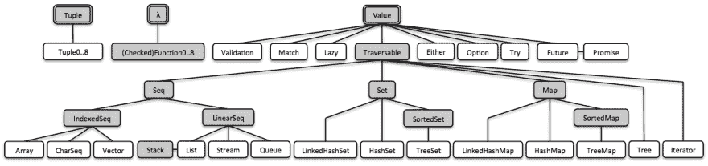

# Vavr 的要么教程

> 原文：<https://dev.to/nbentoneves/vavr-s-either-tutorial-25bd>

## Vavr 是什么？

它是 Java 8+的一个开源库，提供了 Java 中明显缺少的数据类型持久性和功能控制结构。本教程将向您展示 Vavr 中可用的数据类型之一(值->任一)。你应该去 [Vavr 文档](https://www.vavr.io/vavr-docs/#_introduction)看看其他功能和例子。

<figure>

[](https://res.cloudinary.com/practicaldev/image/fetch/s--6MTl0pU5--/c_limit%2Cf_auto%2Cfl_progressive%2Cq_auto%2Cw_880/https://www.vavr.io/vavr-doimg/vavr-overview.png)

<figcaption>**Figure 1:** Vavr three basic blocks (Vavr 2019)</figcaption>

</figure>

## 什么是函数式编程？

函数式编程是一种编程范式，它将计算视为数学函数的求值，并避免统计数据或可变数据。自 2014 年以来，这种范式在 Java 8 中引入了 lambda 表达式。

这种编程有许多概念你应该去探索和阅读，比如一级和高阶函数、纯函数、递归、严格与非严格求值、类型系统、引用透明性、数据结构。

## 如何在我的项目中使用 Vavr？

你可以通过 maven、gradle 或单机在你的项目中使用 [Vavr](https://www.vavr.io/) 。你的目标至少是 Java 1.8。[更多信息](http://www.vavr.io/vavr-docs/#_getting_started)。

## 要么

两者都是表示两种可能类型的控制结构。默认情况下，左边代表错误，右边对应成功，但是您可以改变这种行为。

这个结构有一些功能操作，如 map、flatMap、filter、fold 等。我将向您展示其中一个简单的用例(请注意，这只是为了展示其中一个的功能)，但是您也应该能够在其他复杂的上下文中使用它。

**用例:**除两个数。考虑到用户可以插入分母零，您应该返回以下消息:“不能将一个数除以零！”。如果因为其他原因除法失败，你应该返回“问题时，试图分割的数字！原因:X”，X 是失败的原因。

使用纯 java 实现用例:

```
public static Map<String, Object> divideNumber(int num1, int num2) {
    Map<String, Object> result = new HashMap<>();

    try {
        result.put("SUCCESS", num1 / num2);
    } catch (ArithmeticException ex) {
        result.put("FAIL", "Can't divide a number per zero!");
    } catch (Exception ex) {
        result.put("FAIL", "Problem when trying to divide the numbers! Reason: " + ex.getMessage());
    }

    return result;
} 
```

使用任一控制结构的解决方案:

```
public static Either<String, Integer> divideNumber(int num1, int num2) {
    try {
        return Either.right(num1 / num2);
    } catch (ArithmeticException ex) {
        return Either.left("Can't divide a number per zero!");
    } catch (Exception ex) {
        return Either.left("Problem when try to divide the numbers! Reason: " + ex.getMessage());
    }
} 
```

使用任一种的代码看起来更直观，并且您不需要添加成功/失败逻辑，因为您可以使用右侧/左侧。我创建了一些单元测试来展示可以调用的操作，并与纯 java 进行比较(使用 map 结构)。

```
@Test
void testShouldDivideNumberPerZero() {

    Either<String, Integer> eitherResult = EitherDivisionUseCase.divideNumber(10, 0);

    //You can use isRight or isLeft to check if the value is available
    assertFalse(eitherResult.isRight());
    assertTrue(eitherResult.isLeft());

    //The left side contains the error message (using default behaviour)
    assertEquals(eitherResult.getLeft(), "Can't divide a number per zero!");

    //If you call the get() method when there is no value you will receive a NoSuchElementException exception
    assertThrows(NoSuchElementException.class, eitherResult::get);

    //Comparing to pure java using map
    Map<String, Object> javaResult = JavaDivisionUseCase.divideNumber(10, 0);
    assertNull(javaResult.get("SUCCESS"));
    assertNotNull(javaResult.get("FAIL"));
    assertEquals(javaResult.get("FAIL"), "Can't divide a number per zero!");

} 
```

如您所见，您只需要使用 *isRight* 或 *isLeft* 来检查任一结构中是否有值，而不需要尝试从映射中获取有效的键。

```
@Test
void testShouldDivideNumberExceptPerZeroUsingFunctionalOperations() {

    Either<String, Integer> eitherResult = EitherDivisionUseCase.divideNumber(10, 2);

    //You can call functional operations such as map, flatmap, filter, etc
    assertFalse(eitherResult
            .map(integer -> integer)
            .collect(Collectors.toList())
            .isEmpty());

    //Comparing to pure java using map
    Map<String, Object> javaResult = JavaDivisionUseCase.divideNumber(10, 2);
    assertFalse(javaResult.entrySet()
            .stream()
            .noneMatch(entry -> "SUCCESS".equals(entry.getKey())));
} 
```

使用纯 java，如果你想操作映射、过滤等功能，你需要使用 Java 的*流*。在你不需要它的情况下，这个库只需要接收一个*函数。*它将评估右侧，如果右侧存在，它将从*函数*调用 apply()方法。你可以在下面的#map 中看到*的代码:* 

```
/**
 * Maps the value of this Either if it is a Right, performs no operation if this is a Left.
 *
 * <pre><code>
 * import static io.vavr.API.*;
 *
 * class Example {{
 *
 *     // = Right("A")
 *     Right("a").map(String::toUpperCase);
 *
 *     // = Left(1)
 *     Left(1).map(String::toUpperCase);
 *
 * }}
 * </code></pre>
 *
 * @param mapper A mapper
 * @param <U>    Component type of the mapped right value
 * @return a mapped {@code Monad}
 * @throws NullPointerException if {@code mapper} is null
 */
@SuppressWarnings("unchecked")
@Override
default <U> Either<L, U> map(Function<? super R, ? extends U> mapper) {
    Objects.requireNonNull(mapper, "mapper is null");
    if (isRight()) {
        return Either.right(mapper.apply(get()));
    } else {
        return (Either<L, U>) this;
    }
} 
```

我希望通过这个快速用例，您能够赶上这两种情况。你可以参考 Vavr API [或者接口](https://static.javadoc.io/io.vavr/vavr/0.9.2/io/vavr/control/Either.html)来获得更多信息。

请不吝赐教，给出你的看法！:)

git Vavr-教程用例划分两个数:[https://github . com/nbentoneves/simple-Java-Tutorial/tree/master/Vavr-Tutorial](https://github.com/nbentoneves/simple-java-tutorial/tree/master/vavr-tutorial)

原帖:[http://mydevlife . azure websites . net/2019/04/19/vavr-要么-教程/](http://mydevlife.azurewebsites.net/2019/04/19/vavr-either-tutorial/)

参考资料:

*   [http://www.vavr.io/vavr-docs/#_usage_guide](http://www.vavr.io/vavr-docs/#_usage_guide)
*   [https://static . javadoc . io/io . vavr/vavr/0 . 9 . 2/io/vavr/control/要么. html](https://static.javadoc.io/io.vavr/vavr/0.9.2/io/vavr/control/Either.html)
*   [https://medium . freecodecamp . org/an-introduction-to-the-basic-principles-of-functional-programming-a2 C2 a15 c 84](https://medium.freecodecamp.org/an-introduction-to-the-basic-principles-of-functional-programming-a2c2a15c84)