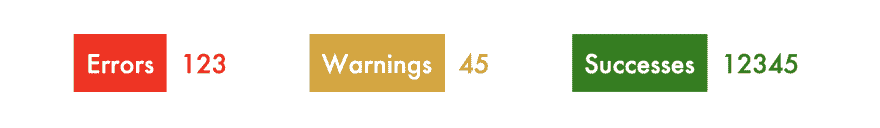

# “currentColor”，第一个 CSS 变量

> 原文：<https://dev.to/kenbellows/currentcolor-the-first-css-variable-12dl>

最近在 CSS 中添加了自定义属性，也就是 CSS 变量，这是对该语言的一个非常受欢迎的添加。它为许多非常酷的技术打开了大门；只有当你能够跟踪你的系统的状态并保持不同的位彼此同步时，你才能做很多事情，而变量给了你一种方法来做到这一点。

但是有些事情是 CSS 的新手开发人员可能不知道的，那些熟悉的人经常会忘记:在自定义属性出现之前很久，我们实际上在 CSS 中已经有了另一个变量。它要简单得多，而且范围有限，所以它不能做自定义属性能做的所有事情，但是它得到了更好的支持，并且通过一点小聪明，它可以用来完成一些非常酷的事情。

这个变量就是特殊的 CSS 关键字`currentColor`！

# 什么事？

[`currentColor`关键字](https://developer.mozilla.org/en-US/docs/Web/CSS/color_value#currentColor_keyword)基本上就是它听起来的样子:它是一个特殊的关键字，在使用它的位置保存`color`属性的值。

举个非常简单的例子，你可以用它来制作一个引用框，它的边框颜色和框中的文字颜色一样:

```
blockquote {
  color: hotpink;
  border-color: currentColor;
} 
```

[https://codepen.io/kenbellows/embed/ZZONYN?height=600&default-tab=result&embed-version=2](https://codepen.io/kenbellows/embed/ZZONYN?height=600&default-tab=result&embed-version=2)

我觉得很时髦。

有趣的是，在这种特殊情况下，`border-color`规则是不必要的。我一直以为默认的`border-color`值是`black`，要不然就是浏览器设置的，但是最近偶然发现其实默认为`currentColor`！所以如果没有指定`border-color`，它将默认使用`hotpink`！

有几个属性实际上默认为`currentColor`:

*   [边框颜色](https://developer.mozilla.org/en-US/docs/Web/CSS/border-color)
*   [插入符号颜色](https://developer.mozilla.org/en-US/docs/Web/CSS/caret-color)
*   [列-规则-颜色](https://developer.mozilla.org/en-US/docs/Web/CSS/column-rule-color)
*   [文本-装饰-颜色](https://developer.mozilla.org/en-US/docs/Web/CSS/text-decoration-color)
*   [文本强调颜色](https://developer.mozilla.org/en-US/docs/Web/CSS/text-emphasis-color)
*   [轮廓-颜色](https://developer.mozilla.org/en-US/docs/Web/CSS/outline-color)(有时；阅读链接并了解关键字`invert`，如果支持的话会用到它)

顺便说一下，在我查找哪些规则默认为`currentColor`之前，我几乎不知道这些规则中的任何一个！我需要多了解一下`text-emphasis`；真的很诡异很有趣。伙计，*每次我深入文档寻找特定的东西时，我都会发现一些意想不到的东西。*

# 浏览器支持

当然，每当你了解到一个你从未见过的网络平台的酷功能时，你应该问的第一个问题是，“它的浏览器支持有多好？我真的能用吗？”幸运的是，`currentColor`的答案是“超级好”和“是的！”

支持实际上可以追溯到很久以前。看一下 [caniuse.com 对支持](https://caniuse.com/#feat=currentColor)的概述，Edge 的每个版本都支持它，从版本 4 开始它就在 Chrome 和 Safari 中(当时他们在引擎盖下使用相同的引擎)，从版本 2 开始它就在 Firefox 中！见鬼，它甚至出现在 IE 9 的 IE 浏览器中！所以不要担心使用它，除非你正在为一个还没有升级过 IE 8 的组织编写一个内部网应用程序。(可悲的是，我非常清楚它们仍然存在😢)

# 演示:徽章

好吧，让我们实际一点。

在调查实现工作设计的最佳方式时，我发现了`currentColor`。我需要创建一排彩色徽章，每个徽章上都有一个标签，旁边还有一个数字计数器。每个徽章的背景颜色与其柜台的文本颜色相匹配，每个徽章上的标签颜色与网站背景相匹配。为了举例，假设模型是这样的:

[](https://res.cloudinary.com/practicaldev/image/fetch/s--S49rdUic--/c_limit%2Cf_auto%2Cfl_progressive%2Cq_auto%2Cw_880/https://thepracticaldev.s3.amazonaws.com/i/0v3b8c0os92ymh08b5kw.png)

每一个徽章都是一样的，只是颜色不同。似乎是一个可重用组件的好用例！在现代浏览器中，您可以使用 CSS 变量作为徽章的背景和计数器的前景文本颜色。但是假设你想要/需要支持 IE 11，Edge 12-14，或者其他不支持自定义属性的浏览器。或者，你的 CSS 中已经有一些实用类来定义各种情况下的文本颜色，比如 [Bootstrap 的上下文颜色类](https://getbootstrap.com/docs/3.4/css/#helper-classes-colors)，例如`.text-danger`和`.text-warning`，所以使用`color`属性来设置徽章颜色的想法非常方便。用你对`currentColor`的新知识武装起来，你会怎么做？

首先，我们需要一个组件的根包装元素。这是设置颜色的地方，也是添加一个类来覆盖颜色的地方。

```
<div class="badge">
</div> 
```

```
.badge {
  display: inline-block;
  color: cornflowerblue;
} 
```

那么徽章组件中需要包含什么呢？乍一看，有两个区域:一个是彩色背景和白色文本的位，我称之为标题栏，另一个是与标题栏背景相匹配的彩色数字，我们称之为计数器。

标题块肯定需要在 DOM 中有自己的块，因为它有背景色，但是计数器可能没有，因为它只是放在一边，这就是内联文本的作用。所以让我们试试这个标记:

```
<div class="badge">
  <div class="title-block">
    Things
  </div>
  12345
</div> 
```

现在是有趣的部分！我们希望`.title-block`的背景与`.badge`上指定的`color`匹配，所以我们可以使用`background: currentColor`！根据我们的模型，我们还想将`.title-block`的文本设置为白色，所以我们也添加`color: white`。(如果你已经发现了这里的问题，没有剧透！)

```
.title-block {
  display: inline-block;
  padding: 0.5rem;
  background: currentColor;
  color: white;
} 
```

太好了！让我们看看它是什么样子的:

[https://codepen.io/kenbellows/embed/vMRLyP?height=600&default-tab=result&embed-version=2](https://codepen.io/kenbellows/embed/vMRLyP?height=600&default-tab=result&embed-version=2)

啊。好吧。这根本不是我们想要的。标题栏似乎不见了...或者说，完全白了。这是为什么呢？

事情是这样的:CSS 是一种声明性语言，而不是命令性语言:它不是自顶向下运行的，一路上保持和更新状态。这意味着当我们写:

```
.something {
  background: currentColor;
  color: white;
} 
```

浏览器不算出`currentColor`的值，*然后*设置`color: white`。相反，设置`color: white`也会将背景的`currentColor`值更改为`white`！这是`currentColor`的一个限制，你需要记住。

这是一个足够简单的修复方法，虽然有点烦人。我们只需要另一层嵌套来封装`color: white`规则。CSS 规则通常向下继承到子节点，但从不向上继承到父节点，所以这让`.title-block`从`.badge`继承它的`currentColor`值，同时能够改变其子节点中的`color`。

```
<div class="badge">
  <div class="title-block">
    <span class="title-block-text">
      Things
    </span>
  </div>
  12345
</div> 
```

```
.title-block {
  display: inline-block;
  padding: 0.5rem;
  background: currentColor;
}
.title-block-text {
  color: white;
} 
```

现在让我们再看一看:

[https://codepen.io/kenbellows/embed/rbdxpJ?height=600&default-tab=result&embed-version=2](https://codepen.io/kenbellows/embed/rbdxpJ?height=600&default-tab=result&embed-version=2)

完美！

现在我们已经得到了组件，我们需要做的就是重复几次，并为每个 be 实例定义一个颜色覆盖类。

```
<div class="error badge">
  <div class="title-block">
    <span class="title-block-text">
      Errors
    </span>
  </div>
  123
</div>

<div class="warning badge">
  <div class="title-block">
    <span class="title-block-text">
      Warnings
    </span>
  </div>
  45
</div>

<div class="success badge">
  <div class="title-block">
    <span class="title-block-text">
      Successes
    </span>
  </div>
  12345
</div> 
```

```
.error {
  color: red;
}
.warning {
  color: goldenrod;
}
.success {
  color: green;
} 
```

[https://codepen.io/kenbellows/embed/mgxPbV?height=600&default-tab=result&embed-version=2](https://codepen.io/kenbellows/embed/mgxPbV?height=600&default-tab=result&embed-version=2)

厉害！我们满足了要求！

这个小徽章组件非常方便；还有更多的可以玩。我们可以尝试不同的颜色，在标题区域添加表情符号，在柜台区域添加背景色...很多可能性！

[https://codepen.io/kenbellows/embed/ZZxEzz?height=600&default-tab=result&embed-version=2](https://codepen.io/kenbellows/embed/ZZxEzz?height=600&default-tab=result&embed-version=2)

你还能想到什么？

# 结论

概括一下:在 CSS 中有一个很酷的、被低估的关键字，`currentColor`，它可以被用作某些用例的排序变量。它比 CSS 自定义属性(也称为 CSS 变量)具有更广泛的支持，并且在开发可重用组件时使用起来可能更加直观，因为您只需要设置`color`属性来填充它的值，这感觉非常好。

然而，很明显`currentColor`有局限性。与自定义属性相比，最明显的是它只是一个颜色值，因此不能用于存储长度值、图像 URL 或花哨的渐变。另一个要注意的要点是，你不能在`currentColor`中使用一个继承的`color`值，比如背景或边框颜色，同时为同一个块中的文本设置你自己的`color`；设置`color`将更新该块内各处`currentColor`的值。您需要引入一个子元素来将您的`color`值保持在一个新的范围内。

简而言之，它有限制和警告，但我个人发现`currentColor`非常有用，它让我在一些棘手的情况下编写了更干净的代码。我最喜欢的特性是能够在一个组件的根元素上设置`color`,然后看到整个更新。试一试，看看你能用它做什么！