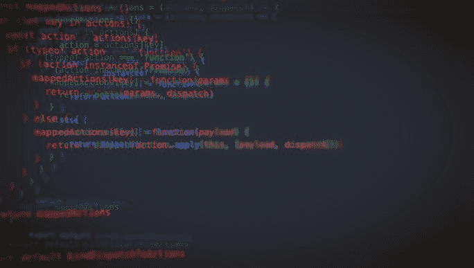
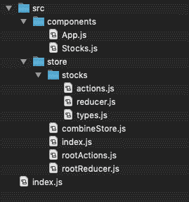

# 用上下文和钩子重新审视 Redux

> 原文：<https://dev.to/visarts/revisiting-redux-with-context-and-hooks-41i5>

我开发了一个小型的面向内部的 UI，它已经使用 Redux 有一段时间了。该商店为某些全局问题提供了功能，如 API 获取和通知，但它有点笨拙，因为所有的连接和 mapstatetopropping 只是为了注入一个基本的数据流。使用 Redux 作为全局状态管理器的最佳选择是 React Context(从纯 React 的角度来看),但直到最近还有一些问题需要克服。

* * *

[React Context](https://reactjs.org/docs/context.html) 于 2018 年初推出，是一种深入组件树共享数据的方法，通过将树包装在提供者中，为其提供初始存储/值，然后通过访问上下文“消费者”来访问/更新子组件中的这些值。最初的实现涉及调用该消费者，并将其子代呈现为带有道具的函数，道具是来自父节点的原始存储/值对象。但是跟踪所有的提供者/消费者/呈现支持变得笨拙，并导致消费组件中的错误层次。

更新从上下文接收的数据也很棘手。大多数人通过传递带有上下文值的回调函数来解决这个问题，并使用这些函数向上传递更改。但是像这样将数据与回调配对有点难看，这意味着每次数据树更新时，它都会用回调重新实例化这些回调。Redux 的 reducers 提供了一种更干净的方式来更新状态，监听由组件中的动作触发的事件触发器，并更新与该动作相关的状态部分。然而，在 hooks 之前，集成 reducers 和 context 是一场庞大的技术联姻。

* * *

当我在 2018 年参加的 React Conf 上介绍 hooks 时，我看到了它们的用处，但不明白为什么人们会说它是 Redux 杀手(不一定，但那是改天的话题)。但是当我发现像 useContext 和 useReducer 这样的挂钩时，事情开始变得明朗起来。使用 useContext 挂钩，您可以提取上下文值，而无需消费者或使用呈现道具，使用 useReducer，您可以提取状态和分派，而无需 Redux 所需的大量开销。

有了这些新工具，我决定创建自己的全球商店/状态管理系统，一劳永逸地摆脱 Redux(直到我发现我确实需要它，但我们现在让未来的问题留在未来)。经过大约四五次迭代，我终于找到了一个对我来说最有意义的模式，并且碰巧消除了数百行代码，这是一个很好的副作用。

* * *

在我们进入细节之前，我想在该表扬的地方给予表扬——爱德华多·马孔德斯·拉贝罗的这篇文章和坦纳·林斯利的这篇文章是我理解如何将这些片段组合在一起的基础，我大量借鉴了他们的观点。我在这里和其他地方也看到了类似的实现[。这里的要点是，剥橙子的方法不止一种，你应该选择最吸引你的方法。](https://medium.com/octopus-labs-london/replacing-redux-with-react-hooks-and-context-part-1-11b72ffdb533)

* * *

例如，我们将制作一个非常简单的 React 应用程序，让用户使用全局存储中的状态和操作，从“股票”API 查看和刷新数据。文件夹结构将如下所示:

注意,“store”文件夹包含一个用于股票 API reducer 和 actions 的文件夹，类似于典型 Redux 项目的结构。

我们的整个应用程序将被包装在一个 StoreProvider 中，以使每个子元素都可以访问动作和状态，所以让我们创建 index.js 作为开始: