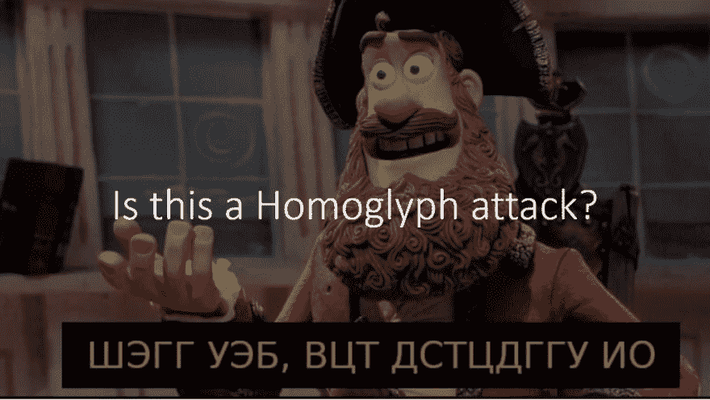
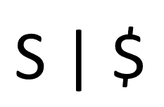
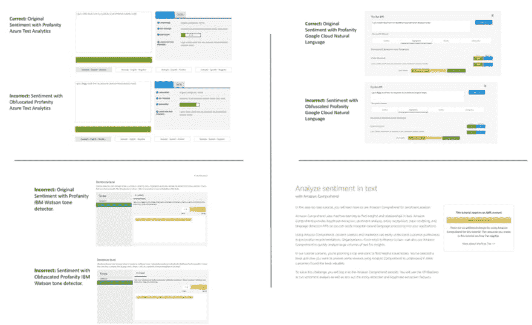
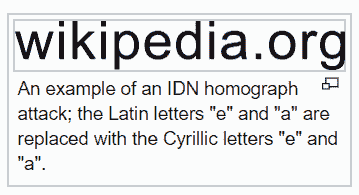
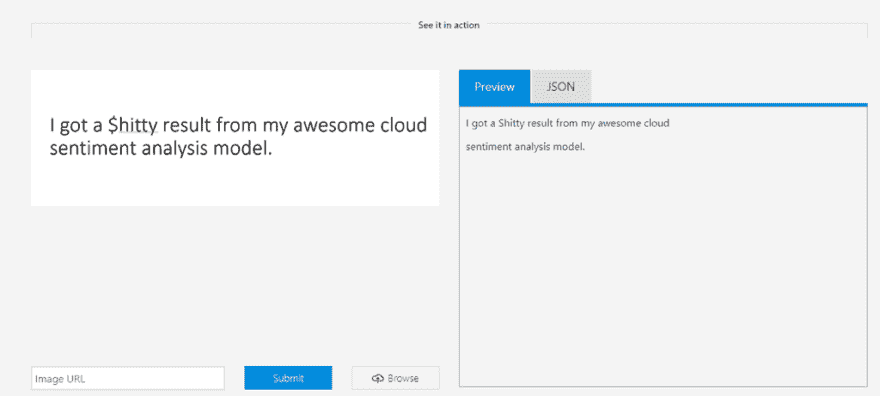
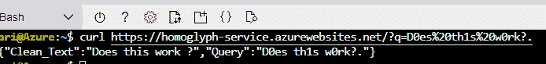
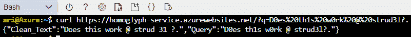

# 用 OCR 防止同形异义字符攻击。

> 原文：<https://dev.to/azure/preventing-homoglyph-attacks-with-ocr-25pm>

TLDR；这篇文章描述了什么是[同形异义攻击](https://en.wikipedia.org/wiki/Homoglyph)以及如何用认知服务来防止它们。

### 入门

这个故事的代码可以在 github 上找到。

[aribornstein/homoglyphatckpreventionservice](https://github.com/aribornstein/HomoglyphAttackPreventionService)

Azure 上的一键式部署说明可以在下面找到。

### 什么是同形攻击？

在[正字法](https://en.wikipedia.org/wiki/Orthography)和[印刷术](https://en.wikipedia.org/wiki/Typography)中，**同形异义字**是两个或更多[字符](https://en.wikipedia.org/wiki/Character_(computing))中形状相同或非常相似的一个。通俗地说，同形字就是任何看起来与另一个字符相似的字符，比如上图**中的 **S** 和 **$** 。**

语言模型通常容易受到使用同形符号的混淆攻击，这是由于它们编码文本的方式。例如，在 Unicode 和 Ascii 中，相同的字符代码在不同的字体中看起来不同，模型将努力学习它们的相似性。

[面向初学者的字符编码](https://www.w3.org/International/questions/qa-what-is-encoding)

为了说明这一点，让我们来看看下面的短语:

> 我从令人敬畏的云情感分析模型中得到了$hitty 结果。

上面的短语清楚地表明了消极的情绪。单词 *$hitty* 是亵渎单词*傻逼*的同音字混淆。

让我们看看互联网上最流行的四种云情感分析服务是如何处理这种攻击的。

<figure> 

<figcaption>顺时针方向，Azure Text Analytics 和 GCP 自然语言正确地对原始情感进行了分类，但在模糊文本上失败了，IBM Watson 未能正确地对任一文本的情感进行分类，AWS 领悟没有提供没有 AWS 帐户的演示，但在例句上也失败了。</figcaption>

</figure>

正如我们所看到的，Azure 文本分析和 GCP 自然语言正确地对原始情感进行了分类，但都没有对模糊文本进行分类。IBM Watson 未能正确地对两种文本的情感进行分类。AWS comprehensive 不提供没有 AWS 订阅的演示，也不能使用例句。

虽然上面的$和 S 的例子可能看起来有些武断，但维基百科下面的拉丁字母和西里尔字母展示了这种攻击是如何有效和难以检测的。

这给用例带来了各种各样的问题，在这些用例中，这种攻击可以利用应用程序或对应用程序造成伤害，例如试图躲避假新闻检测器的机器人。

### 如何防止同形攻击？

<figure> 

<figcaption>Azure 计算机视觉在将文本表示为图像时，正确地揭示了同形异义。</figcaption>

</figure>

在与我来自 BIU NLP 实验室的朋友 Amit Moryossef 交谈后，我们意识到我们可以使用 OCR 系统来防止同形异义字符攻击。

使用 Azure 计算机视觉服务，我用上面的句子测试了这个理论，它正确地使用图像域上下文从同形词 **$hitty** 中提取单词**shipped**。

使用这种能力，我编写了下面的开源容器服务，它将:

1.  将一个给定的文本作为输入

2.  将文本转换为图像

3.  使用 OCR 处理图像

4.  返回删除了同形异义字符的正确文本。

Docker 服务是云不可知的。为了方便起见，我向 Azure 提供了一个单击部署选项。

如果您已有 Azure 订阅，您可以通过单击下面的按钮来自动部署服务。

<figure> 

<figcaption>[点击这里开始！](https://portal.azure.com/#create/Microsoft.Template/uri/https%3A%2F%2Fraw.githubusercontent.com%2Faribornstein%2FHomoglyphAttackPreventionService%2Fmaster%2Fazuredeploy.json)</figcaption>

</figure>

否则，你可以在这里获得一个免费的 Azure 帐户，然后点击上面的部署按钮。

[立即创建您的 Azure 免费帐户| Microsoft Azure](https://azure.microsoft.com/offers/ms-azr-0044p/?WT.mc_id=medium-blog-abornst)

如果您有任何问题、评论或话题希望我讨论，请随时在 [Twitter](https://twitter.com/pythiccoder) 上关注我。再次感谢 Amit Moryossef 和 BIU NLP 实验室的惊人灵感，以及 Iddan Sachar 在他的帮助下调试 ARM 的一键式部署。

### 使用服务

要使用该服务，只需向该服务发送一个最多 200 个字符的 URL 编码查询字符串，该服务非常适合验证推文。下面是一个使用 curl 的调用示例，请务必使用您自己的服务端点。

### 下一步

虽然该服务在删除同形异义词方面表现很好，但仍有少数情况下会失败。

<figure> 

<figcaption>例证失败案例</figcaption>

</figure>

未来的工作将探索使用一个更加定制的方法来解决这个问题，但这种方法非常适合非常小的努力。

### 附加资源

*   [使用计算机视觉 API 进行图像处理|微软 Azure](https://azure.microsoft.com/en-us/services/cognitive-services/computer-vision/#text?WT.mc_id=blog-medium-abornst)
*   [应用服务-容器的网络应用|微软 Azure](https://azure.microsoft.com/en-us/services/app-service/containers/?WT.mc_id=blog-medium-abornst)
*   [文本分析 API |微软 Azure](https://azure.microsoft.com/en-us/services/cognitive-services/text-analytics/?WT.mc_id=blog-medium-abornst)

### 关于作者

亚伦(阿里) 是一个狂热的人工智能爱好者，对历史充满热情，致力于新技术和计算医学。作为微软云开发倡导团队的开源工程师，他与以色列高科技社区合作，用改变游戏规则的技术解决现实世界的问题，然后将这些技术记录在案、开源并与世界其他地方共享。

* * *