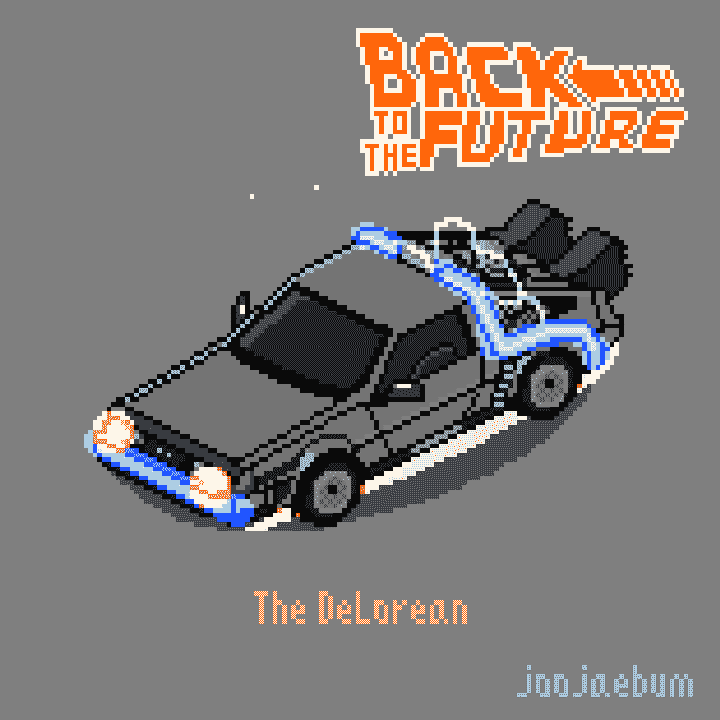
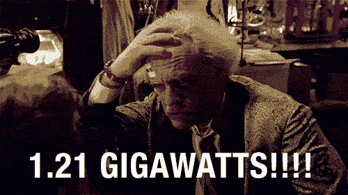
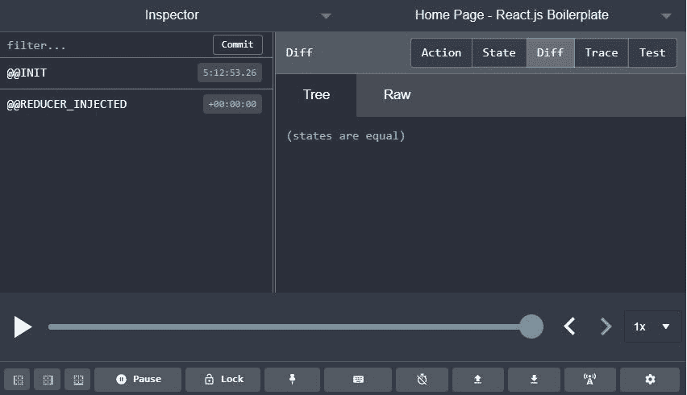
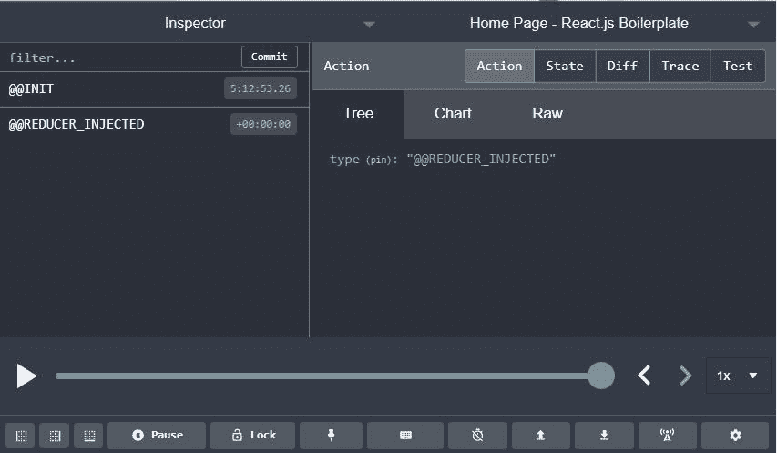
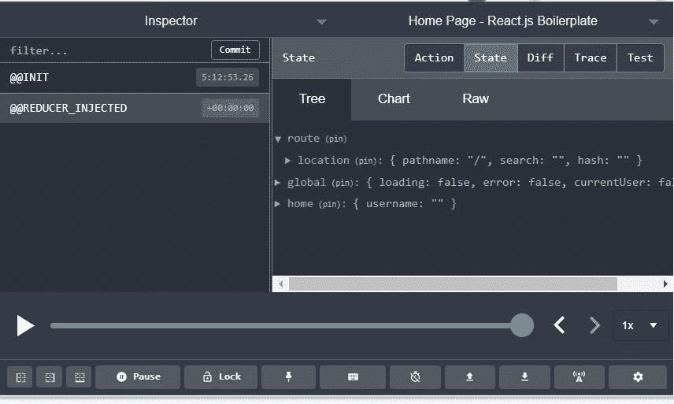
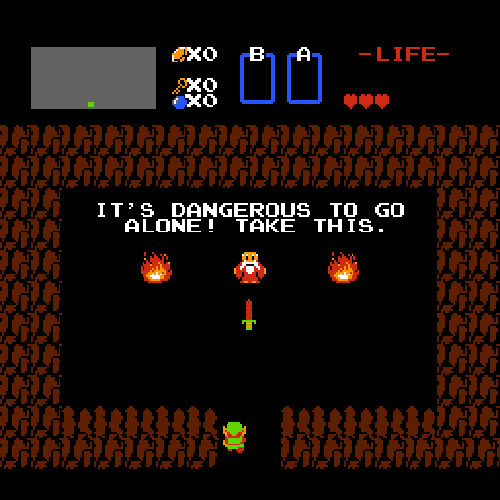
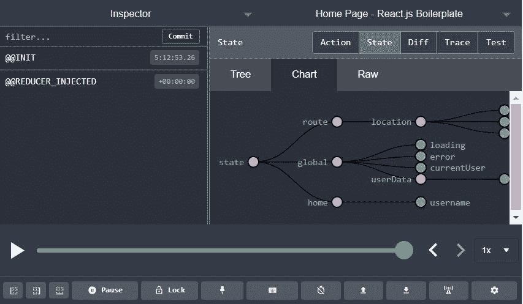
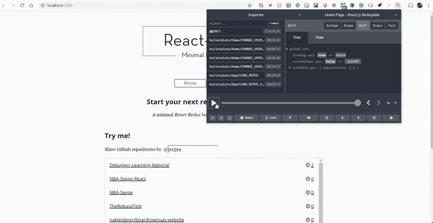
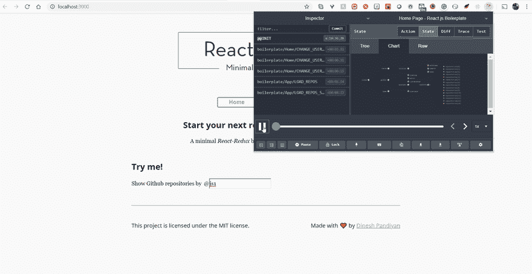

# 修复过去是困难的，ReduxDevTools 和 Reselect 如何能有所帮助

> 原文：<https://dev.to/thugdebugger/fixing-the-past-is-hard-how-reduxdevtools-and-reselect-can-help-3516>

# “停留在过去是不健康的”

谁曾说过停留在过去对你来说是不健康的，这是绝对正确的，但有时我们可以从过去学到一些东西来改善我们的未来**行动**(双关语)。如果你熟悉 Redux 库和它的方法论，那么你可能听说过一个叫做“时间旅行”的术语，但是你可能不确定它是什么意思，它对你自己、你的应用程序结构和与 Redux 的关系有什么好处，以及在调试 Redux 存储中的状态问题时你的整体理智。在我们**拜访过去**(再次双关)之前，让我们仔细看看今天存在的工具

* * *

# 可用的武器库。

1.  Redux-Logger :是一个可与 Redux 库一起使用的中间件，允许将分派的动作记录到您最喜欢的浏览器控制台。除了打印已调度的操作之外，还包括以前和即将到来的状态。这可以让你实时看到行动的结果，但不允许你手动回到过去并通过**回放**这样的行动来进一步了解它对你的商店的影响。
2.  Redux-DevTools :是一个可与 Redux 库一起使用的中间件，类似于 Redux-Logger，但它提供了一个直观的 GUI 来使用，集成到您最喜欢的浏览器中。像 Redux-Logger 一样，调度到存储的动作被记录和显示，但是一个主要的好处是能够回放、跳过/快进、停止、暂停和播放应用程序中发生的动作。此外，可以添加额外的配置来真正帮助您的调试工作，例如 **[跟踪选项](https://github.com/zalmoxisus/redux-devtools-extension/blob/master/docs/Features/Trace.md)** ，这将允许您查看应用程序中的哪个位置发出了该操作。

* * *

# 了解可用的工具是最重要的

现在我们知道了哪些工具是可用的，以及它们在 Redux 日志记录/调试方面的用法，让我们深入讨论其中一个主题；Redux DevTools。为了让这成为一次互动的学习体验，我决定[克隆一个简单的样板文件，它安装了 React、Redux、ReduxDevTools 和 Reselect(稍后将详细介绍)。](https://github.com/flexdinesh/react-redux-boilerplate)回购有一个很好的自述，其中包括如何让一切启动和运行，所以为了努力使本教程简短，我不会涵盖这一点。一旦安装完成，我们需要将 Redux-DevTools 扩展添加到我们最喜欢的浏览器中。你可以在这里找到如何做的说明[。如果你使用的是 Chrome 或 Firefox 浏览器，安装一个简单的插件就可以了，如果不是，按照前面链接中的说明安装 Redux-DevTools。安装完成后，返回到运行**的克隆应用程序(如果它没有运行，启动它)**并刷新页面。您应该看到 Redux-DevTools 图标在发光......**激动人心！**](https://github.com/zalmoxisus/redux-devtools-extension#installation)

* * *

# 通量电容器准备好了吗？

耐心点马蒂！在我们进入这个扩展的所有酷的时间旅行方面之前，让我们先感受一下这个新扩展的一些基础知识。第一次单击扩展的图标将显示分派给商店的操作以及作为结果发生的变化。如果州发生了变化，您会在这里看到，但由于我们刚刚进入页面，它会显示“州是平等的”，如下所示。

<figure>

<figcaption>Redux-DevTools GUI</figcaption>

</figure>

* * *

You should notice on the top row of the extension an option to switch the view from **"diff"** to **"action"**. If you were to switch the view you can now see the action itself which includes the type and payload (if applicable) as seen below. 

<figure>

<figcaption>Redux-DevTools action view</figcaption>

</figure>

* * *

The last option that we're covering in this tutorial arguably the most important, the **"state"** view. Clicking on this view will reveal what the store looks like after being reduced from a dispatched action. As seen below, we now have a bird eye view of how our store looks....**NEAT!** 

<figure>

<figcaption>Redux-DevTools state view</figcaption>

</figure>

* * *

# 我们可以去拯救恐龙了吗？

差不多吧，马蒂，但我有另一个新的扩展功能给你看，这将有助于你独自完成这一旅程(一位老人在 86 '年告诉我)。如果你和我一样，整天看着 JSON 或 raw 对象会让人头晕目眩。你可能注意到了我们新扩展中的一个子选项，叫做**“chart”**。单击 actions 选项和 chart 子选项，将会显示一个绘制得很好的图表，显示所分派的操作及其与商店状态的关系。这很酷，但它真正的亮点是画出了分派的动作和未来状态之间的关系。

* * *

<figure>

继续点击状态选项和图表子选项。您应该注意到所绘制的图表包括商店中可用的不同属性，以及它们之间的相互联系。如果您将鼠标悬停在图表上的单个节点上，将允许您查看商店中特定属性的当前状态。

<figcaption>peek-a-boo, state I see you</figcaption>

</figure>

# 如果我的计算是正确的，当这辆车时速达到 88 英里时，你会看到一些严重的考验。

好了，Marty，现在你已经对我们的工具有了一个大概的了解，你可以回到过去去了解我们的未来了。
进入我们应用程序上的 GitHub 输入框，开始输入你或你最喜欢的 GitHub 用户名，然后点击回车；您应该会看到适用于页面上呈现名称的 repos 列表。耶，我们的应用程序正在按预期工作，但是发生了什么操作，以什么顺序发生，以及这如何影响商店的状态？打开 Redux-DevTools 扩展，选择**“diff”**选项和**“state”**子选项。完成后，将鼠标悬停在列表中的第一个动作上，点击单词**“jump”**。你应该注意到渲染回购清单被拿走了，你的状态差异看起来不同，播放按钮附近的滑块也向左移动了！马蒂....我们现在在过去！现在，您可以单击播放图标按钮，观察出现的状态差异以及它们与屏幕上呈现的内容之间的关系。另一件很酷的事情是，你 **DONT 必须按顺序做。例如，您可以跳到动作 1，然后跳到动作 4 来查看结果。简而言之，这就是时间旅行，能够在状态中前进和后退，以查看某个动作对商店的影响。**

<figure>** 

<figcaption>嘿 DJ，拿回来！</figcaption>** </figure>

 ****亲提示:**还记得我们前面的**【图表】**子选项吗？您也可以选择该选项进行时间旅行，这将在回放过程中发生突变时实时重新绘制图表。你可以在下面见证这一点。  

<figure>

<figcaption>时间旅行图</figcaption>

</figure>** 

* * *

# 哇哦，我们成功穿越了，但是重新选择呢？

啊，是的，我差点忘了重新选择库以及它如何帮助我们。为了简洁起见，我将做一个快速概述，然后在接下来的帖子中提供更深入的教程。
首先，[让我们定义什么是](https://github.com/reduxjs/reselect)，以及它是如何工作的。ReSelect 允许您定义称为**选择器**的函数，它使用了计算机科学中称为 Memoization (Mem-Oh-Ih-Za-shun)的概念，这允许我们利用计算出的值，除非预期结果中有重大变化，否则不必重新计算。选择器也可以从其他选择器中创建，因此如果一个结果是依赖的或者可以从另一个先前创建的选择器中派生出来，那么您可以将它传递给新的选择器以返回即将到来的状态值。在 Redux 中，这是有益的，因为当访问未来状态时，我们不再需要查看整个商店，而是**只关注我们关心的**状态的特定部分。此外，这有助于限制存储中状态更新所产生的副作用，当组件结构可能只关心状态的特定部分时，这将导致对组件结构的大量支持。例如，如果您有一个商店，比如:
`let exampleState = { shop: { taxPercent: 8, items: [ { name: 'apple', value: 1.20 }, { name: 'orange', value: 0.95 }, ] } }`
如果您的组件只关心商店的 taxPercent 属性，那么传递商店的整个状态是没有用的。相反，通过执行以下操作，ReSelect 将允许您只定位和传递 taxPercent 属性:`const taxPercentSelector = state => state.shop.taxPercent`
如果您大声朗读这段代码，它会说“在商店属性中访问我的商店对象的当前状态，并只向我返回 tax percent 属性”。总之，这需要将 **[放入您的 connect() HOC 的 mapStateToProps 函数](https://github.com/reduxjs/reselect#containersvisibletodolistjs)** 中，除非该值发生变化，否则它将立即通过 Props 在您的容器/组件层次结构中可用。
此外，计算值的记忆按如下所述进行:` ` const tax selector = create selector(subtotal selector，taxPercentSelector，(subtotal，taxPercent)=>subtotal *(tax percent/100))
以上将根据从 subtotal 和 tax percent 选择器导出的值计算并返回某个项目的税额。注意 createSelector()方法接受了其他选择器——它允许快速计算值的可组合性(composite-ability ),并且只在前面的结果中有增量时才重新计算。

 

* * *

**Give it a try:** You can play around with the selectors available in our boilerplate via the `app\containers\HomePage\selectors.js` path. Don't be afraid to break them apart, and reconstruct the. to learn more; it's apart of the learning process!

* * *

All this being said, I highly recommend using ReSelect in your application to cut-down on the amount of props being passed to all your components, which can assist in performance by cutting down on useless renders.
**Pro-Tip:** Renders should only happen on prop or state changes that are applicable to that particular component's functionality/data integrity

# 我们的未来现在看起来很光明！

虽然这是一个快速的概述，可以帮助您改进 Redux 动作和状态的调试，但是我鼓励您继续扩展您对上述工具和库的了解，以改进您的代码库。我也鼓励你在谷歌上快速搜索更多关于这个主题的信息/教程，比如 Onsen UI & Monaca 团队的这篇很棒的教程，更深入地介绍了 Redux-DevTools 和时间旅行。感谢你回到另一个，但不是最后一个教程；欢迎为我的下一个教程留下任何评论、建议、想法和反馈。【T2