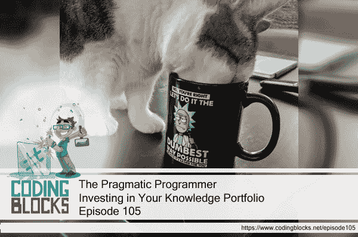

# 务实的程序员:投资于你的知识组合

> 原文：<https://dev.to/_codingblocks/the-pragmatic-programmer-investing-in-your-knowledge-portfolio-2h6n>

刚刚开始了一个新的播客系列，是关于我最喜欢的全职程序员的书:*实用程序员*。谈论它帮助我把我的思想集中在主题上，我希望你和我一样从谈话中得到很多。

请收听节目，让我知道你是否能分辨出你是在做石头汤还是在煮青蛙。

以下是节目笔记的片段:

* * *

## *一种实用主义哲学*

[注:20 周年纪念版将于 5 月 8 日进入测试版](https://pragprog.com/news/coming-soon-the-pragmatic-programmer-20th-anniversary-edition-in-beta)

这本书是由程序员写的，而不是一些框架或语言的设计者，它展示了开发软件的模式。

这本书甚至在前言中也充满了伟大:

*   没有完美的工具、方法或解决方案。你必须为每一个特定的情况选择最好的比特。
    *   不要爱上任何特定的技术或工具。
    *   利用你的经验来帮助选择适合任何特定情况的解决方案。
*   务实的程序员完成工作，并且做得很好。

这本书是为那些想成为更有生产力和效率的开发者而写的。

### 务实程序员的特质

你如何评价自己的这些特质？

*   早期采用者/快速适配器
    *   本能地热衷于尝试新技术。
    *   自信并快速掌握新事物。
*   好奇的

    *   你问了一大堆问题，你想尽可能多地了解正在做的事情。
*   批判思想家

    *   不要接受别人说的或声称的任何东西。用你的经验来思考这个问题。
*   现实的

    *   你知道什么时候事情变得复杂，这对时间表意味着什么。
*   百事通

    *   即使你的实践非常集中/狭窄，你也要保持你的知识广博。

#### 提示

*   关心你的手艺。
*   想想你的工作。
    *   总是评估你在做什么，为什么。

#### 只是好的建议

*   拥抱个性和工艺，即使在大型团队中。
*   总是努力提高和磨练你的技能。

### *猫吃了我的源代码*

最大的弱点是害怕显得软弱 J. B .博须埃

*   采取一种态度、风格和哲学来处理问题和解决方案，你总是在考虑大局。
*   为自己的行为负责。
    *   即使你不能控制正在做的事情的所有方面，也要致力于把事情做好。
    *   这并不意味着你必须倒在剑下。在“不可能”的情况下，你可以自行决定是否对正在发生的事情承担责任。
    *   接受责任就是被追究责任。
    *   如果你确实犯了一个错误或者有一个缺点，要诚实并提供选择。
        *   卖主没来吗？你应该有一个应急计划。不能怪他们。
*   有担当不代表完美。这意味着努力防止错误，然后在出现问题时努力纠正错误。
*   愿意改变，但同时也要谨慎。
*   知道你的软件有多好。定义什么是足够好？

#### 提示

*   提供选择，而不是借口。
    *   *【橡皮鸭】*它。如果你要说的话听起来很蹩脚，那么你或许应该省点口舌，想一些可能的解决办法。
    *   当你需要帮助或更多资源时，承认。

### *软件熵*

*   熵指的是系统中“无序”的数量。
*   也被称为“软件腐烂”。
    *   尽管有最好的计划和最好的人手在一个项目上工作，它仍然会受到这种影响。

#### 提示

*   不要住在破窗户里。
    *   不要在代码中留下糟糕的决策或糟糕的代码。
    *   如果你没有时间完全修复它，用某种方式修补它。
    *   忽视加速腐烂，腐烂导致腐烂。
    *   不要让*“剩下的代码很烂”*的心态渗入，否则它会比你想象的衰退得更快。
    *   有效地保持代码库的整洁会让其他人不想把它弄乱。
    *   如果你没有时间做正确的事情，也许可以考虑*“登上去”*，也就是注释掉代码或者显示一个警告。

#### *石头汤和水煮青蛙*

#### 提示

*   成为变革的催化剂

    *   谈论变革往往没有结果。
    *   人们想要计划会议。
    *   然后是管理审批。
    *   进入壁垒堆积如山。
    *   这就是所谓的*【启动疲劳】*。
    *   开始朝着你认为需要改变的方向大步前进，向人们展示，他们会开始团结在你周围。
    *   人们发现更容易加入正在进行的成功。

#### 提示

*   记住大局，不要做开水里的青蛙。
    *   不断回顾你周围正在发生的事情，否则你会看不到正在发生的事情，事情会在你没有注意到的情况下开始恶化。

### *够好的软件*

*   用户应该能够参与决定某样东西是否足够好。
*   您创建的系统的范围和质量应该是项目规范的一部分。
*   知道何时停止迭代相同的代码是很重要的。
    *   代码永远不可能完美，所以不要去管它。
    *   不要过度修饰或提炼一个完美的程序。

#### 提示

*   使质量成为一个需求问题。
    *   让你的用户现在体验软件可能会在未来带来更好的整体软件，甚至比完善现有软件的途径更好。
    *   今天伟大的软件胜过明天完美的软件。
    *   如何才能围绕质量制定标准？测试覆盖、代码审查、静态代码分析等。也许吧？

### *你的知识组合*

“对知识的投资总是能获得最好的回报。”本杰明·富兰克林

*   您的知识组合是您在编程中获得的所有知识，无论是技术知识还是领域知识，都是随着时间的推移而获得的。
*   你的知识和经验是你最重要的专业资产…但也是即将到期的资产。
*   考虑像投资金融资产一样投资你的知识资产组合:
    *   定期投资，作为一种习惯。
    *   多样化。
    *   管理风险。
    *   低买高卖。
    *   审查和重新平衡。

#### 提示

*   定期投资你的知识组合
    *   每年至少学习一门新语言。
    *   每个季度阅读一本技术书籍。
    *   也阅读非技术性的书籍。
    *   上课。
    *   加入用户组。
    *   尝试不同的环境。
    *   订阅行业杂志、期刊、时事通讯或类似的东西来跟上时代。
    *   加入并参与在线社区，阅读感兴趣技术的白皮书。
    *   寻找机会。如果你不能回答一个问题…不要放过它！

#### 提示

*   批判性地分析你读到的和听到的。
    *   试着对你读到的和听到的进行批判性的思考，不要把它当成真理。
    *   当心狂热者，或者任何时候有人可以自信地告诉你*“方式”*。

### *交流！*

*   想法是没有价值的，除非你能传达它
*   会议、门票、维基和代码都是交流的形式。
*   明白你想说什么。
    *   记下你的高水平目标。
    *   有一个计划让它通过。
*   了解你的受众。
    *   智慧离合诗:
    *   你想让他们学什么？
    *   他们的兴趣是什么？
    *   他们有多狡猾？
    *   他们想要多少细节？
    *   你想让谁知道这些信息？
    *   你怎样才能让他们听你说话呢？
*   明智地选择你的时刻，让你说的话及时相关。
*   用你的观众想要的方式与他们交流。
*   让你的信息看起来不错。
    *   表述和内容本身一样重要。
    *   哪个更容易阅读？一整页的文字？或者将两页文字分成带有标题的小节？
*   尽早并经常让人们参与到你的文档中。
    *   让你的观众参与进来可以建立关系，创造更好的文档。
*   做一个倾听者。你不听别人的，别人也不会听你的。
*   回到人们身边。人们讨厌你不回复，哪怕只是一句*“我以后再打给你。”*

#### 提示

*   你说的话和你说话的方式都很重要。

## 我们喜欢的资源

*   戴维·托马斯的安德鲁·亨特写的《务实的程序员》
*   实用主义书架([pragprog.com](https://pragprog.com/))
*   程序员的构建错误:案例研究(在谷歌)(【static.googleuserconent.com】T2
*   破窗理论([维基百科](https://en.wikipedia.org/wiki/Broken_windows_theory))
*   *破窗如何导致警察和社区之间的紧张关系*(【www.wnyc.org】T2

## 一周的提示

*   *Git* 你最喜欢的老游戏的源代码。( [GitHub](https://github.com/historicalsource?tab=repositories) )
*   使用*设计模式目录*了解所有你喜欢的设计模式。( [refactoring.guru](https://refactoring.guru/design-patterns/catalog)
*   学习你甚至不知道的 VS 代码技巧。 *VS 代码能做到吗？！*(【vscodecandothat.com】T2)
*   使用微软提供的这些自定进度的实验室来提高您的 Azure 技能:
    *   *以您自己的速度获得您需要的云技能*(【handsonlabs.microsoft.com】T2)
    *   欢迎来到自定进度实验室(【www.microsoft.com】T2)