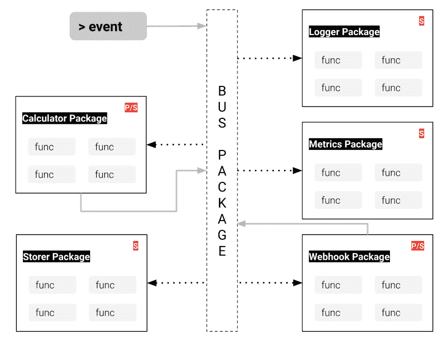

# Go 中的解耦包通信

> 原文：<https://dev.to/mustafaturan/decoupled-package-communication-in-go-g39>

Go 以其简单性、并发性、一流的功能和工具成为非常强大的软件开发语言。

在 Go 中，通常一个包只负责一件事。应用程序随着几个具有各自职责的包而增长。当项目中的包的数量和项目的责任增加时，与其他包的通信可能会混乱。(在这里，通信意味着在有/没有等待结果的情况下调用流程上不同包/模块上的函数。类似于当订单被接收/完全履行时递增计数器度量)

* * *

一种已知的通信解耦方法是事件驱动软件设计。通常，使用外部事件/消息总线服务器是将责任分配给内部/外部服务的方式。但这也为您的堆栈带来了另一个外部组件。每个堆栈都有自己的问题。

对于小型服务、包/库和嵌入式系统，添加外部总线可能是不必要的。为了克服这个问题，在您的包中添加一个内部消息总线包可能会有所帮助。当事情变得更大时，就有可能通过这个内部消息总线与外部消息总线服务进行通信。

[](https://res.cloudinary.com/practicaldev/image/fetch/s--cleP-S----/c_limit%2Cf_auto%2Cfl_progressive%2Cq_auto%2Cw_880/https://thepracticaldev.s3.amazonaws.com/i/lkcb2tnjgsjipad3st5e.png)

假设，一个项目需要在用户注册上做几件事，比如:递增计数器、发送电子邮件、登录和/或向外部服务发送 webhook 消息总线可以在不知道调用者的情况下帮助异步执行多个功能，而不是直接调用每个功能。

* * *

解耦包帮助我们编写更简洁的代码，一次只关注一件事。有了[总线](https://github.com/mustafaturan/bus) Go 包，你可以从真正的消息总线系统中获益，并轻松编写解耦包。`bus`包允许任何处理程序监听任何事件，而不知道是谁生成了事件。因此，包可以相互通信而不依赖于对方。此外，替代消费者函数非常容易。只要新函数理解正在发送和接收的`Event`结构，其他函数就永远不会知道。

* * *

### 开始使用`Bus`4 步走包

#### 配置

[`bus`](https://github.com/mustafaturan/bus) 包需要一个唯一的 id 生成器来给事件分配 id。您可以编写自己的函数来生成唯一 id，或者使用提供唯一 id 生成功能的包。下面是一个使用单调 id 生成器的示例配置:

```
import (
    "github.com/mustafaturan/bus"
    "github.com/mustafaturan/monoton"
    "github.com/mustafaturan/monoton/sequencer"
)

func init() {
    // configure id generator (it doesn't have to be monoton)
    node        := uint(1)
    initialTime := uint(0)
    monoton.Configure(sequencer.NewMillisecond(), node, initialTime)

    // configure bus
    if err := bus.Configure(bus.Config{Next: monoton.Next}); err != nil {
        panic("whoops")
    }
    // ...
} 
```

#### 注册事件主题

要向主题发出事件，首先需要注册主题名:

```
func init() {
    // ...
    // register topics
    bus.RegisterTopics("order.received", "order.fulfilled")
    // ...
} 
```

#### 注册事件处理程序

要接收主题事件，您需要注册处理程序；一个处理程序基本上需要两个值，一个是`Handle`函数，一个是主题`Matcher` *正则表达式模式*。

```
handler := bus.Handler{
    Handle: func(e *Event){ 
        // fmt.Printf("Event: %+v %+v\n", e, e.Topic)
        // do something
        // NOTE: Highly recommended to process the event in an async way
    },
    Matcher: ".*", // regex pattern that matches all topics
}
bus.RegisterHandler("a unique key for the handler", &handler) 
```

#### 发射事件

`bus`包提供了一个通用的事件结构，为它的所有处理程序标准化一个事件是什么。在交付活动之前，最好了解一下 [`bus`](https://github.com/mustafaturan/bus) 包中的活动是什么。如果这是你第一次使用这个库，强烈建议你检查一下 [`Event`](https://godoc.org/github.com/mustafaturan/bus#Event) struct 的数据结构。

```
txID  := "some-transaction-id-if-exists" // if it is blank, bus will generate one
topic := "order.received"                // event topic name (must be registered before)
order := make(map[string]string)         // interface{} data for event

order["orderID"]     = "123456"
order["orderAmount"] = "112.20"
order["currency"]    = "USD"

bus.Emit(topic, order, txID) // emit the event for the topic 
```

恭喜你！！！您用`bus`包发出了您的第一个事件。现在，所有匹配的处理程序将接收相同的事件。请尝试你自己，并分享你的经验作为评论。

使用 [`bus`](https://github.com/mustafaturan/bus) 包的**示例项目**也可以在 [bus-sample-project Github](https://github.com/mustafaturan/bus-sample-project) 上找到。

* * *

##  [穆斯塔法图兰](https://github.com/mustafaturan) / [巴士](https://github.com/mustafaturan/bus)

### 🔊用于内部通信的极简消息总线实现

<article class="markdown-body entry-content p-5" itemprop="text">

# <g-emoji class="g-emoji" alias="loud_sound" fallback-src="https://github.githubassets.cimg/icons/emoji/unicode/1f50a.png">🔊</g-emoji>公交车

[](https://godoc.org/github.com/mustafaturan/bus)[](https://travis-ci.org/mustafaturan/bus)[](https://coveralls.io/github/mustafaturan/bus?branch=master)[](https://goreportcard.com/report/github.com/mustafaturan/bus)[](https://github.com/mustafaturan/bus/blob/master/LICENSE)

总线是一个用于内部通信的极简事件/消息总线实现，它的灵感很大程度上来自我的用于 Elixir 语言的 [event_bus](https://github.com/otobus/event_bus) 包。

## 装置

Via go 软件包`go get github.com/mustafaturan/bus`

## 使用

### 安装ˌ使成形

该包需要一个唯一的 id 生成器来为事件分配 id。您可以编写自己的函数来生成唯一 id，或者使用提供唯一 id 生成功能的包。以下是使用`monoton` id 生成器的配置示例:

```
import (
    "github.com/mustafaturan/bus"
    "github.com/mustafaturan/monoton"
    "github.com/mustafaturan/monoton/sequencer"
)
func init() {
    // configure id generator (it doesn't have to be monoton)
    node        := uint(1)
    initialTime := uint(0)
    monoton.Configure(sequencer.NewMillisecond(), node, initialTime)

    // configure bus
    if err := bus.Configure(bus.Config{Next: monoton.Next}); err != nil {
        panic("whoops")
    }
    // ...
}
```

### 注册事件主题

至…

</article>

[View on GitHub](https://github.com/mustafaturan/bus)