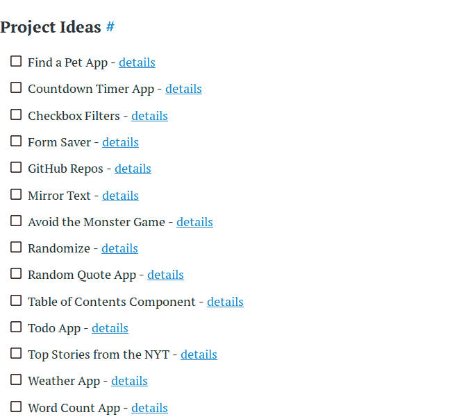

# 快速链接:普通 JavaScript 路线图。

> 原文：<https://dev.to/antonrich/a-quick-link-a-vanilla-javascript-roadmap-18m4>

[这是我见过的最好的香草 js 路线图之一。](https://learnvanillajs.com/roadmap/)

它简单，结构良好，切中要点。每个部分都有一个附加资源和项目想法的链接。

如果你跟随一些像“你不知道 js”这样的书或者像“freecodcamp”这样的免费训练营，当你试图自己解决问题时，你可以消除多余的摩擦。

先学会砌砖就行了。

史前时期。我在 [edabit](https://edabit.com) 上做了一个挑战，快速搜索了一下如何将字符串转换成数字。我就是这样偶然发现 learnvanillajs 的。作者有关于该主题的教程。我推荐 Edabit，因为它特别简单地使用了 javascript。你很快就可以开始黑那里了。